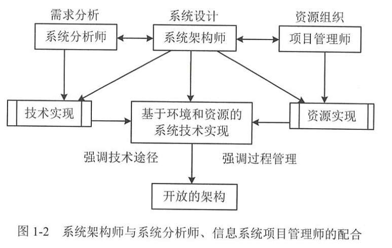

# 系统架构师概述

## 系统架构的概念

1. **现代信息系统的架构有三个要素，即构件、模式和规划。**
2. 现代信息系统的架构本质上存在两个层次：一是概念的层次，包含了艺术、科学、方法和建设风格；二是物理的层次,是指在一系列的架构工作之后而产生的物理结构及其相互作用的结果。
3. **软件系统架构是关于软件系统的结构、行为和属性的高级抽象。**
4. 企业软件架构也叫作企业架构，是应用全面、严格的方法，描述一个针对信息系统、流程处理、个人和组织当前和/或未来行为的抽象结构集合。
5. 企业软件架构的雏形来自企业建模的理论和思想。20世纪80年代中期，IBM首先引入“信息系统架构框架”的概念，提出从信息、流程、网络、人员、时间和基本原理6个视角来分析企业，并提供了与这些视角相对应的6个模型，包括语义、概念、逻辑、物理、组件和功能模型。
6. 现在软件架构的研究已发展为软件工程领域的一个独立学科分支，研究主要包括软件架构描述语言、软件架构的描述与表示、软件架构的分析与验证、基于架构的软件维护与演化、软件架构的可靠性等方面。

## 定义及职业素质

1. 系统架构设计帅是系统或产品线的仅计贝1八可营炒有为性和可测试性等)，给出非功能性系统需求（比如软件的可维护性、性能、复用性、可靠性、有效性和可测试性等)，给出开发规范，搭建系统实现的核心构架，对整个软件架构、关键构件、接口进行总体设计并澄清关键技术细节的高级技术人员。

2. 系统架构设计师主要着眼于系统的“技术实现”，同时还要考虑系统的“组织协调”。可以说，系统架构设计师是信息系统开发和演进的全方位技术与管理人才。

3. 系统架构设计师既应具有技术素质，还应具有管理素质，同时还应该和其他团队角色进行协调工作。

4. 系统架构设计师与系统分析师、信息系统项目管理师的配合如图1-2所示。

   

5. 系统架构设计师与产品经理的关系及区别：
   产品经理通常是指负责产品设计的“专人”。一个优秀的理想的产品经理，应同时具备较高的商业素质和较强的技术背景。产品经理要有深厚的领域经验，也就是说，对该软件系统要应用到的业务领域非常之熟悉。比如，开发房地产销售软件的产品经理，应该对房地产公司的标准销售流程了如指掌。如果开发的是通用产品，则还应具备对市场、潜在客户需求的深刻洞察力
   如果把开发软件比作摄制电影，产品经理之于系统架构设计师，就正像编剧之于导演。产品经理虽然要有一定技术背景，但仍应属于“商业人士”，而系统架构设计师则肯定是一个技术专家。二者看待问题的立场、角度和出发点完全不同。

6. 系统架构设计师与项目经理的关系及区别。
   软件项目经理是指对项目控制/管理，关注项目本身的进度、质量，分配、调动、协调、管理好人、财、物等资源的负责人。对于软件项目经理来讲，包括项目计划、进度跟踪/监控、质量保证、配置/发布/版本/变更管理、人员绩效评估等方面。优秀的项目经理需要的素质，并不仅在于会使用几种软件或是了解若干抽象的方法论原则，更重要的是从大量项目实践中获得的宝贵经验，以及交流、协调、激励的能力，甚至还应具备某种个性魅力或领袖气质。由此可见，项目经理和系统架构设计师在职责上有很大差异。混淆这两个角色，往往也会导致低效、无序的开发。特别是从性格因素上讲，单纯的技术人员倾向于忽视“人”的因素，而这正是管理活动的一个主要方面。另外，就像战争中的空军掩护一样，专职的项目经理能够应对开发过程中大量的偶发事件和杂务，对于一个规模稍大的项目，这些杂务几乎能占用一个全职工作者的全部时间。在一个项目中，推动项目发展的是系统架构设计师，而不是项目经理。项目经理的职责只是配合系统架构设计师提供各个方面的支持，主要职责是与内外部沟通和管理资源（包括人)。系统架构设计师提出系统的总体构架，给出开发指导。

7. 系统架构设计师与系统分析师的关系及区别。
   系统分析师(System analyst）是指对系统开发中进行业务需求分析、系统需求分析、可行性分析、业务建模和指导项目开发的人。系统分析师往往面临许多不确定性的事件，需要对这些不确定性的事件进行分析、总结，得出一个相对可靠的确定性结论或实施方案模型。一般来说，系统分析师的水平将影响系统开发的质量甚至成败。但在一个完善的系统开发团队中,还需要有业务专家、技术专家和其他辅助人员。对于大型企业或者项目，如果一人承担多个角色，往往容易发生顾此失彼的现象。
   系统分析师对业务系统进行分析、建模，其任务和目标是明确的。系统架构设计师协助系统分析师的工作，建议系统分析师按什么标准、什么工具、什么模式、什么技术去思考系统。同时，系统架构设计师应该对系统分析师所提出的问题、碰到的难题及时提出解决的方法。系统架构设计师在项目中担任技术骨干的角色，负责技术实施中的重点技术问题攻关。同时，又是系统分析师的技术顾问，为整个项目的技术框架与技术细节的展开和落实提供强有力的技术保障。

## 具备的能力

作为系统架构设计师，必须成为所在开发团队的技术路线的引导者，系统架构设计师的知识维度应是多层次、多方面的。系统架构设计师需具备以下九种能力：

1. 战略规划能力。
2. 业务流程建模能力。
3. 信息数据架构能力。
4. 技术架构选择与实现能力。
5. 应用系统架构的解决和实现能力。
6. 基础IT知识及基础设施、资源调配的能力。
7. 信息安全技术支持与管理保障能力。
8. IT审计、治理与基本需求分析、获取能力。
9. 面向软件系统可迁居性与系统生命周期的质量保障服务能力。

## 题目

关于系统架构设计师的说法，正确的是（)。
A．系统架构设计师就是软件设计师
B．系统架构设计师就是产品经理
C．系统架构设计师就是项目经理
D．系统架构设计师主要着眼于系统的“技术实现”，同时还要考虑系统的“组织协调”。可以说，系统架构设计师是信息系统开发和演进的全方位技术与管理人才

==解析: 选项A、B、C的表示都过于片面，只有选项D完整表述了系统架构设计师的职责。.选D==

# 多媒体技术及其应用

概念

1. 媒体:承载信息的载体。
2. 多媒体:数字、文字、声音、图形、图像和动画等各种媒体的有机组合，并与先进的计算机、通信和广播电视技术相结合，形成一个可组织、存储、操纵和控制多媒体信息的集成环交互系统。
3. 多媒体技术:以数字化为基础，能够对多种媒体信息进行采集、编码、存储、传输、处理和表现，综合处理多种媒体信息并使之建立起有机的逻辑联系，集成为一个系统并能具有良好交互性的技术。多媒体技术的特征有多样性、集成性、交互性、实时性。
4. 多媒体计算机MPC=PC+CD-ROM+声卡+显卡+多媒体操作系统。

多媒体数据压缩编码技术

1. 静止图像压缩标准（JPEG):是Internet上使用最为广泛的图像格式。这是一种有多缩程度的有损压缩方法，其文件名后缀包括.jpg、.jpeg 等。
2. 运动图像压缩标准(MPEG):视频图像压缩的一个重要标准，兼顾了JPEG标准和CCITT专家组的H.261标准。其中，MPEG-1标准是针对传输速率为1Mbit/s到 1.5Mbit/s的普通电视质量的视频信号的压缩;MPEG-2标准的目标则是对每秒30帧的720×572分辩率的视频信号进行压缩；在扩展模式下，MPEG-2可以对分辩率达1440×1152高清晰度电视（HDTV)）的信号进行压缩。
3. 视频通信编码标准（H.261):是1990年ITU-T制定的一个视频编码标准，属于视频编解码器。其设计的目的是能够在带宽为64kb/s的倍数的综合业务数字网上传输质量可接受的视频信号。

