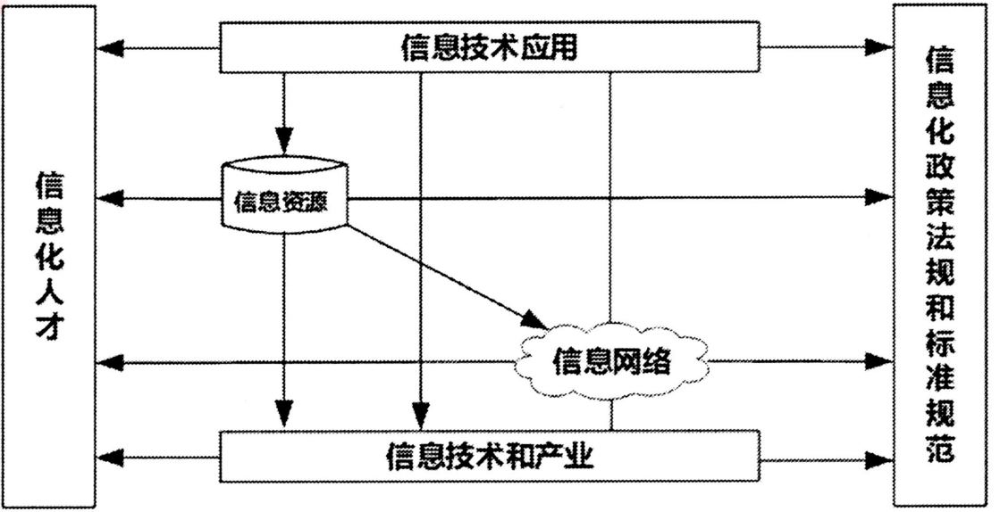
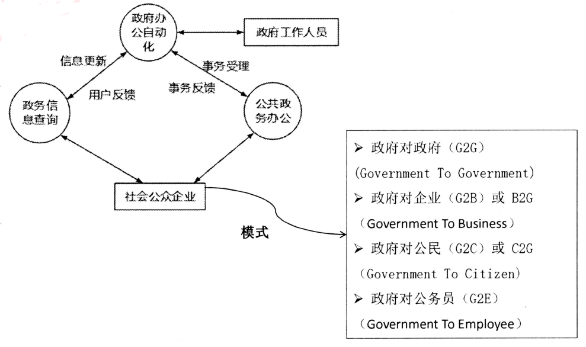
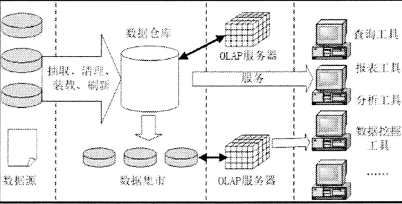
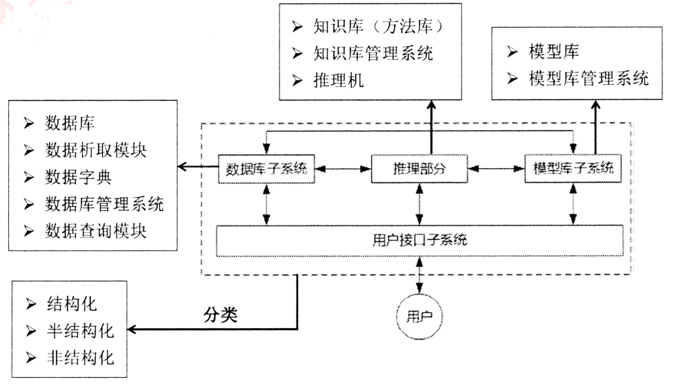
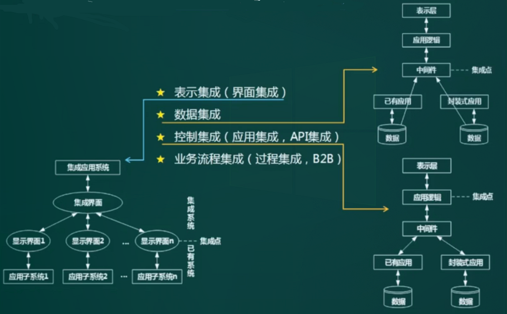

# 信息化

信息的概念：

1. 控制论的创始人维纳认为：信息就是信息，它既不是物质，也不是能量。
2. 信息化的奠基者香农认为：信息是能够用来消除不确定性的东西。

信息的质量属性

1. 精确性：对事物状态描述的精准程度
2. 完整性：对事物状态描述的全面程度
3. 可靠性：信息来源合法，传输过程可信
4. 及时性：信息的获得及时
5. 经济性：信息获取、传输成本经济
6. 可验证性：信息的主要质量属性可以证实或证伪
7. 安全性：信息可以被非授权访问的可能性，可能性越低，安全性越高

信息的特征：客观事实性，动态性，层次性（战略级，管理级，操作级），传递性，滞后性（数据加工后的产物，相对数据滞后），扩压性（可扩散，可压缩）、分享性、普遍性

信息化的概念：

1. 信息化是从工业社会到信息社会的演进和变革。（在这个过程中所做的工作都是信息化）
2. 主体是全体社会成员，时域是一个长期过程，空域是政治、经济、文化、军事和社会生活的一切领域。手段是先进社会生产工具。
3. 对组织的意义：组织的结构创新，管理创新，经营创新（管理和经营融为一体），造就信息化的人才队伍。

信息化层次：

1. 产品信息化：如集成了车载计算机系统的小汽车
2. 企业信息化：如CRM、ERP等
3. 产业信息化：如交通运输业、制造业等传统产业广泛利用信息技术来完成工艺、产品的信息化，实现资源优化与重组，从而实现产业升级
4. 国民经济信息化：指在经济大系统内实现统一的信息大流动，使生产、流通、分配、消费等经济的4个环节，通过信息进一步联成一个整体
5. 社会生活信息化：指包括商务、教育、日常生活等在内的整个社会体系，采用先进的信息技术拓展我们的活动时空，提升生活品质。如智慧城市等

信息化标准，法律和规定，

信息化体系六要素：信息资源是核心，信息技术应用是龙头，信息网络是基础，信息技术和产业是国家信息化建设基础，信息化人才是关键，信息化政策法规和标准规范是保障。关系如图：

组织信息化需求通常包含三个层次：

1. 一是**战略需求**。组织信息化的目标是提升组织的竞争能力、为组织的可持续发展提供一个支持环境。从某种 意义上来说，信息化对组织不仅仅是服务的手段和实现现有战略的辅助工具；信息化可以把组织战略提升到一个 新的水平，为组织带来新的发展契机。特别是对于企业，信息化战略是企业竞争的基础。 
2. 二是**运作需求**。组织信息化的运作需求是组织信息化需求非常重要且关键的一环，它包含三方面的内容：一 是实现信息化战略目标的需要；二是运作策略的需要。三是人才培养的需要。 
3. 三是**技术需求**。由于系统开发时间过长等问题在信息技术层面上对系统的完善、升级、集成和整合提出了需 求。也有的组织，原来基本上没有大型的信息系统项目，有的也只是一些单机应用，这样的组织的信息化需求， 一般是从头开发新的系统。

# 信息系统工程

概念：

1. 信息系统：是一种以处理信息为目的的专门的系统。
2. 信息系统的组成部分包括：硬件、软件、数据库、网络、存储设备、感知设备、外设、人员以及把数据处理成信息的规程等。
3. 信息系统集成：采用现代管理理论（如软件工程、项目管理等）作为计划、设计、控制的方法论，将硬件、软件、数据库、网络等部件按照规划的结构和秩序，有机地整合到一个有清晰边界的信息系统中，以达到既定系统的目标，这个过程称为信息系统集成。

## *战略规划

企业化战略（水平扩展，横向扩张，或者垂直延申，扩展或深耕业务领域），

信息化战略（支撑企业战略，涉及扩展服务器，网络改造，硬件升级，软件系统的规划），

信息系统战略（从软件开发角度，用什么系统做支撑，多个系统如何组织和开发），

**用于管理信息系统规划的方法：**

1. 第一阶段：**以数据处理为核心**，围绕职能部门需求（主要是逻辑计算，按流程进行数据处理）

   1. 企业系统规划法（**BSP**）：**自上而下的识别系统目标，自下而上设计信息系统，对组织结构的变动具有适应性。其规划设计中使用U/C矩阵**。产出物也是UC矩阵表，了解子系统的划分。

      U/C矩阵的作用：用来表达过程与数据两者之间的关系。

      U代表Use，表示过程对数据类的使用。C代表Create），表示过程对数据类的产生。

      U/C矩阵是MIS开发中用于系统分析阶段的一个重要工具。提出了一种用关系数据库实现U/C矩阵的方法，并对其存储、正确性检验、表上作业等做了分析，同时利用结果关系进行了子系统划分。

   2. 关键成功因素法（**CSF**）：通过分析找出使得企业成功的关键因素，然后再围绕这些关键因素来确定系统的需求，并进行规划。

      基本思想：在现行系统中，总存在着多个变量影响系统目标的实现，其中若干个因素是关键的和主要的(即关键成功因素)。通过对关键成功因素的识别，找出**实现目标所需的关键信息集合**，从而确定**系统开发的优先次序**。

      关键成功因素来自于组织的目标，通过组织的目标分解和关键成功因素识别、**性能指标识别**，一直到产生**数据字典**。

      例如：先判断研发系统，营销系统哪个强，先专注于有优势的系统开发，找到成功的关键因素。

   3. 战略集合转化法（**SST**）：把战略目标转变为管理信息系统的战略目标。

2. 第二阶段：**以企业内部MIS（管理信息系统）为核心**，围绕企业整体需求（系统相关联）

   1. 战略数据规划法（**SDP**），信息工程法（**IE**），战略栅格法（**SG**）
   2. 主题数据库：整合每个节点的重复数据，解决一份数据多处存储，可能不一致问题

3. 第三阶段：综合考虑企业内外环境，**以集成为核心**，围绕企业战略需求（很多系统的互联互通）

   1. 价值链分析法（VCA），战略一致性模型（SAM）

**企业数字化转型**的五个发展阶段依次是：初始级发展阶段、单元级发展阶段、流程级发展阶段、网络级发展险段、生态级发展阶段

## 生命周期

1. 立项阶段：从企业全局出发，形成概念，需求分析，完成可行性分析，确立项目是否进行，

2. | 开发阶段 | 内容                                                         | 产出物                                                       |
   | -------- | ------------------------------------------------------------ | ------------------------------------------------------------ |
   | 系统规划 | 初步调查，分析系统目标，子系统组成，拟实施方案，可行性研究，制定系统建设方案 | 系统设计任务书（系统建设方案，实施计划）                     |
   | 系统分析 | 业务流程分析，数据和数据流程分析，软件需求分析，网络需求分析（**做什么**） | 系统需求规格说明书，软件需求规格说明书，确认测试计划，系统测试计划，初步的用户手册 |
   | 系统设计 | 系统架构设计，系统概要设计，详细设计，网络设计（**怎么做**） | 架构设计文档，概要设计说明书，详细设计说明书，程序规格说明书，概要测试计划，详细测试计划，各类设计图 |
   | 系统实施 | 软件编码，单元、集成、系统测试，综合布线                     | 源码，单元、集成测试报告，操作手册                           |
   | 系统验收 | 确认测试、试运行                                             | 确认测试报告，项目验收报告                                   |

3. 运维阶段：通过验收，移交之后，进行维护打补丁，生命周期中持续时间最长

4. 消亡阶段：更新改造，功能扩展，报废重建

# 信息化的应用

## 电子政务

政府信息化

- 政府对政府(G2G，Government To Government)：政府之间的互动及政府与公务员之间互动。基础信息的采集、处理和利用，如人口信息;各级政府决策支持、人口信息采集处理和利用业务。
- G2G原则上包含政府对公务员(G2E，Government To Employee)：内部管理信息系统。
- 政府对企业(G2B，Government To Business)：政府为企业提供的政策环境。给企业单位颁发的各种营业执照、许可证、合格证、质量认证。
- 企业对政府(B2G，Business To Government) ：企业纳税及企业为政府提供服务。企业参加政府各项工程的竞/投标，向政府供应各种商品和服务，企业向政府提建议，申诉。
- 政府对公民(G2C，Government To Citizen) ：政府对公民提供的服务。社区公安和水、火、,天灾等与公共安全l关的信息。户口（籍）、各种证件和牌照的管理。
- 公民对政府(C2G, Citizen To Government)：个人应向政府缴纳税费和罚款及公民反馈渠道。个人应向政府缴纳的各种税款和费用了解民意，征求群众意见。报警服务(盗贼、医疗、急救、火警等)。

## 电子商务

概念：

- 狭义的电子商务：指利用Web提供的通信手段在网上买卖产品或提供服务。
- 广义的电子商务：除了利用Web提供的通信手段在网上买卖产品或提供服务外，还包括企业内部的商务活动以及企业间的商务活动。

主要模式：

1. B2B(Business To Business,企业对企业）：指企业与企业之间通过互联网进行产品、服务及信息的交换。

   B2B电子商务模式包括两种基本模式：①企业之间直接进行的电子商务（如制造商的在线采购和在线供货等）；②通过第三方电子商务网站平台进行的商务活动。如阿里巴巴

2. B2C(Business To Customer,企业对个人）：是商家对消费者，即商业零售模式，商家直接面向消费者销售产品和服务。最具有代表性的B2C电子商务模式是网上零售网站。B2C电子商务的模式不唯一，企业既可以依靠网站开展网上零售，也可以开设面向消费者的在线直接销售。

   如当当，例外，个人咨询师给企业提供服务，就是C2B。

3. C2C(Customer To Customer,个人对个人）：是消费者对消费者的交易，即消费者本身提供服务或产品给消费者，最常见的形态就是个人工作者提供服务给消费者，如保险从业人员、促销人员的在线服务及销售网点或是商品竞标网站。如咸鱼

   C2C 商务平台通过为买卖双方提供一个在线交易平台，使卖方可以主动提供商品上网拍卖，而买方可以自行选择商品进行竞价。

4. 线上对线下（O2O）：如团购，线上支付，线下体验。

电子商务支撑保障体系：法律法规体系、运行监控体系、技术装备体系、在线支付体系、安全认证体系、电子商务支撑保障体系、服务体系、信用体系、现代物流体系、标准规范体系

企业信息化：

1. 概念：企业信息化就是在企业作业、管理、决策的各个层面，科学计算、过程控制、事务处理、经营管理的各个领域，引进和使用现代信息技术，全面改革管理体制和机制，从而大幅度提高企业工作效率、市场竞争能力和经济效益。
2. 目前企业竞争中的“大”吃“小”正在转向为“快”吃“慢”。
3. 企业信息化发展过程应遵循如下原则：效益原则、一把手原则、以人为本的原则、中长期与短期建设相结合的原则、规范化和标准化原则。

## 企业资源计划ERP

定义：企业的所有资源包括三大流：**物质流、资金流和信息流**。企业资源计划（ERP)是对这三种资源进行全面集成管理的管理信息系统。

形成过程：ERP理论与系统是从MRP-II(制造资源计划II)发展而来的，它的主线也是计划，但ERP将管理的重心转移到财务上，在企业整个经营运作过程中贯穿了**财务成本控制**的概念。

1. MRP：物料需求计划（Material Requirement Planning)，物料单系统。
2. MRP II：制造资源计划(manufacturing resource planning)，增加库存，分销等。
3. ERP：企业资源计划（enterprise resource planning)，打通供应链，把财务，人力资源，销售管理等纳入。

ERP系统的总体思路：

- 一个中心：以财务数据库为中心；
- 两类业务：计划与执行；
- 三条干线：供应链管理、生产管理和财务管理。

特点：

1. 是管理思想的变革。
2. 软件产品需要个性化的开发和部署
3. 有多个统一规划的子系统，实现互联互通，便于监控。

供销存系统的子系统：

- 财会管理（财务管理，会计核算），
- 物流管理（分销，库存，采购），
- 生产控制管理（经营计划，生产计划，物料需求计划，能力需求计划，车间控制，制造标准），
- 人力资源管理（规划，招聘，工资核算，工时，差旅费）

## 客户关系管理CRM

概念：

1. CRM（Customer Relationship Management)：一种旨在改善企业与客户之间关系的新型管理机制，将市场营销的科学管理理念通过信息技术的手段集成在软件上，能够帮助企业构建良好的客户关系。
2. CRM在坚持**以客户为中心**的理念的基础上，重构**市场营销和客户服务**等业务流程。**客户服务与支持**是CRM系统的重要功能。客户服务与支持的主要手段有两种：**呼叫中心和互联网**。
3. CRM的目标不仅要使这些**业务流程自动化**，而且要确保前台应用系统能够**改进客户满意度、增加客户忠诚度**，以达到使企业获利的最终目标。
4. 在客户管理系统中，销售自动化是其中最为基本的模块；营销自动化作为销售自动化的补充，包括营销计划的编制和执行、计划结果分析等功能。

支柱性功能：市场营销和客户服务，包含以下模块

1. 基础：客户服务和支持，客户群维系，商机管理 
2. 工具：触发中心，挖掘中心（客户画像，交易信息等）
3. 功能：自动化销售，自动化市场营销，自动化客户服务

通过维护客户关系，推送个性需求信息，实现企业的持久获利。

CRM系统能够与ERP 系统在财务、制造、库存等环节进行连接，两者之间虽然关系比较独立，但由于两者之间具有一定的关系，因此会**形成一定的闭环反馈结构**。

## 供应链管理SCM

供应链管理（Supply Chain Management,SCM)的核心是供应链。现代意义的供应链是利用计算机网络技术全面规划供应链中的**商流、物流、信息流、资金流**等，并进行计划、组织、协调和控制。

1. 需求信息流（**客户订单，生产计划（先有客户订单，再由生产方制定），采购合同**），需方到供方
2. 供应商信息流（**入库单，库存记录，完工报告单，可供销售量**），供方到需方。

供应链管理至少包括以下六大应用功能：需求管理（预测和协作工具）、供应链计划（多工厂计划）、生产计划、生产调度、配送计划、运输计划。

理念：强强联合（供应链管理：制造商，供应商，分销商，零售商），整合与优化“三流”，打通企业间“信息孤岛”，严格的数据交换标准，完成信息交换，提高效率。

## 企业门户

- 企业网站：注重单向信息传递，缺互动。
- 企业信息门户（EIP）：把各种应用系统，数据资源，和**互联网资源**统一集成到企业门户之下。
- 企业知识门户（EKP）：企业网站的基础上，**增加知识性内容**
- 企业应用门户（EAP）：实际是对企业业务流程的集成。**以业务流程和企业应用为核心**，把业务流程中功能不同的应用模块通过门户技术集成在一起。
- 企业通用门户：集以上四者为一体。

## *商业智能BI

Business Intelligence，是一个将技术打包后形成的可行的解决方案。

商业智能（BI)：是企业对商业数据的搜集、管理和分析的系统过程，目的是使企业的各级决策者获得知识或洞察力，帮助他们作出对企业更有利的决策。

一般认为**数据仓库、联机分析处理（OLAP）和数据挖掘**是商业智能的三大组成部分。

 流程：

1. 需求分析
2. 数据仓库建模
3. 数据抽取
4. 建立BI分析报表
5. 用户培训和数据模拟测试
6. 系统改进和完善

### 数据仓库

数据仓库（Data Warehouse）是一个面向主题的、集成的、相对稳定且随时间变化的数据集合，用于支持管理决策。

诞生的原因：一个业务系统，经过多年的运行，数据量逐年递增，造成数据查询慢，系统响应慢。需要抽离历史数据；因为不会删除，所以可以使用索引优化查询；将分析的结果进行存储，先得到数据集合，最终形成数据仓储，

数据仓库的关键特征是：

1. 面向主题：数据按主题组织。
2. 集成的：消除了源数据中不一致性，提供整个企业的一致性全局信息。
3. 相对稳定的（非易失的）：主要进行查询操作，只有少量修改和删除（或不删除）
4. 反应历史变化（随着时间变化）：记录了企业从过去某一时刻到当前，各个阶段的信息，可对发展历程和未来趋势做定量分析和预测。

数据库（单体）=》数据集市（局部）=》数据仓库（全局，一个企业只有一个）。

传统数据库与数据仓库的比较：

| 比较项目         | 传统数据库                    | 数据仓库                                      |
| ---------------- | ----------------------------- | --------------------------------------------- |
| 数据内容         | 当前值                        | 历史的、归档的、归纳的、计算的数据（处理过的) |
| 数据目标         | 面向业务操作程序、重复操作    | 面向主体域,分析应用                           |
| 数据特性         | 动态变化、更新                | 静态、不能直接更新，只能定时添加、更新        |
| 数据结构         | 高度结构化、复杂,适合操作计算 | 简单、适合分析                                |
| 使用频率         | 高                            | 低                                            |
| 数据访问量       | 每个事务一般只访问少量记录    | 每个事务一般访问大量记录                      |
| 对响应时间的要求 | 计时单位小，如秒              | 计时单位相对较大，除了秒，还有分钟、小时      |

### OLAP

OLAP，OLTP的区别

1. **OLAP（联机分析处理）**，针对数据仓库，是其核心部件。
2. **OLTP（联机事务处理）**，针对数据库，关系数据库的基础。

| 项目     | OLTP                                 | OLAP                                   |
| -------- | ------------------------------------ | -------------------------------------- |
| 用户     | 操作人员、低层管理人员               | 决策人员:高级管理人员                  |
| 功能     | 日常操作处理                         | 分析决策                               |
| DB设计   | 面向应用                             | 面向主题                               |
| 数据     | 当前的、最新的、细节的、二维的分立的 | 历史的、聚集的、多维的、集成的、统一的 |
| 存取     | 读/写数十条记录                      | 读上百万条记录                         |
| 工作单位 | 简单的事务                           | 复杂的查询                             |
| 用户数   | 上千个                               | 上百个                                 |
| DB大小   | 100MB 至GB级                         | 100GB 至TB级                           |

### 数据挖掘

概念：

1. 数据挖掘是从数据库的大量数据中揭示出隐含的、先前未知的并有潜在价值的信息的非平凡过程，

2. 数据挖掘的任务有关联分析、聚类分析、分类分析、异常分析、特异群组分析和演变分析等。

3. 并非所有的信息发现任务都被视为数据挖掘。

   例如，使用数据库管理系统查找个别的记录，或通过Internet的搜索引擎查找特定的Web页面，则是信息检索领域的任务。虽然这些任务是重要的，可能涉及使用复杂的算法和数据结构，但是它们主要依赖传统的计算机科学技术和数据的明显特征来创建索引结构，从而有效地组织和检索信息。

数据挖掘与传统数据分析的区别：

- 数据挖掘是在没有明确假设的前提下去挖掘信息、发现知识。
- 数据挖掘所得到的信息应具有先知、有效和可实用三个特征。
- 先前未知的信息是指该信息是预先未曾预料到的，即数据挖掘是要发现那些不能靠直觉发现的信息或知识，甚至是违背直觉的信息或知识，挖掘出的信息越是出乎意料，就可能越有价值。

方法：

1. 决策树：构建树结构进行分析
2. 神经网络：类似统计学中的判别，回归，聚类
3. 遗传算法（三个基本过程）：繁殖（选择），交叉（重组），变异（突变）
4. 关联规则挖掘算法：关联规则是描述数据之间存在关系的规则。

分类：

1. 关联分析：挖掘出隐藏在数据间的相互关系

2. 序列模式分析：侧重点是分析数据间的前后（因果）关系。

3. 分类分析：为每一个记录赋予一个标记，再按标记分类。

   如：当前由足球筐，乒乒球筐，篮球筐，将一堆球，先进行标记，可标记为足球或篮球，再放入符合的筐内。

4. 聚类分析：分析分类的逆过程，先按记录的不同特性进行分类，再赋予定义好的标记。

   如：不知道球的名称，按外形的大小颜色，相同的放在一个筐内，再给筐命名。

   **物以类聚，人以群分**

示例：超市商品分类摆放，通过关联分析，尿不湿和啤酒在一起。通过小票分析，关联度最多的商品，再通过市场调研得知，一般父亲去超市买尿不湿，通常会买啤酒。验证：在柜台摆放尿不湿和啤酒的促销组合，可提高啤酒的销量。（捆绑营销）

大数据杀熟：对于客户经常买的东西，暗中提价。

### 数据湖

定义：

1. 数据湖是一个存储企业的各种各样原始数据的大型仓库，其中的数据可供存取，处理，分析和传输。
2. 数据湖从企业的多个数据源获取原始数据，并针对不同的目的，同一份原始数据可能由多种满足特定内部模型格式的数据副本。所以在数据湖中的数据可以是任意类型的信息，**从结构化到完全非结构化数据**。

数据湖和数据仓库的区别：

| 维度     | 数据仓库                                                     | 数据湖                                                       |
| -------- | ------------------------------------------------------------ | ------------------------------------------------------------ |
| 用途     | 支持分析处理                                                 | 支持分析处理和事务处理                                       |
| 数据     | 清洗过的，结构化数据                                         | 原始数据，结构化，半结构化数据                               |
| 模式     | 数据存储之前定义数据模式；数据集成之前完成大量工作；数据的价值提前明确 | 数据存储之后定义数据模式；提供敏捷，简单的数据集成；数据的价值尚未明确 |
| 存取方法 | 标准SQL接口                                                  | 应用程序，类SQL程序                                          |
| 优势     | 多数据源集成；干净安全的数据；转化一次，多次使用             | 无限扩展性，并行执行，支持编程框架，数据经济                 |

问题：

1. 事务的四大特性：原子性，一致性，隔离性，持久性。
2. 数据湖的使用：直接使用原始数据，或者提取数据到数据仓库中再使用。
3. 数据中台：基于构建化的开发，会积累大量重复的构建工具，又没有动力进行持续更新，所以有了中台。

## 决策支持系统DSS

Decision Support System，建立在足够的数据量上，并对信息进行加工处理，最后得出结论性的内容，供人做决策。 如医生看病。

解决的问题：结构化（能得到具体答案），半结构化，非结构化问题（决策有好有坏）

## 业务流程重组BPR

定义：BPR（Business Process Reengineering）是对企业的**业务流程进行根本性的再思考和彻底性的再设计**，从而获得可以用诸如成本、质量，服务和速度等方面的业绩来衡量的显著性的成就。

流程：

1. 项目的启动，拟定变革计划
2. 建立项目团队，分析目标流程
3. 重新设计目标流程，实施新的设计
4. 持续改进，重新开始。

**基本原则：**

1. 以流程为中心的原则
2. 团队管理原则（以人为本）
3. 以客户为导向的原则

**基于BPR的系统规划：**战略规划，流程规划，数据规划，功能规划，系统实施。

早期：将手工流程转换为计算机流程时，业务流程会发生变化，可以进行简化。比如单据

## 业务流程管理BPM

定义：BPM是一种以**规范化**的构造端到端的卓越业务流程为中心，以**持续的**提高组织业务绩效为目的的**系统化**方法。

**PDCA闭环的管理流程**（plan计划 due执行 check检查  action调优行动)

1. 目标：明确业务流程所获取的成果
2. 计划：开发和计划系统的方法，实现以上成果
3. 执行：系统的部署方法，确保全面实施
4. 迭代：根据对业务的检查和分析以及持续的学习活动，评估和审查所执行的方法，并进一步提出计划和实施改进措施。

**重点**

1. BPR和BPM的区别：BPR对业务流程调整力度最大，而BPM并不要求对所有流程进行再造，而是对流程进行规范化设计，实现持续化的调优。
2. 流程管理有三个层面：规范流程，优化流程，再造流程。

## *企业应用集成EAI

概念：

1. EAI（Enterprise Application Integration，应用集成）：构建统一标准的基础平台，将进程、软件、标准和硬件联合起来，连接具有不同功能和目的而又独自运行的企业内部的应用系统，以达到信息和流程的共享，使企业相关应用整合在一起。
2. EAI就是在各个应用系统的接口之间共享数据和功能。
3. EAI的基本原则：集成多个系统并保证系统互不干扰，也就是**独立性**。
4. EAI的终极目标：将多个企业和企业内部的多个应用集成到一个虚拟的、统一的应用系统中。因此实施EAI必须遵循如下原则︰应用程序的独立性;、面向商业流程、独立于技术、平台无关。
5. EAI提供4个层次的服务，**从下至上依次为通讯服务、信息传递与转化服务、应用连接服务、流程控制服务**，最上层是流程控制服务

作用：

1. 企业信息集成是解决“信息孤岛”问题的需要，
2. 企业集成的水平在很大程度上取决于企业内部各种系统、应用或服务的集成化运行水平，良好的软件支持工具可以帮助企业加快实现企业系统集成。

3. 企业集成平台：作为支持企业集成化运行的使能工具，其主要功能是为企业中各种数据、系统、过程等多种对象的协同运行提供各种公共服务及运行时的支撑环境，从而降低实现企业内部的信息孤岛集成的复杂度，提高应用间集成的有效性，将信息系统实施规划中确定的企业中各种应用系统、服务、人员、信息资源及数字化设备的协同关系物化到集成化运行的可执行系统中去。

- 界面集成：把各应用系统的功能提取到统一界面上，**统一操作入口，产生整体的感觉**。如：导航网站。

- 数据集成：是应用集成和业务过程集成的基础。**把不同来源，格式，特点性质的数据在逻辑上或物理上有机的集中**，从而为企业提供全面的数据共享。如：ETL，数据仓库，主题数据库。

  在集成以前，要对数据进行统—标识分类,并进行元数据建模。这三个步骤完成后，就可以实现企业范围的数据共享和数据分布了。

  图中集成点指向数据库中间件（如jdbc），两个数据库可进行数据同步，也开始使用数据仓库整合数。

- 控制集成（应用集成，API集成）：业务逻辑层次集成，指将多个应用系统进行“绑定”，使之象一个实时运行的系统一样接受信息输入和产生数据输出，实现多个系统功能的“叠加”。

  可以借助于**远程过程调用或远程方法调用，面向消息的中间件等技术**。一个系统调用另一个系统的接口，方法。如：消息队列处理异步。

  应用集成广泛用于B2B集成、在后端服务应用基上建立客户关系管理系统、集成多个应用的Web门户等；在ERP应用实施后，也要经常进行与新的应用系统的集成。

- 业务流程集成（过程集成，B2B）：企业对各种业务信息的交换进行定义，授权，管理，以便改进操作，减少成本，提高响应速度。**先进行流程优化，调整后再合并**。

  商务对商务，企业对企业。对应到企业外部，如供应链，打通上下游企业。
  
  为实现整体的业务目标，要定义关联和管理不同的业务过程，并通过相应的业务信息系统中实现所需要的信息交换，从而降低成本，更高效地实现客户目标。BPI的要素包括过程管理，过程建模和工作流。

**数据集成**主要有以下三种模式:

1. **数据联邦**：数据联邦是指不同的应用共同访问一个**全局虚拟数据库**，通过全局虚拟数据库管理系统为不同的应用提供全局信息服务，实现不同的应用和数据源之间的信息共享和数据交换，其具体实现由**客户端应用、全局信息服务和若干个局部数据源**三部分组成。
2. **数据复制模式**：在数据复制模式中，通过底层应用数据源之间的**一致性复制**来实现（访问不同数据库的)不同应用之间的信息共享和互操作，其实现的关键是必须能够提供在两个或多个数据库系统之间实现数据转换和传输的基础结构(以屏蔽不同数据库间数据模型的差异)。
3. **基于接口的数据集成模式**：在基于接口的数据集成模式中，不同的应用系统之间利用**适配器(或接口代理)**提供的应用编程接口来实现相互调用。应用适配器或接口代理通过其开放或私有接口将业务信息从其所封装的具体应用系统中提取出来，进而实现不同的应用系统之间业务数据的共享与互交换。接口调用的方式可以采用同步调用方法，也可以采用基于消息中间件的异步方法来实现。

消息传递的维度：

- 消息集成：适用于数据量小，但要求频繁的，立即的，**异步的**数据交换场合
- 共享数据库：实时性强，可以频繁交互，数据交换属于**同步方式**
- 文件传输：适用于数据量大，**交换频率小**，即时性能要求低。
- 总线集成：业务流程的集成。把各个模块挂在总线上，通过总线传递信息，如**ESB企业服务总线**。

主题数据库和数据仓库主要区别：**定位不同**

1. 主题数据库用于业务系统
2. 数据仓库只用于数据分析的应用。

# 练习题

1. 查询数据仓库中某种产品的总体销售数量，此活动不属于商业智能范畴，没有进行任何数据分析工作。

   数据库：主要做高并发事务处理OLTP

   数据仓库：主要做决策分析OLAP，商业智能，大数据，数据挖掘。

2. 面向《过程》的集成模式强调处理不同应用系统之间的交互逻辑，与核心业务逻辑相分离，并通过不同应用系统之间的协作共同完成某项业务功能。

   过程和接口集成的区别：

   另一种说明，集成支持的方式：

   1. 面向信息的集成：针对信息孤岛问题，实现方法有：数据复制，数据捆绑，基于接口的信息集 
   2. 面向过程的集成：技术层面的过程集成，引入工作流引擎。业务过程逻辑和应用逻辑分离，实现过程建模和数据、功能的分离
   3. 面向服务的集成（接口哦api）：支队大范围内的公共业务过程集成，较好的实现企业间具有松散耦合关系的不同应用间的互操作。

3. 企业应用集成通过采用多种集成模式构建统一标准的基础平台，将具有不同功能和目的且独立运行的企业信息系统联合起来。其中，面向（）的集成模式强调处理不同应用系统之间的交互逻辑，与核心业务逻辑相分离，并通过不同应用系统之间的协作共同完成某项业务功能。
   A.数据；B.接口；C.过程；D.界面

   解析：企业应用集成通过采用多种集成模式，构建统一标准的基础平台，将具有不同功能和目的而又独立运行的企业信息系统联合起来。目前市场上主流的集成模式有三种：面向信息的集成、面向过程的集成和面向服务的集成。其中面向过程的集成模式强调处理不同应用系统之间的交互逻辑，与核心业务逻辑相分离，并通过不同应用系统之间的协作共同完成某项业务功能。

4. 门户系统以商业流程和企业应用为核心，将商业流程中不同的功能模块通过门户集成在一起，提高公司的贸易，协同，信息管理能力。需要使用《应用门户解决方案》

5. CRM系统能够和ERP系统在财务，制造，库存等环节进行连接，但两者关系相对松散，《一般不会形成闭环结构》

   错误的原因：ERP，CRM，SCM虽然侧重点不同，但都是成熟的结构体系，有良好的对接机制，可以形成闭环结构。比如SCM中，上下游企业的供应链管理就是强强联合。

6. 客户关系管理（CRM)系统将市场营销的科学管理理念通过信息技术的手段集成在软件上，
   能够帮助企业构建良好的客户关系。以下关于CRM系统的叙述中，错误的是（）。
   A.销售自动化是CRM系统中最基本的模块
   B.营销自动化作为销售自动化的补充，包括营销计划的编制和执行、计划结果分析等
   C.CRM 系统能够与ERP 系统在财务、制造、库存等环节进行连接，但两者关系相对松散，**一般不会形成闭环结构**
   D.客户服务与支持是CRM系统的重要功能。目前，客户服务与支持的主要手段是通过呼叫中心和互联网来实现

7. 共享数据库为不同的应用程序提供了统一的数据存储与格式定义，《能够解决不同应用程序中数据语义不一致的问题》。

   错误的原因：语义的理解歧义不能通过统一的数据的统一来解决。比如：“老地方见”，数据不变，但不同的人不同的理解。

8. 想要集成内部多个业务系统，但这些业务系统的运行平台和开发语言差异较大，系统所使用的通信协议和数据格式各不相同，需要采用《总线》的集成框架。

   原因：使用一条总线，用于连接不同的业务系统，对不同的协议，不同格式的数据进行转换，并分发。

   集成系统还需要根据公司的新业务需要，灵活、动态的定制系统之间的功能协作关系，可以基于《工作流》技术来实现。

   原因：业务灵活，动态定制，设计模式使用解释器，用于做自定义内容的解读。工作流技术有工作流引擎做支持，可以灵活的组转，所以不应该是远程过程调用。

   工作流常用于OA系统，由于业务流程很灵活，经常改变，而工作流支持灵活的配置。

9. 企业战略数据模型可以分两种类型：《数据库模型》描述日常事务处理中的数据及其关系。《数据仓库模型》描述企业管理决策者所需信息及其关系。

10. 运用信息技术进行知识的挖掘和《业务流程》的管理是企业信息化建设的重要活动。

   业务流程管理和重组。 

11. 业务流程重构是对企业的佐治结构和工作方法进行重新设计，《SCM》是一种重要实现手段。

    原因：不是供应链管理，而是BPR。

    在业务数量浩繁且流程错综复杂的大型企业中，《主题数据库》方法往往形成许多“信息孤岛”

    原因：不是主题数据库，而是应用数据库。

    人力资源管理把企业的《部分》优秀员工看作是一种资本，能够取得投资收益。

    原因：部分 错误，应该是所有的。

    围绕核心业务，应用计算机和网络技术，是企业信息化建设的有效途径。正确

12. 集成管理是企业信息资源管理的主要内容之一，实现企业信息资源集成的前提是对企业历史上形成的的**企业信息功能**的集成，其核心是对**企业内部和外部信息流**的集成，其实施的基础是**各种信息手段**的集成。

    通过集成管理实现企业信息系统各要素的优化组合，使信息系统各要素之间形成强大的协同作用，从而最大限度的方法企业信息的功能，实现企业可持续化发展的目的。

13. 为了加强对企业信息资源的管理，设置信息管理机构，建立信息中心，确定信息主管，统一管理和协调企业信息资源的开发，收集和使用。

    信息中心的**主要职能**是：处理信息，确定信息处理的方法，用先进的信息技术提高业务管理水平，建立业务部门期望的信息系统和网络，并预测未来的信息系统和网络，培养信息资源的管理人员。

14. ERP的发展路程：企业信息化涉及到对企业管理理念的创新，重新整合企业现有的管理流程，管理核心从对《**财务和物料**》的管理，转向对《**技术，物资和人力资源**》的管理，并延申到对企业技术创新，产品设计，工艺设计，生产制造过程的管理，进而还扩展到对《**客户关系和供应商**》的管理，乃至发展到电子商务。

    物料和物资的区分：生产企业习惯将最终产品之外的、在生产领域流转的一切材料（不论其来自生产资料还是生活资料）、燃料、零部件、半成品、外协件以及生产过程中必然产生的边角余料、废料以及各种废物统称为“物料”。物资是全部物质资料。

15. 企业信息化一定要建立在企业战略规划的基础之上，以企业战略规划为基础建立的企业管理模式，是建立《**企业战略数据模型**（就是主题数据库）》的依据

16. 企业信息集成按照组织范围分为：企业内部的信息集成和外部的信息集成。

    企业内部的信息集成分为4个方面：

    1. 技术平台的集成：系统底层的体系结构、**软硬件**、异构网络的特殊需求必须先得到集成。主要是信息技术设备和设施。
    2. 数据的集成：实现**不同系统的数据交流和共享**，是进行更进一步集成的基础。采用的主要数据处理技术有数据复制，数据聚合，接口集成等。
    3. 应用系统的集成：**实现不同系统之间的互操作，使得不同系统之间能够实现数据和方法的共享**
    4. 业务过程的集成：企业必须在各种业务系统中定义、授权和管理各种业务信息的交换，以便改进操作，减少成本，提高响应速度。使**不同应用系统中的流程能无缝连接，实现流程的协调运作和流程信息的充分共享。**

    企业外部的信息集成：

    1. 通过**门户网站**和互联网实现公众，社会和客户的互动，实现企业内外部信息资源的有效交流和集成。
    2. 通过与**合作伙伴信息系统的对接**，建立动态企业联盟，发展基于竞争合作机制的虚拟企业，重塑企业的战略模式和竞争优势。

17. 集成平台是支持企业集成的支撑环境，包括硬件，软件，软件工具和系统，通过集成各种企业应用软件形成企业集成系统。作为企业集成系统支持环境的集成平台，其基本功能主要有：

    1. 通信服务：提供分布环境下透明的同步异步同行服务功能
    2. 信息集成服务：**为应用提供透明的信息访问服务，通过实现各种数据库系统之间数据的交换、互操作、分布数据管理和共享信息模型定义**，是集成平台上运行的应用、服务或用户端能以一致的语义和接口实现对数据（数据库，文件，应用交互信息）的访问和控制。
    3. 应用集成服务：通过高层应用编辑接口来实现对相应应用程序的访问，这些高层应用编辑接口包含在不同的适配器或代理中，他们被用来连接不同的应用程序。**通过为应用提供数据交换和访问操作，使各种不同的系统能够相互协作**。 
    4. 二次开发工具，平台运行管理工具

18. 商业智能系统的处理过程由4个阶段：数据预处理通过《数据抽取，转换和转载》实现企业原始数据的初步整合；建立数据仓库是后续数据处理的基础；数据分析是体现系统智能的关键，主要采用《联机分析处理》和《数据挖掘》技术。前者实现数据的上卷，下钻和旋转分析，后者利用隐藏的知识，通过建立分析模型预测企业未来发展趋势；数据展现是数据处理结果的可视化。

