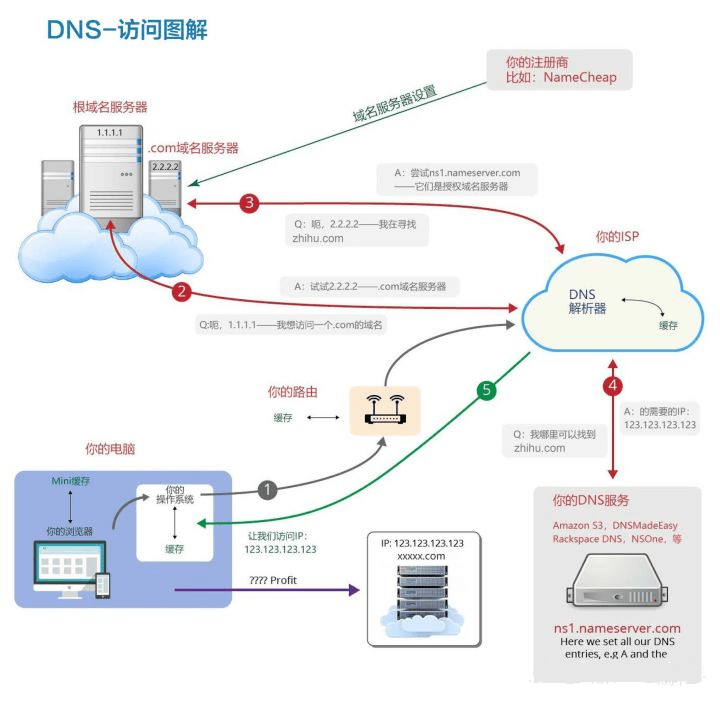

# TCP/IP协议族

- 国际互联协议IP（Internet Protocol）
- 传输控制协议TCP（Transmission Control Protocol）
- 用户数据报协议UDP（User Datagram Protocol）

## TCP

TCP是一个面向连接的传输控制协议，必须对数据的传输进行控制。

报文格式：

- 源端口号/目的端口号：表示数据从哪个进程来，要到那个进程去

- 32位序号：序号是可靠传输的关键因素。TCP将要传输的每个字节都进行了编号，序号是本报文段发送的数据组的第一个字节的编号，序号可以保证传输信息的有效性。比如：一个报文段的序号为300，此报文段数据部分共有100字节，则下一个报文段的序号为401。
- 32位确认序号：每一个ACK对应这一个确认号，它指明下一个期待收到的字节序号，表明该序号之前的所有数据已经正确无误的收到。确认号只有当ACK标志为1时才有效。比如建立连接时，SYN报文的ACK标志位为0。
- 4位首部长度(数据偏移)： 表示该TCP头部有多少个32位bit(有多少个4字节)，所以TCP头部大长度是15 * 4 = 60。根据该部分可以将TCP报头和有效载荷分离。TCP报文默认大小为20个字节。
- 6位标志位：
  URG : 它为了标志紧急指针是否有效。
  ACK ：标识确认号是否有效。
  PSH : 提示接收端应用程序立即将接收缓冲区的数据拿走。
  RST：它是为了处理异常连接的， 告诉连接不一致的一方，我们的连接还没有建立好， 要求对方重新建立连接。我们把携带RST标识的称为复位报文段。
  SYN : 请求建立连接; 我们把携带SYN标识的称为同步报文段。
  FIN : 通知对方, 本端要关闭连接了, 我们称携带FIN标识的为结束报文段。
- 16位的紧急指针：按序到达是TCP协议保证可靠性的一种机制，但是也存在一些报文想优先被处理，这时就可以设置紧急指针，指向该报文即可，同时将紧急指针有效位置位1。

- 16位窗口大小：如果发送方发送大量数据，接收方接收不过来，会导致大量数据丢失。然后接收方可以给发送方发消息让发送方发慢一点，这是流量控制。接收方将自己接收缓冲器剩余空间的大小告诉发送方叫做16位窗口大小。发送发可以根据窗口大小来适配发送的速度和大小，窗口大小最大是2的16次方，及64KB，但也可以根据选项中的某些位置扩展，最大扩展1G。
- 16位校验和：发送端填充，CRC校验。如果接收端校验不通过， 则认为数据有问题(此处的检验和不光包含TCP首部也包含TCP数据部分)。

TCP是一个能提供高可靠性的通信协议，高可靠性指数据无丢失、数据无误、数据无失序、数据无重到达。

为保证可靠性的机制：

- 确认应答机制：接收方(对方的TCP)有责任对收到的数据进行确认(acknowledge) 应答。

  TCP会将每个字节的数据进行编号，即**序列号**。每一个ACK都带有对应的确认序列号，意思是告诉发送者，我已经收到了哪些数据；下一次你从哪里开始发。

- 超时重传机制：主机A发送数据给B之后，可能因为网络拥堵等原因，数据无法到达主机B；如果主机A在一个特定时间间隔内没有收到B发来的确认应答，就会进行重发；

  因此主机B会收到很多重复数据，通过序列号去重。并让超时时间以指数形式递增，所以不会一直重传。

- 连接管理机制：TCP要经过三次握手建立连接，四次挥手断开连接。这是由于 TCP 的**半关闭**（half-close）特性造成的，TCP 提供了连接的一端在结束它的发送后还能接收来自另一端数据的能力。

  **三次握手**：主要作用是为了确认双方的接收能力和发送能力是否正常、指定自己的 **初始化序列号(Init Sequense Number,** **ISN**)为后面的可靠性传输做准备。

  SYN：连接请求/接收 报文段；seq：发送的第一个字节的序号

  ACK：确认报文段；ack：确认号，希望收到的下一个数据的第一个字节的序号

  **刚开始客户端处于** **Closed** **的状态，而服务端处于** Listen **状态**：

  CLOSED：没有任何连接状态LISTEN：侦听来自远方 TCP 端口的连接请求

  1. **第一次握手**：客户端向服务端发送一个 SYN 报文（SYN = 1），并指明客户端的初始化序列号 ISN(x)，即图中的 seq = x，表示本报文段所发送的数据的第一个字节的序号。此时客户端处于 SYN_Send 状态。

     SYN-SENT：在发送连接请求后等待匹配的连接请求

  2. **第二次握手**：服务器收到客户端的 SYN 报文之后，会发送 SYN 报文作为应答（SYN = 1），并且指定自己的初始化序列号 ISN(y)，即图中的 seq = y。同时会把客户端的 ISN + 1 作为确认号 ack 的值，表示已经收到了客户端发来的的 SYN 报文，希望收到的下一个数据的第一个字节的序号是 x + 1，此时服务器处于 SYN_REVD 的状态。

     SYN-RECEIVED：在收到和发送一个连接请求后等待对连接请求的确认

  3. **第三次握手**：客户端收到服务器端响应的 SYN 报文之后，会发送一个 ACK 报文，也是一样把服务器的 ISN + 1 作为 ack 的值，表示已经收到了服务端发来的的 SYN 报文，希望收到的下一个数据的第一个字节的序号是 y + 1，并指明此时客户端的序列号 seq = x + 1（初始为 seq = x，所以第二个报文段要 +1），此时客户端处于 Establised 状态。服务器收到 ACK 报文之后，也处于 Establised 状态，至此，双方建立起了 TCP 连接。

     ESTABLISHED：代表一个打开的连接，数据可以传送给用户

  **发起方一定是客户端**，

  

  **四次挥手**：

  FIN ：连接终止位；seq：发送的第一个字节的序号；

  ACK：确认报文段；ack：确认号。希望收到的下一个数据的第一个字节的序号

  1. **第一次挥手**：客户端发送一个 FIN 报文（请求连接终止：FIN = 1），报文中会指定一个序列号 seq = u。并**停止再发送数据，主动关闭 TCP 连接**。此时客户端处于 FIN_WAIT1 状态，等待服务端的确认。

     FIN-WAIT-1 - 等待远程TCP的连接中断请求，或先前的连接中断请求的确认；

  2. **第二次挥手**：服务端收到 FIN 之后，会发送 ACK 报文，且把客户端的序号值 +1 作为 ACK 报文的序列号值，表明已经收到客户端的报文了，此时服务端处于 CLOSE_WAIT状态。

     CLOSE-WAIT - 等待从本地用户发来的连接中断请求；

     **此时的 TCP 处于半关闭状态，客户端到服务端的连接释放**。客户端收到服务端的确认后，进入FIN_WAIT2（终止等待 2）状态，等待服务端发出的连接释放报文段。

     FIN-WAIT-2 - 从远程TCP等待连接中断请求

  3. **第三次挥手**：如果服务端也想断开连接了（没有要向客户端发出的数据），和客户端的第一次挥手一样，发送 FIN 报文，且指定一个序列号。此时服务端处于 LAST_ACK 的状态，等待客户端的确认。

     LAST-ACK - 等待原来发向远程TCP的连接中断请求的确认；

  4. **第四次挥手**：客户端收到 FIN 之后，一样发送一个 ACK 报文作为应答（ack = w+1），且把服务端的序列值 +1 作为自己 ACK 报文的序号值（seq=u+1），此时客户端处于 **TIME_WAIT（时间等待）状态**。

     TIME-WAIT - 等待足够的时间以确保远程TCP接收到连接中断请求的确认

  5. 这个时候由服务端到客户端的 TCP 连接并未释放掉，**需要经过时间等待计时器设置的时间 2MSL（一个报文的来回时间） 后才会进入** **CLOSED状态**（目的是确保服务端收到自己的 ACK 报文。如果服务端在规定时间内没有收到客户端发来的 ACK 报文，服务端会重新发送 FIN 报文给客户端，客户端再次收到 FIN 报文之后，就知道之前的 ACK 报文丢失了，然后再次发送 ACK 报文给服务端）。服务端收到 ACK 报文之后，就关闭连接了，处于 CLOSED 状态。

  **客户端或服务端均可主动发起挥手动作**

  

## UDP

UDP是一种不可靠无连接、实时性高的协议，在数据发送前，不需要提前建立连接，所以可以更高效地传输数据，但可靠性无法保证。

报文格式：

特点：

1. **无连接**：只知道对端的IP和端口号就可以发送，不需要实现建立连接。(就像寄信)。
2. **不可靠**：没有确认机制， 没有重传机制。如果因为网络故障该段无法发到对方， UDP协议层也不会给应用层返回任何错误信息。
3. **面向数据报**： 应用层交给UDP多长的报文， UDP原样发送既不会拆分，也不会合并。所以UDP不能够灵活的控制读写数据的次数和数量。
4. **UDP存在接收缓冲区，但不存在发送缓冲区**。
5. **大小受限**。UDP协议首部中有一个16位的最大长度。也就是说一个UDP能传输的数据最大长度是64K（包含UDP首部）。

## DHCP

定义：DHCP（Dynamic Host Configuration Protocol）动态主机配置协议，是一个基于UDP的应用层协议，使用客户/服务器模型，客户端和服务端通过广播进行交互。

作用：给主机分配IP地址。

分配方式：固定分配（永久IP）、动态分配（有时限的IP）、手动分配（网络管理员分配）

1. 一般使用动态分配，可以实现续租和释放，租约默认是8天，
2. 当租约过半时，客户机需要向DHCP服务器申请续租
3. 若租约超过87.5%时，还没有和当初提供IP的DHCP服务器联系上，则开始联系其它的DHCP服务器。
4. 若DHCP服务器没有多余的IP地址时，会分配无效的IP地址，如169.254.X.X或0.0.0.0。

DHCP的实现分为4步，分别是：

1. Client端在局域网内发起一个DHCP　Discover包，目的是想发现能够给它提供IP的DHCP Server。
2. 可用的DHCP Server接收到Discover包之后，通过发送DHCP Offer包给予Client端应答，意在告诉Client端它可以提供IP地址。
3. Client端接收到Offer包之后，发送DHCP Request包请求分配IP。
4. DHCP Server发送ACK数据包，确认信息。

## DNS

定义：DNS（Domain Name System）域名系统，就是解析器和域名服务器的组合。

- DNS就是存储了各种IP地址，然后让你通过域名定位到IP地址来进行连接通信的。
- DNS是基于UDP的应用层协议，client端（一般指浏览器）构建DNS查询请求，依次被传输层，网络层，数据链路层等封装传送到达DNS服务器端，最终client端接收到DNS响应消息

主要作用：将主机域名转换为IP地址。

因特网的域名结构：

1. 因特网采用了层次树状结构的命名方法。
2. 任何一个连接在因特网上的主机或路由器，都有一个唯一的层次结构的名字，即域名。
3. 域名的结构由标号序列组成，各标号之间用点隔开：

域名服务器的管辖范围以区zone为单位，分为4种类型

1. 根域名服务器：在因特网上共有13个不同 IP 地址的根域名服务器，从a 一直到 m，它们都知道所有的顶级域名服务器的域名和 IP 地址；在使用迭代查询时，根域名服务器把下一步应当找的顶级域名服务器的 IP 地址告诉本地域名服务器。
2. 顶级域名服务器：负责管理在该顶级域名服务器注册的所有二级域名。当收到 DNS 查询请求时，就给出相应的回答（可能是最后的结果，也可能是下一步应当找的域名服务器的 IP 地址）
3. 权限域名服务器
4. 本地域名服务器

查询方式：

1. 递归查询：DNS服务器必须回答目标IP和域名的映射关系（正确答案）。如**本地域名服务器向根域名服务器的查询**。
2. 迭代查询：DNS服务器收到一次迭代查询，回复一次结果（可能是目标IP和域名的对应关系，也可以能是其它DNS服务器地址）。如**主机向本地域名服务器的查询**。

DNS缓存：每次访问网站，DNS会保存你访问过的网站的域名服务器（即DNS) 信息，存储在你的本机电脑上，目的是下次在浏览器以最短的路径、更快的速度找到所需的DNS信息，解析网站。

1. 浏览器缓存：当用户通过浏览器访问某域名时，浏览器首先会在自己的缓存中查找是否有该域名对应的IP地址
2. 系统缓存：当浏览器缓存中无域名对应IP则会自动检查用户计算机系统Hosts文件，是否有该域名对应IP。

请求实例

1.  浏览器会首先搜索自身的**DNS缓存**（缓存时间比较短，大概只有1分钟，且只能容纳1000条缓存），看自身的缓存中是否有www . qq .com 对应的条目，而且没有过期，如果有且没有过期则解析到此结束。
2. 如果浏览器自身的缓存里面没有找到对应的条目，那么浏览器会尝试读取**hosts文件**（位于C:\Windows\System32\drivers\etc），看看这里面有没有该域名对应的IP地址，如果有则解析成功。
3. 如果在hosts文件中也没有找到对应的条目，浏览器就会发起一个DNS的系统调用，就会向本地配置的首选DNS（53号端口UDP协议）服务器发起域名解析请求。（**本地域名服务器**）
4. **主机向本地域名服务器解析的过程采用递归**（也就是运营商的DNS服务器必须得提供给我们该域名的IP地址），而本地域名服务器向其它域名服务器解析可以使用递归和迭代两种方式。

# 网络规划和设计

## 需求分析和规划

分析网络的要求：功能需求、通信需求、性能需求、可靠性需求、安全需求、运行和维护需求、管理需求。

网络规划原则：实用性原则，开放性原则（统一通用标准），先进性原则。

网络设计任务：确定网络总体目标、确定总体设计原则、通信/资源子网设计、设备选型、网络操作系统与服务器资源设备、网络安全设计

网络实施原则：可靠性、安全性、高效性、可扩展性。

网络实施步骤：工程实施计划、网络设备到货验收、设备安装、系统测试、系统试运行、用户培训、系统转换。

## 逻辑和物理设计

逻辑网络设计：包含拓扑结构、网络地址分配、安全规划、网络管理、选择路由协议、设备命名规则

物理网络设计：包括设备的具体物理分布、运行环境等确定，设备选型、结构化布线，机房设计。

利用需求分析结果来设计逻辑网络结构，逻辑网络设计文档的输出内容有：

1. 逻辑网络设计图
2. **IP地址方案**
3. **安全方案**
4. 招聘和培训网络员工的具体说明
5. 对软硬件、服务、员工和培训的费用**初步估计**

物理网络设计是**对逻辑网络设计的物理实现，通过对设备的具体物理分布、运行环境等确定**，确保网络的物理连接符合逻辑连接的要求。输出内容有：

1. 网络物理结构图和**布线方案**
2. **设备和部件的详细列表清单**
3. 软硬件和安装费用的**估算**
4. 安装日程表、详细说明服务的时间及期限
5. 安装后的测试计划
6. 用户的培训计划

## 层次化网络设计：

1. 接入层：用户接入、计费管理、MAC地址认证、收集用户信息
2. 汇聚层：网络访问策略控制、数据包处理、过滤、寻址
3. 核心层：高速数据交换，常用冗余机制（多台）。

# 网络接入

有线接入：公用交换电话网络PSTN（Public Switch Telephone Network），数字数据网DDN（Data Direct Network），综合业务数字网ISDN，非对称数字用户线路ADSL（PPOE，PPOA），同轴光纤技术HFC（Hybird Fiber Coaxial）

无线接入：IEEE 802.11（WiFi），IEEE 802.15（蓝牙Bluetooth），红外IrDA，无线局域网鉴别和保密基础结构WAPI（Wireless LAN Authentication and Privacy Infrastructure）

3G、4G、5G标准：

1. 3G：宽带码分多址WCDMA、码多分址CDMA2000，TD-SCDMA
2. 4G：TD-LTE（时分），FDD-LTE（频分），WiMax（WirelessMax-Advanced 802.16m）
3. 5G：高性能，低延迟，高容量，速率1Gbit/S。

# 网络存储

分类：

1. 直连式存储DAS（Direct-Attached Storage）：用USB线连硬盘
2. 网络附加存储NAS（Network-Attached Storage）：用网线连接一个文件系统或私有云存储系统
3. 存储区域网络SAN（Storage Area Network）：划分不同网络区域，并用光纤连通存储网和业务网，成本高
4. Internet小型计算机系统接口iSCSI（internet Small Computer System Interface）：用以太网交换机连通，成本低

## 磁盘阵列

定义：磁盘阵列RAID（Redundant Arrays of Independent Disk）

- Raid0（条块化）：性能最高，并行处理，无冗余，损坏无法恢复。（用两个硬盘存数据）

- Raid1（镜像结构）：可用性，可修复性好，具备纠错功能，但只有50%利用率。

  

- Raid0+Raid1：Raid0和Raid1长处的结合，高效且可靠，企业应用比较多。

- Raid3（奇偶校验并行传送）：N+1模式，有固定的校验盘，坏一个盘可恢复。

- Raid5（分布式奇偶校验的独立磁盘）：N+1模式，无固定的校验盘，坏一个盘可恢复，具备容错功能，磁盘利用率（n-1)/n。（每个盘都会存储相互形成的校验码，如Dp,Cp,Bp,Ap）

  

  **容量计算**：若4个盘都是50G，则最终存储的最大数据量是150G，校验数据量是一个盘的大小50G。若其中一个盘扩容到100G，则最终存储的最大数据量是150G，**由最小盘的容量决定最大存储量和校验量**。

- Raid6（两种存储的奇偶校验）

## IPv6

IPv4是点分十进制，用32位二进制来表示二进制。2^32≈40亿，所以不够用。

IPv6是冒分十六进制，用于替代现行版本IP协议（IPv4）的下一代IP协议。

1. 地址长度为128位，**地址空间扩大了2^96倍**
2. 简化的IP报文头部格式，字段只有8个，加快报文转发，提高吞吐量。
3. 灵活的IP报文头部格式，使用一系列固定格式的扩展头部取代IPv4中的可变长度的选项字段，加快了报文处理速度
4. 提高安全性。增加关键特性：身份认证和隐私权。
5. 支持更多的服务类型
6. 允许协议继续演变，增加新的功能，使之适应未来技术的发展。

地址格式：IPv6地址由8个16进制字段构成

1. 单播地址（Unicast）：用于单个接口的标识符，给单一对象发信息。 

   可聚合全球单播地址（前缀001），本地单播地址（链路本地前缀为11 1111 1010，站点本地前缀为11 1111 1011）

2. 任播地址（Anycast）：泛播地址，一组接口的标识符，IPv4的广播地址。**前缀固定，其余位置为0.**

3. 组播地址（Multicast）：**也叫多播，前缀为1111 1111**，功能上和IPv4的组播类似。

**省略原则（合法地址判断）**：高位0可省略，一段全为0则记为1个0，多段0直接省略为双冒号::（只能使用一次）

- 示例：2001：0db8：0000：0000：1319：0370：7344
- 省略等价于：2001：0db8：0：0：1319：0370：7344，	2001：0db8 :: 1319：0370：7344

**IPv4/IPv6过渡技术**：

1. 双协议栈技术：双栈技术通过节点**对IPv4和IPv6双协议栈的支持**，从而支持两种业务的共存。
2. 隧道技术：隧道技术通过在IPv4网络中**部署隧道，实现在IPv4网络上对IPv6业务的承载**，保证业务的共存和过渡。隧道技术包括:6to4隧道；6over4隧道；ISATAP隧道。
3. NAT-PT技术：NAT- PT使用网关设备连接IPv6和IPv4网络。当IPv4和IPv6节点互相访问时，NAT- PT网关实现两种协议的转换翻译和地址的映射。

# 综合布线系统

包括：工作区子系统（电脑和网线连接），水平干线子系统（楼层中网线的连接），管理间子系统（每个楼层中使用交换机连接），垂直干线子系统（将管理间子系统联系起来，解决楼层之间的连接），设备间子系统（每个楼层中管理当前层的设备），建筑群子系统（建筑和建筑之间连接）。

# 物联网

## 概念和分层

概念：物联网（The Internet of Things）是实现物物相连的互联网络。其内涵包括两方面：

1. 物联网的核心和基础是互联网，是在互联网上延伸和扩展的网络
2. 其用户延伸和扩展到任何物体和物体之间，使其进行信息交换和通信。

分层：

1. 感知层：识别物体，采集信息。如二维码，摄像头，传感器（温度、湿度），RFID射频技术。
2. 网络层：传递和处理信息。通信网和互联网的融合网络，网络管理中心，信息中心，智能处理中心等。
3. 应用层：解决信息处理和人机交互的问题。

## 关键技术

- 射频识别技术RFID（Raido Frequency Identification），又称电子标签，通过无线电讯号识别特定目标并读写相关数据，而无需识别系统与特定目标之间建立机械或光学接触。

  基本组成部分：标签，阅读器、天线

- 二维码：用某种特定的几何图形，按一定规律在平面分布的黑白相间的图形记录数据符号信息的。在代码编制上利用构成计算机内部逻辑基础的0和1比特流的概念，使用若干个与二进制相对应的几何形体来表示文字数值信息，通过图像输入设备或光电扫描设备自动识读以实现信息自动处理。

  常用码制：Data Matrix，Maxi Code，Azter，QR Code，Vericode，PDF417，Ultracode，Code49，Code 16K

  1. 若采用扩展的字母数字压缩格式，可容纳1850个字符
  2. 若采用二进制/ASCII格式，可容纳1108个字节
  3. 若采用数字压缩格式，可容纳2701个数字。

# 云计算

定义：云计算是一种基于互联网的计算方式，通过这种凡是，共享的软硬件资源和信息可以按需提供给计算机和其它设备。云其实是网络、互联网的一种比喻说法。

核心思想：将大量用网络连接的计算资源统一管理和调度，构成一个计算资源池向用户按需服务。

- 狭义云计算：指IT基础设施的交付和使用模式，通过网络以按需、易扩展的方式获得所需资源
- 广义云计算：指服务的交付和使用模式，通过网络以按需、易扩展的方式获得所需服务。

**特点：**

- 集合了大量计算机，规模成千上万
- 多种软硬件技术相结合
- 对客户端设备的要求低
- 规模化效应

分类：

1. 软件即服务SaaS（Software as a Service)：打包应用程序，提供给用户，如在线客服。
2. 平台即服务PaaS（Platform as a Service)：提供平台，需要二次开发。
3. 基础设施即服务LaaS（Infrastructure as a Service）：提供设备

