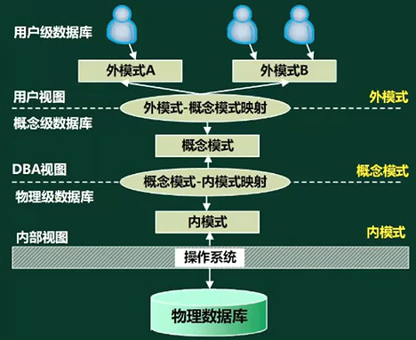
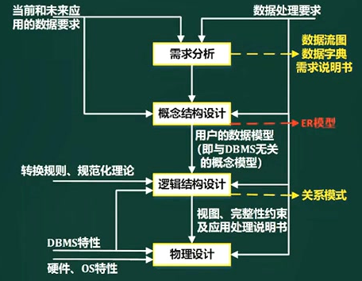
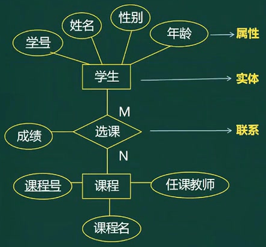
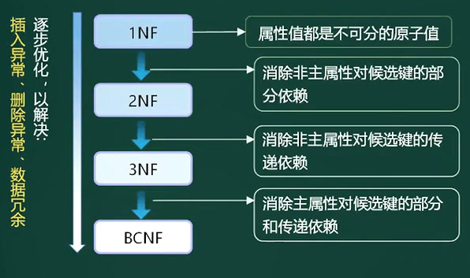
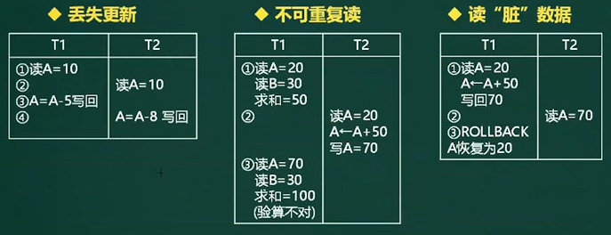
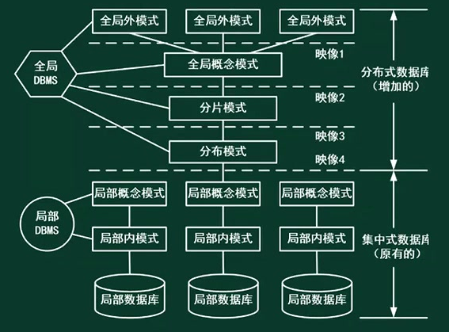
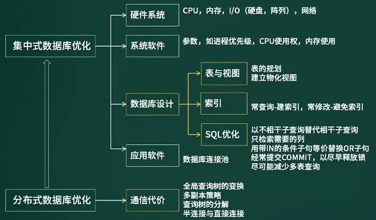

# 定义

1. 数据库（DataBase，DB)：是指长期储存在计算机内的、有组织的、可共享的数据集合。
2. 数据库系统（DataBase System，DBS)：由数据库、硬件、软件和人员组成，管理的对象是数据。
3. 数据库管理系统（DataBase Management System，DBMS)：是一种操纵和管理数据库的大型软件，用于建立、使用和维护数据库。DBMS通常分三类：关系数据库系统（RDBS），面向对象的数据库系统（OODBS)、对象关系数据库系统（ORDBS)。

# 数据库模式

## 三级模式-两层映射

ANSI为了规范我们对数据库的使用，ANSI的数据库管理系统研究小组于1978年提出了标准化的建议，将数据库结构分为3级：面向用户或应用程序员的**用户级**、面向建立和维护数据库人员的**概念级**、面向系统程序员的**物理级**。 

三级模式：

1. 内模式：又称**存储模式**，对应于物理级。它是数据库中全体数据的内部表示或底层描述，是数据库最低一级的逻辑描述，它描述了数据在存储介质上的存储方式和物理结构，对应着**实际存储在外存储介质上的数据库文件**

   内模式依赖于概念模式，独立于外模式和存储设备

2. 概念模式：又称**模式**，对应于概念级，它是数据库设计者综合所有用户的数据，按照一个统一的观点构造的全局逻辑结构，**对数据库的全部的数据的逻辑结构和特征的总体描述（基本表）**。是所有用户的公共数据视图(全局视图)，

   概念模式是数据库的中心与关键，由数据模式描述语言(Data Description Language，DDL)来描述、定义的

3. 外模式：又称子模式或**用户模式**，对应于用户级。它是某个或某几个用户所看到的数据库的**数据视图**，是与某一应用有关的数据的逻辑表示。

   面向具体的应用，独立于内模式和存储设备

**应用程序依赖于外模式，独立于概念模式和内模式。**

二级映射：

1. 模式/内模式的映射：实现模式到内模式的相互转换，保证数据的物理独立性（基本表改变，只修改视图，不需要修改用户调用过程）
2. 外模式/模式的映射：实现外模式到模式的相互转换，保证数据的逻辑独立性（数据迁移后，用户程序不需要修改）

## 关系数据库模式

在数据库中要区分型和值。关系数据库中的型也称为关系数据库模式，是关系数据库结构中的描述。它包括若干域的定义以及在这些域上定义的若干关系模式。

关系数据库的值是这些关系模式在某一个时刻而对应的关系的集合，通常称之为关系数据库

关系的描述称为关系模式，简记为：$R(U)\space or \space R(A_1,A_2,A_3,\dots,A_n)$

| 运算符           | 含义                                                         |
| ---------------- | ------------------------------------------------------------ |
| 集合运算符       | ∪ 并 \\cup；− 差； ∩ 交 \\cap； × 笛 卡 尔 积 \\times        |
| 专门的关系运算符 | σ 选 择 \\sigma； π 投 影 \\pi； ⋈ 连 接 \\bowtie； ÷ 除 \\div |
| 逻辑运算符       | ¬ 非 \\neg；∨ 与 \\vee； ∧ 或 \\wedge                        |
**数据依赖**是通过一个关系中属性间值的相等与否体现出来的数据间的相互关系，是现实世界属性间联系和约束的抽象，是数据内在的性质，是语义的体现。

**函数依赖**则是一种最重要、最基本的数据依赖。设R(U)是属性集U上的关系模式，X、Y是U的子集。若R(U)的任何一个可能的关系r，r中不可能存在两个元组在X上的属性值相等，而在Y上的属性值不等，则称X函数决定Y或Y函数依赖于X，记作$ X \rightarrow Y$

## 关系代数

- 集合运算：并，交，差

- 笛卡尔积：返回所有的情况。属性列数是二者之和，元组行数是二者之积（排列组合）。

- 投影：从垂直方向上，针对属性列做的选择。

- 选择：从水平方向上，针对元组行查找满足的行。

自然连接：是一种特殊的等值链接，基于表R和S的笛卡尔乘积，取对应的R和S中**相同属性组都相同的值**，同时相同属性组只保留一个。

- 它要求两个关系中进行比较的分量必须是相同的属性组。
- **属性列数是二者之后并去重，元组行的同名属性列取值相等**【选择】。

- 笛卡尔积的等价表达式：先选择后投影。（笛卡尔积、选择、投影的组合表示可以与自然连接等价.）
- 自然连接的性能优于笛卡尔积

多表联合查询：select 【投影】 from t1,t2【笛卡尔积】 where 【选择】

## 数据库视图

定义：是一个虚拟表（逻辑上的表），其内容由查询定义（仅保存SQL多表联合查询语句），通过查询原始表动态生成所需要的数据。

优点：

1. 视图简化用户操作
2. 视图使用户能以多种角度看待同一数据
3. 视图对重构数据库提供一定程度的逻辑独立性
4. 视图可以对机密数据提供安全保护（只读，分配访问权限）

缺点：查询后再展示，效率比较低，且不能修改。

物化视图：实体化视图，会存储数据。当原始表中的数据更新使，物化视图也会更新，所以适合查询较多的数据。

# 数据库设计

## 结构和数据模型

数据库的结构

- 数据库结构的基础是数据模型，是用来描述数据的一组概念和定义。
- 数据模型的三要素：数据结构、数据操作、数据的约束条件。

常用的数据模型。

1. 概念数据模型。

   概念数据模型又称为实体联系模型，它按照用户的观点来对数据和信息建模，主要用于数据库设计。概念模型主要用实体一联系方法（Entity-Relationship Approach）表示，简称E-R方法。

   E-R模型简称E-R图，是描述概念世界、建立概念模型的实用工具。E-R图的三个要素有:
   1）实体（型)：用矩形框表示，框内标注实体名称。
   2）属性：用椭圆形表示，并用连线与实体连接起来。
   3）实体之间的联系：用菱形框表示，框内标注联系名称，用连线将菱形框分别与有关实体相连，并在连线上注明联系类型。

2. 基本数据模型。

   基本数据模型又称为结构数据模型，是按照计算机系统的观点来对数据和信息建模，主要用于DBMS 的实现。

   **基本数据模型是数据库系统的核心和基础**，通常由数据结构、数据操作和完整性约束三部分组成，其中数据结构是对系统静态特性的描述；数据操作是对系统动态特性的描述；完整性约束是一组完整性规则的集合。

3. 面向对象模型。

   用面向对象观点来描述现实世界实体的逻辑组织、对象间限制、联系等的模型。一个面向对象数据库系统是一个持久的、可共享的对象库的存储和管理者，而一个对象库是由一个面向对象模型所定义的对象的集合体。

   面向对象数据库模式是类的集合，提供了一种类层次结构。在面向对象数据库模式中，一组类可以形成一个类层次，一个面向对象数据库可能有多个类层次。在一个类层次中，一个类继承其所有超类的全部属性、方法和消息。面向对象的数据库系统在逻辑上和物理上从面向记录上升为面向对象、面向可具有复杂结构的一个逻辑整体。允许用自然的方法，并结合数据抽象机制在结构和行为上对复杂对象建立模型，从而大幅度提高管理效率，降低用户使用复杂性。

## 设计过程

1. 需求分析：生成**数据流图，数据字典、需求规格说明书**
2. 概念结构设计：**E-R模型**（实体关系图），对数据建模
3. 逻辑设计：**关系模式**（二维表）作为数据模式。
4. 物理设计：硬件，OS特性，聚簇索引。

## E-R模型

实体（矩形）、属性（椭圆）、联系（菱形，多对多，1对多）。

概念结构设计中，E-R模型的设计流程：

1. 抽象数据，设计局部ER模型
2. 合并局部模型，消除冲突
3. 重构优化，消除冗余

集成的方法：

1. 多个局部E-R图一次集成
2. 逐步集成，用累加的方式一次集成两个局部E-R

集成产生的冲突和解决办法：

1. 属性冲突：属性域冲突和属性取值冲突
2. 命名冲突：同名异义，异名同意。
3. 结构冲突：同一对象在不同应用中具有不同的抽象，以及同一实体在不同局部E-R图中所包含的属性个数和排列次序不完全相同。

进入逻辑设计阶段后，将E-R图转换为关系模式

1. 一个实体型转换为一个关系模式
2. 1对1联系可以转换为一个关系模式，也可以与任一端实体的关系模式合并。
3. 1对n联系可以转换为一个关系模式，也可以与n端实体的关系模式合并。
4. m对n联系必须单独转换为一个关系模式
5. 三个以上实体间的一个多元联系。例如3个不同实体集和它们之间的多对多联系m:n:p，最少可以转换为**4个关系模式**。（多对多联系，可以转化成一个多元关系模式）

# 规范化理论

非规范化的关系模式，可能存在的问题：数据冗余、异常更新、插入异常、删除异常。

## 基本概念

函数依赖：设R(U）是属性U上的一个关系模式，X和Y是U的子集，r是R的任一关系，如果对于r中的任意两个元组u和v，只要有u[X]=v[X]，就有u[Y]=v[Y]，则称X函数决定Y，或称Y函数依赖于X，记为X→Y。函数依赖是一种最重要、最基本的数据依赖。而关系数据库设计理论的核心就是数据间的函数依赖。

- 函数依赖：对于函数f(x) ，若每一个X都有唯一结果Y与它对应，则称X函数决定Y，或Y函数依赖于X，记为X→Y。如学号→系号。
  - 部分函数依赖：关系模式R1（A，B，C，D），依赖集（AB→D，A→C），联合主键情况下。
  - 传递函数依赖：关系模式R1（A，B，C），依赖集（A→B，B→C，可得A→C）
- 候选键：唯一标识元组的属性集合，且无冗余。如学号，身份证号，或组合属性。
- 主键：唯一标识元组。（候选键中任一个）
- 外键：其它关系的主键
- 属性分为：简单属性（不可拆分），复合属性（可以再分，如地址），派生属性（如出生日期可以计算出年龄）

**求候选键：**

1. 将关系模式的函数依赖用**有向图**的方式表示
2. **找入度为0的属性**，并以该属性集合为起点，尝试遍历有向图，若能便**遍历图中所有节点**，则该属性集为关系模式的候选键。
3. 若入度为0的属性集不能遍历图中所有节点，则需要尝试性的将一些中间节点（有入度和出度）并入入度为0的属性集中，直至该集合能遍历所有节点。

## 范式

定义：符合某一种级别的关系模式的集合，表示一个关系内部各属性之间的联系的合理化程度。**通俗讲，是一张数据表的表结构所符合的某种设计标准的级别**。

关系模式和关系的区别：关系模式是数据表的结构，关系是一张带数据的表。

目的：解决因**数据冗余**而造成的插入异常，更新异常，删除异常的问题。

1. 第一范式：保持列的**原子性，不可再分**（二维表）。

2. 第二范式：满足第一范式，确保表中**非主属性**都和主键相关，不能**对联合主键有部分依赖**（会产生冗余数据，需要分解表）。

   若表的候选码只有一个属性，所以不可能存在非主属性对于码 的部分函数依赖，所以此表符合2NF的要求。

3. 第三范式：满足第二范式，确保表中**非主属性**和主键直接相关，不能间接相关，存在**传递依赖**（非主属性B依赖候选键A，非主属性C又依赖非主属性B）。

4. BC范式：满足第三范式，消除**主属性和候选键**的部分、传递依赖。假设R是一个关系模式，F是它的依赖集，R属于BCNF当且仅当F中每个依赖的决定因素必定包含R的某个候选码。

- 候选键包含的是主属性，其它为非主属性。

范式判断方法：

1. 找到候选键，主属性，和非主属性。
2. 从第一范式到BC范式依次判断。

题目1：设有职工实体Employee（职工号，姓名，性别，年龄，通信地址，家庭成员)，其中通信地址记录了邮编、省、市、街道信息;家庭成员记录了职工的亲属的姓名。职工实体中的通信地址是一个(**复合**）属性；为了将数据库模式设计的**更合理**，对于家庭成员属性(**D**）。

A.   可以不作任何处理直接记录亲属的姓名
B.   只允许记录一个亲属的姓名（不能限制用户输入，更改需求）
C．需要对职工实体设置若干个亲属姓名字段
D．应该将职工的亲属的姓名加上职工号设计成为一个独立的实体（弱实体单独列表）

题目2：若1.某公司有若干个仓库；2.每个仓库只能有一名管理员，一名管理员只能在一个仓库中工作;；
3.一个仓库中可以存放多种物品，一种物品也可以存放在不同的仓库中。每种物品在每个仓库中都有对应的数量。
那么关系模式仓库（仓库名，管理员，物品名，数量)属于哪一级范式?

题解：已知依赖集F：仓库名→管理员，管理员→仓库名，（仓库名，物品名）→数量；

1. 候选码：（管理员，物品名），（仓库名，物品名）；主属性：仓库名，管理员，物品名；非主属性：数量。
2. 不存在非主属性对候选码的部分依赖和传递依赖，所以此关系模式属于3NF。
3. 存在的问题：
   1. 先**新增加一个仓库**，但尚未存放任何物品，是否可以为该仓库指派管理员？——不可以，因为物品名也是主属性，根据实体完整性的要求，主属性不能为空。
   2. **某仓库被清空**后，需要删除所有与这个仓库相关的物品存放记录，会带来什么问题？——仓库本身与管理员的信息也被随之删除了。
   3. 如果**某仓库更换了管理员**，会带来什么问题？——这个仓库有几条物品存放记录，就要修改多少次管理员信息
4. 主要原因：存在**主属性【仓库名】对于候选码【（管理员，物品名）】的部分函数依赖**。（依赖集F中的依赖项仓库名→管理员，管理员→仓库名没有包含候选码，只包含候选码的一部分）。
5. 解决办法：在3NF基础上，消除主属性对候选码的部分、传递函数依赖。分表：仓库（仓库名，管理员）
   库存（仓库名，物品名，数量）。

## 模式分解

定义：**范式之间的转化一般都是通过拆分属性，即模式分解**，将具有部分函数依赖和传递依赖的属性分离出来，达到一步步优化的目的。

### 保持函数依赖分解

定义：对于关系模式R，有依赖集F，若对R进行分解，分解出来的多个关系模式，**保持原来的依赖集不变**，则为保持函数依赖的分解。

==另外，注意要消除掉冗余依赖（如传递依赖）。==

示例：原关系模式 R(A,B,C)，依赖集F(A->B,，B->C，A->C)，将其分解为两个关系模式 R1(A,B)和R2(B,C)，此时 R1中保持依赖 A->B，R2保持依赖B->C，说明分解后的R1 和R2是保持函数依赖的分解，因为A->C这个函数依赖实际是一个冗余依赖，可以由前两个依赖传递得到，因此不需要管。

### 无损分解

定义：将一个关系模式分解成若干个关系模式后，**通过自然连接和投影等运算仍能够还原出原关系模式**，就是无损分解，不能还原就是有损。

定理：当模式R分解成两个关系模式R1和R2时，如果R1和R2的公共属性函数能决定R1或R2中的其它属性，则这样的分解具有**无损联接性**。所以**具备无损分解的两个条件：有同名属性和以同名属性为决定因素的函数依赖**。

**示例**：有关系模式:成绩（学号，姓名，课程号，课程名，分数)，

函数依赖：学号→姓名，课程号→课程名，(学号，课程号)→分数，

若将其分解为：成绩（学号，课程号，分数)；学生（学号，姓名)；课程（课程号，课程名)

判断该分解是否为无损分解

1. **使用自然连接（同名属性列取值相等），同名属性列进行相交，并使用同名属性列做决定因素的函数依赖（被保留到分解的关系模式中），来还原出被决定因素。**
2. 成绩和学生做自然连接，学号是同名属性列，由于有:学号→姓名，所以还原出姓名的属性列：成绩（学号，课程号，分数，姓名)
3. 成绩和课程做自然连接，课程号是同名属性列，由于有:课程号→课程名，所以还原出课程名的属性列：成绩（学号，课程号，分数，姓名，课程名)

**表格法**判断是否为无损分解 

1. 初始表：

   |      |  学号   |  姓名   | 课程号  | 课程名  |  分数   |
   | :--: | :-----: | :-----: | :-----: | :-----: | :-----: |
   | 成绩 | $\surd$ | $\Chi$  | $\surd$ | $\Chi$  | $\surd$ |
   | 学生 | $\surd$ | $\surd$ | $\Chi$  | $\Chi$  | $\Chi$  |
   | 课程 | $\Chi$  | $\Chi$  | $\surd$ | $\surd$ | $\Chi$  |

2. 根据学生表和课程表的函数依赖：学号→姓名，课程号→课程名，**且具有同名属性列**，可以进行处理，

   |      |  学号   |  姓名   | 课程号  | 课程名  |  分数   |
   | :--: | :-----: | :-----: | :-----: | :-----: | :-----: |
   | 成绩 | $\surd$ | $\surd$ | $\surd$ | $\surd$ | $\surd$ |
   | 学生 | $\surd$ | $\surd$ | $\Chi$  | $\Chi$  | $\Chi$  |
   | 课程 | $\Chi$  | $\Chi$  | $\surd$ | $\surd$ | $\Chi$  |

3. 第一行全是√，所以本次R分解是无损联接分解。

题目：设关系模式R(U，F)，其中R上的属性集U={A，B，C，D，E}，R上的函数依赖集F= {A→B，DE→B，CB→E，E→A，B→D}。(**CE**）为关系R的候选关键字。分解（==R1(ABC)，R2(ED)，R3(ACE)==）是无损连接。

题解使用表格法：

|      | A       | B       | C       | D       | E       |
| ---- | ------- | ------- | ------- | ------- | ------- |
| R1   | $\surd$ | $\surd$ | $\surd$ |         |         |
| R2   |         |         |         | $\surd$ | $\surd$ |
| R3   | $\surd$ |         | $\surd$ |         | $\surd$ |

1. 通过依赖函数A→B，且A为同名属性列，R3和R1自然连接，R3中关联出B。
2. 通过依赖函数CB→E，且CB为同名属性列，R3和R1自然连接，R1中关联出E。
3. 通过依赖函数E→A，且E为同名属性列，R3和R2自然连接，R2中关联出A。
4. 通过依赖函数A→B，且A为同名属性列，R2和R1自然连接，R2中关联出B
5. 通过依赖函数B→D，且B为同名属性列，R1和R2自然连接，R1中关联出D
6. R1行的属性都还原，所以是无损连接。（已经还原出的属性可以在下次还原）

## Armstrong公理

**正确性**和**完备性**：

- 正确性是指从F中推导出的函数依赖必为F所蕴含
- 完备性是指F所蕴含的**所有函数依赖**都可以从Armstrong公理中推导出

设关系模式R<U,F>，其中U为属性集，F是U上的一组函数依赖，那么有如下推理规则：

- ① A1自反律（Reflexivity）：若Y⊆X⊆U，则X→Y为F所蕴含；

  （软件学院，软件工程）这个属性组可以推出 软件工程 这个属性，本身可以推出子集是一定满足的。

- ② A2增广律（Augmentation）：若X→Y为F所蕴含，且Z⊆U，则XZ→YZ为F所蕴含；

  由专业和班级的对应表，软工1901 -> 软件工程，再加上张三这个名字，将函数依赖“**增广**”为(软工1901，张三) -> (软件工程，张三)，这个关系也是成立的

- ③ A3传递律（Transitivity）：若X→Y，Y→Z为F所蕴含，则X→Z为F所蕴含。

  软工1901->软件工程， 软件工程->软件学院，所以：软工1901->软件学院

根据A1，A2，A3这三条推理规则可以得到下面三条推理规则

- ④ 合并规则：若X→Y，X→Z，则 X→YZ 为F所蕴含；(A2：X→XY，XY→YZ；A3：X→YZ)
- ⑤ 伪传递规则：若X→Y，WY→Z，则 XW→Z 为F所蕴含；(A2：XW→YW，A3)
- ⑥ 分解规则：若Z⊆Y，X→Y，则 X→Z 为F所蕴含。(Al：Y→Z，A3)

## 反规范化

规范化问题：由于规范化会使表不断的拆分，从而导致数据表过多。虽然减少了数据冗余，提高了增删改的速度，但会增加查询的工作量，查询效率低（系统需要进行多次连接，才能进行查询操作）

反规范化技术：数据库设计建表时遵循规范化理论，根据业务逻辑，数据库设计者希望**牺牲部分规范化来提高性能**，这种**从规范化设计的回退方法**称为反规范化技术。

好处：减低连接操作的需求，降低外码和索引的数目，较少表的数目，提高查询效率。

问题：数据的重复存储，浪费磁盘空间；可能出现数据完整性问题（删除），为了保障数据的一致性，增加了数据维护的复杂性，降低修改速度（更新）

技术手段：

1. 增加冗余列：多个表中保留相同的列，通过增加数据冗余，来减少或避免查询时的连接操作。如姓名（成绩表中增加，也可通过学号关联）
2. 增加派生列：在表中增加可以由本表或其他表中数据计算生成的列，减少查询时的连接操作，并避免计算或使用集合函数。如年龄（通过出生日期计算）
3. 重新组表：若多用户经常查询两个表连接的结果数据，则把两表的组成一个表来减少连接而提高性能。解决多表关联频繁查询慢的问题。
4. 水平分割表：根据一列或多列数据的值，把数据放到多个独立的表中，主要用于数据规模大，表中数据相对独立，或数据需要存放到多个介质上时使用。减少数据查询范围。
5. 垂直分割表：对表分割，主键和部分常用列放一个表，主键和非常用字段放另一个的表，可以减少查询时的I/O次数。

权衡：增、删、改和查询效率之间的选择。

# 事务管理

DBMS运行的基本工作单位是事务，事务是用户定义的一个数据库操作序列，这些操作序列要么全做，要么全都不做，是一个不可分割的工作单位。

事务四大特性（ACID）

1. 原子性(Atomicity)：事务是数据库的逻辑工作单位，事务的所有操作在数据库中要么全做，要么全都不做。
2. 一致性（Consistency)：事务的执行使数据库从一个一致性状态变成另一个一致性状态。
3. 隔离性（Isolation)：一个事务的执行不能被其他事务干扰。
4. 持续性（Durability，永久性）：指一个事务一旦提交，它对数据库的改变必须是永久的，即便系统出现故障时也是如此。

# 并发控制

并发操作：在多用户共享系统中，许多事务可能同时对同一数据进行操作，称为并发操作，此时数据库管理系统的并发控制子系统负责协调并发事务的执行，保证数据库的完整性不受破坏，同时避免用户得到不正确的数据。

1. **并发**的问题：丢失更新（T1的值被覆盖），脏读（读未提交），不可重复度（读已提交的数据）。

    

2. 解决方案 --》 封锁协议：

   1. **S封锁**：读锁，共享锁，事务T对数据A加上S锁时，则T就可以对A进行读取，但不能进行更新。

      其他事务只能再对数据A加S锁，而不能加X锁，直到T释放A上的S锁。（保证只能读取，不能更新）

   2. **X封锁**：写锁，排他锁，独占锁，事务T对数据A加上X锁时，只允许事务T读取和修改数据A。

      其他事务不能再对数据A加任何锁。

   3. 一级封锁协议：事务T再修改数据A之前必须对其**加X锁**，**直到事务结束释放**。可防止丢失修改。

      | 执行顺序 | T1            | T2                 |
      | -------- | ------------- | ------------------ |
      | 1        | 对数据A加X锁  |                    |
      | 2        |               | 对数据A加X锁       |
      | 3        | 读A=10        | 加锁失败，进入等待 |
      | 4        | A=A-5；写回   | 等待               |
      | 5        | 释放对A的写锁 | 等待               |
      | 6        |               | 读A=5              |
      | 7        |               | A=A-8；写回        |
      | 8        |               | 释放对A的写锁      |

   4. 二级封锁协议：一级封锁协议的基础上事务T在读取数据A之前对其**加S锁**，**读完后即可释放S锁**。可防止丢失修改，防止脏读。

      | 执行顺序 | T1                       | T2                          |
      | -------- | ------------------------ | --------------------------- |
      | 1        | 对数据A加X锁             |                             |
      | 2        | 读A=20                   |                             |
      | 3        | A= A+50                  |                             |
      | 4        | 写回70                   | 对数据A加S锁                |
      | 5        |                          | 等待                        |
      | 6        | ROLLBACK                 | 等待                        |
      | 7        | A恢复到20，释放对A的写锁 | 读A=20                      |
      | 8        |                          | 释放对A的读锁（读完就释放） |

   5. 三级封锁协议：一级封锁协议的基础上，事务T在读数据A之前先对其**加S锁**，**直到事务结束才释放**。可防止丢失修改，防止脏读，防止数据重复读。

      | T1                                 | T2                     |
      | ---------------------------------- | ---------------------- |
      | 对A和B加S锁，读A=20，B=30，求和=50 |                        |
      |                                    | 对A加X锁               |
      | 读A=20，B=30，求和=50              | A已有读锁，加锁失败    |
      | 释放对A和B的读锁（事务完成后释放） | 等待                   |
      |                                    | 读A=20，A=A+50，写回70 |
      |                                    | 释放对A的写锁          |

   6. 两段封锁协议：将加锁和释放锁放在两个时间段，可串行的（并行和串行的结果一样），可能发生死锁。

3. 死锁：预防和解除。

# 数据库完整性约束

- **实体完整性约束**：主键，唯一且非空
- **参照完整性约束**：外键，其它关系的主键，或者空。
- **用户自定义完整性约束**：check约束
- 触发器：解决复杂问题，保证关联数据的完整性和一致性

# 数据库安全性

| 措施           | 说明                                                     |
| -------------- | -------------------------------------------------------- |
| 用户标识和鉴定 | 身份验证（用户账户，口令），是最外层的安全保护措施，     |
| 存取控制       | 权限控制，对用户进行授权，包括操作类型和数据对象的权限。 |
| 密码存储和传输 | 对远程终端信息用密码传输                                 |
| 视图的保护     | 对视图进行授权，只读                                     |
| 审计           | 日志记录（用户对数据库的所有操作）、事后审查，可追溯     |

# 数据备份

备份方式的分类：

- 冷备份（静态备份）：将数据库正常关闭，在停止状态下，将数据库文件全部拷贝一份。
- 热备份（动态备份）：利用备份软件，在数据库正常运行的状态下，将数据库中的数据文件备份出来。

| 备份方式 | 优点                                                         | 缺点                                                         |
| -------- | ------------------------------------------------------------ | ------------------------------------------------------------ |
| 冷备份   | 备份速度快，容易归档和恢复；低度维护，高度安全               | 备份时，数据库需要关闭；不能按表或用户恢复；只能提供某一时间点上的恢复；占用磁盘空间大 |
| 热备份   | 可在表空间或数据库文件级备份，备份时间短；数据库备份时正常使用；可达到秒级恢复；可对所有数据库实体做恢复；恢复速度快 | 不能出错，否则数据库会崩；难于维护；若备份失败，备份文件不可用 |

备份内容的分类：

1. 完全备份：备份所有数据
2. 差量备份：仅备份**上一次完全备份**之后变化的数据
3. 增量备份：备份**上一次备份**之后变化的数据。

日志文件：事务日志时针对数据库改变所做的记录，它可以记录针对数据库的任何操作，并将记录结果保存在独立文件中。（先写日志，再写数据）

备份计划：交错使用，一周一次完备，隔两天差备，其它增备。

# 数据库故障和恢复

| 故障关系               | 故障原因               | 解决办法                                                     |
| ---------------------- | ---------------------- | ------------------------------------------------------------ |
| 事务本身的可预期故障   | 本身逻辑               | 在程序中预先设置RollBack语句                                 |
| 事务本身的不可预期故障 | 算术溢出，违反存储保护 | 由DBMS的恢复子系统，通过日志撤销事务对数据库的修改，回退到事务的初始状体 |
| 系统故障               | 系统停止运作           | 使用检查点法                                                 |
| 介质故障               | 外存被破坏             | 使用日志重做业务                                             |

Undo：撤销（事务未正常提交）；Redo：重做（已成功提交的事务）

# 分布式数据库

定义：分布式系统是指其组件分布在网络上，组件之间通过传递消息进行通信和动作协调的系统。它的核心理念是让多台服务器协同工作，完成单台服务器无法处理的任务，尤其是高并发或者大数据量的任务。

分布式数据库管理系统 DDBMS（Distributed Database Management System）：由多个独立实体组成，并且彼此通过网络进行互联的数据库。也是针对地理上分散而管理上又需要不同程度集中管理的需求，而提出的一种数据管理信息系统。

分布式数据库系统的特点：数据的集中控制性、数据独立性、数据冗余可控性、场地自治性、存取有效性。

分布式数据库与集中式数据库的区别：

| 分布式数据库                     | 集中式数据库                             |
| -------------------------------- | ---------------------------------------- |
| 由位于不同站点的多个数据文件组成 | 由单个中央数据库文件组成                 |
| 允许多个用户访问和操作数据       | 多个用户同时访问同一文件时发生瓶颈问题   |
| 从里用户最近的位置快速传送文件   | 文件传递给用户可能需要更长时间           |
| 若某一个站点发生故障，数据可恢复 | 单站点，系统发生故障时停机               |
| 来自分散数据库的多个文件必须同步 | 在单一的中央系统中更简单的更新和管理数据 |

## 体系结构

分布式数据库的体系结构：全局外层、全局概念层、局部概念层、局部内层。

结构分类：全局控制集中的DDBMS，全局控制分散的DDBMS，全局控制部分分散的DDBMS。

组成：

- 局部数据库管理系统LDBMS（Local Database Management System)
- 全局数据库管理系统GDBMS（Global Database Management System)
- 通信管理CM（Communication Management）
- 全局数据字典。

**分布透明性：**

1. 分片透明性：是指全局数据模式如何分片对用户和应用程序不可见，其只需按全局模式进行操作，会由分布式系统映像到不同的分片上实现（水平、垂直、混合分片）
2. 场地透明：是指用户和应用程序不需要指出对哪个场地上的片段进行操作，场地的变换不会引起用户和应用程序使用上的改变;
3. 局部数据模型透明性：指各场地数据的数据模型(关系模型、非关系模型)和数据的逻辑结构以及选用的DBMS等对用户和应用程序是不可见的，用户和应用程序只需要按全局关系模式进行操作，而由分布式数据库系统来实现转换。

**核心：**

- 数据分片：突破中心化数据库单机的容量限制，从而将数据分散到多节点，以更灵活、高效的方式来处理数据
  - 水平分片：按行进行数据分割，数据被切割为一个个数据组，分散到不同节点上。
  -  垂直分片：按列进行数据切割，一个数据表的模式（Schema）被切割为多个小的模式
- 数据同步：是分布式数据库的底线，帮助数据库恢复一致性。

两阶段提交协议中的两个阶段：

- 第一阶段： 准备阶段(表决阶段)：事务协调者(事务管理器)给每个参与者(资源管理器)发送 Prepare 消息，每个参与者要 么直接返回失败(如权限验证失败)，要么在本地执行事务，写本地的 redo 和 undo 日志，但不提交，到达一种“万事俱备，只欠东风”的状态。 
- 第二阶段：提交阶段（执行阶段）：如果协调者收到了参与者的失败消息或者超时，直接给每个参与者发送回滚(Rollback) 消息；否则，发送提交(Commit)消息；参与者根据协调者的指令执行提交或者回滚操作，释放所有事务处理过程 中使用的锁资源。(注意:必须在最后阶段释放锁资源)

## 发展历程

分布式数据库发展就是一个由合到分，再到合的过程：

1. 早期的关系型商业数据库的分布式能力可以满足大部分用户的场景，因此产生了如 Oracle 等几种巨无霸数据库产品，均为 OLTP 与 OLAP 融合数据库；

2. OLAP 领域首先寻求突破，演化出了大数据技术与 MPP 类型数据库，提供功能更强的数据分析能力；

3. 去 IOE （小型机，商业闭源数据库，存储阵列）引入数据库中间件，并结合应用平台与开源单机数据库形成新一代解决方案（融合了旧有的开源型数据库，同时结合先进的分布式技术，共同构造了一种融合性的“准”数据库。它是面向具体的应用场景的，所以阉割掉了传统的 OLTP 数据库的一些特性，甚至是一些关键的特性，如子查询与 ACID 事务等），让商业关系型数据库走下神坛，NoSQL 数据库更进一步打破了关系型数据库唯我独尊的江湖地位；

4. 新一代分布式 OLTP 数据库正式完成了分布式领域对数据库核心特性的完整支持，它代表了分布式数据库从此走向了成熟，也表明了 OLAP 与 OLTP 分布式场景下，分别在各自领域内取得了胜利；

5. 随着云计算的纵向深入发展，分布式数据库又迎来新的革命浪潮——云原生数据库。HTAP 和多模式数据处理的引入，再一次将 OLAP 与 OLTP 融合，从而将分布式数据库推向如传统商业关系型数据库数十年前那般的盛况，而其产生的影响要比后者更为深远。

# 数据库表分区

定义：将一个数据量比较大的表，用某种方法吧数据从物理上分成若干个小表来存储，逻辑上还是一个表。

分区和分表（反规范化）的区别：

1. 两者都是针对数据表，将数据做到分布式，提高数据检索的效率，降低数据库频繁I/O压力值
2. 分表是生成多张新数据表，实现数据均衡存储
3. 分区不生成新的数据表，而是将表的数据均分到不同硬盘、系统或不同服务器存储介质中，逻辑上还是一张表。

优点：

1. 相对于单个文件系统或硬盘，分区可以存储更多的数据。
2. 数据管理比较方便，通过删除分区数据，可以很容易清理掉某年的数据。
3. 精准定位分区查询数据，不需要全表扫描查询，提高数据检索效率
4. 可跨多个分区磁盘查询，提高查询吞吐量
5. 设计聚合函数查询时，可以很容易进行数据合并

分区策略：

1. 范围分区（RANGE）：根据数据库表**某一字段的值的范围**来划分分区，如年份。
2. 散列分区（HASH）：根据**字段的hash值**进行均匀分布，尽可能实现各分区所散列的数据相等。（业务逻辑相关性弱）
3. 列表分区（LIST）：根据某字段的某个具体值进行分区，如地域长沙、武汉一个区，北京一个区。

# 联邦数据库

联邦数据库系统FDBS是一个彼此协作却又相互独立的成员数据库CDBS的集合

联邦数据库管理系统FDBMS：是一个将成员数据库系统按不同程度进行集成，对该系统整体提供控制和协同操作的软件

**特征**：分布性、异构性、自治性、透明性

**分类**：紧耦合，松耦合。

# NoSQL

定义：Not-only SQL，非关系型数据库。

**与关系型数据库的区别**：

|            | 关系数据库模式          | NoSQL模式                |
| ---------- | ----------------------- | ------------------------ |
| 并发支持   | 支持，效率低            | 支持、效率高             |
| 存储和查询 | 关系表方式存储，SQL查询 | 海量数据存储、查询效率高 |
| 扩展方式   | 向上扩展（垂直）        | 向外扩展（水平）         |
| 索引方式   | B树，哈希               | 键值索引                 |
| 应用领域   | 面向通用领域            | 特定应用领域             |

- 关系型数据库的**缺陷**：高并发读写性能低，支撑容量有限，数据库可扩展性和可用性低，建设和运维成本高。
- NoSQL的缺点：软件、技术、人才、兼容性。

分类：

| 分类            | 典型应用场景                           | 数据模型                           | 优点                                             | 缺点                                     | 举例    |
| --------------- | -------------------------------------- | ---------------------------------- | ------------------------------------------------ | ---------------------------------------- | ------- |
| 键值 key -value | 内容缓存，用于处理大量数据的高访问负载 | 键值对，Hash Table                 | 查找速度快                                       | 数据无结构化，通常为字符串或二进制数据   | Redis   |
| 列存储数据库    | 分布式的文件系统                       | 以列模式存储，同一列数据存一起     | 查找速度快，容易进行分布式扩展                   | 功能相对局限                             | HBase   |
| 文档型数据库    | Web应用                                | key-value键值对，Value是结构化数据 | 数据结构要求不严谨，表结构可变（不需要预先定义） | 查询性能不高，缺乏统一的查询语法         | MongoDb |
| 图形数据库Graph | 社交网络，专注于构建关系图谱           | 图结构                             | 利用图结构相关算法，如最短路径寻址               | 需要对整个图做计算，不好做分布式集群方案 | Neo4J   |

# 内存数据库

定义：基于**全部数据都在内存中**重新设计了体系结构，并改进了数据缓存、快速算法、并行操作，所以数据处理速度快。

特点：主拷贝或工作版本常驻内存，即活动事务只与实时内存数据库的内存拷贝打交道。

常见内存数据库：Redis，FastDB

# 数据库性能优化

# 大数据

大数据的4个特征：Volume（数据体量大）、Variety（数据类型繁多，多样性）、Value（价值密度低，商业价值高）、Velocity（处理速度快且及时）

大数据技术，就是一套完整的”数据 + 业务 + 需求“的解决方案。是一个宽泛的概念，涉及五个领域：1.业务分析；2.数据分析；3.数据挖掘；4.机器学习；5.人工智能。（业务到技术）

| 维度         | 传统数据             | 大数据                         |
| ------------ | -------------------- | ------------------------------ |
| 数据量       | GB或TB               | PB级或以上                     |
| 数据分析需求 | 现有数据的分析和检测 | 深度分析（关联分析、回归分析） |
| 硬件平台     | 高端服务器           | 集群平台                       |

大数据处理系统的重要特征

1. 高度可扩展性、高性能、高度容错
2. 支持异构环境，较短的分析延迟
3. 医用且开发的接口，较低成本，向下兼容性。

