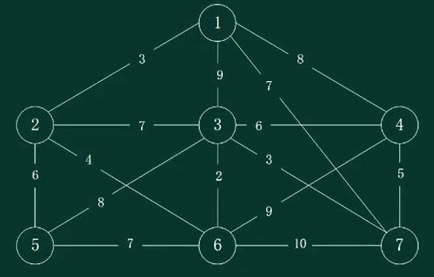
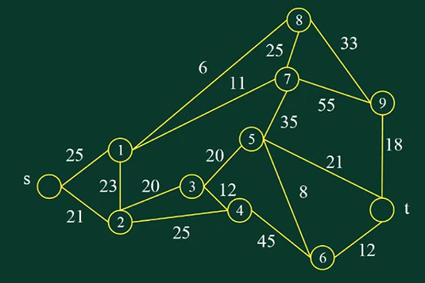
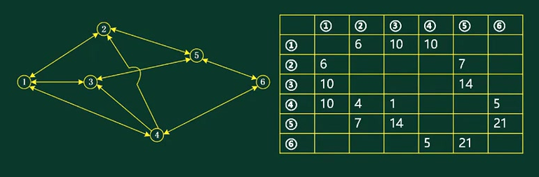
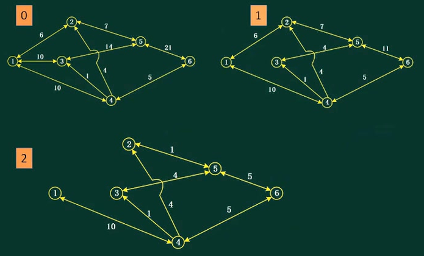
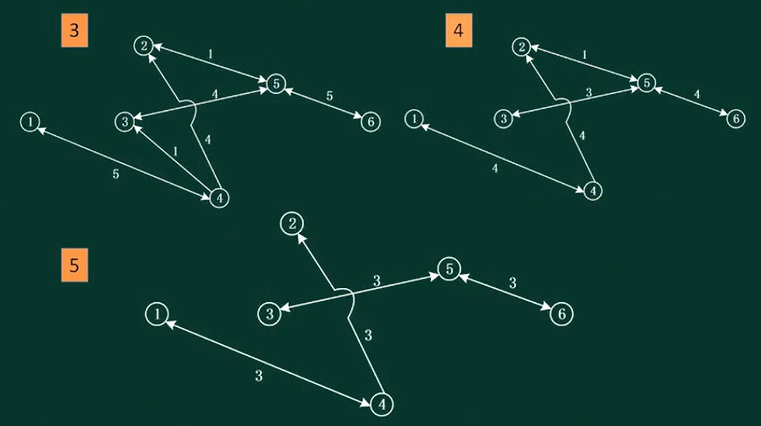
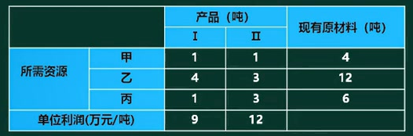
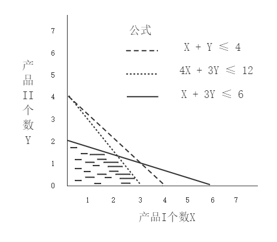
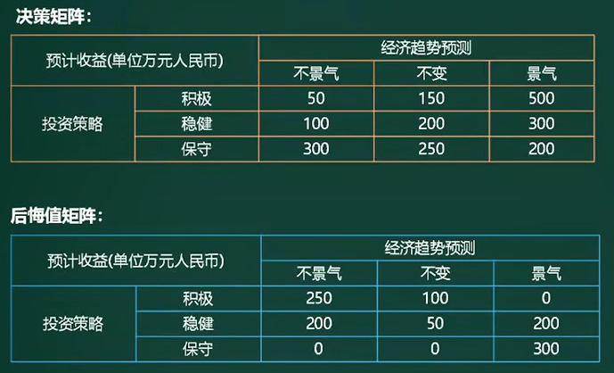
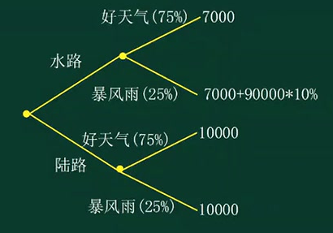
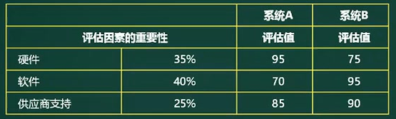

#  图论应用

## 最小生成树

最小连通图，权值之和的最小值。**就是用最小的代价把顶点连起来**。

题目：某小区有七栋楼房①~⑦(见下图)，各楼房之间可修燃气管道路线的长度(单位:百米)己标记在连线旁。为修建连通各个楼房的燃气管道，该小区内部煤气管道的总长度至少为多少百米?

题解：

1. 普里姆算法：最近的顶点
   1. 任意选择一个顶点2，生成顶点集合X
   2. 查找离X最近的顶点为1，进行连通，X={2，1}
   3. 查找离X最近的顶点为6，进行连通，X={2，1，6}
   4. 查找离X最近的顶点为3，进行连通，X={2，1，6，3}
   5. 查找离X最近的顶点为7，进行连通，X={2，1，6，3，7}
   6. 查找离X最近的顶点为4，进行连通，X={2，1，6，3，7，4}
   7. 查找离X最近的顶点为5，进行连通，X={2，1，6，3，7，4，5}，得到最小连通图。
2. 克鲁斯卡尔算法：最短的边
   1. 图中最短的边是2，连通3和6，X={3，6}
   2. 图中最短的边是3，连通1和2、3和7，X={1，2，3，6，7}
   3. 图中最短的边是4，连通6和2，X={1，2，3，6，7}
   4. 图中最短的边是5，连通4和7，X={1，2，3，4，6，7}
   5. 图中最短的边是6，连通2和5，X={1，2，3，4，5，6，7}
   6. 图中最短的边是7，连通5和6，形成环，舍弃。

## 最短路径

最短路径：从起点到终点，求出代价最小的路径。

题目：存有一批货物要从城市s发送到城市t，线条上的数字代表通过这条路的费用(单位为万元)。那么，运送这批货物，至少需要花费多少元?

题解：迪杰斯特拉，宽度优先遍历，使用贪心。

1. s到1的最小成本是25，s到2的最小成本21
2. s到8的最小成本是25+6=31，s到7的最小成本25+11=36，s到3的最小成本是21+20=41，s到4的最小成本21+25=46
3. s到5的最小成本41+20=61，
4. s到6的最小成本是61+8=69，s到9的最小成本是31+33=64
5. s到t的最小成本

题目2：下表记录了六个结点A、B、C、 D、E、F之间的路径方向和距离。从A到F的最短距离是（**38**）

| 从/到 | B    | C    | D    | E    | F    |
| ----- | ---- | ---- | ---- | ---- | ---- |
| A     | 11   | 16   | 24   | 36   | 54   |
| B     |      | 13   | 16   | 21   | 29   |
| C     |      |      | 14   | 17   | 22   |
| D     |      |      |      | 14   | 17   |
| E     |      |      |      |      | 15   |

题解：先找从一个范围的最短距离，再递归

1. A到B的最短距离是11，B到F的距离是29，A到F是40.
2. A到B的最短距离是16（A->B->C是24），C到F的距离是22，A到F是38.

## 网络和最大流量

相邻节点的流量有限制，瓶颈会影响起点到终点之间的最大流量

题目：下图标出了某地区的运输网，各节点之间的运输能力如下表所示。那么，从节点①到节点⑥的最大运输能力(流量)可以达到多少万吨/小时?

题解：计算最大流量（路径中有瓶颈），==贪心：求最大值，则先选择从1到6的最大的流量的路径==

- 0（1-3-5-6）：**最大是10**，1-3剩余0（抽走），3-5剩余4，5-6剩余21-10=11

- 1（1-2-5-6）：**最大值是6**，1-2剩余0（抽走），2-5剩余1，5-6剩余11-6=5

- 2（1-4-6）：**最大值是5**，1-4剩余5，4-6剩余0（抽走）.

  

- 3（1-4-3-5-6）：**最大值是1**，1-4剩余4，4-3剩余0（抽走），3-5剩余3，5-6剩余4

- 4（1-4-2-5-6）：**最大值是1**，1-4剩余3，4-2剩余3，2-5剩余0（抽走），5-6剩余3

- 5：没有1到6的路径，所以最大流量是10+6+5+1+1=23.

  

# 运筹方法

## 线性规划

题目：某企业需要采用甲、乙、丙三种原材料生产I、II 两种产品。生产两种产品所需原材料数量、单位产品可获得利润以及企业现有原材料数如下表所示，则公司可以获得的最大利润是(**34**)万元。取得最大利润时，原材料(**甲**) 尚有剩余。

题解：使用线性代数求解，假设产品I生产X个，产品II生产Y个，则：

- (1)，X + Y ≤ 4；(2)，4X + 3Y ≤ 12；(3)，X + 3Y ≤ 6；
- 由不等式**1和2**可得，X=0，Y=4，**带入不等式3**： X + 3Y = 12 不满足，不在结果域中
- 由不等式**1和3**可得，X=3，Y=1，**带入不等式2**： 4X + 3Y = 15 不满足，不在结果域中
- 由不等式**2和3**可得，X=2，Y=4/3，**带入不等式1**： X + Y = 10/3 满足
- 9X + 12Y = 34。（**产品单位是吨，可以是小数**）

**图解法**：X和Y的取值，一定再阴影区域上。且最优解一定在阴影区域的顶点上，（0，2）（3，0）（2，4/3)

==找到线性约束的所有交点，每一个计算后比较结果。==

## 动态规划

题目：某公司打算向它的三个营业区增设6个销售店，每个营业区至少增设1个。各营业区年增加的利润与增设的销售店个数有关，具体关系如表所示。可以调整各营业区增设的销售店的个数，使公司总利润增加额最大达()万元。

| 增设销售店个数 | 营业区A | 营业区B | 营业区C |
| -------------- | ------- | ------- | ------- |
| 1              | 100     | 120     | 150     |
| 2              | 160     | 150     | 165     |
| 3              | 190     | 170     | 175     |
| 4              | 200     | 180     | 190     |

题解：**暴力递归，从A开始，穷举展开ABC选择的所有情况**，最大值是490.

| A    | B    | C    | 利润值 |
| ---- | ---- | ---- | ------ |
| 1    | 1    | 4    | 410    |
| 1    | 2    | 3    | 425    |
| 1    | 3    | 2    | 435    |
| 1    | 4    | 1    | 430    |
| 2    | 1    | 3    | 455    |
| 2    | 2    | 2    | 475    |
| 2    | 3    | 1    | 480    |
| 3    | 1    | 2    | 475    |
| 3    | 2    | 1    | 490    |
| 4    | 1    | 1    | 470    |

## 转移矩阵

()假设市场上某种商品有两种品牌A和B，当前的市场占有率各为50%。根据历史经验估计，这种商品当月与下月市场占有率的变化可用转移矩阵P来描述:

$\displaystyle p=\left[\matrix{p(A\rightarrow A)\quad p(A\rightarrow B)\\ p(B\rightarrow A)\quad p(B\rightarrow B)}\right]=\left[\matrix{0.8\quad 0.2 \\0.4\quad 0.6}\right]$

其中，p (A→B)是A的市场占有份额中转移给B的概率，依次类推。这样，2个月后的这种商品的市场占有率变化为(**A的份额增加了14%，**)。

题解：使用矩阵乘法

1. 使用当前A和B的占有率的矩阵为[0.5，0.5]
2. 第一个月市场占有率为 $p=[0.5\quad 0.5]*\left[\matrix{0.8\quad 0.2 \\0.4\quad 0.6}\right]=[0.6\quad 0.4]$，
3. A=0.5*0.8+0.5\*0.4=60%，B=0.5\*0.2+0.5\*0.6（或1-60%）=40%
4. 第一个月市场占有率为 $p=[0.6\quad 0.4]*\left[\matrix{0.8\quad 0.2 \\0.4\quad 0.6}\right]=[0.64\quad 0.36]$，
5. A=0.6*0.8+0.4\*0.4=64%，B=0.6\*0.2+0.4\*0.6（或1-64%）=36%

逻辑解释：

- A下个月的占有率分两部分：p (A→A)保留的份额，p (B→A)从B转移的份额，A=0.5*0.8+0.5\*0.4=0.6
- B下个月的占有率分两部分：p (B→B)保留的份额，p (A→B)从A转移的份额，A=0.5*0.6+0.5\*0.2=0.4

## 排队论

题目：某博览会每天8:00开始让观众通过各入口处检票进场，8:00前已经有很多观众在排队等候。假设8:00后还有不少观众均匀地陆续到达，而每个入口处对每个人的检票速度都相同。根据以往经验，若开设8个入口，则需要60分钟才能让排队观众全部入场；若开设10个入口，则需要40分钟才能消除排队现象。为以尽量少的入口数确保20分钟后消除排队现象，博览会应在8:00和8:20开设的入口数分别为( ) 。

题解：假设原有R人，8点后观众到达速度是X人/min，每个入口的检票速度Y人/min

1. 由已知可得：R + 60X = 60 * Y * 8，R + 40X = 40 * Y * 10，联合计算：X = 4Y，R=240Y
2. 20分钟消除排队现象，则 R+20*X = 20\*Y\*Z，带入得Z=16，需要16个入口。
3. 当8点20时，已消除排队现象，所以只要保证观众到达的速度和检票的速度一致就可以，观众到达速度是单个入口检票速度的4倍，所以需要4个入口

# 决策

按决策问题的可控程度分为：

1. **确定型决策**，人们对未来的认识比较充分，了解未来市场可能呈现某种状况，能够比较准确地估计未来的市场需求情况，从而可以比较有把握地计算各方案在未来的经济发展，并据此做出选择；
2. **风险型决策**，也称“随机决策”。在这种决策中，决策的结果有多种，决策者不知道会发生哪一种结果，但每种结果发生的概率已知；
3. **不确定型决策**，在无法估计系统行动方案所处状态概率的情况下进行的决策。人们对未来的认识程度最低，人们只知道未来可能呈现出几种情况，但不知道各种情况出现的概率，在比较不同方案的经济效果时，只能**根据主观选择一些原则**来进行.

## 不确定型决策

| 决策准则     | 说明                                                         |
| ------------ | ------------------------------------------------------------ |
| 乐观主义准则 | maxmax准则，其决策的原则是“大中取大”，总抱有乐观和冒险的态度，决不放弃任何获得最好结果的机会。在决策表中各个方案对各个状态的结果中选出最大者，记在表的最右列，再从该列中选出最大者 |
| 悲观注意准则 | maxmin准则，其决策的原则是“小中取大”。抱有悲观和保守的态度，在各种最坏的可能结果中选择最好的。决策时从决策表中各方案对各个状态的结果选出最小者，记在表的最右列，再从该列中选出最大者 |
| 折中主义准则 | Harwicz准则，既不乐观冒险，也不悲观保守，而是从中折中平衡，用一个系数a (称为折中系数)来表示，并规定0≤a≤l，cv;=a *max{a}+(1-a )*min{a;}，然后比较cvi，从中选择最大者 |
| 等可能准则   | Laplace准则，当决策者无法事先确定每个自然状态出现的概率时，可以将每个状态出现的概率定为1/n，然后按照EMV决策 |
| 后悔值准则   | Savage准则，每个自然状态的最大收益值(损失矩阵取为最小值)作为该状态的理想目标，并将该状态的其它值与最大值的差作为未达到理想目标的后悔值。决策的原则是最大后悔值达到最小(minmax，大中取小，最小最大后悔值) |

1. 乐观准则下：每一种投资策略的最大值分别为500，300，300，再取最大值，就是A积极。
2. 悲观准则下：每一种投资策略的最小值分别为50，100，200，再取最大值，就是C保守
3. 后悔值准则下：每一种投资策略的最大值分别为250，200，300，再取最小值，就是B稳健

## 风险型决策

根据风险的概率概率，求加权平均数。

**决策树**

题目：某电子商务公司要从A地向B地的用户发送-批价值为90000元的货物。从A地到B地有水、陆两条路线。走陆路时比较安全，其运输成本为10000元；走水路时一般情况下的运输成本只要7000元，不过一旦遇到暴风雨天气，则会造成相当于这批货物总价值的10%的损失。根据历年情况，这期间出现暴风雨天气的概率为1/4，那么该电子商务公司该如何选择呢?

1. 陆路：在好天气、暴风雨的情况下，运输成本都是10000；加权平均数还是10000；
2. 水路：好天气时，运输成本是7000；暴风雨时，运输成本是7000  + 90000*10%=16000，加权平均数为7000\*0.75 + 16000\*0.25 = 9250
3. 所以选择水路。

**决策表**

题目：评估和选择最佳系统设计方案时，甲认为可以采用点值评估方法，即根据每一个价值因素的重要性，综合打分来选择最佳的方案。乙根据甲的提议，对如表所示的系统A和B进行评估，那么乙认为(**最佳方案是B**)。

题解：系统A： 95*0.35 + 70\*0.4 + 85\*0.25 = 82.5；系统B： 75\*0.35 + 95\*0.4 + 90\*0.25 = 86.75；

> 论文中：可以对系统的解决方案进行评估。可以使用决策表。

# 数学建模

定义：数学建模是一种数学的思考方法，是运用数学的语言和方法，通过**抽象和简化**，建立能
近似刻画并解决实际问题的模型的一种强有力的**数学手段**。

**数学建模过程：**

- ➢模型准备：了解问题的实际背景，明确其实际意义，掌握对象的各种信息。用数学语言来描述问题。
- ➢模型假设：根据实际对象的特征和建模的目的，对问题进行必要的简化，并用精确的语言提出一些恰当的假设。
- ➢模型建立：在假设的基础上，利用适当的数学工具来刻划各变量之间的数学关系，建立相应的数学结构。只要能够把问题描述清楚，尽量使用简单的数学工具。
- ➢模型求解：利用获取的数据资料，对模型的所有参数做出计算(估计)。
- ➢模型分析：对所得的结果进行数学上的分析（误差分析，敏感度分析）。
- ➢模型检验：将模型分析结果与实际情形进行比较，以此来验证模型的准确性、合理性和适用性。如果模型与实际较吻合，则要对计算结果给出其实际含义，并进行解释。如果模型与实际吻合较差，则应该修改假设，再次重复建模过程。
- ➢模型应用：应用方式因问题的性质和建模的目的而异。

**数学建模方法：**

1. 直接分析法：认识原理，直接构造模型
2. 类比法：根据类似问题模型构建新模型
3. 数据分析法：大量数据统计分析后建模
4. 构象法：对将来可能发生的情况给出设想从而建模。