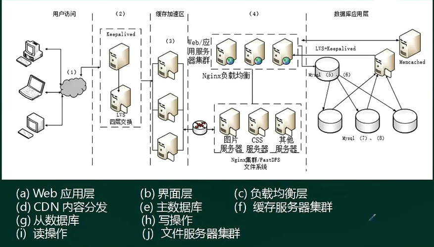
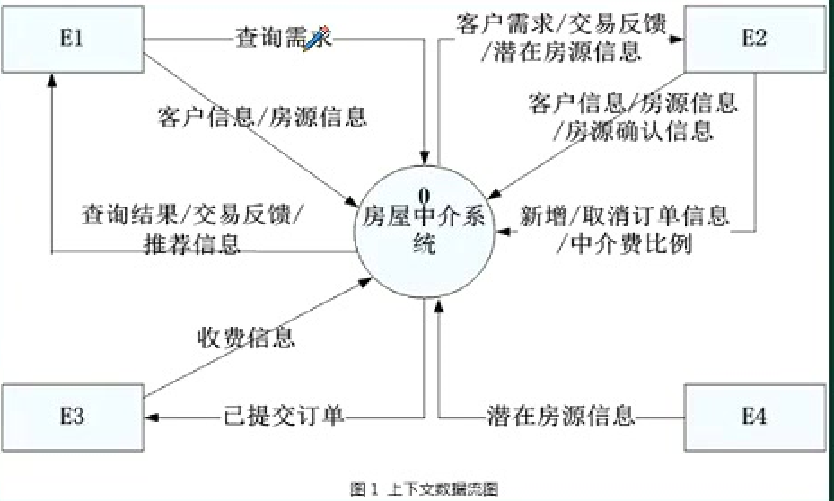
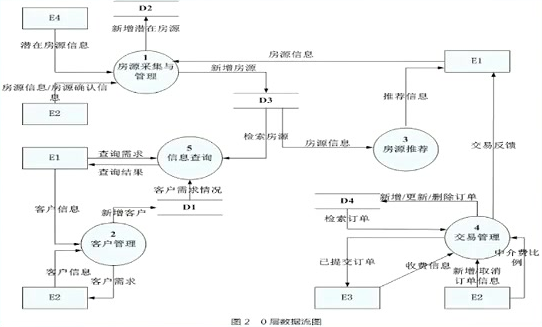
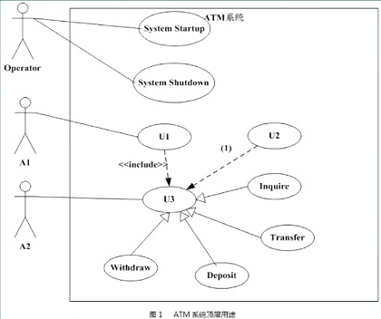
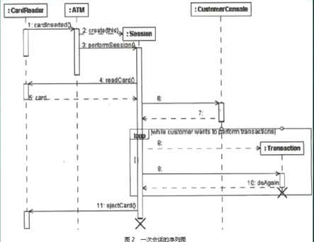
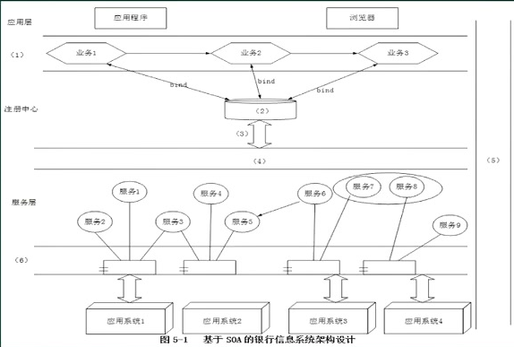
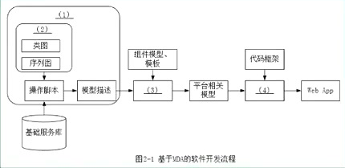
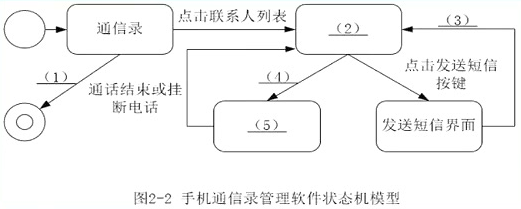
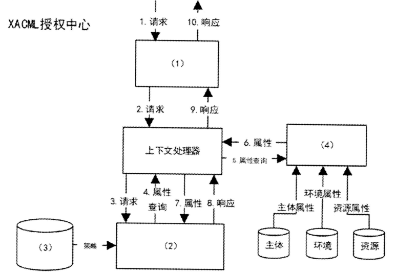

**案例 = 心态 + 技巧 + 理论**

# 考点分析

1. 系统规划：可行性研究和计算
2. 软件架构设计：架构风格，架构设计（质量属性）、架构评估（风险点、敏感点）；ABSD；
3. 设计模式：分类，概念，基本应用场景。
4. 系统设计：
5. UML：需求工程，DFD，ERD。顺序、状态，活动、协作。
6. Web架构：数据库主从、noSQL，缓存机制。
7. 系统建模：思想4+1视图。与面向对象设计关联，逻辑视图（分析），物理视图（设计）
8. 分布式系统设计
9. 嵌入式系统设计
10. 系统的可靠性分析与设计
11. 系统的安全性和保密性设计：对称非对称，等保体系。

**历年考试知识点13-19：**

1. 软件架构设计：软件质量属性对应的需求，管道-过滤器风格，数据仓储风格，填充架构图
2. 软件架构评估：软件质量属性场景、架构风险、敏感点、权衡点
3. 软件系统建模：结构化和面向对象分析，DFD，ERD，用例；用例图与类图，用例关系和类之间的关系；状态图和活动图；数据流图、CRUD矩阵
4. 数据库建模：Redis缓存技术、雪崩效应、缓存穿透
5. Web应用系统架构：分布式架构，SQL注入，响应式Web设计，架构设计图填充，主从复制机制；负载均衡、磁盘I/O瓶颈问题、查询缓存机制、Memcached分布式缓存机制。
6. Web系统设计：面向服务架构SOA，ESB的作用和特点，Web系统架构，信息系统安全保障的措施
7. Web系统应用：应用服务器、网站技术、大负荷和长时间运行下的稳定性以及可扩展性、J2EE的N层结构
8. 系统设计：非功能性需求分类，瘦客户端C/S架构，MVC概念和组成、EJB，有状态和无状态
9. 设计模式：MVC设计模式，基于XML的界面管理技术。
10. 嵌入式系统：实时系统的特点，实时特性分类，可靠性；实时任务中简单任务和复杂任务的区分，腰型通信模式架构风格；机器人操作系统ROS；
11. 嵌入式系统可靠性分析：可靠性相关概念、恢复快方法、N版本程序设计
12. 嵌入式构建设计：遗留工程、构件技术
13. 分布式数据库：MemCache与Redis，数据可靠性和一致性，Redis集群切片的几种常见方式
14. 数据库设计：ORM优缺点、增加数据访问层的原因
15. 敏捷开发：Scrum敏捷开发过程、MVC、分层架构
16. 应用系统数据架构：关系型数据库、文件系统、内存数据库、SQL设计策略
17. 信息安全：公钥体系，数据库敏感字段加密。
18. 项目管理：项目计划内容、项目绩效计算、项目延期解决方案。

# 解答方法

步骤：

1. 标出问题要点，以此作为主要线索进行分析和思考

2. 对照问题要点，仔细阅读正文。（善于从书面叙述中提取最必要的信息）

3. 通过定性分析或者定量估算，构思答案的要点

   对于可以简单定量分析的问题，已有类似经验并能进行估算、

   对于只能定性分析的问题用简练的语言抓住要点加以表达

4. 以最简练的语言写出答案

注意事项：

1. 分析题目问题的倾向性，顺势答题
2. 列条目回答问题，觉得对的都写上。
3. 多选题：少选，则按项给分；多选了错误项无分。

# 往年试题

## 试题1-架构风格和评估

阅读以下关于软件架构设计的叙述，在答题纸上回答问题1至问题3.

**[说明**]

某软件公司为某品牌手机厂商开发一套**手机应用程序集成开发环境**，,以提高开发手机应用程序的质量和效率。在项目之初,公司的系统分析师对该集成开发环境的需求进行了调研和分析，具体描述如下:

- a .需要同时支持该厂商自行定义的应用编程语言的编辑、界面可视化设计、编译、调试等模块，这些模块产生的模型或数据格式差异较大，集成环境应提供数据集成能力。集成开发环境还要支持以适配方式集成公司现有的应用模拟器工具。（功能描述）
- b .经过调研，手机应用开发人员更倾向于使用Windows系统，因此集成开发环境的界面需要与Windows平台上的主流开发工具的**界面风格保持一致**。
- c .支持相关开发数据在云端存储，需要保证在云端存储数据的**机密性和完整性**。
- d .支持用户通过配置界面依据自己的喜好修改界面风格,包括颜色、布局、代码高亮方式等,**配置完成后无需重启环境**。
- e .支持不同模型的自动转换。在初始需求中定义的机器性能条件下，对于一个包含50个对象的设计模型，将其转换为相应代码框架时所**消耗时间不超过5秒**。
- f .能够连续**运行的时间不小于240小时**，意外退出后能够在**10秒之内自动重启**。
- g .集成开发环境具有**模块化结构**，支持以模块为单位进行**调试、测试与发布**。
- h .支持应用开发过程中的代码调试功能：开发人员可以设置断点，启动调试，编辑器可以自动卷屏并命中断点。能通过变量监视器查看当前变量取值。（功能描述）

架构师王工在仔细分析后，认为应该采用数据仓储( Data Repository )的架构风格。公司经过评了王工的方案。

[问题1] ( 10分)
识别软件架构质量属性是进行架构设计的重要步骤。请分析题干中的需求描述，填写质量属性识别表中(1) ~ (5)处的空白。

| 质量属性名称 | 需求描述符号 |
| :----------: | :----------: |
|    可用性    |      f       |
|     性能     |      e       |
|   可修改性   |      d       |
|   可测试性   |      g       |
|    安全性    |      c       |
|    易用性    |      b       |

- **质量属性的核心属性：性能、可用性、安全性、可修改性**。
- **可修改性：改变系统的容易度。**

[问题2] (7分 )
请在阅读题干需求描述的基础上,从交互方式数据结构、控制结构和扩展方法4个方面对两种架构风格进行比较。填写两种架构比较表中(1) ~ (4)处的空白。

| 比较因素 | 管道-过滤器风格          | 数据仓储风格                                               |
| -------- | ------------------------ | ---------------------------------------------------------- |
| 交互方式 | 顺序结构或有限的循环结构 | 星型结构，或以数据为中心，其它构件围绕数据，进行交互的结构 |
| 数据结构 | 数据流                   | 文件或模型                                                 |
| 控制结构 | 数据（流）驱动           | 业务功能驱动                                               |
| 扩展方法 | 接口适配                 | 依赖于中心数据结构的适配 或 数据结构适配                   |

- 交互方式：此处说明的是 构件和构件之间的结构。**顺势而为，依赖之前的答案**
- 扩展方法：此处说明的是 构件之间如何联系和匹配 

[问题3] (8分 )
在确定采用数据仓库架构风格后,王工给出了集成开发环境的架构图，请填写图1- 1中(1) ~ (4)处的空白,完成该集成开发环境的架构图。

- 具体描述中的功能描述的内容：自行定义的应用编程语言的编辑、界面可视化设计、编译、调试等模块，以**适配方式**集成公司现有的**应用模拟器工具**
- 中心是**语法树**，周边可修改更新的构件是：编译器、调试器、可视化设计工具、**语言编辑器、适配器，模拟工具**

## 试题2-架构设计

阅读以下关于企业应用系统集成架构设计的说明,在答题纸上回答问题1和问题2。

[**说明**]

​	某航空公司希望对构建于上世纪七、八十年代的主要业务系统进行改造与集成,提高企业的竞争力。由于集成过程非常复杂，公司决定首先以Ramp Coordination系统为例进行集成过程的探索与验证。

​	在航空业中, Ramp Coordination是指飞机从降落到起飞过程中所需要进行的各种业务活动的协调过程。通常每个航班都有位员工负责Ramp Coordination，称之为Ramp Coordinator，由Ramp Coordinator协调的业务活动包括检查机位环境卸货和装货等。

业务流程：

- a：开始-》接收航班信息-》检查机位环境-》检查卸货-》检查装货-》检查关门-》结束
- b：开始-》接收航班信息-》检查机位环境-》检查卸货-》结束
- c：开始-》接收航班信息-》检查装货-》检查关门-》结束

​	由于航班类型、机型的不同, Ramp Coordination的流程有很大差异。(a)所示的流程主要针对短期中转航班，这类航班在机场稍作停留后就起飞；(b)所示的流程主要针对到达航班，通常在机场过夜后第二天起飞；(c)所示的流程主要针对离港航班，这类航班是每天的第一班飞机。这三种类型的航班根据长途/短途、国内/国外等因素还可以进步细分 , 每种细分航班类型的Ramp Coordination的流程也略有不同。

​	为了完成上述业务, **Ramp Coordination信息系统需要从乘务人员管理系统中提取航班乘务员的信息、从订票系统中提取乘客信息从机务人员管理系统中提取机务人员信息、接收来自航班调度系统的航班到达事件**。其中乘务人员管理系统和航班调度系统运行在大型主机系统中，机务人员管理系统运行在Unix操作系统之上；订票系统基于Java语言,具有Web界面，运行在Linux操作系统之上。

​	目前Ramp Coordination信息系统主要由人工完成所有协调工作，效率低且容易出错。

​	公司领导要求集成后的Ramp Coordination信息系统能够针对不同需求迅速开展业务流程,灵活、高效地完成协调任务。

​	针对上述要求,公司部]的架构师经过分析与讨论，最终采用面向服务的架构，以服务为中心进行Ramp Coordination信息系统的集成工作。

[问题1] ( 10分)
服务建模是对Ramp Coordination信息系统进行集成的首要工作，公司的架构师首先对Ramp Coordination信息系统进行服务建模，识别出系统中的两个主要业务服务组件:
( 1 ) Ramp Control ：负责Ramp Coordination信息系统中相关名种业务活动的组件; 
( 2 ) Flight Management ：负责航班相关信息的管理,包括航班日程，乘客信息等。针对上述服务模型,
结合题干描述，请为每个业务服务组件提供的服务进行分析与整理，完成表中的空白部分。

| 业务服务组件      | 提供服务名称 |
| ----------------- | ------------ |
| Ramp Control      |              |
| Flight Management |              |

- 阅读理解，文中描述的内容放入合适的位置。

[问题2] (15分)
对Ramp Coordination信息系统的集成涉及到对乘务人员管理系统、航班调度系统机务人员管理系统和订票系统的组织与协调；公司架构师决定采用企业服务总线(Enterprise Service Bus , ESB)技术进行系统集成，请用200字以内的文字对ESB的定义进行描述，给出ESB的五个主要功能，并针对题干描述,将恰当的内容填入图1-2中的(1) ESB，(2)~ (6)。

- 阅读理解，加粗的一段。
- 

## 试题3-应用服务器

阅读以下关于应用服务器的叙述，, 在答题纸上回答问题1至问题3.
[**说明**]
	某电子产品制造公司,几年前开发建设了企业网站系统,实现了企业宣传、产品介绍、客服以及售后服务等基本功能。该网站技术上采用了**Web服务器**、**动态脚本语言PHP**。随着市场销售渠道变化以及企业业务的急剧拓展，该公司急需建立完善的电子商务平台。
	公司张工建议对原有网站系统进行扩展，增加新的功能(包括订单系统、支付系统、库存管理等) ,这样有利于降低成本、快速上线；而王工则认为原有网站系统在**技术上存在先天不足**，不能满足企业业务的快速发展，尤其是企业业务将服务全球,需要提供24小时不间断服务,系统在大负荷和长时间运行下的稳定性至关重要。建议采用应用服务器的Web开发方法，例如2EE，为该企业重新开发新的电子商务平台。

[问题1] ( 7分)
王工认为原有网站在技术上存在先天不足,不能满足企业业务的快速发展,根据你的理解，请用300字以内的文字说明原系统存在哪几个方面的不足。

题解：

1、PHP只能实现简单的分布式两层或三层的架构，而JAVA在这方面就比较强大,可以实现多层的网络架构。数据库层(持久化层)、应用(业务)逻辑层、表示逻辑层彼此分开，而且现在不同的层都已经有一些成熟的开发框架的支持。

2、PHP是面向过程的语言，Java是面向对象的，面向过程语言开发的程序只要业务流程发生变化，修改工作量很大，所以可修改性差,同时可复用性也差。

3、 PHP语言在可靠性方面比J2EE平台差，J2EE平台有大量增强可靠性的成熟解决方案，而PHP只是一 种简单的脚本语言,在可靠性方面缺乏成熟解决方案。

4、 PHP对于不同的数据库采用不同的数据库访问接口,而Java通过JDBC来访问数据库,通过不同的数据库厂商提供的数据库驱动方便地访问数据库，访问数据库的接口比较统一。所以原架构在数据库连接方面修改起来工作量也是很大的。

5、PHP适合于小型项目，所以本项目中以前采用PHP是合适的，但目前大量功能需要增加, PHP在稳定性方面也达不到要求。

5、PHP比Java的可维护性差。

7、PHP比Java的扩 展性差。

8、PHPE比Java的安全性差。

[问题2] (8分)
请简要说明应用服务器的概念，并重点说明应用服务器如何来保障系统在大负荷和长时间运行下的稳定性以及可扩展性。

题解：应用服务器是指通过各种协议把商业逻辑曝露给客户端的程序。

- 1、若系统负荷很大,可以布署多台应用服务，多台应用服务器分担任务,以达到**性能要求**。
- 2、应用服务器可以通过灵活的增加服务器完成扩展,所以**可扩展性很好**。
- 3、应用服务器可长时间稳定运行。因为当一台应用服务 器出现故障时,可以将当前运行的事务转移至正常应用服务器上完成执行，不影响业务正常执行,从而**保障高可靠性与稳定性**。

[问题3] (10分 )
J2EE平台采用了多层分布式应用程序模型,实现不同逻辑功能的应用程序被封装到不同的构件中，处于不同层次的构件可被分别部看到不同的机器中。请填写图4 1中(1) ~ (5)处的空白，完成J2EE的N层体系结构。

题解：

1. 客户端（浏览器）（HTML，**Applet**）
2. Web（Web服务器）：JSP，Servlet 
3. EJB容器：Simple Bean，Session Bean，Entity Bean（**优先填写重要的，其它的有空再填，如消息bean**）
4. DB

**Web服务器和应用服务器**

1. Web服务器：HTML页面就是WEB的数据元素,处理这些数据元素的应用软件就叫WEB服务器。

   WEB服务器与客户端打交道，它要处理的主要信息有：session、request、response、HTML等

   Web服务器可以解析(handles)HTTP协议。当Web服务器接收到一个HTTP请求(request)，会返回一个HTTP响应(response)，例如送回一个HTML页面。

   如**Apache、IIS、Nginx（也是反向代理服务器）**

2. Web应用服务器：通过各种协议（包括HTTP），把商业逻辑暴露给(expose)客户端的应用程序。

   应用程序服务器是通过组件(component)的应用程序接口(API)把商业逻辑暴露(expose)(给客户端应用程序)的，例如基于J2EE(Java 2 Platform, Enterprise Edition)应用程序服务器的EJB(Enterprise JavaBean)组件模型

   如**Tomcat、Weblogic、Jboss。**

3. 总结：应用服务器处理业务逻辑，web服务器则主要是让客户可以通过浏览器进行访问，处理HTML文件，web服务器通常比应用服务器简单。

## 试题4-Web

问题:阅读以下关于Web系统架构设计的叙述，在答题纸上回答问题1至问题3.

[**说明**】

​	某电子商务企业因发展良好,客户量逐步增大，企业业务不断扩充，导致其原有的B2C商品交易平台己不能满足现有业务需求。因此，该企业委托某软件公司重新开发一套商品交易平台。

​	该企业要求新平台应可适应客户从手机、平板设备、电脑等不同终端设备访问系统,同时满足电商定期开展"秒杀"、"限时促销"等活动的系统高并发访问量的需求。面对系统需求，软件公司召开项目组讨论会议,制定系统设计方案。讨论会议上，王工提出可以应用响应式Web设计满足客户从不同设备正确访问系统的需求。同时，采用增加镜像站点、CDN内容分发等方式解决高并发访问量带来的问题。

​	李工在王工的提议上补充，仅仅依靠上述外网加速技术不能完全解决高用户并发访问问题，如果访问量持续增加,系统仍存在崩溃可能。李工提出应同时结合负载均衡、缓存服务器、Web应用服务器、分布式文件系统、分布式数据库等方法设计系统架构。经过项目组讨论，最终决定综合王王和李工的思路，完成新系统的架构设计。

[问题1] (5分)
请用200字以内的文字描述什么是"响应式Web设计" ,并列举2个响应式Web设计的实现方式。

题解：响应式web设计是指我们设计与开发的页面可以根据用户的行为和不同的设备环境做出相应的响应来调整页面的布局，以提供用户可感知的、流畅的阅读和操作体验。

实现方式：(1)流式布局；(2)弹性布局(如弹性图片)；(3)媒体查询；使用相对值而不是绝对值

[问题2] (16 分)
综合王工和李工的提议，项目组完成了新商品交易平台的系统架构设计方案。新系统架构图如图5-1所示。请从选项(a) - (j)中为架构图中(1) - (8)处空白选择相应的内容,补充支持高并发的Web应用系统架构设计图。

题解：==支持高并发的架构：用户访问（CDN内容分发）=》负载均衡层（四层交换，keeplived）=》缓存加速区（缓存服务器集群）=》Web应用层（Web应用服务器集群，Nginx集群/FastDFS文件系统、Nginx负载均衡）=》数据库应用层==

**keepalived**是集群管理中保证集群高可用的一个服务软件，其功能类似于heartbeat,用来防止单点故障。 

[问题3] (4 分)
根据李工的提议,新的B2C商品交易平台引入了主从复制机制。请针对B2C商品交易平台的特点,简要叙述引入该机制的好处。

题解：==从性能，可用性、安全性、可修改性等方面去分析优点==

1、提升性能：交易平台要求高并发，主从复制方式一主多从，不同的用户请求可以从不同的从数据库读取数据，提高并发度。

2、可扩展性更优：如果采用单台数据库服务器,则访问量持续增加时,数据库瓶颈暴露,且无法迅速解决问题。而主从结构可以快速增加从服务器数量,以满足需求。

3、提升可用性：一主多从，一台从服务器出现故障不影响整个系统正常工作。

4、相当于负载均衡：一主多从分担任务，相当于负载均衡

5、提升数据安全性：系统中的数据冗余存放多份，不会因为某台机器硬件故障而导致数据丢失。

## 试题5-SA

阅读下列说明和图,回答问题1至问题4 ,将解答填入答题纸的对应栏内。

某房产中介连锁企业欲开发一个基于Web的房 屋中介信息系统，以有效管理房源和客户,提高成交率。该系统，
的主要功能是:

1. 房源采集与管理。系统自动采集**外部网站的潜在房源信息**，保存为潜在房源。由经纪人联系确认的潜在房源变为房源,并添加出售/出租房源的客户。由经纪人或客户登记的出售/出租房源,系统将其保存为房源。房源信息包括基本情况配套设施交易类型、委托方式业主等。经纪人可以对房源进行更新等管理操作。
2. 客户管理。**求租/求购客户**进行注册、更新，推送客户需求给经纪人,或由经纪人对求租/求购客户进行登记、更新。客户信息包括身份证号、姓名、手机号、需求情况、委托方式等。
3. 房源推荐。根据客户的需求情况(求购/求租需求情况以及出售/出租房源信息)，向已登录的客户**推荐房源**。
4. 交易管理。**经纪人**对租售客户双方进行交易信息管理，包括**订单提交和取消，设置收取中介费比例**。**财务人员收取中介费**之后，表示该订单已完成系统更新订单状态和 房源状态,向客户和经纪人发送交易反馈。
5. 信息查询。客户根据自身查询需求查询房屋供需信息

现采用结构化方法对房屋中介信息系统进行分析与设计,获得如图1所示的上下文数据流图和图2所示的0层数据流图。

[问题1] (8分)
( 1 )使用说明中的词语,给出图1中的实体E1-E4的名称;
( 2 )使用说明中的词语,给出图2中的数据存储D1-D4的名称。

题解：

[问题2\](5分)
根据说明和图中术语，补充图2中缺失的数据流及其起点和终点。

题解：

**数据流图的平衡规则**：可以找出 在 细化上层数据流图时 , 忽略的数据流 ;

1. 父图 ( 上层数据流图 ) 与 子图 ( 下层数据流图 ) 之间的平衡：

   根据 顶层数据流 可以 确定缺失的 底层数据流 ; 根据底层数据流 , 可以补充缺失的顶层数据流 

   **平衡匹配方法** ：两层数据流图中的 数据流个数和方向一致

2. 子图 内部的平衡：对于数据流图的任意一个加工 , 既有输入 , 又有输出 ;

   **加工**：描述 “输入数据流” 到 “输出数据流” 之间的变换 , 即 对数据进行了什么样的处理 , 使得 “输入数据流” 变为 “输出数据流” ;

   **黑洞 :** 某个加工 , 只有输入 , 没有输出 , 称为黑洞 ;

   **奇迹 :** 某个加工 , 只有输出 , 没有输入 , 称为奇迹 ;

[问题3\](12分)
需求分析的方法主要有结构化的分析方法、面向对象分析方法，而结构化分析方法需要建立三个模型，包括功能模型、行为模型和数据模型。而功能模型般用数据流图来表示。 请简单介绍需求分析的主要任务，以及需求分析包括哪几个方面的工作?

题解：主要任务：针对待开发软件提供完整、清晰、具体的要求，确定软件必须实现哪些任务。具体分为功能性需求、非功能性需求与设计约束三个方面。

需求分析阶段的工作,可以分为四个方面：问题识别、分析与综合、制订规格说明、评审。

1. **问题识别：**确定对所开发系统的综合要求，并提出这些需求的实现条件，以及需求应该达到的标准。这些需求包括：功能需求(做什么)、性能需求(要达到什么指标)、环境需求(如机型、操作系统等)、可靠性需求(不发生故障的概率）、安全保密需求、用户界面需求、资源使用需求(软件运行是所需的内存、CPU等)、软件成本消耗与开发进度需求、预先估计以后系统可能达到的目标。**定义数据字典**。
2. **分析与综合：** 逐步细化所有的软件功能（**数据流图**），找出系统各元素间的联系（**ER图**），以及各元素的状态和事件（**状态图**），接口特性和设计上的限制，分析他们是否满足需求，剔除不合理部分，增加需要部分。最后综合成系统的解决方案，给出要开发的系统的详细逻辑模型(做什么的模型)，。
3. **制订规格说明书：** 即编制文档，描述需求的文档称为**软件需求规格说明书（指定优先级）**。请注意，需求分析阶段的成果是需求规格说明书，向下一阶段提交。
4. **评审：** **对功能的正确性，完整性和清晰性**，以及其它需求给予评价。评审通过才可进行下一阶段的工作,否则重新进行需求分析。

## 试题6-Redis

阅读以下关于分布式数据库缓存设计的叙述，在答题纸上回答问题1至问题3.

[**说明**]

​	某企业是为城市高端用户提供高品质蔬菜生鲜服务的初创企业，创业初期为快速开展业务,该企业采用轻量型的开发架构(脚本语言+关系型数据库)研制了一套业务系统。业务开展后受到用户普遍欢迎，用户数和业务数量迅速增长，原有的数据库服务器不能满足高度并发的业务要求。为此,该企业成立了专门的研发团队来解决该问题。

​	张工建议重新开发整个系统，采用新的服务器和数据架构,解决当前问题的同时为日后的扩展提供支持。但是，李工认为张工的方案开发周期过长，投入过大,当前应该在改动尽量小的前提下解决该问题。
​	李工认为访问量很大的只是部分数据，建议采用缓存工具MemCache来减轻数据库服务器的压力，这样开发量小，开发周期短，比较适合初创公司，同时将来也可以通过集群进行扩展。
​	然而,刘工又认为李工的方案中存在数据可靠性和一致性问题 ，在宕机时容易丢失交易数据，建议采用Redis来解决问题。（数据同步）在经过充分讨论，该公司最终决定采用刘工的方案。

[问题1] ( 9分)
在李工和刘工的方案中，均采用分布式数据库缓存技术来解决问题。请说明分布式数掘库缓存的基本概念。表4-1中对MemCache和Redis两种工具的优缺点进行了比较，请补充完善表中的空(1) ~(6)。

题解：**分布式数据库缓存**指的是在高并发环境下，为了减轻数据库压力和提高系统响应时间，在数据库系统和应用系统之间增加的独立缓存系统。

|            | MemCache                  | Redis                               |
| ---------- | ------------------------- | ----------------------------------- |
| 数据类型   | key-value结构             | key/value，list，set，hash , sorted |
| 持久性     | 不支持                    | 支持                                |
| 分布式存储 | 客户端哈希分片/一致性哈希 | 主从、哨兵、集群                    |
| 多栈程支持 | 支持                      | 不支持                              |
| 内存管理   | 有，私有内存池            | 无                                  |
| 事务支持.  | 不支持                    | 有限支持                            |

[问题2] ( 8分)
刘工认为李工的方案存在数据可靠性和一致性的问题，请说明原因。（**从第一问的答案找思路**）
为避免数据可靠性和一致性的问题,刘工的方案采用Redis作为数据库缓存,请说明基本的Redis与原有关系数据库的数据同步方案。

题解：可靠性（需要用到的时候不存在，持久性，灾备恢复有优势），一致性（分布式，事务）

1. Memcache没有持久化功能,所以掉电数据会全部丢失，而且无法直接恢复，这存在可靠性问题。
2. Memcache不支持事务，所以操作过程中可能产生数据的不一致性。

同步方案：读取数据时,先读取Redis中的数据，如果Redis没有，则从原数据库中读取，并同步更新Redis中的数据。写回时，写入到原数据库中,并同步更新至Redis中；

[问题3\](8分)
请给出Redis分布式存储的2种常见方案和Redis集群切片的几种常见方式。

题解：主从模式（ Master/Slave ），哨兵模式（Sentinel）、集群模式（Cluster）；

Redis集群切片的常见方式：

1. 客户端分片，即在客户端就通过key的hash值对应到不同的服务器。
2. 中间件实现分片。在应用软件和Redis中间,例如: Twemproxy. Codis等,由中间件实现服务到后台Redis节点的路由分派。
3. 客户端服务端协作分片。RedisCluster模式,客户端可采用致性哈希,服务端提供错误节点的重定向服务slot上。不同的slot对应到不同服务器。

## 试题7-UML

阅读下列说明和图,回答问题1至问题3，将解答填入答题纸的对应栏内。

​	某银行计划开发一个自动存提款机模拟系统( ATM System)。系统通过读卡器( CardReader )读取ATM卡，系统与客户( Customer )的交互由客户控制台( CustomerConsole )实现；银行操作员( Operator )可控制系统的启动( System Startup )和停止( System Shutdown ) ；系统通过网络和银行系统( Bank )实现通信。

​	当读卡器判断用户已将ATM卡插入后。创建会话( Session).会话开始后，读卡器进行读卡，并要求客户输入个人验证码( PIN)。系统将卡号和个人验证码信息送到银行系统进行验证。验证通过后，客户可从菜单选择如下事务( Transaction) :
1.从ATM卡账户取款( Withdraw ) ;
2.向ATM卡账户存款( Deposit) ;
3.进行转账( Transfer) ;
4.查询( Inquire ) ATM卡账户信息。

​	一次会话可以包含多个事务，每个事务处理也会将卡号和个人验证码信息送到银行系统进行验证。若个人验证码错误，则转个人验证码错误处理( Invalid PIN Process)。每个事务完成后，客户可选择继续上述事务或退卡。选择退卡时，系统弹出ATM卡,会话结束。

​	系统采用面向对象方法开发,使用UML进行建模。系统的顶层用例图如图1所示，一次会话的序列图(不考虑验
证)如图2所示。消息名称参见消息名称列表。

| 名称                        | 说明               | 名称               | 说明              |
| --------------------------- | ------------------ | ------------------ | ----------------- |
| cardInserted                | ATM卡已插入        | performTransaction | 执行事务          |
| performSession              | 执行会话           | readCard()         | 读卡              |
| RedPIN()                    | 读取个人验证码     | PIN                | 个人验证信息      |
| Creat(atm, this, card, pin) | 为当前会话创建事务 | Create(this)       | 为当前ATM创建会话 |
| card                        | ATM卡信息          | dpAgain()          | 执行下一个事务    |
| ejectCard                   | 弹出ATM卡          |                    |                   |

[问题1] (9分)
根据[说明]中的描述，给出图1中A1和A2所对应的参与者，U1至U3所对应的用例,以及该图中空(1 )所对应
的关系。( U1至U3的可选用例包括: Session, Transaction Insert Card . Invalid PIN Process和Transfer )

题解：参与者是外部实体、温度，时间、传感器

- A1 : Customer；A2 : Bank；U1 : Session；U2 : Invalid PIN Process；U3 : Transaction ；
- (1) : <<extend>>：包含关系和扩展关系，U2是U3的扩展（事务中，若验证码正确不需要执行U2），U3包含U1（每个事务都要有会话），扩展用例指向基本用例。

[问题2] ( 8分)
根据[说明]中的描述，使用表1中的英文名称，给出图2中6 ~ 9对应的消息。

题解：6: readPIN0)；7:PIN；8: creat(atm，this , card ，pin)；9 : performTransaction()

[问题3] ( 3分)
解释图1中用例U3和用例Withdraw、Deposit等四个用例之间的关系及其内涵。

题解：U3与Withdraw、Deposit等用例之间**存在泛化关系**，U3中有多个用例的共有属性和行为,每个具体用例继承它，并实现适合自己特定的操作。

[问题4] ( 5分)
顺序图和通信图都是一种交互图，它们都表达了类似的概念，但它们所强调的概念不同，请分别描述它们的共同
点和不同点?

题解：共同点：顺序图与通信图均显示了对象间的交互。
		   不同点：**顺序图强调的是对象交互的时间次序。通信图强调的的对象之间的组织结构。**

## 试题8-SOA

阅读以下关于Web系统设计的叙述，在答题纸上回答问题1至问题3.

[说明]
	某银行拟将以分行为主体的银行信息系统 ，全面整合为由总行统管理维护的银行信息系统，实现统的用户账户管理、转账汇款、自助缴费、理财投资、贷款管理、网上支付、财务报表分析等业务功能。但是,由于原有以分行为主体的银行信息系统中，多个业务系统采用异构平台、数据库和中间件，使用的报文交换标准和通信协议也不尽相同,使用传统的EAI解决方案根本无法实现新的业务模式下异构系统间灵活的交互和集成。因此，为了以最小的系统改进整合现有的基于不同技术实现的银行业务系统，该银行拟采用基于ESB的面向服务架构( SOA )集成方案实现业务整合。

[问题1] ( 7分)
请说明什么是面向服务架构 ( SOA )以及ESB在SOA中的作用与特点。

题解：SOA是一个组件模型，它将应用程序的不同功能单元称为服务，通过这些服务之间定义良好的接口和契约联系起来。接口是采用中立的方式进行定义的，它应该独立于实现服务的硬件平台、操作系统和编程语言。这使得构建在各种这样的系统中的服务可以一种统一和通用的方式进行交互。

**ESB作用与特点:**

1、SOA的一种实现方式，ESB在面向服务的架构中起到的是总线作用，将各种服务进行连接与整合;
2、描述服务的元数据和服务注册管理;
3、在服务请求者和提供者之间传递数据，以及对这些数据进行转换的能力，并支持由实践中总结出来的一些模式如同步模式、异步模式等;
4、发现、路由、匹配和选择的能力，以支持服务之间的动态交互。解耦服务请求者和服务提供者。高
级一些的能力，包括对安全的支持、服务质量保证、可管理性和负载平衡等。

[问题2\](12分)
基于该信息 系统整合的实际需求,项目组完成了基于SOA的银行信息系统架构设计方案。该系统架构图如图5-1所示:

请从(a)~ (j)中选择相应内容填入图5-1的(1)~ (6) ,补充完善架构设计图。
(a)数据层；(b)界面层；(c)业务层；(d)bind；(e)企业服务总线ESB；(f) XML；(g)安全验证和质量管理
(h)publish；(i) UDDI；(j) 组件层；(k) BPEL

题解：1-(c)业务层；2-(i) UDDI（注册中心）；3-(h)) publish；4-(e)企业服务总线ESB（串联所有服务，负责服务和业务的交互）；5-(g )安全验证和质量管理；6-(j)组件层（和原有的系统做对接，封装功能的组件）;

**统一描述、发现和集成（Universal Description, Discovery and Integration，UDDI）**，是一套基于Web的，分布式的，为WEB服务提供的信息注册的实现标准规范，同时为也是为企业本身提供的Web服务注册以让别的企业能够发现并访问的协议标准

[问题3] ( 6分)
针对银行信息系统的数据交互安全性需求，列举3种可实现信息系统安全保障的措施。

题解：
1、引入https协议或采用加密技术对数据先加密再传输
2、采用信息摘要技术对重要信息进行完整性验证
3、防火墙系统
4、安全检测
5、网络扫描

## 试题9-项目管理

阅读以下关于软件系统分析的叙述，在答题纸上回答问题1至问题3.
[说明]
某软件企业为电信公司开发套网上营业厅系统,以提升服务的质量和效率。项目组经过分析,列出了项目开发过
程中的主要任务、持续时间和所依赖的前置任务,如表1-1所示。在此基础上，绘制了项目PERT图。

| 任务名称        | 持续时间（周） | 前置任务 | 松弛时间 |
| --------------- | :------------: | :------: | :------: |
| A。问题分析     |       2        |    -     |    -     |
| B。数据建模     |       3        |    A     |    -     |
| C。业务过程建模 |       6        |    B     |    a     |
| D。数据库设计   |       2        |    B     |    b     |
| E。接口设计     |       3        | B、C、D  |    c     |
| F。程序设计     |       4        |   B、D   |    d     |
| G。单元测试     |       7        | D、E、F  |    e     |
| H。集成测试     |       2        |    G     |    -     |
| I。安装和维护   |       2        |    H     |    -     |

[问题1] ( 10分)
PERT图采用网络图来描述一个项目的任务网络 ，不仅可以表达子任务的计划安排，还可以在任务计划执行过程中估计任务完成的情况。针对表1-2中关于PERT图中关键路径的描述( 1)一(5)，判断对PERT图的特点描述是否正确，并说明原因。

| 编号 | PERT的特点                         | 原因                                                         |
| ---- | ---------------------------------- | ------------------------------------------------------------ |
| 1    | 关键路径是PERT图中工期最长的路径   | 正确。项目中最长路径上的工作，是不能延误的，所以这条路径是个项目成败关键 ,故命名关键路径。 |
| 2    | 一个PERT图仅包含唯一的一条关键路径 | 不正确。一个PERT图可以有多条关键路径。                       |
| 3    | 关键路径在项目执行过程中不会变化   | 不正确。关键路径在项目执行过程中可能发生变化，只要非关键活动延误超过其总时差，关键路径就会发生变化 |
| 4    | PERT图中关键路径越多说明项目越复杂 | 正确。关键路径越多，说明项目活动并行度高，而且大量任务不容延误，所以项目管理的复杂度高，风险也大。 |
| 5    | 关键路径上的任务不能延迟           | 正确。关键路径上的任务不能延迟，一旦延迟会导致项目工期延长。 |

- 关键路径：最长路径，对应最短工期。

[问题2] ( 5分)
根据表1- 1所示任务及其各项任务之间的依赖关系，计算对应PERT图中的关键路径及项目所需工期。

题解：关键路径为: ABCEGHI ，最短工期为25周。

[问题3] ( 10分)
根据表1- 1所示任务及其各项任务之间的依赖关系，分别计算对应PERT图中任务C ~ G的松弛时间( SlackTime )，将答案填入(a)一(e )中的空白处。

题解：(a)0，(b)3，(c)0，(d)3 ，(e)0

## 试题10-MDA

阅读以下关于基于MDA ( Model Driven Archtecture )的软件开发过程的叙述，在答题纸上回答问题1至问题3.

[**说明**]
	某公司拟开发一套手机通讯录 管理软件,实现对手机中联系人的组织与管理。公司系统分析师王工首先进行了需求分析,得到的系统需求列举如下:
	用户可通过查询接口查找联系人,软件以列表的方式将查找到的联系人显示在屏幕上。显示信息包括姓名、照片和电话号码。用户点击手机的“后退”按钮则退出此软件。
	点击联系人列表进入联系人详细信息界面，包括姓名、照片电话号码、电子邮箱、地址和公司等信息。为每个电话号码提供发送短信和拨打电话两个按健实现对应的操作。用户点击手机的“后退”按钮则回到联系人列表界面。
	在联系人详细信息界面点击电话号码对应的发送短信按健则进入发送短信界面。界面包括发送对象信息显示、短信内容输入和发送按键三个功能。用户点击发送按键则发送短信并返回联系人详细信息界面；点击“后退”按钮则回到联系人详细信息界面。
	在联系人详细信息界面内点击电话号码对应的拨打电话按键则进入手机的拨打电话界面。在通话结束或挂断电话后返回联系人详细信息界面。
	在系统分析与设计阶段,公司经过内部讨论，一致认为该系统的需求定义明确，建议基于公司现有的软件开发框架，采用新的基于模型驱动架构的软件开发方法，将开发人员从大量的重复工作和技术细节中解放出来，使之将主要精力集中在具体的功能或者可用性的设计上。公司任命王工为项目技术负责人，负责项目的开发工作。

问题1(7分)
请用300字以内的文字,从可移植性、平台互操作性、文档和代码的一致性等三个方面说明基于MDA的软件开发方法的优势。

题解：

1. 可移植性：在MDA中，包括PIM(平台无关模型)、PSM(平台相关模型)可移植性和代码。PIM 是具有高抽象层次、独立任何实现技术的模型。PIM 被转换为一个或多个PSM。PSM是为某种特定实现技术量身定做。软件移植只需要转换PSM即可，所以可移植性强。
2. 平台互操作性：平台互操作性在MDA中，整个开发过程是模型驱动的，标准化程度很高。为平台的互操作性带来非常大的帮助。
3. 文档和代码--致性：文档和代码的一致性在MDA中，代码是由模型生成的，所以具有天然的一致性。 

问题2 (8分)
王工经过分析，设计出了一个基于MDA的软件开发流程，如图2-1所示。请填写图2-1中(1) ~ (4)处的空白，完成开发流程。

题解：1-平台无关模型PIM，2-UML建模，3-模型转化，4-模型生成源代码

问题3(10分)
王工经过需求分析，首先建立了该手机通信录管理软件的状态机模型,如图2-2所示。请对题干需求进行仔
细分析,填写图2-2中的( 1) ~ (5 )处空白。

题解：1-点击手机的“后退”按钮，2-联系人详细信息界面，3-点击发送或后退按钮，4-点击拨打电话按钮，5-拨打电话界面。

## 试题11-应用集成 SOA

问题1(7分)

1、EAI一般包括:(1)数据集成、控制集成、(2）其中(1）的主要作用是把各应用系统的界面集成起来，统一入口,使用户能够对集成系统产生一个“整体”的感觉。(3)为实现整体的业务目标，要定义、关联和管理不同的业务过程，并通过相应的业务信息系统中实现所需要的信息交换，从而降低成本，更高效地实现客户目标。并可以进行B2B集成。
2、数据集成主要有:数据联邦、数据复制和基于接口的数据集成三种模式。其中:(4）是指不同的应用共同访问一个全局虚拟数据库，通过全局虚拟数据库管理系统为不同的应用提供全局信息服务。(5）是指不同的应用系统之间利用适配器来实现相互调用以达到集成的目标。

\[问题2](8分)

请简述应用之间开发一对一专用接口方式进行集成的优缺点。

\[问题3](8分)

面向服务的集成，经常会用到WebService技术对遗留系统进行集成。以下为面向服务的集成结构图。请使用以下词，根据自己的理解补充(1)~ (4)。
A、ARP；B、SOAP；C、WSDL；D、DCOM；E、客户端；F、适配器；G、服务提供者；H、扩展开发接口

题解：客户端-》SOAP-》服务提供者-》适配器-》Com、JAVA已有应用

优点：直观，当企业应用数量少时容易实现。

缺点:
1、工作量大
2、集成系统的维护费用高，系统升级与扩展困难
3、不易于标准化，由于接口数量多，给系统管理造成比较大的困难
4、一般只能解决应用系统之间的数据集成问题，难以用来支持过程集成和应用之间的协调

# 教材试题

## 试题1-架构评估

​	某网上购物电子商务公司拟升级正在使用的在线交易系统，以提高用户网上购物在线支付环节的效率和安全性。在系统的需求分析与架构设计阶段，公司提出的需求和关键质量属性场景如下:

(a)正常负载情况下，系统必须在0.5秒内对用户的交易请求进行响应;（**性能**）
(b)信用卡支付必须保证99.999%的安全性;（**安全性**）
(c)对交易请求处理时间的要求将影响系统的数据传输协议和处理过程的设计;（**敏感度**）
(d)网络失效后，系统需要在1.5分钟内发现错误并启用备用系统;（**可用性**）
(e)需要在20人月内为系统添加一个新的CORBA中间件;（**可修改性**）
(f)交易过程中涉及到的产品介绍视频传输必须保证画面具有600*480的分辨率，20帧/秒的速率;（**性能**）
(g)更改加密的级别将对安全性和性能产生影响;（**权衡**）
(h)主站点断电后，需要在3秒内将访问请求重定向到备用站点:（**可用性**）
(i)假设每秒中用户交易请求的数量是10个，处理请求的时间为30毫秒，则“在1秒内完成用户的交易请求”这一要求是可以实现的;
(j)用户信息数据库授权必须保证99.999%可用;（**安全性**）
(k)目前对系统信用卡支付业务逻辑的描述尚未达成共识，这可能导致部分业务功能模块的重复,影响系统的可修改性;（**风险点**）
(l)更改Web界面接口必须在4人周内完成;（**可修改性**）
(m)系统需要提供远程调试接口，并支持系统的远程调试。（**可测试性**）

​	在对系统需求和质量属性场景进行分析的基础上，系统的架构师给出了三个候选的架构设计方案。公司目前正在组织系统开发的相关人员对系统架构进行评估。

问题1(7分)
在架构评估过程中，质量属性效用树(utility tree) 是对系统质量属性进行识别和优先级排序的重要工具。请给出合适的质量属性，填入下图中(1)、(2) 空白处;并选择题干描述的(a) ~(m)，填入(3) ~ (6)空白处，完成该系统的效树。

题解：性能：a，f；可用性：d，h；可修改性：e，l；安全性：j，b

问题2(10分)
在架构评估过程中，需要正确识别系统的架构风险、敏感点和权衡点，并进行合理的架构决策。请用300字以内的文字给出系统架构风险、敏感点和权衡点的定义，并从题干(a) ~ (m)中各选出1个对系统架构风险、敏感点和权衡点最为恰当的描述。

题解：

1. 风险点：指架构设计中潜在的、存在问题的架构决策所带来的隐患。如k，
2. 敏感点：指为了实现某种特定的质量属性，一个或多个构件所具有的特性。如c，
3. 权衡点：影响多个质量属性的特性，是多个质量属性的敏感点。如g，

## 试题2-设计模式

​	某软件企业为影音产品销售公司W开发一套在线销售系统，以提升服务的质量和效率。项目组经过讨论后决定采用面向对象方法开发该系统。在设计建模阶段需要满足以下设计要求。

​	(1) W公司经常进行促销活动。根据不同的条件(如订单总额、商品数量、产品种类等)，公司可以提供百分比折扣或现金减免等多种促销方式供提交订单的用户选择。实现每种促销活动的代码量很大，且会随促销策略的不同经常修改。系统设计中需要考虑现有的促销和新的促销，，而不用经常地重写控制器类代码。
​	(2)该在线销售系统需要计算每个订单的税率，不同商品的税率及计算方式会有所区别。所以W公司决定在系统中直接调用不同商品供应商提供的税率计算类，但每个供应商的类提供了不同的调用方法。系统设计中需要考虑如果公司更换了供应商，应该尽可能少地在系统中修改或创建新类。

​	项目组架构师决定采用设计模式来满足上述设计要求，并确定从当前已经熟练掌握的设计模式中进行选择，这些设计模式包括:适配器模式(Adapter) 、构造器模式(Builder) 、命令模式(Command)、外观模式(Facade) 、中介模式(Mediator)、原型模式(Prototype)、代理模式(Proxy)、状态模式(State) 和策略模式(Strategy) 等。

[问题1]
设计模式按照其应用模式可以分为三类:创建型、结构型和行为型，请用200字以内文字说明三者的作用。

题解：

1. 创建型：创建对象的不同方式，主要用于创建对象，为设计类实例化新对象提供指南。
2. 结构型：对象的组织方式，主要用于处理类或对象的组合，对类如何设计，以形成更大的结构提供指南。
3. 行为型：对象的交互方式，主要用于描述类或对象的交互，以及职责的分配，对类之间交互以及分配责任的方式提供指南。

[问题2]
请将项目组已经掌握的设计模式按照其作用分别归类到创建型、结构型和行为型模式中。

题解：创建型（工厂、抽象工厂，原型，构建器，单例），结构型（适配、桥接、门面/外观、代理、组合、装饰、享元），行为型（责任链、备忘录、观察者，解释器，迭代器、状态、策略、访问者、模板、中介者）

[问题3]
针对题目中所提出的设计要求(1)和(2)，项目组应该分别选择何种设计模式?请分别用200字以内文字说明具体的解决方案。

题解：策略和适配器

1. 策略：在具有公共接口的独立类中定义每个计算。可以利用该模式创建各种促销类，它们从同一个超类继承。每个类都有相同名称的标准接口方法，用于根据订单编号计算将要折扣的金额总数。计算每个促销的内部代码对促销类来说完全不同。
2. 适配器：实现一个适配器类，这个类为系统的其他部分提供了一个不变的方法供调用，为了集成不同商品供应商提供的税率计算类，编写一个适配器类的子类，包含调用购买类所需的代码。该子类将系统的调用映射到某个供应商的税率计算类。如果要更换供应商，那么只需要写一个新的适配器子类，其他保持不变。

## 试题3-RPC

​	某软件公司拟开发一套基于局域网的分布式系统，该系统由分布于某企业各部门的多个子系统构成。在该企业的日常运作中，各子系统之间要经常基于企业局域网进行交互。实现各子系统之间的交互可以采用如下两种方式:
​	(1)基于某种成熟的分布式软件架构(如EJB，CORBA， DCOM/COM+) 来构建整个系统。现在主流的分布式软件架构都融合了面向对象技术，对分布式对象提供了很好的支持，可以利用这些架构支持分布式对象访问的通信机制(如RMI/IIOP，ORB，ORPC等) 来实现各子系统之间的交互，其优点是实现相对简单且比较可靠。
​	(2)先分别实现各个子系统，然后利用底层通信协议(如TCP/IP) 实现各子系统之间的交互，其优点是通信效率高且可控性好。

[问题1 ]
虽然不同的分布式软件架构采用的具体实现方式不尽相同，但它们都支持客户端透明地访问分布式对象，即客户端可以像访问本地对象一样访问分布式对象。请用200字以内文字，说明实现这种透明性的基本原理。

题解：客户端和服务端不是直接进行交互，而是利用**客户端存根和服务端框架间接进行通信**，可以不考虑底层的通信细节问题。

​	由于客户端存根和服务器框架一般由平台自动生成，不需要手工编写代码，所以这种通信模型的最大好处是省去程序员自己写程序来处理底层通信问题。

==RPC技术在架构设计上由4部分组成：==

1. 客户端(Client)：服务调用发起方，也称为服务消费者。
2. **客户端存根(Client Stub)** 该程序运行在客户端所在的计算机机器上，主要用来存储要调用的服务器的地址，另外，该程序还负责将客户端请求远端服务器程序的数据信息打包成数据包，通过网络发送给服务端Stub程序；其次，还要接收服务端Stub程序发送的调用结果数据包，并解析返回给客户端。
3. 服务端(Server)： 远端的计算机机器上运行的程序，其中有客户端要调用的方法。
4. 服务端存根(Server Stub)： 接收客户Stub程序通过网络发送的请求消息数据包，并调用服务端中真正的程序功能方法，完成功能调用；其次，将服务端执行调用的结果进行数据处理打包发送给客户端Stub程序。

[问题2]
由于应用的具体需求千差万别，再好的分布式软件架构也不可能适应所有的应用系统，有时不.得不放弃现有的分布式软件架构的支持，自己利用底层的通信协议来实现各子系统之间的交互。请用200字以内文字，简要说明用底层通信协议实现各子系统之间的交互时要解决的主要问题。

题解：

1. 异类系统之间交互的兼容性：处理不同操作系统的字节顺序，数据长度，数据表现方式。
2. 通信的可靠性问题：出错机制，重传机制
3. 通信的安全性问题
4. 接口的通用性、易用性。

## 试题4-产品线

​	A公司是一 家中等规模的计算机企业，专业从事网络安全防护软件系统的开发。从最初仅开发基于windows的个人防火墙产品开始，现在，已经延伸到基于Linux、Windows 系列、MAC操作系统的个人防火墙、企业防火墙、入侵检测系统、病毒扫描系统、安全扫描系统等多种产品。公司原来的产品都是一一个一个地开发，为每个软件对应地组织一个项目组。为了适应快速变化的市场，降低开发成本，公司想引入产品线方法。 
​	然而，由于软件产品线方法涉及了一个软件开发企业的多个产品，所以，公司的王总决定在弄清楚以下三个问题之后再做决定，首先就是本公司的业务范围是否适合使用产品线方法，其次是如何在原有产品的基础上建立产品线，最后是成功实施产品线的主要因素是什么?

[问题1]
请用100字以内文字，说明A公司是否适合采用产品线方法，并说明理由。

题解：关键在于企业是否存在拥有共性领域模型的产品集合；A公司的业务是在多平台下开发一系列相关的网络安全防护软件，因此适合采用产品线方法。

[问题2]
请用400字以内文字，说明在原有产品的基础上建立软件产品线的方式，并作简要评价。

题解：在原有产品的基础上**建立软件产品线主要有两种方式**：

1. **演化式**：将现有产品演化为产品线，也就是==将特定产品的构件逐渐转化到产品线的公用构件==。

   分解了投资回报周期，最大程度减少了实施产品线的风险，但完成软件产品线核心资源的总周期和总投资较大

2. **革命式**：用软件产品线替代现有产品集合。停止现有产品的开发，直接针对软件产品线的核心资源开发。

   完成软件产品线核心资源的总周期和总投资都会减少，但风险增大。

[问题3]
请用150字以内文字，说明成功实施产品线的主要因素。

题解：

1. 对该领域具有长期和深厚的积累和经验
2. 一个用于构建产品的好的核心资源库
3. 好的产品线架构
4. 好的管理（软件资源，人员组织、过程）支持。

## 试题5-系统安全

​	某大型跨国企业的IT部门一年前基于SOA (Service-0riented Architecture)对企业原有的多个信息系统进行了集成，实现了原有各系统之间的互连互通，搭建了支撑企业完整业务流程运作的统一-信息系统平台。随着集成后系统的投入运行，IT部门发现在满足企业正常业务运作要求的同时，系统也暴露出明显的安全性缺陷，并在近期出现了企业敏感业务数据泄漏及系统核心业务功能非授权访问等严重安全事件。针对这一情况，企业决定由IT部门成立专门的项目组负责==提高现有系统的安全性==。
​	项目组在仔细调研和分析了系统现有安全性问题的基础上，决定首先为在网络中传输的数据提供机密性(Confidentiality) 与完整性(Integrity) 保障，同时为系统核心业务功能的访问提供访问控制机制，以保证只有授权用户才能使用特定功能。
​	经过分析和讨论，项目组决定采用加密技术为网络中传输的数据提供机密性与完整性保障。但在确定具体访问控制机制时，张工认为应该采用传统的强制访问控制(MandatoryAccessControl)机制，而王工则建议采用基于角色的访问控制(Role -Based Access Control)与可扩展访问控制标记语言(eXtensible Access Control Markup Language， XACML) 相结合的机制。项目组经过集体讨论，最终采用了王工的方案。

[问题1]
请用400字以内的文字，分别针对采用对称加密策略与公钥加密策略，说明如何利用加密技术为在网络中传输的数据提供机密性与完整性保障。

题解：

1. 对称加密：机密性（发送者利用对称密钥对发送的数据进行加密，只有拥有正确相同密钥的接收者才能将数据正确解密），完整性（发送者根据发送的数据**生成消息摘要**，利用对称密钥对消息摘要进行加密并附加到数据上发送；接收者使用相同密钥将消息摘要解密，并根据接收的数据重新生成消息摘要，比较两个消息摘要是否相同，来验证数据完整性）
2. 公钥加密：机密性（发送者利用接收者的公钥对发送的数据进行加密，只有拥有对应私钥的接收者才能将数据正确的解密，从而提供机密性），完整性（发送者根据发送的数据生成消息摘要，利用**发送者的私钥对消息摘要进行加密（数字签名）**，并附加在数据上发送；接收者利用发送者的公钥对数据摘要进行解密，并根据接收的数据生成消息摘要，比较两个摘要是否相同以验证数据的完整性）

[问题2]
请用300字以内的文字，从授权的可管理性、细粒度访问控制的支持和对分布式环境的支持三个方面指出项目组采用王工方案的原因。

题解：

1. 授权的可管理性：RBAC**用角色将用户和权限分离**，与MAC相比，减少了授权管理的复杂性，更适合大型企业级系统的安全管理。
2. 细粒度访问控制的支持：XACML提供了统一的访问控制策略的描述语言，策略表达能力强，可以用来描述各种复杂的和细粒度的访问控制安全需求，更适合企业复杂业务功能的访问控制要求。
3. 分布式环境的支持：XACML的标准性便于各子系统的协作交互，各子系统或企业业务部门可以分布管理访问控制权限，而MAC通常需要对访问控制权限集中管理，不适合企业基于SOA集成后的分布式系统。

[问题3]
下图给出了基于XACML的授权决策中心的基本结构以及一次典型授权决策的执行过程，请分别将备选答案填入图中的(1) ~ (4)

题解：1.策略执行点，2.策略决策点，3.策略管理点，4.策略信息点。

## 试题6-架构风格

​	某软件公司为其新推出的字处理软件设计了一种脚本语言，专门用于开发该字处理软件的附加功能插件。为了提高该语言的编程效率，公司组织软件工具开发部门为脚本语言研制一套集成开发环境。软件工具开发部门根据字处理软件的特点，对集成开发环境进行了需求分析，总结出以下3项核心需求:
​	(1)集成开发环境需要提供对脚本语言的编辑、语法检查、解释、执行和调试等功能的支持，并要**实现各种功能的灵活组合、配置与替换。**
​	(2)集成开发环境需要提供一组可视化的编程界面，用户通过对界面元素拖拽和代码填充的方式就可以完成功能插件核心业务流程的编写与组织。
​	(3)在代码调试功能方面，集成开发环境需要实现在脚本语言编辑界面中的代码自动定位功能。具体来说，在调试过程中，编辑界面需要响应调试断点命中事件，并自动跳转到当前断点处所对应的代码。
​	针对上述需求，软件工具开发部门对集成开发环境的架构进行分析与设计，王工认为该集成开发环境应该采用管道-过滤器的架构风格实现，李工则认为该集成开发环境应该采用以数据存储为中心的架构风格来实现。公司组织专家对王工和李工的方案进行了评审，最终采用了李工的方案。

[问题1]
请用200字以内的文字解释什么是软件架构风格，并从集成开发环境与用户的交互方式、集成开发环境的扩展性、集成开发环境的数据管理三个方面说明为什么最终采用了李工的设计方案。

题解：软件架构风格：**指描述特定软件系统组织方式的惯用模式。组织方式描述了系统的组成构件和这些构件的组织方式，惯用模式则反映众多系统共有的结构和语义**。

1. 集成开发环境与用户的交互方式：用户通常采用交互式的方式对脚本语言进行编辑、解释执行和调试。在这种情况下，采用以数据存储为中心的架构风格，能更好的支持**交互式的数据处理**，而管道-过滤器的架构风格对用户的交互式数据处理支持有限。
2. 集成开发环境的扩展性：系统核心需求需要实现各种编辑、语法检查、解释执行等多种功能的灵活组织、配置和替换。这种情况下，采用数据存储为中心的架构风格，**以数据格式解耦各种功能之间的依赖关系**，并**可以灵活定义功能之间的逻辑顺序**。管道-过滤器架构风格也可以用数据格式解耦数据处理过程之间的依赖关系，但其在数据处理逻辑关系的灵活定义方面较差。
3. 集成开发环境的数据管理：集成开发环境需要支持脚本语言、语法树(用于检查语法错误)、可视化模型、调试信息等多种数据类型，并需要支持数据格式的转换。以数据存储为中心的架构将数据存储在统一的中心存储器中，中心存储器能够表示多种数据格式，并能够为数据格式转换提供各种支持。
   管道-过滤器架构风格通常只能支持有限度的数据格式，并且在数据格式转换方面的灵活性较差。

[问题2]
在对软件系统架构进行设计时，要对架构需求进行分析，针对特定需求选择最为合适的架构风格，因此实际的软件系统通常会混合多种软件架构风格。请对核心需求进行分析，说明为了满足需求(2)和(3)，分别应采用何种架构风格，并概要说明采用相应架构风格后的架构设计过程。

题解：

1. 满足需求2，需要使用解释器架构风格，设计过程：a.为可视化编程元素及其拖拽关系定义某种语言，并描述其语法和语义，b.编写解释器对该语言的解释。c.生成对应的脚本语言程序。
2. 满足需求3，需要使用隐式调用架构风格。设计过程：a.定义‘断点在调试过程中命中’的**事件**，并实现当断点命中后的屏幕定位**函数**。b.集成开发环境维护一个**事件注册表结构，将该事件与屏幕定位函数关联起来**，形成注册表中的一个记录项。c.调试过程中，集成开发环境**负责监听各种事件**，但‘断点在调试过程中命中’这一事件发生时，集成开发环境查找事件注册表，找到并调用屏幕定位函数，从而实现脚本语言编辑界面与调试代码的自动定位。

## 试题7-项目管理

​	某软件公司拟开发-一套电子商务系统，王工作为项目组负责人负责编制项目计划。由于该企业业务发展需要，CEO急于启动电子商务系统，要求王工尽快准备--份拟开发系统的时间和成本估算报告。项目组经过讨论后，确定出与项目相关的任务如表所示。其中，根据项目组开发经验，分别给出了正常工作及加班赶工两种情况下所需的时间和费用。

| 任务名称       |   正常工作    |     加班工作     | 压缩一天费用 | 前置任务 |
| -------------- | :-----------: | :--------------: | :----------: | :------: |
| A.系统调研     |  4天/7200元.  |    3天/8400元    |     1200     |    -     |
| B.提交项目计划 |  2天/ 1600元  |    1天/1900元    |     300      |    A     |
| C.需求分析     |  6天/ 9600元  |   4天/14200元    |     2300     |    B     |
| D.系统设计     | 12天/ 22200元 |   8天/27600元    |     1350     |    C     |
| E.数据库开发   |  3天/5100元   |    2天/5700元    |     600      |    D     |
| F.网页开发     |  6天/8700元   |  5天/ 10000元.   |     1300     |    D     |
| G.报表开发     |  4天/6000元   | 任务外包无法赶工 |              |    D     |
| H.测试修改     |  7天/ 9800元  |   4天/12800元    |     1000     |  E,F,G   |
| I.安装部署     |  4天/ 4000元  |   2天/ 5000元    |     500      |    H     |

[问题1]
请用400字以内文字说明王工拟编制的项目计划中应包括哪些内容。

题解：项目背景、项目人员，项目总体技术解决方案、项目生命周期和相关项目阶段、项目最终目标和阶段性目标、项目计划、项目预算、变更流程和变更控制委员会。

[问题2]
请根据表分别给出正常工作和最短工期两种情况下完成此项目所需的时间和费用。

题解：绘制前导图PDM，然后进行计算。

[问题3]
如果项目在系统调研阶段用了7天时间才完成，公司要求尽量控制成本，王工可在后续任务中采取什么措施来保证项目能按照正常工作进度完成?

题解：计算压缩一天费用，B和I 阶段进行加班，成本最低。

[问题4]
如果企业CE0想在34天后系统上线，王工应该采取什么措施来满足这一要求?这种情况下完成项目所需的费用是多少?

题解：A，B，H，I的任务采用加班。