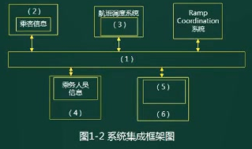

**案例 = 心态 + 技巧 + 理论**

# 考点分析

1. 系统规划：可行性研究和计算
2. 软件架构设计：架构风格，架构设计（质量属性）、架构评估（风险点、敏感点）；ABSD；
3. 设计模式：分类，概念，基本应用场景。
4. 系统设计：
5. UML：需求工程，DFD，ERD。顺序、状态，活动、协作。
6. Web架构：数据库主从、noSQL，缓存机制。
7. 系统建模：思想4+1视图。与面向对象设计关联，逻辑视图（分析），物理视图（设计）
8. 分布式系统设计
9. 嵌入式系统设计
10. 系统的可靠性分析与设计
11. 系统的安全性和保密性设计：对称非对称，等保体系。

**历年考试知识点13-19：**

1. 软件架构设计：软件质量属性对应的需求，管道-过滤器风格，数据仓储风格，填充架构图
2. 软件架构评估：软件质量属性场景、架构风险、敏感点、权衡点
3. 软件系统建模：结构化和面向对象分析，DFD，ERD，用例；用例图与类图，用例关系和类之间的关系；状态图和活动图；数据流图、CRUD矩阵
4. 数据库建模：Redis缓存技术、雪崩效应、缓存穿透
5. Web应用系统架构：分布式架构，SQL注入，响应式Web设计，架构设计图填充，主从复制机制；负载均衡、磁盘I/O瓶颈问题、查询缓存机制、Memcached分布式缓存机制。
6. Web系统设计：面向服务架构SOA，ESB的作用和特点，Web系统架构，信息系统安全保障的措施
7. Web系统应用：应用服务器、网站技术、大负荷和长时间运行下的稳定性以及可扩展性、J2EE的N层结构
8. 系统设计：非功能性需求分类，瘦客户端C/S架构，MVC概念和组成、EJB，有状态和无状态
9. 设计模式：MVC设计模式，基于XML的界面管理技术。
10. 嵌入式系统：实时系统的特点，实时特性分类，可靠性；实时任务中简单任务和复杂任务的区分，腰型通信模式架构风格；机器人操作系统ROS；
11. 嵌入式系统可靠性分析：可靠性相关概念、恢复快方法、N版本程序设计
12. 嵌入式构建设计：遗留工程、构件技术
13. 分布式数据库：MemCache与Redis，数据可靠性和一致性，Redis集群切片的几种常见方式
14. 数据库设计：ORM优缺点、增加数据访问层的原因
15. 敏捷开发：Scrum敏捷开发过程、MVC、分层架构
16. 应用系统数据架构：关系型数据库、文件系统、内存数据库、SQL设计策略
17. 信息安全：公钥体系，数据库敏感字段加密。
18. 项目管理：项目计划内容、项目绩效计算、项目延期解决方案。

# 解答方法

步骤：

1. 标出问题要点，以此作为主要线索进行分析和思考

2. 对照问题要点，仔细阅读正文。（善于从书面叙述中提取最必要的信息）

3. 通过定性分析或者定量估算，构思答案的要点

   对于可以简单定量分析的问题，已有类似经验并能进行估算、

   对于只能定性分析的问题用简练的语言抓住要点加以表达

4. 以最简练的语言写出答案

注意事项：

1. 分析题目问题的倾向性，顺势答题
2. 列条目回答问题，觉得对的都写上。
3. 多选题：少选，则按项给分；多选了错误项无分。

# 试题实例

## 试题1

阅读以下关于软件架构设计的叙述，在答题纸上回答问题1至问题3.

**[说明**]

某软件公司为某品牌手机厂商开发一套**手机应用程序集成开发环境**，,以提高开发手机应用程序的质量和效率。在项目之初,公司的系统分析师对该集成开发环境的需求进行了调研和分析，具体描述如下:

- a .需要同时支持该厂商自行定义的应用编程语言的编辑、界面可视化设计、编译、调试等模块，这些模块产生的模型或数据格式差异较大，集成环境应提供数据集成能力。集成开发环境还要支持以适配方式集成公司现有的应用模拟器工具。（功能描述）
- b .经过调研，手机应用开发人员更倾向于使用Windows系统，因此集成开发环境的界面需要与Windows平台上的主流开发工具的**界面风格保持一致**。
- c .支持相关开发数据在云端存储，需要保证在云端存储数据的**机密性和完整性**。
- d .支持用户通过配置界面依据自己的喜好修改界面风格,包括颜色、布局、代码高亮方式等,**配置完成后无需重启环境**。
- e .支持不同模型的自动转换。在初始需求中定义的机器性能条件下，对于一个包含50个对象的设计模型，将其转换为相应代码框架时所**消耗时间不超过5秒**。
- f .能够连续**运行的时间不小于240小时**，意外退出后能够在**10秒之内自动重启**。
- g .集成开发环境具有**模块化结构**，支持以模块为单位进行**调试、测试与发布**。
- h .支持应用开发过程中的代码调试功能：开发人员可以设置断点，启动调试，编辑器可以自动卷屏并命中断点。能通过变量监视器查看当前变量取值。（功能描述）

架构师王工在仔细分析后，认为应该采用数据仓储( Data Repository )的架构风格。公司经过评了王工的方案。

[问题1] ( 10分)
识别软件架构质量属性是进行架构设计的重要步骤。请分析题干中的需求描述，填写质量属性识别表中(1) ~ (5)处的空白。

| 质量属性名称 | 需求描述符号 |
| :----------: | :----------: |
|    可用性    |      f       |
|     性能     |      e       |
|   可修改性   |      d       |
|   可测试性   |      g       |
|    安全性    |      c       |
|    易用性    |      b       |

- **质量属性的核心属性：性能、可用性、安全性、可修改性**。
- **可修改性：改变系统的容易度。**

[问题2] (7分 )
请在阅读题干需求描述的基础上,从交互方式数据结构、控制结构和扩展方法4个方面对两种架构风格进行比较。填写两种架构比较表中(1) ~ (4)处的空白。

| 比较因素 | 管道-过滤器风格          | 数据仓储风格                                               |
| -------- | ------------------------ | ---------------------------------------------------------- |
| 交互方式 | 顺序结构或有限的循环结构 | 星型结构，或以数据为中心，其它构件围绕数据，进行交互的结构 |
| 数据结构 | 数据流                   | 文件或模型                                                 |
| 控制结构 | 数据（流）驱动           | 业务功能驱动                                               |
| 扩展方法 | 接口适配                 | 依赖于中心数据结构的适配 或 数据结构适配                   |

- 交互方式：此处说明的是 构件和构件之间的结构。**顺势而为，依赖之前的答案**
- 扩展方法：此处说明的是 构件之间如何联系和匹配 

[问题3] (8分 )
在确定采用数据仓库架构风格后,王工给出了集成开发环境的架构图，请填写图1- 1中(1) ~ (4)处的空白,完成该集成开发环境的架构图。

- 具体描述中的功能描述的内容：自行定义的应用编程语言的编辑、界面可视化设计、编译、调试等模块，以**适配方式**集成公司现有的**应用模拟器工具**
- 中心是**语法树**，周边可修改更新的构件是：编译器、调试器、可视化设计工具、**语言编辑器、适配器，模拟工具**

## 试题2

阅读以下关于企业应用系统集成架构设计的说明,在答题纸上回答问题1和问题2。

[**说明**]

​	某航空公司希望对构建于上世纪七、八十年代的主要业务系统进行改造与集成,提高企业的竞争力。由于集成过程非常复杂，公司决定首先以Ramp Coordination系统为例进行集成过程的探索与验证。

​	在航空业中, Ramp Coordination是指飞机从降落到起飞过程中所需要进行的各种业务活动的协调过程。通常每个航班都有位员工负责Ramp Coordination，称之为Ramp Coordinator，由Ramp Coordinator协调的业务活动包括检查机位环境卸货和装货等。

业务流程：

- a：开始-》接收航班信息-》检查机位环境-》检查卸货-》检查装货-》检查关门-》结束
- b：开始-》接收航班信息-》检查机位环境-》检查卸货-》结束
- c：开始-》接收航班信息-》检查装货-》检查关门-》结束

​	由于航班类型、机型的不同, Ramp Coordination的流程有很大差异。(a)所示的流程主要针对短期中转航班，这类航班在机场稍作停留后就起飞；(b)所示的流程主要针对到达航班，通常在机场过夜后第二天起飞；(c)所示的流程主要针对离港航班，这类航班是每天的第一班飞机。这三种类型的航班根据长途/短途、国内/国外等因素还可以进步细分 , 每种细分航班类型的Ramp Coordination的流程也略有不同。

​	为了完成上述业务, **Ramp Coordination信息系统需要从乘务人员管理系统中提取航班乘务员的信息、从订票系统中提取乘客信息从机务人员管理系统中提取机务人员信息、接收来自航班调度系统的航班到达事件**。其中乘务人员管理系统和航班调度系统运行在大型主机系统中，机务人员管理系统运行在Unix操作系统之上；订票系统基于Java语言,具有Web界面，运行在Linux操作系统之上。

​	目前Ramp Coordination信息系统主要由人工完成所有协调工作，效率低且容易出错。

​	公司领导要求集成后的Ramp Coordination信息系统能够针对不同需求迅速开展业务流程,灵活、高效地完成协调任务。

​	针对上述要求,公司部]的架构师经过分析与讨论，最终采用面向服务的架构，以服务为中心进行Ramp Coordination信息系统的集成工作。

[问题1] ( 10分)
服务建模是对Ramp Coordination信息系统进行集成的首要工作，公司的架构师首先对Ramp Coordination信息系统进行服务建模，识别出系统中的两个主要业务服务组件:
( 1 ) Ramp Control ：负责Ramp Coordination信息系统中相关名种业务活动的组件; 
( 2 ) Flight Management ：负责航班相关信息的管理,包括航班日程，乘客信息等。针对上述服务模型,
结合题干描述，请为每个业务服务组件提供的服务进行分析与整理，完成表中的空白部分。

| 业务服务组件      | 提供服务名称 |
| ----------------- | ------------ |
| Ramp Control      |              |
| Flight Management |              |

- 阅读理解，文中描述的内容放入合适的位置。

[问题2] (15分)
对Ramp Coordination信息系统的集成涉及到对乘务人员管理系统、航班调度系统机务人员管理系统和订票系统的组织与协调；公司架构师决定采用企业服务总线(Enterprise Service Bus , ESB)技术进行系统集成，请用200字以内的文字对ESB的定义进行描述，给出ESB的五个主要功能，并针对题干描述,将恰当的内容填入图1-2中的(1) ESB，(2)~ (6)。

- 阅读理解，加粗的一段。
- 

## 试题3

阅读以下关于应用服务器的叙述，, 在答题纸上回答问题1至问题3.
[**说明**]
	某电子产品制造公司,几年前开发建设了企业网站系统,实现了企业宣传、产品介绍、客服以及售后服务等基本功能。该网站技术上采用了**Web服务器**、**动态脚本语言PHP**。随着市场销售渠道变化以及企业业务的急剧拓展，该公司急需建立完善的电子商务平台。
	公司张工建议对原有网站系统进行扩展，增加新的功能(包括订单系统、支付系统、库存管理等) ,这样有利于降低成本、快速上线；而王工则认为原有网站系统在**技术上存在先天不足**，不能满足企业业务的快速发展，尤其是企业业务将服务全球,需要提供24小时不间断服务,系统在大负荷和长时间运行下的稳定性至关重要。建议采用应用服务器的Web开发方法，例如2EE，为该企业重新开发新的电子商务平台。

[问题1] ( 7分)
王工认为原有网站在技术上存在先天不足,不能满足企业业务的快速发展,根据你的理解，请用300字以内的文字说明原系统存在哪几个方面的不足。

题解：

1、PHP只能实现简单的分布式两层或三层的架构，而JAVA在这方面就比较强大,可以实现多层的网络架构。数据库层(持久化层)、应用(业务)逻辑层、表示逻辑层彼此分开，而且现在不同的层都已经有一些成熟的开发框架的支持。

2、PHP是面向过程的语言，Java是面向对象的，面向过程语言开发的程序只要业务流程发生变化，修改工作量很大，所以可修改性差,同时可复用性也差。

3、 PHP语言在可靠性方面比J2EE平台差，J2EE平台有大量增强可靠性的成熟解决方案，而PHP只是一 种简单的脚本语言,在可靠性方面缺乏成熟解决方案。

4、 PHP对于不同的数据库采用不同的数据库访问接口,而Java通过JDBC来访问数据库,通过不同的数据库厂商提供的数据库驱动方便地访问数据库，访问数据库的接口比较统一。所以原架构在数据库连接方面修改起来工作量也是很大的。

5、PHP适合于小型项目，所以本项目中以前采用PHP是合适的，但目前大量功能需要增加, PHP在稳定性方面也达不到要求。

5、PHP比Java的可维护性差。

7、PHP比Java的扩 展性差。

8、PHPE比Java的安全性差。

[问题2] (8分)
请简要说明应用服务器的概念，并重点说明应用服务器如何来保障系统在大负荷和长时间运行下的稳定性以及可扩展性。

题解：应用服务器是指通过各种协议把商业逻辑曝露给客户端的程序。

- 1、若系统负荷很大,可以布署多台应用服务，多台应用服务器分担任务,以达到**性能要求**。
- 2、应用服务器可以通过灵活的增加服务器完成扩展,所以**可扩展性很好**。
- 3、应用服务器可长时间稳定运行。因为当一台应用服务 器出现故障时,可以将当前运行的事务转移至正常应用服务器上完成执行，不影响业务正常执行,从而**保障高可靠性与稳定性**。

[问题3] (10分 )
J2EE平台采用了多层分布式应用程序模型,实现不同逻辑功能的应用程序被封装到不同的构件中，处于不同层次的构件可被分别部看到不同的机器中。请填写图4 1中(1) ~ (5)处的空白，完成J2EE的N层体系结构。

题解：

1. 客户端（浏览器）（HTML，**Applet**）
2. Web（Web服务器）：JSP，Servlet 
3. EJB容器：Simple Bean，Session Bean，Entity Bean（**优先填写重要的，其它的有空再填，如消息bean**）
4. DB

**Web服务器和应用服务器**

1. Web服务器：HTML页面就是WEB的数据元素,处理这些数据元素的应用软件就叫WEB服务器。

   WEB服务器与客户端打交道，它要处理的主要信息有：session、request、response、HTML等

   Web服务器可以解析(handles)HTTP协议。当Web服务器接收到一个HTTP请求(request)，会返回一个HTTP响应(response)，例如送回一个HTML页面。

   如**Apache、IIS、Nginx（也是反向代理服务器）**

2. Web应用服务器：通过各种协议（包括HTTP），把商业逻辑暴露给(expose)客户端的应用程序。

   应用程序服务器是通过组件(component)的应用程序接口(API)把商业逻辑暴露(expose)(给客户端应用程序)的，例如基于J2EE(Java 2 Platform, Enterprise Edition)应用程序服务器的EJB(Enterprise JavaBean)组件模型

   如**Tomcat、Weblogic、Jboss。**

3. 总结：应用服务器处理业务逻辑，web服务器则主要是让客户可以通过浏览器进行访问，处理HTML文件，web服务器通常比应用服务器简单。

## 试题4

问题:阅读以下关于Web系统架构设计的叙述，在答题纸上回答问题1至问题3.

[**说明**】

​	某电子商务企业因发展良好,客户量逐步增大，企业业务不断扩充，导致其原有的B2C商品交易平台己不能满足现有业务需求。因此，该企业委托某软件公司重新开发一套商品交易平台。

​	该企业要求新平台应可适应客户从手机、平板设备、电脑等不同终端设备访问系统,同时满足电商定期开展"秒杀"、"限时促销"等活动的系统高并发访问量的需求。面对系统需求，软件公司召开项目组讨论会议,制定系统设计方案。讨论会议上，王工提出可以应用响应式Web设计满足客户从不同设备正确访问系统的需求。同时，采用增加镜像站点、CDN内容分发等方式解决高并发访问量带来的问题。

​	李工在王工的提议上补充，仅仅依靠上述外网加速技术不能完全解决高用户并发访问问题，如果访问量持续增加,系统仍存在崩溃可能。李工提出应同时结合负载均衡、缓存服务器、Web应用服务器、分布式文件系统、分布式数据库等方法设计系统架构。经过项目组讨论，最终决定综合王王和李工的思路，完成新系统的架构设计。

[问题1] (5分)
请用200字以内的文字描述什么是"响应式Web设计" ,并列举2个响应式Web设计的实现方式。

题解：响应式web设计是指我们设计与开发的页面可以根据用户的行为和不同的设备环境做出相应的响应来调整页面的布局，以提供用户可感知的、流畅的阅读和操作体验。

实现方式：(1)流式布局；(2)弹性布局(如弹性图片)；(3)媒体查询；使用相对值而不是绝对值

[问题2] (16 分)
综合王工和李工的提议，项目组完成了新商品交易平台的系统架构设计方案。新系统架构图如图5-1所示。请从选项(a) - (j)中为架构图中(1) - (8)处空白选择相应的内容,补充支持高并发的Web应用系统架构设计图。

题解：(1) (d)、(2) (C)、(3) (f)、(4) (a)、(5) (6) (e) (h)、(7) (8) (g) (i)

[问题3] (4 分)
根据李工的提议,新的B2C商品交易平台引入了主从复制机制。请针对B2C商品交易平台的特点,简要叙述引入该机制的好处。

题解：

1、提升性能：交易平台要求高并发，主从复制方式一主多从，不同的用户请求可以从不同的从数据库读取数据，提高并发度。

2、可扩展性更优：如果采用单台数据库服务器,则访问量持续增加时,数据库瓶颈暴露,且无法迅速解决问题。而主从结构可以快速增加从服务器数量,以满足需求。

3、提升可用性：一主多从，一台从服务器出现故障不影响整个系统正常工作。

4、相当于负载均衡：一主多从分担任务，相当于负载均衡

5、提升数据安全性：系统中的数据冗余存放多份，不会因为某台机器硬件故障而导致数据丢失。

## 试题5

阅读下列说明和图,回答问题1至问题4 ,将解答填入答题纸的对应栏内。

某房产中介连锁企业欲开发一个基于Web的房 屋中介信息系统，以有效管理房源和客户,提高成交率。该系统，
的主要功能是:

1. 房源采集与管理。系统自动采集**外部网站的潜在房源信息**，保存为潜在房源。由经纪人联系确认的潜在房源变为房源,并添加出售/出租房源的客户。由经纪人或客户登记的出售/出租房源,系统将其保存为房源。房源信息包括基本情况配套设施交易类型、委托方式业主等。经纪人可以对房源进行更新等管理操作。
2. 客户管理。**求租/求购客户**进行注册、更新，推送客户需求给经纪人,或由经纪人对求租/求购客户进行登记、更新。客户信息包括身份证号、姓名、手机号、需求情况、委托方式等。
3. 房源推荐。根据客户的需求情况(求购/求租需求情况以及出售/出租房源信息)，向已登录的客户**推荐房源**。
4. 交易管理。**经纪人**对租售客户双方进行交易信息管理，包括**订单提交和取消，设置收取中介费比例**。**财务人员收取中介费**之后，表示该订单已完成系统更新订单状态和 房源状态,向客户和经纪人发送交易反馈。
5. 信息查询。客户根据自身查询需求查询房屋供需信息

现采用结构化方法对房屋中介信息系统进行分析与设计,获得如图1所示的上下文数据流图和图2所示的0层数据流图。

[问题1] (8分)
( 1 )使用说明中的词语,给出图1中的实体E1-E4的名称;
( 2 )使用说明中的词语,给出图2中的数据存储D1-D4的名称。

题解：

[问题2\](5分)
根据说明和图中术语，补充图2中缺失的数据流及其起点和终点。

题解：

**数据流图的平衡规则**：可以找出 在 细化上层数据流图时 , 忽略的数据流 ;

1. 父图 ( 上层数据流图 ) 与 子图 ( 下层数据流图 ) 之间的平衡：

   根据 顶层数据流 可以 确定缺失的 底层数据流 ; 根据底层数据流 , 可以补充缺失的顶层数据流 

   **平衡匹配方法** ：两层数据流图中的 数据流个数和方向一致

2. 子图 内部的平衡：对于数据流图的任意一个加工 , 既有输入 , 又有输出 ;

   **加工**：描述 “输入数据流” 到 “输出数据流” 之间的变换 , 即 对数据进行了什么样的处理 , 使得 “输入数据流” 变为 “输出数据流” ;

   **黑洞 :** 某个加工 , 只有输入 , 没有输出 , 称为黑洞 ;

   **奇迹 :** 某个加工 , 只有输出 , 没有输入 , 称为奇迹 ;

[问题3\](12分)
需求分析的方法主要有结构化的分析方法、面向对象分析方法，而结构化分析方法需要建立三个模型，包括功能模型、行为模型和数据模型。而功能模型般用数据流图来表示。 请简单介绍需求分析的主要任务，以及需求分析包括哪几个方面的工作?

题解：主要任务：针对待开发软件提供完整、清晰、具体的要求，确定软件必须实现哪些任务。具体分为功能性需求、非功能性需求与设计约束三个方面。

需求分析阶段的工作,可以分为四个方面：问题识别、分析与综合、制订规格说明、评审。

1. **问题识别：**确定对所开发系统的综合要求，并提出这些需求的实现条件，以及需求应该达到的标准。这些需求包括：功能需求(做什么)、性能需求(要达到什么指标)、环境需求(如机型、操作系统等)、可靠性需求(不发生故障的概率）、安全保密需求、用户界面需求、资源使用需求(软件运行是所需的内存、CPU等)、软件成本消耗与开发进度需求、预先估计以后系统可能达到的目标。**定义数据字典**。
2. **分析与综合：** 逐步细化所有的软件功能（**数据流图**），找出系统各元素间的联系（**ER图**），以及各元素的状态和事件（**状态图**），接口特性和设计上的限制，分析他们是否满足需求，剔除不合理部分，增加需要部分。最后综合成系统的解决方案，给出要开发的系统的详细逻辑模型(做什么的模型)，。
3. **制订规格说明书：** 即编制文档，描述需求的文档称为**软件需求规格说明书（指定优先级）**。请注意，需求分析阶段的成果是需求规格说明书，向下一阶段提交。
4. **评审：** **对功能的正确性，完整性和清晰性**，以及其它需求给予评价。评审通过才可进行下一阶段的工作,否则重新进行需求分析。

## 试题6

阅读以下关于分布式数据库缓存设计的叙述，在答题纸上回答问题1至问题3.

[**说明**]

​	某企业是为城市高端用户提供高品质蔬菜生鲜服务的初创企业，创业初期为快速开展业务,该企业采用轻量型的开发架构(脚本语言+关系型数据库)研制了一套业务系统。业务开展后受到用户普遍欢迎，用户数和业务数量迅速增长，原有的数据库服务器不能满足高度并发的业务要求。为此,该企业成立了专门的研发团队来解决该问题。

​	张工建议重新开发整个系统，采用新的服务器和数据架构,解决当前问题的同时为日后的扩展提供支持。但是，李工认为张工的方案开发周期过长，投入过大,当前应该在改动尽量小的前提下解决该问题。李工认为访问量很大的只是部分数据，建议采用缓存工具MemCache来减轻数据库服务器的压力，这样开发量小，开发周期短，比较适合初创公司，同时将来也可以通过集群进行扩展。然而,刘工又认为李工的方案中存在数据可靠性和一致性问题 ，在宕机时容易丢失交易数据，建议采用Redis来解决问题。在经过充分讨论，该公司最终决定采用刘工的方案。

[问题1] ( 9分)
在李工和刘工的方案中，均采用分布式数据库缓存技术来解决问题。请说明分布式数掘库缓存的基本概念。表4-1中对MemCache和Redis两种工具的优缺点进行了比较，请补充完善表中的空(1) ~(6)。

|            | MemCache          | Redis          |
| ---------- | ----------------- | -------------- |
| 数据类型   | 間单key-value结构 | 列表、哈希、图 |
| 持久性     | 不支持            | 支持           |
| 分布式存储 |                   |                |
| 多栈程支持 | 支持              |                |
| 内存管理   |                   |                |
| 事务支持.  |                   | 有限支持       |

[问题2] ( 8分)
刘工认为李工的方案存在数据可靠性和一致性的问题，请说明原因。（**从第一问的答案找思路**）
为避免数据可靠性和一致性的问题,刘工的方案采用Redis作为数据库缓存,请说明基本的Redis与原有关系数据库的数据同步方案。

题解：可靠性（需要用到的时候不存在，持久性，灾备恢复有优势），一致性（分布式，事务）

[问题3\](8分)
请给出Redis分布式存储的2种常见方案和Redis集群切片的几种常见方式。

题解：主从，哨兵、集群；

