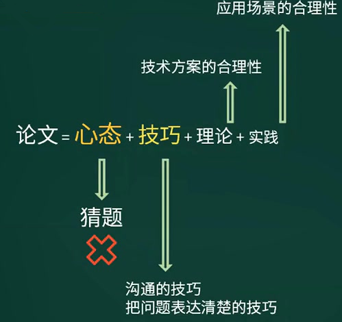

# 考试复习

## 考试大纲

- 系统建模
- 软件架构设计
- 系统设计
- 分布式系统设计
- 系统可靠性分析与设计
- 系统安全性和保密性设计

15-19考试情况

| 考试题目                   | 知识点说明                                                   |
| -------------------------- | ------------------------------------------------------------ |
| 论微服务架构及其应用       | 微服务架构的特点，如何采用微服务架构模式，遇到的实际问题和解决方案 |
| 论软件系统建模方法及其应用 | 建模方法及特点与适用范围                                     |
| 论软件架构风格             | 经典的架构风格及含义，架构选择的依据                         |
| 论无服务器架构及其应用     | 无服务器架构的特点                                           |
| 论软件质量保证及其应用     | 质量保证的活动以活动的主要内容                               |
| 论软件开发过程RUP及其应用  | RUP在该项目中的具体实施内容                                  |
| 论软件体系结构的演化       | 基于系统演化的6个步骤                                        |
| 论面向服务架构设计及其应用 | 构建S0A架构时遇的问题，具体实施效果                          |
| 论NoSQL数据库技术及其应用  | 采用的NoSQL数据库技术的架构设计过程及其应用效果              |
| 论软件设计方法             | 具体技术、方法及流程                                         |
| 论软件架构评估             | 评估方法，实施过程与效果                                     |
| 论数据湖                   | 面向多数据源的信息存储                                       |
| 论负载均衡算法应用         | 技术特点、算法应用                                           |

## 注意事项

1. 理论重于实践（加强学习，平时积累）
2. 要复用构件，不要整篇复用
3. 自己杜撰项目，而不用范文中的项目示例
4. 掌握写作技巧、提高写作速度。
5. 以论文写作技巧为依据，对自己的论文进行自评。

## 论文评分标准

### 扣分与加分准则

下述情况的论文，需要适当扣5分到10分:

- 没有写论文摘要、摘要过于简略、或者摘要中没有实质性内容的论文
- 字迹比较潦草、其中有不少字难以辨认的论文
- 确实属于过分自我吹噓或自我标榜、夸大其词的论文
- 内容有明显错误和漏洞的，按同一类错误每一类扣一次分
- 内容仅属于大学生或研究生实习性质的项目、并且其实际应用水平相对较低的论文

下述情况，可考虑适当加分(可考虑加5分到10分) :

- 有独特的见解或者有着很深入的体会、相对非常突出的论文
- 起点很高，确实符合当今信息系统发展的新趋势与新动向，并能加以应用的论文
- 内容详实、体会中肯、思路清晰、非常切合实际的很优秀的论文
- 项目难度很高，或者项目完成的质量优异，或者项目涉及国家重大信息系统工程且作者本人参加并发挥重要作用、并且能正确按照试题要求论述的论文

### 雷区

下述情况之一的论文，不能给予及格分数:

1. 虚构情节、文章中有较严重的不真实的或者不可信的内容出现的论文
2. 没有项目开发的实际经验、通篇都是浅层次纯理论的论文
3. 所讨论的内容与方法过于陈旧、或者项目的水准非常低下的论文
4. 内容不切题意，或者内容相对很空洞、基本上是泛泛而谈且没有较深入体会的论文
5. 正文与摘要的篇幅过于短小的论文(如正文少于1200字)
6. 文理很不通顺、错别字很多、条理与思路不清晰、字迹过于潦草等情况相对严重的论文

# 解答步骤

- 找准核心论点（5分钟）
- 搭建论文框架（10分钟）
- 撰写摘要（15分钟）
- 正文写作（90分钟）

## 找准核心论点

1. 根据论文标题。
2. 分析3个题干问题。

## 搭建论文框架

| 基本框架           | 内容                                                         |    字数     |
| :----------------- | ------------------------------------------------------------ | :---------: |
| 摘要               | 项目相关背景及主要功能 你的岗位及主要职责 **论文主体内容的总概** 项目最终的实施效果、或你的总结和感悟 |  300~320字  |
| 正文、项目背景介绍 | 项目背景的详细介绍 项目开发的原因 项目的开始实践、实施周期 你的主要岗位职责 |  400字左右  |
| 正文、相关问题回应 | 非核心论点问题的回应（大环境的主流技术或情况） 引出主体内容（核心论点） |  300~400字  |
| 正文、主体内容     | 采用总分式描述：一总加三分，共4个段落                        | 1000~1500字 |
| 正文、结论         | 结构分三段：分析项目运行效果，总结项目不足，提出解决思路     |  400~600字  |

- 根据不同的论文主题选择不同的角色：如需求选择产品经理，架构选择架构师。
- **万能角色：技术负责人。**
- 正文项目背景：宏观和微观
- 不足之处要适度，和主题相关。

## 正文写作

写作技巧：

1. 以我为中心
2. 站在高级工程师的角度
3. 忠实于论点
4. 条理清晰，开门见山：
   1. 整理一下你所掌握的素材，列出提纲，即你打算谈几个方面，每个方面你是怎么做的，收效如何等等，简明扼要地写在草稿纸上。提纲不要求全面，关键要列出你所做过的工作。
   2. 用精练的语句说明项目的背景、意义、规模、开发过程以及你的角色等，让评卷人对你所做的项目产生兴趣。
   3. 每自然段的第一句就开门见山指出你所采取的措施，然后指出你为什么这样做，这样做有何优点，克服了以前做法的哪些缺点等等。最好对你所采取的措施分一下主次，先陈述你认为重要的措施
   4. ==最后，把各段的提纲串连起来就是一个摘要==
5. 图文并茂，能收奇效
6. 标新立异，要有主见：通过一个适当的话题，全面地、系统地展现个人的软件研发工作经验以及分析问题解决问题的能力。
7. 首尾一致

常见问题：

1. 走题
2. 字数不够，字数偏多
3. 摘要归纳欠妥
4. 文章深度不够，缺少特色，泛泛而谈
5. 文章口语化太重，文字表达能力太差
6. 文章缺乏主题项目，项目年代久远
7. 整篇文章从大一二三到小123，给人以压抑感
8. 文章结构不够清晰，段落太长

## 撰写摘要

摘要模板：

➢本文讨论.....系统的..... (论文主题)。该系统.... (系统背景、简单功能介绍)。在本文中首先讨论了..... (过程、方法、措施)，最后.... (不足之处/如何改进、特色之处)。在本系统的开发过程中，我担任了...... (作者的工作角色)。

➢根据...需求(项目背景)，我所在的...组织了....系统的开发。该系统.......(系统背景、简单功能介绍)。在该系统的开发中，我担任了.... (作者的工作角色)。我通过采取...... (过程、方法、措施)，使该系统开发工作圆满完成，得到了 用户们的一致好评。但现在看来，.... (不足之处/如何改进、特色之处) 

➢**.....年.....月，我参加了....系统的开发，担任.... (作者的工作角色)。该系统.....(系统背景、简单功能介绍)。本文结合作者的实践，...... 系统为例，讨论....... (论文主题) ,包括..... (过程、方法、措施)。**

==上线时间必须是3年以内，开发周期8个月以上==

➢........是....... (戴帽子，讲论文主题的重要性)。本文结合作者的实践，...... 系统为例，讨论...... (论文主题)，包括.... (过程、方法、措施)。在本系统的开发过程中，我担任了.... (作者的工作角色)。

# 写作分析

## 试题1-需求获取

**论系统设计中对用户需求的把握**

​	对于系统工程师来说，在把某项工作系统化的时候，正确地理解该项工作的内容并设计出有效的系统，是一-件最困难的事情。为了把用户的需求正确无误地反映到系统的规格说明中去，常规的作法是把系统的规格说明书和输出的报表交给用户征求意见。在某些情况下，还要做出系统的原型，请用户试用。

请围绕“系统设计中对用户需求的把握”论题，依次对以下三个问题进行论述。
1.叙述你参与的开发工程的概要，以及你所担任的工作。
2.就你所下过功夫的地方叙述，为了把用户需求反映到系统规格说明书中，采用过什么手段与用户进行通信?
3.对于你所采用的手段，各举出一点你认为有效果的方面和无效果的方面，简要叙述你对这方面的评价。

题解：查找核心论点：

1. 问题1的要点：
   1. 软件系统的概要：软件背景，发起单位、目的，开发周期，交付的产品
   2. 软件在胸痛分析方面的情况
   3. 担任的角色和主要工作
2. **问题2的要点**
   1. 在系统分析过程中，把握用户需求的重要性
   2. 为了把用户需求反映到系统规格说明数种，采用什么手段与用户通信
3. 问题3的要点：
   1. 采取的手段中有效果的手段，效果体现在什么方面
   2. 采取的手段中无效果的手段，为什么没效果
   3. 还有哪些地方值得改进和提高。

搭建论文框架：

| 基本框架           | 内容                                                         |    字数     |
| :----------------- | ------------------------------------------------------------ | :---------: |
| 摘要               | 摘要                                                         |  300~320字  |
| 正文、项目背景介绍 | 系统的概要 开发的体制和我担任的工作 在系统分析方面的情况 |  400字左右  |
| 正文、相关问题回应 | 对需求的认知 把握用户需求的重要性                       |  300~400字  |
| 正文、主体内容     | 采用过的手段： 三种技术的应用，或者一个技术的三个阶段   | 1000~1500字 |
| 正文、结论         | 有效的手段体现在哪？ 无效的手段的原因 总结项目不足，提出解决思路 |  400~600字  |

## 试题2-设计模式

**论软件设计模式及其应用**

​	软件设计模式(Software Design Pattern) 是一套被反复使用的、多数人知晓的、经过分类编目的代码设计经验的总结。使用设计模式是为了重用代码以提高编码效率、增加代码的可理解性、保证代码的可靠性。软件设计模式是软件开发中的最佳实践之一，它经常被软件开发人员在面向对象软件开发过程中所采用。项目中合理地运用设计模式可以完美地解决很多问题，每种模式在实际应用中都有相应的原型与之相对，每种模式都描述了一个在软件开发中不断重复发生的问题，以及对应该原型问题的核心解决方案。

​	请围绕“论软件设计模式及其应用”论题，依次从以下三个方面进行论述。
1.概要叙述你参与分析和开发的软件系统，以及你在项目中所担任的主要工作。
2.说明常用的软件设计模式有哪几类?阐述每种类型特点及其所包含的设计模式。
3.详细说明你所参与的软件系统开发项目中，采用了哪些软件设计模式，具体实施效果如何。

题解：查找核心论点：

1. 问题1的要点：
   1. 软件系统的概要：系统背景、发起单位、目的、开发周期、交付的产品等
   2. 担任的角色和主要工作。
2. 问题2的要点：
   1. 常用的软件设计模式的分类
   2. 说明每种类型的特点及所包含的设计模式。
3. **问题3的要点：**
   1. **项目采用了哪些软件设计模式，说明其具体实施步骤**
   2. 具体实施效果如何

搭建项目框架：

| 基本框架           | 内容                                          |    字数     |
| :----------------- | --------------------------------------------- | :---------: |
| 摘要               | 摘要                                          |  300~320字  |
| 正文、项目背景介绍 | 问题1                                         |  400字左右  |
| 正文、相关问题回应 | 对软件设计模式的认识、问题2                   |  300~400字  |
| 正文、主体内容     | 问题3.1（最多写3种）                          | 1000~1500字 |
| 正文、结论         | 问题3.2，概括总结不足，提出解决思路，总结展望 |  400~600字  |

## 试题3-架构风格

**论软件系统架构风格**

​	系统架构风格(System Architecture Style) 是描述某- -特定应用领域中系统组织方式的惯用模式.架构风格定义了一个词汇表和一组约束，词汇表中包含一些构件和连接件类型，而这组约束指出系统是如何将这些构件和连接件组合起来的。软件系统架构风格反映了领域中众多软件系统所共有的结构和语义特性，并指导如何将各个模块和子系统有效地组织成--个完整的系统。软件系统架构风格的共有部分可以使得不同系统共享同一个实现代码，系统能够按照常用的、规范化的方式来组织，便于不同设计者很容易地理解系统架构。

​	请以“软件系统架构风格”论题，依次从以下三个方面进行论述:
1.概要叙述你参与分析和开发的软件系统开发项目以及你所担任的主要工作。
2.分析软件系统开发中常用的软件系统架构风格有哪些?详细阐述每种风格的具体含义。
3.详细说明在你所参与的软件系统开发项目中，采用了哪种软件系统架构风格，具体实施效果如何。

题解：查找核心论点：

1. 问题1的要点：
   1. 软件系统的概要：系统背景、发起单位、目的、开发周期、交付的产品等
   2. 担任的角色和主要工作。
2. 问题2的要点：
   1. 常用的软件系统架构风格
   2. 每种风格的含义。
3. **问题3的要点：**
   1. 采用了哪些软件架构风格，说明其具体实施步骤
   2. 具体实施效果如何

搭建论文框架：类似设计模式。

素材：

1. 架构设计的一个核心问题是能否达到架构级的软件复用
2. 架构风格反映了领域中众多系统所共有的结构和语义特性、并指导如何将各个构件组织成一个完整的系统
3. 架构风格定义了用于描述系统的术语表和一组指导构建系统的规则
4. 数据流风格：管道-过滤器、批处理
5. 调用/返回风格：主程序和子程序、面向对象，层次结构
6. 独立构件风格：事件驱动（隐式调用）、进程通信
7. 虚拟机风格：解释器、基于规则的系统
8. 仓库风格：数据库系统、黑板系统、超文本系统

## 试题4-企业集成

**论企业集成平台的技术与应用**

企业集成平台是-一个支持复杂信息环境下信息系统开发、集成和协同运行的软件支撑环境。它基于各种企业经营业务的信息特征，在异构分布环境(操作系统、网络、数据库)下为应用提供一致的信 息访问和交互手段，对其上运行的应用进行管理，为应用提供服务，并支持企业信息环境下各特定领域的应用系统的集成。企业集成平台的核心是企业集成架构，包括信息、过程、应用集成的架构。

请以“企业集成平台的技术与应用”为题，依次从以下三个方面进行论述:
1.概要叙述你参与管理和开发的企业集成平台相关的软件项目以及你在其中所担任的主要工作。
2.简要说明企业集成平台的基本功能及企业集成的关键技术，并结合项目实际情况，阐述该项目所选择的关键技术及其原因。
3.结合你具体参与管理和开发的实际项目，举例说明所采用的企业集成架构设计技术的**具体实施方式及过程**，并详细分析其实现效果。

题解：找准核心论点

1. 问题1论点：
   1. 软件系统概要：系统背景、发起公司、目的、开发周期、交付的产品  
   2. 担任的角色和职责
2. 问题2论点：
   1. 企业集成平台的基本功能和关键技术
   2. 阐述项目中所选择的关键技术及其原因
3. **问题3论点：**
   1. **项目中采用的企业集成架构设计技术，及其具体实施方式及过程。**
   2. 分析采用企业集成架构技术的实现效果。

==论文主题是技术和应用时，则最重要的是技术的具体实现过程==

搭建论文框架：

| 基本框架           | 内容                                      |    字数     |
| :----------------- | ----------------------------------------- | :---------: |
| 摘要               | 摘要                                      |  300~320字  |
| 正文、项目背景介绍 | 问题1：系统的概要，开发的体制、担任的工作 |  400字左右  |
| 正文、相关问题回应 | 对企业集成的认识、问题2                   |  300~400字  |
| 正文、主体内容     | 问题3.1                                   | 1000~1500字 |
| 正文、结论         | 分析运行效果，问题3.2，总结展望           |  400~600字  |

==企业集成的关键技术==

1. 企业集成的关键应用技术可从两个方面来选择技术进行论述：
2. 数据交换格式：
   1. EDI (电子数据交换)是一种利用计算机进行商务处理的方法，它将贸易、运输、保险、银行和海关等行业的信息，用一种国际公认的标准格式，通过计算机通信网络，供有关部门、公司与企业之间进行数据交换与处理，并完成以贸易为中心的全部业务过程。EDI格式处理的目的是将在功效上与纸介质文件等同的电子表单用统一的(或标准的)格式进行表示，以保证各个独立开发的计算机应用间能够实现表单数据共享与集成。用于描述电子表单格式的标准称为EDI格式标准或EDI标准，目前广泛使用的EDI格式标准主要有两个UN EDIFACT和ANSIX12.它们分别由联合国欧洲经济委员会(UN/ECE)和美国国家标准化协会(ANSI) 制定。
   2. XWIL (可扩展标记语言)，它是国际组织W3C制定的一个面向各类信息的数据存储工具和可配置载体的开放式标准。提出XML的目的是为了更好地适应Web应用的需求，解决HTML在表达能力、可扩展性和交互性等方面的缺陷。XML是通过对SGML标准进行简化而形成的元标记语言，具有语法清晰简单和结构无歧义等优点。它利用一套定义标记的规则将文件的内容和外观进行分离，实现了XML文档的可延展性及自我描述特性，从而使各种业务信息可以在全球信息网或企业间的应用系统中传递、处理及储存。这里需要指出的是，虽然XML称为可扩展标记语言，但它本身并不是一种标记语言，而是一种创建、设计和使用标记语言的根规则集，是一种创建标记语言( 如HTML)的元语言
   3. STEP标准是一个描述如何表达和交换数字化产品信息的IS0标准(IS010303) ，其目的是提供一种不依赖于
      具体系统的中性模型和机制，并将其用来描述整个生命周期內的产品数据。
3. 分布式应用集成基础框架：
   1.  CORBA的全称是公共对象请求代理体系结构，它是对象管理组织(OMG) 为解决分布式处理环境中硬件和软件系统的互连而提出的一种标准的面向对象应用程序体系规范。
   2. COIM +是Microsoft公司基于windows平台的一个分布式企业应用模型，它与Windows操作系统紧密结合，是沿着DDE-OLE- OLE2- C0N-D0M-COM+的路线发展而来。目前COM、DCOM和COM +应用比较广泛。
   3. WebService(Web服务)是指服务提供者将应用作为服务部署在Web上，通过使用Web服务描述语言(WSDL)来描述特定Web服务提供的功能。服务请求者在需要一种Web服务时，可以通过Internet， 在Web服务的注册机构中查找分布在Web站点上的Web服务，并自动实现服务的绑定，完成数据交换，在这个过程中无需人干预。由于Web服务的系统架构和实现技术基本上基于已有的技术，因此，Web服务可以看成是现有应用面向Intermet的一个延伸。
4. 界面集成
5. SOA架构风格

## 试题5 -信息安全

**论信息系统的安全性与保密性设计**

​	在企业信息化推进的过程中，需要建设许多的信息系统，这些系统能够实现高效率、低成本的运行，为企业提升竞争力。但在设计和实现这些信息系统时，除了针对具体业务需求进行详细的分析，保证满足具体的业务需求之外，还要加强信息系统安全方面的考虑。因为如果一个系统的安全措施没有做好，那么系统功能越强大，系统出安全事故时的危害与损失也就越大。

请围绕“信息系统的安全性与保密性”论题，依次从以下三个方面进行论述:
1.概要叙述你参与分析设计的信息系统及你所担任的主要工作。
2.深入讨论作者参与建设的信息系统中，面临的安全及保密性问题，以及解决该问题采用的技术方案。
3.经过系统运行实践，客观的评价你的技术方案， 并指出不足，以及解决方案。

题解：找准核心论点

1. 问题1的论点：
   1. 系统的概要：项目背景、发起单位、起始时间、目的、开发周期、交付的产品
   2. 承担的角色和责任
2. **问题2的论点：**
   1. 讨论项目中面临的安全和保密性的问题
   2. **解决问题所采用的技术方案**
3. 问题3的论点：
   1. 项目运行效果，不足和解决方案。

搭建论文框架：相关问题回应只包括对安全和保密性的认识，以及2.1的答案。

==信息安全体系结构：==

1. 鉴别服务：用户名+口令、数字证书、生物特征识别。
2. 控制访问：自主访问控制（DAC）、访问控制列表（ACL）、强制访问控制（MAC）、基于角色的访问控制（RBAC）、基于任务的访问控制（TBAC）
3. 数据完整性：
   1. 阻止对媒体访问的机制（隔离、访问控制、路由控制）
   2. 探测非授权修改的机制（数字签名、数据重复、数字指纹、消息序列号）
4. 数据保密性：通过禁止访问提供机密性、通过加密提供机密性
5. 抗抵赖：数字签名。

## 问题总结 

1. 摘要的项目背景一定要精炼，侧重于对正文总概的描述。
2. 摘要中的总概一定要准确，精炼，描述核心论点。
3. 技术方案总概时，要提出解决的什么问题。
4. 涉及到日期，写具体的年月，而不是今年，去年等。 

2019年2月，我所在的公司承担了某市某大型三甲医院的一站式入院信息系统的研发工作,我在该项目中担任系统架构师一职，主要负责系统的整体架构设计。项目本着以患者体验为中心，包含开具电子住院证及检查计划,预约登记，院前评估,预约排程,床位管理，床位安排，住院办理等子系统。本文以一站式入院信息系统为例，讨论了软件设计模式在该系统中的具体应用。针对不同数据库访问,我们采用了工厂方法模式**;针对系统各子系统的业务界面统一. 我们采用了外观模式**；针对患者入院流转的不同状态变化,我们采用了观察者模式。以上设计模式在系统中的使用保证了代码的可靠性，同时提高了系统的开发效率和可用性，整个系统的开发周期历时10个月，目前已稳定运行半年多的时间,获得了用户的一致好评。

# 论文模板

## 摘要

2012年1月，我作为项目经理，主持XX保险公司全国再保险大集中管理系统的建设项目，该项目为期2年半，总投资为1800万人民币，通过该项目，实现XX保险公司整体信息化转型升级的战略中再保险板块的落地，完成全国海量再保险业务数据的集中部署运行，迁移整合历史数据，全面替代上一代系统。该项目时间紧任务重、涉及人员组织多，直接相关XX保险公司内部60个部门400余人，外部配合协作30多个厂商团队300余人。该项目2014年5月院成系统上线，2014 年6月通过最终验收,得到了用户的一致肯定，顺利达成了项目既定目标。本文作者结合实际经验，以该项目为例，讨论一下项目建设的【软件分析、软件设计、、】这几个过程来进行论述。

## 正文

​	2012年1月，我作为项目经理，主持XX保险公司全国再保险大集中管理系统的建设项目，该平台为期2年半，总投资为1800万人民币。该项目时间紧任务重，具有相当的挑战性，一是业务模式升级,需按照最新的再保险业务流程，完成系统功能的分析开发,进而具体落地公司再保险业务流程的再造。二是技术要求高，要实现全国海量再保险业务数据的集中部署运行，每日处理数据量达到3000万笔以上，同时要满足性能要求。三是数据整合难，需要将上一代系统的中历时十年的数据，按其有效性进行分类、转化、整合，实现历史存续业务数据在新系统环境下，按照新新模式正常运行。四是涉及人员组织多,直接研发团队成员36人, XX保险公司总部再保险部、财务部、风险部、八大业务部、40个省公司等400余人，同时涉及外部配合协作承保系统、核保系统、理赔系统、收付费系统、财务系统等30多个厂商团队300余人。

​	我担任项目第一负责人，负责==项目整体技术方案评估==、立项论证以及项目管理工作。在项目启动前，负责分析项目的预期经济效益、可选技术方案,分析关联项目影响，并向公司提交立项报告。项目启动后，作为主要负责人，牵头与公司内部技术专家、外部架构师- -同建立项目技术架构组，设计项目整体技术架构，同时挑选项目内部成员，建立需求分析组、系统开发组、系统测试组、运维支持组，开展业务需求分析、系统设计、数据迁移方案、上线切换方案 工作。一方面， 我个人接受各组工作汇报，指导团队研发工作，监控整体工作进度。同时，我及时向公司领导、项目客户方、相关项目团队汇报沟通工作进展、阐明关键技术要点。

该项目2014年5月院成系统上线，2014 年6月通过最终验收，得到了用户的一致肯定，顺利达成了项目既定目标。==尤其在系统整体技术架构方面，效果尤为突出，一是保持了较好的灵活性，提供了较多的基础组件，使得应用功能便于横向扩充，满足了项目业务灵活性；二是系统性能整达到各个层次的整合设计，数据库层(分片、读写分离)、应用开发层(缓存技术、查询条件的严格限制)，服务部署层(采用集群部署、F5 分发)，使得业务日处理能力5500万单以上，预留了80%性能，满足了公司未来3-5年的业务增量。==

​	以该项目为例，就==系统架构设计的XXX方面==进行讨论，具体从规划XXX、管理XX和控制XX及XXXX管理这几个过程来进行论述。

​	==论文主干，出哪个方面就写哪个方面，里面每个点至少写1-2段,凑够1500-1800+字，重点突出“我” 作为项目架构师的思考和实践。==

### 性能设计

1. 性能设计是一个整体，必须有整体的一致性，避免"大河接了小水管”的片面设计。

   如何做到整体：充分理解需求、梳理运行环境、全流程分析、分层模型

2. 性能设计要抓住关键点：哪些地方是风险点、敏感点、权衡点。

3. 要敢于突破：特定环境要敢于突破。比如必须用接口?比如不准用存储过程。

4. 要有效地验证：评估推算、模拟验证

### 质量评估

1. 质量的要点
   1. 性能
   2. 可靠性：出错情况下的容错能力
   3. 可用性：正常/异常时间比、两次异常间隔时间
   4. 安全性
   5. 可修改性
   6. 功能性
   7. 可变性
   8. 互操作性
2. 采用的评估方法+实施过程+实际效果。3选1来说。
   评估方法：SAAM、ATAM体系结构平衡法

### 设计模式

常见设计模式以及作用

1. 创建型：对对象实例化过程进行抽象。

   工厂Factory、抽象工厂Abstract Factory、单例Singleton、原型Prototype、建造者Builder

2. 结构型：组合类或对象，获得更大的结构

   适配器Adapter、外观Facade、装饰Decorator、组合Composite、桥接Bridge、享元Flyweight、代理Proxy

3. 功能型：描述对象之间的交互。

   责任链Chain of Responsibility、观察者Observer、中介者Mediator、命令Command、备忘录Memento、状态State、策略Strategy、解释器Interpreter、迭代器Iterator、模板方法Template Method、访问者Visitor

### 数据库访问层设计

五种访问模式

1. 在线访问。业务之间访问数据，无数据库访问层
2. dao：将底层数据库与高层业务逻辑分开，访问特定数据源
3. dto: 一组对象组成的数据容器。跨进程或者跨网络传输数据
4. 离线数据模型：从数据源获得数据后，按照预定结构存放在系统中的数据。往往与XML集成使用
5. 对象/关系映射ORM：ORM可以是一-种工具或者平台，将程序中的数据映射成关系数据库中的记录，或者反之。使得开发面向对象，简化数据库开发相关工作。

实际使用效果：哪些场景实际用了什么设计方法，为什么，如何设计的，取得的效果如何。

1. 在业务逻辑部分，采用orm模式。在特定的高性能数据提取要求情况下，采取了之间读取数据库(及个边)
2. 在系统数据内部自运算环境，采用了个别存储过程。以保持效率。

### 微服务架构

优点：

1. 实现组件化，单个服务实现简单，能够聚焦一个指定的业务功能或业务需求。
2. 功能明确，易于理解。小团队能够更关注自己的工作成果。
3. 围绕业务功能构建开发团队。更符合企业的分工与组织结构
4. 支持多种语言和平台：采用HTTP等通用、轻量协议交互进行互操作。支持不同平台。
5. 离散化数据管理。无法创建或维护统一-的数据模型，需要进行数据模型的离散化管理
6. 基础设施自动化：通过持续集成工具实现基础设施自动化。

实际使用情况。

1. 使用已经有的微服务基础设施：用户登录认证服务、用户权限控制服务、主数据集合服务、接口发现服务。
2. 构建再保险微服务：先分保后出单模块、自动分保模块、账务处理模块、结算管理、资信管理

主要遇到的问题:

1. 微服务不是越多越好，需要充分理解用户需求、实际业务场景的前提下，做出合理划分归集
2. 基础设施的要求更高
3. 信息安全挑战加大。

## 结论

经过我和团队的不懈努力，历时一年，项目终于于2014年6月通过顺利通过了验收,并得到了一致好评，运行至今，用户反馈良好，XX保险公司的再保险业务运营水平得以提升。但是，在实施过程中，也暴露了一些具体问题，例如==跨系统之间接口交互时，由于业务复杂，简单的队列机制无法满足繁忙场景，需要建立具有动态优先级调整机制的处理队列等等==，这些问题通过应急处理和协调，以及高层领导的推动，都得到了妥善解决，没有影响到项目的总体进度。我们已经把这些经验和教训，总结到了工作总结里面，向其他技术人员分享,为今后系统架构设计提供帮助。**相信通过不断持续学习改进，加强自己的系统分析与设计能力，努力工作提升工作水平**，为社会和公司多贡献- -点自己的价值。

# 论文准备

## 主要技术

### 设计模式

### 架构风格

### 系统评估

### 系统安全

### Web架构

### 分布式架构

DUBBE，RPC、Docker

中间件，高并发，MQ,redis，缓存，中间件

### 邻域驱动设计

ABP，IOC，AOP。

## 项目

### 网约车

### 区域平台

## 具体实践过程