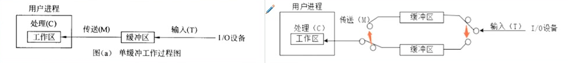

# 计算机系统

5、假设磁盘块与缓冲区大小相同，每个盘块读入缓冲区的时间为16us,由缓冲区送至用户区的时间是
5us,在用户区内系统对每块数据的处理时间为1us。若用户需要将大小为10个磁盘块的Doc1文件逐块
从磁盘读入缓冲区，并送至用户区进行处理，那么采用单缓冲区需要花费的时间为( ) us; 采用双缓
冲区需要花费的时间为( ) USo
A: 160；B:161 ；C:166；D:211
A:160；B:161 ；C:166；D:211

题解：这道题中处理数据有三个处理步骤:
1、从磁盘读入到缓冲区(10us) ; 
2、从缓冲区读入到(内存)用户区(6us);
3、处理(内存)用户区数据(2us)。

单缓冲区:

1. 步骤1和2都需要访问临界资源--缓冲区，所以需要合并成一个操作阶段。
2. 使用缓冲区时不能并行，必须分开执行，时间为16+5=21us，其次处理数据1uS。
3. 构造成流水线后，整个过程划分为2个阶段，分别是21us ,1us,根据流水线执行公式，流水线执行时间为
   21us+1us+(10-1)*21us= 211us*

双缓冲区:

1. 可以实现读入到缓冲区2和从缓冲区1读入到用户区的并发。
2. 读入缓冲区，和从缓冲区读入用户区，可以对不同的缓冲区进行，也就是说，可以并行处理。
3. 对于这里构造成流水线后，整个过程划分为3个阶段，1、从磁盘读入到缓冲区(16us) ; 2、从缓冲区读入到用户区(5us); 3、处理(内存)用户区数据(1us)。根据流水线执行公式，流水线执行时间为16us+5us+1us+(10-1)*16us=166uS.

6、在嵌入式操作系统中，板级支持包BSP作为对硬件的抽象，实现了( )。

A:硬件无关性，操作系统无关性
B:硬件有关性，操作系统有关性
C:硬件无关性，操作系统有关性
D:硬件有关性，操作系统无关性

7、某计算机系统采用4级流水线结构执行命令，设每条指令的执行由取指令(2△t) 、分析指令(1△t)取操作数(3△t) 、运算并保存结果(2△t)组成(注:括号中是指令执行周期)。并分别用4个子部件完成，该流水线的最大吞吐率为( ) ;若连续向流水线输入5条指令，则该流水线的加速比为()。

8、以下关于总线的说法中，正确的是( )。
A:串行总线适合**近距离高速数据传输**，但线间串扰会导致速率受限
B:并行总线适合**长距离数据传输**，易提高通信时钟频率来实现高速数据传输
C:单总线结构在一一个总线上适应不同种类的设备，设计复杂导致性能降低
D:半双工总线只能在一个方向上传输信息（**同一时刻只有一个设备发出数据，多个设备同时接收数据**）

10、CPU的频率有主频、倍频和外频。某处理器外频是200MHz,倍频是13,该款处理器的主频是( )。
A:2.6GHz；B:1300MHz；C:15.38Mhz；D:200MHz

11、把应用程序中应用最频繁的那部分核心程序作为**评价计算机性能的标准程序**，称为( )程序。()不是对Web服务器进行性能评估的主要指标。
A:仿真测试；B:核心测试；C:基准测试；D:标准测试
A:丢包率；B:最大并发连接数；C:响应延迟；D:吞吐量

14、假设某计算机系统中资源R的可用数为6,系统中有3个进程竞争R,且每个进程都需要个R,该系统可能会发生死锁的最小i值是( )。若信号量S的当前值为-2,则R的可用数和等待R的进程数分别为()。
A:1；B:2；C:3；D:4
A:0、0；B:0、1；C:1、0；D:0、2

17、计算机系统中常用的输入/输出控制方式有无条件传送、中断、程序查询和 DMA方式等。当采用()方式时，不需要CPU执行程序指令来传送数据。
A:中断；B:程序查询；C:无条件传送；D:DMA

# 数据库系统

19、在数据库设计的需求分析阶段，业务流程一般采用（)表示。
A:数据流图；B:E-R图；C:程序结构图；D:功能模块图

20、在关系R(A1 A2, A3) 和S(A2, A3, A4)上进行$π_{A1A4}(σ_{A2<2017\ \wedge\ A4 ='95'},(R D< S))$，关系运算与该关系表达式等价的是( )。将该关系代数表达式转换为等价的SQL语句如下：SELECT FROM R,S WHERE R.A, < '2017’ ( )

A、$π_{1,4}(σ_{A2<2017\ \vee\ A4 ='95'},(R D< S))$；自然连接，条件是或，不是且。
B、$π_{1,6}(σ_{2<2017}\ (R)\times σ_{3 ='95'}(S))$；笛卡尔积，没有做自然连接的等值。
C、$π_{1,4}(σ_{2<2017}\ (R)\times σ_{6 ='95'}(S))$；投影错误
D、$π_{1,6}(σ_{2=4\ \wedge\ 3 =5}(σ_{2<2017}\ (R)\times σ_{3 ='95'}(S))$；先筛选再做等值连接

A: OR    S.A4< '95' OR    R.A2=S.A2 OR    R.A3=S.A3
B: AND S.A4< ‘95' OR    R.A2=S.A2 AND R.A3=S.A3
C: AND S.A4< '95’ AND R.A2=S.A2 AND R.A3=S.A3（都是错误，选最接近）
D: OR   S.A4< '95’ AND R.A2=S.A2 OR    R.A3=S.A3

21、给定关系模式R(A1, A2, A3, A), R.上的函数依赖集F={ A1A3->A2, A2->Az }, 则R ( )。若将R分解为p={(A1, A2), (A1, A3)}, 那么该分解( )。
A:有一个候选关键字A1 A3
B:有一个候选关键字A1 A2 A3
C:有两个候选关键字A1 A3 A4和A1A2 A4
D:有三个候选关键字A1 A2、A1 A3 和A1 A4
A:是无损联接的
B:是保持函数依赖的
C:既是无损联接又保持函数依赖
D:既是有损联接又不保持函数依赖

22、给定关系模式R<U,F>,其中U为属性集，F是U上的一 组函数依赖，那么Armstrong公理系统的增
广律是指()。
A:若X- +Y, X- >Z,则X-→YZ为F所蕴涵
B:若X- +Y, WY >Z,则XW-→Z为F所蕴涵
C:若X- +Y, Y-→Z为F所蕴涵，则X- >Z为F所蕴涵
D:若X- +Y为F所蕴涵，且ZEU,则XZ-→YZ为F所蕴涵

23、某数据库中有员工关系E (员工号，姓名，部门，职称，月薪) ;产品关系P (产品号，产品名称，型号，尺寸，颜色) ;仓库关系W (仓库号，仓库名称，地址，负责人) ;库存关系| (仓库号，产品号，产品数量)。

a.若数据库设计中要求:
仓库关系W中的“负责人”引用员工关系的员工号
②库存关系中的“仓库号，产品号”惟一标识中的每一个记录
③员工关系E中的职称为“工程师” 的月薪不能低于3500元
则①②③依次要满足的完整性约束是( )。

b.若需得到每种产品的名称和该产品的总库存量，则对应的查询语句为:
SELELCT 产品名称，SUM(产 品数量) FROM P，I  WHERE P.产品号=1.产品号( ) ;
A:实体完整性、参照完整性、用户定义完整性
B:参照完整性、实体完整性、用户定义完整性
C:用户定义完整性、实体完整性、参照完整性
D:实体完整性、用户定义完整性、参照完整性
A: ORDER BY产品名称 ；B: ORDER BY产品数量；C: GROUP BY产品名称；D: GROUP BY产品数量

25、在分布式数据库中，() 是指各场地数据的逻辑结构对用户不可见。
A:分片透明性；B:场地透明性；C:场地自治；D:局部数据模型透明性

场地自治：是指各场地上的数据库具有独立处理的能力，可以执行该场地上的局部应用; 

# 计算机网络

27、TCP和UDP协议均提供了()能力。
A:连接管理；B:差错校验和重传；C:流量控制；D:端口寻址

28、网络系统设计过程中，逻辑网络设计阶段的任务是：
A:确定设备的具体物理分布和运行环境
B:设计网络安全方案
C:进行软硬件和安装费用估算
D:设计网络布线方案

29、在层次化园区网络设计中，( )是汇聚层的功能。
A:高速数据传输；B:出口路由；C:广播域的定义；D:MAC地址过滤

30、假如有3块80T的硬盘，采用RAID5的容量是( )。
A:40T；B:80T；C:160T；D:240T

31、建筑物综合布线系统中的园区子系统是指( )
A:由终端到信息插座之间的连线系统
B:楼层接线间到工作区的线缆系统
C:各楼层设备之间的互连系统
D:连接各个建筑物的通信系统

32、IPV6的地址空间是IPV4的 ( )倍
A:4；B:96；C:128；D:2^96 

# 知识产权和标准化

38、() 为推荐性地方标准的代号。
A:SJ/T；B:Q/T11 ；C:GB/T；D:DB11/T

# 数学和经济管理

40、设三个煤场A1 A2, A3分别能供应煤7、12、11万吨，三个工厂B1，B2, B3,分别需要煤10、10、10万吨，从各煤场到各工厂运煤的单价(百元/吨)见下表方框内的数字。只要选择最优的运输方案，总的运输成本就能降到( )百万元。

|                | 工厂B1 | 工厂B2 | 工厂B3 | 供应量（万吨） |
| -------------- | ------ | ------ | ------ | -------------- |
| 煤场A1         | 1      | 2      | 6      | 7              |
| 煤场A2         | 0      | 4      | 2      | 12             |
| 煤场A3         | 3      | 1      | 5      | 11             |
| 需求量（万吨） | 10     | 10     | 10     |                |

题解：**贪心算法**（为了总体成本最低，每一个工厂的需求都尽量成本最低，再根据条件进行调整）。

1. B1和B3都需要从A2运输，成本最低，此时A2产量不够。需要调整。

   B1调整为A1运输成本增加1, B1调整为A3运输成本增加3; 

   B3调整为A1运输成本增加4、B3调整为A3运输成本增加3.

2. 选择成本增加少的方式，选择B1调整为A1运输成本增加1, B3从A2获取10万吨，A2剩余产量2万吨仍然分配给B1,

3. 针对B1 ：A1能够供货7万吨，A2能够供货2万吨，剩余1万吨可以从A3获取；
   针对B2: A3能够供货10万吨，针对B3: A2能够供货10万吨
   总成本=40

41、在如下线性约束条件下: 2x+3y<=30; x+2y>=10; x>=y; x>=5; y>=0,目标函数2x+3y的极小值为(17.5)。

42、有一名患者胸部长了一个肿瘤，医院X光检查结果呈阳性。据统计，胸部肿瘤为良性的概率为99%。对良性肿瘤，X光检查的正确率(星 阴性的概率)为90%;对恶性肿瘤，X光检查的正确率(呈阳性的概率)为80%。因此，可推算出该患者患恶性肿瘤的概率是( )。

题解：X光呈阳性的来源（1、假阳性: 0.99\*0.01，2、真阳性: 0.01*0.8；合计0.107）
==恶性肿瘤就是真阳性，X光检测出阳性的概率是0.107，所以真阳性概率为：0.008/0.107=7.5%==

# 架构评估

# 2016

## 理论知识

3．嵌入式处理器是嵌入式系统的核心部件，一般可分为嵌入式微处理器(MPU)、微控制器
(MCU)、数字信号处理器(DSP)和片上系统(SOC)。以下叙述中，错误的是(）。A. MPU在安全性和可靠性等方面进行增强，适用于运算量较大的智能系统
B. MCU 典型代表是单片机，体积小从而使功耗和成本下降
C. DSP处理器对系统结构和指令进行了特殊设计，适合数字信号处理
D.SOC是一个有专用目标的集成电路，其中包括完整系统并有嵌入式软件的全部内容

9.IETF定义的区分服务（DiffServ)模型要求每个IP分组都要根据IPv4协议头中的（）字段加上一个DS码点，然后内部路由器根据DS码点的值对分组进行调度和转发
A.数据报生存期；B.服务类型；C.段偏置值；D.源地址

11.如果管理距离为 15，则（ ）。 
A.这是一条静态路由 ；B.这是一台直连设备； C.该路由信息比较可靠； D.该路由代价较小

14 项目的成本管理中，（）将总的成本估算分配到各项活动和工作包上，来建立一个成 本的基线。 
A.成本估算； B.成本预算； C.成本跟踪； D.成本控制

15.（ ）是关于项目开发管理正确的说法。 
A.需求文档、设计文档属于项目管理和机构支撑过程域产生的文档 
B.配置管理是指一个产品在其生命周期各个阶段所产生的各种形式和各种版本的文档、 计算机程序、部件及数据的集合 
C.项目时间管理中的过程包括活动定义、活动排序、活动的资源估算、活动历时估算、 制定进度计划以及进度控制 
D.操作员指南属于系统文档

16.（ ）在软件开发机构中被广泛用来指导软件过程改进。 
A.能力成熟度模型（Capacity Maturity Model）；B.关键过程领域（Key Process Areas） 
C.需求跟踪能力链（Traceability Link）； D.工作分解结构（Work Breakdown Structure）

17.（ ）是关于需求管理正确的说法。 
A.为达到过程能力成熟度模型第二级，组织机构必须具有 3 个关键过程域 
B.需求的稳定性不属于需求属性 
C.需求变更的管理过程遵循变更分析和成本计算、问题分析和变更描述、变更实现的顺序 
D.变更控制委员会对项目中任何基线工作产品的变更都可以做出决定

18. 螺旋模型在（ ）的基础上扩展而成。 A.瀑布模型 B.原型模型 C.快速模型 D.面向对象模型

20 在软件系统工具中，版本控制工具属于（ ），软件评价工具属于（ ）。
 A.软件开发工具 B.软件维护工具 C.编码与排错工具 D.软件管理和软件支持工具 
 A.逆向工程工具 B.开发信息库工具 C.编码与排错工具 D.软件管理和软件支持工具

21 面向对象的分析模型主要由（ ）、用例与用例图、领域概念模型构成；设计模型则包 含以包图表示的软件体系结构图、以交互图表示的（ ）、完整精确的类图、针对复杂 对象的状态图和描述流程化处理过程的（ ）等。
 A.业务活动图 B.顶层架构图 C.数据流模型 D.实体联系图 
 A.功能分解图 B.时序关系图 C.用例实现图 D.软件部署图 
 A.序列图 B.协作图 C.流程图 D.活动图

22 面向构件的编程(Component Oriented Programming，COP)关注于如何支持建立面向构件 的解决方案。面向构件的编程所需要的基本支持包括（35）。
A.继承性、构件管理和绑定、构件标识、访问控制 
B.封装性、信息隐藏、独立部署、模块安全性 
C.多态性、模块封装性、后期绑定和装载、安全性 
D.构件抽象、可替代性、类型安全性、事务管理

23 CORBA（Common Object Request Broker Architecture,公共对象请求代理体系结构，通用 对象请求代理体系结构）构件模型中，（ ）的作用是在底层传输平台与接收调用并返 回结果的对象实现之间进行协调，（ ）是最终完成客户请求的服务对象实现。
A.伺服对象激活器 B.适配器激活器 C.伺服对象定位器 D.可移植对象适配器 POA 
A.CORBA 对象 B.分布式对象标识 C.伺服对象 Servant D.活动对象映射表

24 关于构件的描述，正确的是（ ）。 
A.构件包含了一组需要同时部署的原子构件 
B.构件可以单独部署，原子构件不能被单独部署 
C.一个原子构件可以同时在多个构件家族中共享 
D.一个模块可以看作带有单独资源的原子构件

25 面向服务系统构建过程中，（ ）用于实现 Web 服务的远程调用，（ ）用来将分散的、 功能单一的 Web 服务组织成一个复杂的有机应用。 
A.UDDI（Universal Description，Discovery and Integration） 
B.WSDL（Web Service Description Language) 
C.SOAP（Simple Object Access Protocol） 
D.BPEL（Business Process Execution Language）

29 DSSA (特定领域的软件架构，domain-specific software architecture)是在一个特定应用领 域中为一组应用提供组织结构参考的软件体系结构，参与 DSSA 的人员可以划分为 4 种角色，包括领域专家、领域设计人员、领域实现人员和（ ），其基本活动包括领域 分析、领域设计和（ ）。 
A.领域测试人员 B.领域顾问 C.领域分析师 D.领域经理
A.领域建模 B.架构设计 C.领域实现 D.领域评估 

30.（ ）不属于可修改性考虑的内容。 
A.可维护性 B.可扩展性 C.结构重构 D.可变性 

34 某企业内部现有的主要业务功能已封装成为 Web 服务。为了拓展业务范围，需要将现 有的业务功能进行多种组合，形成新的业务功能。针对业务灵活组合这一要求，采用（ ） 架构风格最为合适。 
A.规则系统 B.面向对象 C.黑板 D.解释器

42 M 软件公司的软件产品注册商标为 N，为确保公司在市场竞争中占据优势，对员工进行了保密约束。此情形下，（ ）的说法是错误的。
 A.公司享有商业秘密权 B.公司享有软件著作权 C.公司享有专利权 D.公司享有商标权

架构设计的目标是确定应用软件的哪些部分将分配到何种硬件。识别出正在开发系统的主要软件构件并分配到系统将要运行的硬件构件。所有软件系统可分为四项基本功能。

- 第一项是数据存储。大多数信息系统需要数据进行存储并检索，不论是一个小文件，比 如一个字处理器产生的一个备忘录，还是一个大型数据库，比如存储一个企业会计记录的数 据库。
- 第二项功能是数据访问逻辑，处理过程需要访问数据，这通常是指用 SQL 进行数据 库查询。
- 第三项功能是应用程序逻辑，这些逻辑通过数据流图，用例和功能需求来记录。
- 第四项功能是表示逻辑，给用户显示信息并接收用户命令。一个系统的三类主要硬件构件是客 户机、服务器和网络。

44 The objective of（1）is to determine what parts of the application software will be assigned to what hardware. The major software components of the system being developed have to be identified and then allocated to the various hardware components on which the system will QQ 群：746552968、1087700294、128773281 第 12 页 共 12 页 operate. All software systems can be divided into four basic functions. The first is（2）.Most information systems require data to be stored and retrieved, whether a small file,such as a memo produced by a word processor, or a large database, such as one that stores an organization’s accounting records.The second function is the（3）,the processing required to access data, which often means database queries in Structured Query Language. The third function is the （4）,which is the logic documented in the DFDs, use cases,and functional requirements.The fourth function is the presentation logic,the display of information to the user and the acceptance of the user’s commands.The three primary hardware components of a system ar

## 案例分析

 【题目】**软件UML系统建模**

 某软件公司计划开发一套教学管理系统，用于为高校提供教学管理服务。该教学管理系统基 本的需求包括：
(1)系统用户必须成功登录到系统后才能使用系统的各项功能服务； 
(2)管理员(Registrar)使用该系统管理学校(University)、系(Department)、教师(Lecturer)、 学生(Student)和课程(Course)等教学基础信息；
(3)学生使用系统选择并注册课程，必须通过所选课程的考试才能获得学分；如果考试 不及格，必须参加补考，通过后才能获得课程学分； 
(4)教师使用该系统选择所要教的课程，并从系统获得选择该课程的学生名单； 
(5)管理员使用系统生成课程课表，维护系统所需的有关课程、学生和教师的信息；
(6)每个月到了月底系统会通过打印机打印学生的考勤信息。 项目组经过分析和讨论，决定采用面向对象开发技术对系统各项需求建模。 

\[问题 1](7 分) 用例建模用来描述待开发系统的功能需求，主要元素是用例和参与者。请根据题目所述需求， 说明教学服务系统中有哪些参与者。 

 解析：较为容易识别的参与者包括：学生、教师、管理员，比较隐晦的参 与者包括：时间、打印机。

\[问题 2](7 分) 用例是对系统行为的动态描述，用例获取是需求分析阶段的主要任务之一。请指出在面向对 象系统建模中，用例之间的关系有哪几种类型？对题目所述教学服务系统的需求建模 时， “登录系统”用例与“注册课程”用例之间、“参加考试”用例与“参加补考”用例 之间的关系分别属于哪种类型？ 

解析：用例之间的关系包括：包含、扩展、泛化。 “登录系统”用例与“注册课程”用例之间的关系为：包含关系。 “参加考试”用例与“参加补考”用例之间的关系为：扩展关系

\[问题 3](11 分) 类图主要用来描述系统的静态结构，是组件图和配置图的基础。请指出在面向对象系统建 模中，类之间的关系有哪几种类型？对题目所述教学服务系统的需求建模时，类 University 与类 Student 之间、类 University 和类 Department 之间、类 Student 和类 Course 之间的关系分别属于哪种类型？ 

解析：类之间的关系包括：关联、聚合、组合、依赖、泛化、实现(可写可不写，因为实现是 接口与类之间的关系，而接口是一种特殊的类) 
类 University 与类 Student 之间的关系是：聚合关系(整体与部分的关系，整体与部分 可 以分开，生命周期不同，因为 Student 不仅在高校，也可以在小学等)。 
类 University 与类 Department 之间的关系是：组合关系(也是整体与部分的关系，但是 整体与部分不可以分开，生命周期相同，题目中的系一般只有高校才有)。 
类 Student 与类 Course 之间的关系是：关联关系。

 【题目】**嵌入式实时系统设计**

 嵌入式系统是当前航空、航天、船舶及工业、医疗等领域的核心技术，嵌入式系统可包括实 时系统与非实时系统两种。某宇航公司长期从事航空航天飞行器电子设备的研制工作，随着 业务的扩大，需要大量大学毕业生补充到科研生产部门。按照公司规定，大学毕业生必须进 行相关基础知识培训，为此，公司经理安排王工对他们进行了长达一个月的培训。 

\[问题 1](7 分) 王工在培训中指出：嵌入式系统主要负责对设备的各种传感器进行管理与控制。而航空航天 飞行器的电子设备由于对时间具有很强的敏感性，通常由嵌入式实时系统进行管控，请用 300 字以内文字说明什么是实时系统，实时系统有哪些主要特性。

解析： 实时系统是指向系统发出一指令后，在一个极短的时间内，系统回复结果。 

实时系统的特性： (1)时间约束性(及时性) (2)可预测性 (3)高可靠性 (4)与外部环境的交互作用性 (5)多任务类型 (6)约束的复杂性 (7)具有短暂超载的特点 

\[问题 2](8 分) 实时系统根据应用场景、时间特征以及工作方式的不同，存在多种实时特性，大致有三种分 类方法，即时间类别、时间需求和工作方式结构。根据自己所掌握的“实时性”知识，将图 3-1 给出的实时特性按三种分类方式，填写图 3-1 中(1)～(8)处空白。 备选答案：时限的危害程度；时间角色；弱；时间响应；固定；时限/反应时间；时间明确； 输入/输出激励；时间触发；强；周期/零星/非周期；事件触发。 图 3-1 实时特性分类图 

解析：时限的危害程度：强、弱、固定。 时间角色：时间响应、时间明确。 时间需求：时限/反应时间、输入/输出激励、周期/零星/非周期。 工作方式：时间触发、事件触发。 

\[问题 3](10 分) 可靠性是实时系统的关键特性之一，区分软件的错误(Error)、缺陷(Defect)、故障(Fault)和失 效(Failure)概念是软件可靠性设计工作的基础。请简要说明错误、缺陷、故障和失效的定义； 并在图 3-2 中标出错误、缺陷和失效出现阶段，说明缺陷、故障和失效的表现形式，填写图 3-2 中(1)～(6)处的空白。 

 解析:
软件错误：软件错误是指在软件生存期内的不希望或不可接受的人为错误，其结果是导致软件缺陷的产生。
软件缺陷：软件缺陷是存在于软件(文档、数据、程序)之中的那些不希望或不可接受的偏差。 
软件故障：软件故障是指软件运行过程中出现的一种不希望或不可接受的内部状态。
软件失效：软件失效是指软件运行时产生的一种不希望或不可接受的外部行为结果。

开发人员在开发过程中产生错误 -》在产品中存在缺陷 --》在运行时引起故障 --》 在运行时用户经历失效

# 2017

## 理论知识

1 某计算机系统采用 5 级流水线结构执行指令，设每条指令的执行由取指令(2 ∆t )、分析指令 (1∆t )、取操作数(3∆t )、运算(1∆t )和写回结果(2∆t ) 组成， 并分别用 5 个子部完成，该流水 线的最大吞吐率为( ) ;若连续向流水线输入 10 条指令，则该流水线的加速比为( ) 。

4 以下关于 RTOS (实时操作系统)的叙述中，不正确的是( )。
A.RTOS 不能针对硬件变化进行结构与功能上的配置及裁剪 
B.RTOS 可以根据应用环境的要求对内核进行裁剪和重配 
C.RTOS 的首要任务是调度一切可利用的资源来完成实时控制任务 
D.RTOS 实质上就是一个计算机资源管理程序，需要及时响应实时事件和中断

6 在磁盘上存储蝶的排列方式会影响 I/O 服务的总时间。假设每磁道划分成 10 个物理块，每块 存放 1 个逻辑记录。逻辑记录 R1，R2， ...，RI0 存放在同一个磁道上， 记录的安排顺序如下表所示 : 物理块 1 2 3 4 5 6 7 8 9 10 逻辑记录 R1 R2 R3 R4 R5 R6 R7 R8 R9 R10 ，假定磁盘的旋转速度为 30ms/周，磁头当前处在 R1 的开始处。若系统顺序处理这些记录，使 用单缓冲 区，每个记录处理时间为 6ms，则处理这 10 个记录的最长时间为 ( ) ;若对信息存 储进行优化分布后，处理 10 个记录的最少时间为( )。

9 分布式数据库两阶段提交协议中的两个阶段是指( )。 
A.加锁阶段、解锁阶段； B.获取阶段、运行阶段； C.表决阶段、执行阶段； D.扩展阶段、收缩阶段

10 下面可提供安全电子邮件服务的是( )。 A.RSA B.SSL C.SET D.S/MIME

11 网络逻辑结构设计的内容不包括( )。
A.逻辑网络设计图 ；B.IP 地址方案 ；C.具体的软硬件、广域网连接和基本服务 ；D.用户培训计划

12 某企业通过一台路由器上联总部，下联 4 个分支结构，设计人员分配给下级机构一个连续的地址空间，采用一个子网或者超网段表示。这样的主要作用是( )。
 A.层次化路由选择 B.易于管理和性能优化 C.基于故障排查 D.使用较少的资源

题解：层次化路由的含义是指对网络拓扑结构和配置的了解是局部的，一台路由器不需要知道所有的路由信息，只 需要了解其管辖的路由信息，层次化路由选择需要配合层次化的地址编码。而子网或超网就属于层次化地址编码 行为。

15 组织信息化需求通常包含三个层次，其中( )需求的目标是提升组织的竞争能力，为组织的可持续发展提供 支持环境。( )需求包含实现信息化战略目标的需求、运营策略的需求和人才培养的需求三个方面。技术需 求主要强调在信息层技术层面上对系统的完善、升级、集成和整合提出的需求。 
A.战略 B.发展 C.人事 D.财务 ；A.规划 B.运作 C.营销 D.管理

16 项目范围管理中，范围定义的输入包括( )。 
A.项目章程、项目范围管理计划、产品范围说明书和变更申请 
B.项目范围描述、产品范围说明书、生产项目计划和组织过程资产 
C.项目章程、项目范围管理计划、组织过程资产和批准的变更申请 
D.生产项目计划、项目可交付物说明、信息系统要求说明和项目质量标准

17 软件过程是制作软件产品的一组活动以及结果，这些活动主要由软件人员来完成，主要包括( )。软件过程模型是软件开发实际过程的抽象与概括，它应该包括构成软件过程的各种活动。软件过程有各种各样的模型， 其中( )的活动之间存在因果关系，前一阶段工作的结果是后一段阶段工作的输入描述。 
(1)A.软件描述、软件开发和软件测试 
	B.软件开发、软件有效性验证和软件测试 
	C.软件描述、软件设计、软件实现和软件测试 
	D.软件描述、软件开发、软件有效性验证和软件进化
(2)A.瀑布模型 B.原型模式 C.螺旋模型 D.基于构建的模型

**软件过程模型**的基本概念：软件过程是制作软件产品的一组活动以及结果，这些活动主要由软件人员来完成， 软件活动主要有： 

- (1)软件描述。必须定义软件功能以及使用的限制。 
- (2)软件开发。也就是软件的设计和实现，软件工程人员制作出能满足描述的软件。 
- (3)软件有效性验证。软件必须经过严格的验证，以保证能够满足客户的需求。 
- (4)软件进化。软件随着客户需求的变化不断地改进。

26 软件构件是一个独立可部署的软件单元，与程序设计中的对象不同，构件( )。
A.是一个实例单元，具有唯一的标志 
B.可以利用容器管理自身对外的可见状态 
C.利用工厂方法(如构造函数)来创建自己的实例 
D.之间可以共享一个类元素

27 为了使一个接口的规范和实现该接口的构件得到广泛应用，需要实现接口的标准化。接口标准是对( )的标准化
 A.保证接口唯一性的命名方案 B.接口中消息模式、格式和协议 C.接口中所接收的数据格式 D.接口消息适用语境 

- **接口标准化是对接口中消息的格式、模式和协议的标准化**。它不是要将接口格式化为参数化操作的集合，而 是关注输入输出的消息的标准化，它强调当机器在网络中互连时，标准的消息模式、格式、协议的重要性。这也是因特网（IP, UDP,TCP,SNMP, 等等）和 Web（HTTP, HTML, 等等）标准的主要做法。为了获得更广泛的语义， 有必要在一个单一通用的消息格式语境中标准化消息模式。这就是 XML 的思想。XML 提供了一种统一的数据格式。 

28 OMG 接口定义语言 IDL 文件包含了六种不同的元素，( )是一个 IDL 文件核心的内容，( )将映射为 Java 语言中的包 (package)或 c++语言中的命名空间(Namespace)。 
A.模块定义 B.消息结构 C.接口描述 D.值类型 
A.模块定义 B.消息结构 C.接口描述 D.值类型

30 系统移植也是系统构建的一种实现方法，在移植工作中，( )需要最终确定移植方法。 
A.计划阶段 B.准备阶段 C.转换阶段 D.验证阶段 

移植工作大体上分为计划阶段、准备阶段、转换阶段、测试阶段、验证阶段。 

1. 计划阶段，在计划阶段，要进行现有系统的调查整理，从移植技术、系统内容（是否进行系统提炼等）、 系统运行三个方面，探讨如何转换成新系统，**决定移植方法**，确立移植工作体制及移植日程。 
2. 准备阶段，在准备阶段要进行移植方面的研究，准备转换所需的资料。该阶段的作业质量将对以后的生 产效率产生很大的影响。 
3. 转换阶段，这一阶段是将程序设计和数据转换成新机器能根据需要工作的阶段。提高转换工作的精度， 减轻下一阶段的测试负担是提高移植工作效率的基本内容。
4. 测试阶段，这一阶段是进行程序单元、工作单元测试的阶段。在本阶段要核实程序能否在新系统中准确 地工作。所以，当有不能准确工作的程序时，就要回到转换阶段重新工作。
5. 验证阶段，这是测试完的程序使新系统工作，最后核实系统，准备正式运行的阶段。

31 软件确认测试也称为有效性测试，主要验证( )。确认测试计划通常是在需求分析阶段完成的。根据用户的 参与程度不同，软件确认测试通常包括( )。 
(1)A.系统中各个单元模块之间的协作性 （集成测试）
B.软件与硬件在实际运行环境中能否有效集成 （系统测试）
C .软件功能、性能及其它特性是否与用户需求一致 （确认测试）
D.程序模块能否正确实现详细设计说明中的功能、性能和设计约束等要求 （单元测试）
(2)A.黑盒测试和白盒测试 
B.一次性组装测试和增量式组装测试 
C.内部测试、Alpha、Beta 和验收测试 
D.功能测试、性能测试、用户界面测试和安全性测

33 体系结构文档化有助于辅助系统分析人员和程序员去实现体系结构。体系结构文档化过程的主要输出包括 ( ) A. 体系结构规格说明、测试体系结构需求的质量设计说明书 
B. 质量属性说明书、体系结构描述 
C. 体系结构规格说明、软件功能需求说明 
D. 多视图体系结构模型、体系结构验证说明

36 某公司拟开发一个新闻系统，该系统可根据用户的注册兴趣，向用户推送其感兴趣的新闻内容，该系统应该 采用( )架构风格最为合适。
 A.事件驱动系统 B.主程序-子程序 C.黑板 D.管道-过滤器 
【解析】 根据题目的意思，用户会注册自己的兴趣，然后系统也会把新闻按兴趣分类，如果某个新闻事件发生，可以 通过事件来触发推送动作，将新闻推送给对其感兴趣的用户。这是典型的事件驱动系统应用场景。

40 在网络规划中，政府内外网之间应该部署网络安全防护设备。在下图中部署的设各 A 是( )，对设备 A 的 作用描述错误的是( )。 
(1)A.IDS； B.防火墙； C网闸 ；D.UTM 
(2)A. 双主机系统，即使外网被黑客攻击瘫痪也无法影响到内网 
B.可以防止外部主动攻击 
C.采用专用硬件控制技术保证内外网的实时链接 
D.设备对外网的任何响应都是对内网用户请求的应答

【解析】

-  IDS：即入侵检测系统，这个系统会根据操作行为的特征或是异常行径来判断，是不是一次入侵行为。像杀毒软件就用到了入侵检测系统的原理，通过特征识别病毒。 
- 防火墙：作用是内外网之间的隔离。外网的请求要到内网，必须通过防火墙，所以防火墙能使用一些判断规 则来把一些恶意行为拒之门外。但如果攻击本身来自内网，防火墙就无能为力了。
-  网闸：一个物理离隔离装置，与 IDS 与防火墙不同，**网闸连接的两个网络是不相通的**。网闸与内网相联时， 会断开与外网的连接，与外网相联时，会断开与内网的连接。 
- UTM 安全设备的定义是指一体化安全设备，它具备的基本功能包括网络防火墙、网络入侵检测/防御和网关 防病毒功能，但这几项功能并不一定要同时得到使用，不过它们应该是 UTM 设备自身固有的功能。

 对于**政务网的安全需求是在公网和外网之间实行逻辑隔离，在内网和外网之间实行物理隔离**。 网闸其实就是模拟人工数据倒换，利用中间数据倒换区，分时地与内外网连接，但一个时刻只与一个网络连接，保持“物理的分离”，实现数据的倒换。

42 某人持有盗版软件，但不知道该软件是盗版的，该软件的提供者不能证明其提供的复制品有合法来源。此情 况下，则该软件的 ( ) 应承担法律责任。 
A.持有者； B.持有者和提供者均； C.提供者； D.持有者和提供者均不 

43 甲、乙软件公司同日就其财务软件产品分别申请"用友"和"用有"商标注册。两财务软件相似，且甲、乙第一 次使用"用友"和"用有"商标时间均为 2015 年 7 月 12 日。此情形下，( ) 能获准注册。 
A.“用友” B.“用友”与“用有”都 C.“用有” D.由甲、乙抽签结果确定

【解析】“用有”与“用友”属于相同商标。相同商标注册遵循的原则是谁先申请谁拥有，同时（同一 天）申请则看谁先使用，如果无法判断可以通过协商来确定归属，协商不成可抽签决定结果。

44 某工程包括 A、B、C、D 四个作业，其衔接关系、正常进度下所需天数和所需直接费用、赶工进度下所需 的最少天数和每天需要增加的直接费用见下表。该工程的间接费用为每天 5 万元。据此，可以估算出完成该 工程最少需要费用 ( ) 万元，以此最低费用完成该工程需要 ( ) 天

【解析】：赶工进度的最少天数，指加班后完成作业的最少天数。

正常工期：

- **直接费用 = 10+ 15 + 12 + 18 = 55万元**
- **间接费用 = 12天 \* 5万元 = 60万元。**
- **总费用 = 直接费用 + 间接费用 = 55 + 60 = 115万元。**

根据优化原则，首先优化关键路径上的活动，优化原则：最优先优化A，其次是C和D中选择一个进行优化，然后考虑是否优化B。==赶工时，正常工期每减少一天，则算一天的加班费。==

1. 第一步：活动A赶工2天，工期从3天变为1天，共增加直接费用：2天 * 4万元 = 8万元

2. 第二步：活动C、D相比，活动D赶工一天所增加的成本仅为活动C赶工成本的一半，从成本角度考虑，优先选择对D赶工。从上表可知，活动D的赶工成本（2万元/天）远低于每天的间接成本（5万元/天），因此可以尽可能的对活动D进行赶工，以节约成本。

   活动D最多可以赶工3天，工期由5天变为2天，共增加直接费用： 3天 * 2万元 = 6万元。

3. 第三步：这个时候，我们可以发现，关键路径从A-C-D（工期为6）变成了A-B（工期为7），选择对活动B赶工一天，将A-B和A-C-D对齐，可以节省一天的间接成本。

   活动B**赶工1天**，工期从7天变为6天，共增加直接费用：1天 * 2万元 = 2万元。

## 案例分析

\[问题 3](10 分)

采用企业级 JavaEE 架构，请说明下列(a)-(e)所给出的业务功能构件中，**有状态和无状态构件**分别包括哪些。
(a) IdentificationBean(身份认证构件) 
(b) ResPublishBean(资源发布构件) 
(c) ResRetrievalBean(资源检索构件) 
(d) OnlineEditBean(在线编辑构件) 
(e) StatisticsBean(统计分析构件)

【问题 3 解析】 有状态：(a)、(b)、(d) 无状态：(c)、(e) 

- 无状态的 Bean 适合用不变模式，技术就是单例模式，这样可以共享实例，提高性能。
- 有状态的 Bean，多线程环境下不安全，那么适合用 Prototype 原型模式。

**【题目】 机器人操作系统架构**

随着人工智能技术的发展，工业机器人已成为当前工业界的热点研究对象。某宇航设备 公司为了扩大业务范围，决策层研究决定准备开展工业机器人研制新业务。公司将论证工作 交给了软件架构师王工，王工**经过分析和调研，从机器人市场现状、领域需求、组成及关键技术和风险分析等方面开展了综合论证。论证报告指出：首先，为了保障本公司机器人研制 的持续性，应根据领域需求选择一种适应的设计架构；其次，为了规避风险，公司的研制工 作不能从零开始，应该采用国际开源社区所提供机器人操作系统(Robot Operating System， ROS)作为机器人开发的基本平台。** 

​	在讨论会上，架构师李工提出不同意见，他认为公司针对宇航领域已开发了某款嵌入式 实时操作系统，且被多种宇航装备使用，可靠性较高。因此应该采用现有架构体系作为机器 人的开发平台。会上王工说明了机器人操作系统与该款操作系统的差别，要沿用需要进行改 造，技入较大。经过激烈讨论，公司领导同意了王工采用 ROS 的意见。 

 【问题 1 】(5 分) 王工拟采用的 ROS 具有分布式进程框架，以点对点设计以及服务和节点管理器方式，使得 执行程序可以各自独立地设计，松散地、实时地组合起来。这些进程可以按照功能包和功能 包集的方式分组，因而可以容易地分享和发布。请用 400 字以内文字说明 ROS 与嵌入式实 时操作系统的共同点，以及在实时性和任务通信方式两个方面的差异。

 【问题 1 解析】 

ROS 与嵌入式实时操作系统的共同点：（1）系统微型化 （2）系统专用性强 （3）软硬件依赖性强 （4）系统资源受限 

ROS 与嵌入式实时操作系统的差异： 

- 实性性：ROS 弱于嵌入式实时操作系统 通信方式：
- ROS 的通信方式较为丰富，嵌入式实时操作系统通信方式单一。

**【题目】 系统架构**

​	某制造企业为拓展网上销售业务，委托某软件企业开发一套电子商务网站。初期仅解决 基本的网上销售、订单等功能需求。该软件企业很快决定基于。NET 平台和 SQLServer 数 据库进行开发，但在数据库访问方式上出现了争议。王工认为应该采用程序在线访问的方式 访问数据库：而李工认为本企业内部程序员缺乏数据库开发经验，而且应用筒单，应该采用 ORM(对象关系映射)方式。最终经过综合考虑，该软件企业采用了李工的建议。 

​	随着业务的发展，该电子商务网站逐渐发展成一个通用的电子商务平台，销售多家制造 企业的产品，电子商务平台的功能也日益复杂。目前急需对该电子商务网站进行改造，以支 持对多种异构数据库平台的数据访问，同时满足复杂的数据管理需求。该软件企业针对上 述需求，对电子商务网站的架构进行了重新设计，新增加了数据访问层，同时采用工厂设计 模式解决异构数据库访问的问题。新设计的系统架构如图 4-1 所示

\[问题 1](9 分) 
请用 300 字以内的文字分别说明数据库程序在线访问方式和 ORM 方式的优缺点，说明该软 件企业采用 ORM 的原因。

【问题 1 解析】 ORM，即 Object-Relationl Mapping，它在关系型数据库和对象之间作一个映射，这样， 我们在具体的操作数据库的时候，就不需要再去和复杂的 SQL 语句打交道，只要像平时操 作对象一样操作即可。

数据库程序在线访问方式优点： 性能比 ORM 好; 、可以处理复杂查询语句 

数据库程序在线访问方式缺点： 要求程序员懂 SQL 语句 、修改与维护相对困难

 ORM 优点： 1、使用 ORM 可以大大降低学习和开发成本。 2、程序员不用再写 SQL 来进行数据库操作。 3、减少程序的代码量。 4、降低由于 SQL 代码质量差而带来的影响。 

ORM 缺点： 1、不太容易处理复杂查询语句。 2、性能较直接用 SQL 差。 

本题中的场景之所以选择 ORM，主要考虑的是程序缺数据库开发经验，这样 SQL 语句 质量有很大风险。同时学习成本很高。此外应用简单，不也担心 ORM 对性能的影响。 

【问题 2】(9 分) 请用 100 宇以内的文字说明新体系架构中增加数据访问层的原因。请根据图 4-1 所示，填写 图中空白处(1)-(3)

增加数据访问层的原因： 由于涉及到多种异构数据库平台，数据访问复杂性增加，不宜与业务逻辑混合在一起（题 目中粗体标出）。 数据管理变复杂之后，需要使用的代码量增加，分单独层次有利于让逻辑更清晰。 业务逻辑应以相同的方式应对异构的数据库，此时需要单独的数据访问层屏蔽差异性。
 (1)-(3)空白处分别问：(1)执行业务逻辑、(2)工厂层、(3)数据访问接口层

# 2018

## 理论知识

1. 在关系 R（A1，A2，A3）和 S（A2，A3，A4）上进行关系运算的 4 个等价的表达式 E1、E2、E3 和 E4 如下所示： 如果严格按照表达式运算顺序执行，则查询效率最高的是表达式（ ）

   A、$π_{A1,A4}(σ_{A2<'2018'\ \wedge\ A4 ='95'},(R \Join S))$；自然连接，条件是或
   B、$π_{A1,A4}(σ_{A2<2017}\ (R)\Joinσ_{A4 ='95'}(S))$；先条件选择后，再自然连接，
   C、$π_{A1,A4}(σ_{A2<'2018'\wedge R.A3=S.A3\wedge A4 ='95'}(R\Join S))$；自然连接，多条件选择
   D、$π_{A1,A4}(σ_{R.A3=S.A3}(σ_{2<'2018'}\ (R)\times σ_{A4 ='95'}(S))$；笛卡尔积，然后选择条件，最后投影

2. 目前处理器市场中存在 CPU 和 DSP 两种类型处理器，分别用于不同场景，这两种处理 器具有不同的体系结构，DSP 采用（ ）。 
   A. 冯.诺伊曼结构 ；B. 哈佛结构 ；C. FPGA 结构 ；D. 与 GPU 相同结构 

3. 以下关于串行总线的说法中，正确的是（ ）。 
   A. 串行总线一般都是全双工总线，适宜于长距离传输数据 
   B. 串行总线传输的波特率是总线初始化时预先定义好的，使用中不可改变 
   C. 串行总线是按位（bit）传输数据的，其数据的正确性依赖于校验码纠正 
   D. 串行总线的数据发送和接收是以软件查询方式工作

4. 嵌入式系统设计一般要考虑低功耗，软件设计也要考虑低功耗设计，软件低功耗设计一 般采用（ ）。 
   A. 结构优化、编译优化和代码优化 
   B. 软硬件协同设计、开发过程优化和环境设计优化 
   C. 轻量级操作系统、算法优化和仿真实验 
   D. 编译优化技术、软硬件协同设计和算法优化

5. 在客户机上运行 nslookup 查询某服务器名称时能解析出 IP 地址，查询 IP 地址时却不能 解析出服务器名称，解决这一问题的方法是（ ）。 
   A. 清除 DNS 缓存 ；B. 刷新 DNS 缓存 ；C. 为该服务器创建 PTR 记录 ；D. 重启 DNS 服务 
6. 如果发送给 DHCP 客户端的地址已经被其他 DHCP 客户端使用，客户端会向服务器发 送（ ）信息包拒绝接受已经分配的地址信息。 
   A. DhcpAck ；B. DhcpOffer ；C. DhcpDecline ；D. DhcpNack
7. 系统工程利用计算机作为工具，对系统的结构、元素、（18）和反馈等进行分析，以达 到最优（19）、最优设计、最优管理和最优控制的目的。霍尔（A.D. Hall）于 1969 年 提出了系统方法的三维结构体系，通常称为霍尔三维结构，这是系统工程方法论的基础。 霍尔三维结构以时间维、（20）维、知识维组成的立体结构概括性地表示出系统工程的 各阶段、各步骤以及所涉及的知识范围。其中时间维是系统的工作进程，对于一个具体 的工程项目，可以分为 7 个阶段，在（21）阶段会做出研制方案及生产计划。 
   （18）A. 知识 B. 需求 C. 文档 D. 信息 
   （19）A. 战略 B. 规划 C. 实现 D. 处理 
   （20）A. 空间 B. 结构 C. 组织 D. 逻辑 
   （21）A. 规划 B. 拟定 C. 研制 D. 生产
8. 项目时间管理中的过程包括（ ）。
   A. 活动定义、活动排序、活动的资源估算和工作进度分解 
   B. 活动定义、活动排序、活动的资源估算、活动历时估算、制定计划和进度控制 
   C. 项目章程、项目范围管理计划、组织过程资产和批准的变更申请 
   D. 生产项目计划、项目可交付物说明、信息系统要求说明和项目度量标准
9. 软件开发过程模型中，（ ）主要由原型开发阶段和目标软件开发阶段构成。
    A. 原型模型； B. 瀑布模型 ；C. 螺旋模型 ；D. 基于构件的模型
10. 软件开发环境应支持多种集成机制。其中，（29）用于存储与系统开发有关的信息，并支持信息的交流与共享；（30）是实现过程集成和控制集成的基础。
    （29）A. 算法模型库 ；B. 环境信息库 ；C. 信息模型库 ；D. 用户界面库 
    （30）A. 工作流与日志服务器 ；B. 进程通信与数据共享服务器 ；C. 过程控制与消息服务器 ；D. 同步控制与恢复服务器
11. 软件概要设计包括设计软件的结构、确定系统功能模块及其相互关系，主要采用（ ） 描述程序的结构。
     A. 程序流程图、PAD 图和伪代码 
     B. 模块结构图、数据流图和盒图 
     C. 模块结构图、层次图和 HIPO 图 
     D. 程序流程图、数据流图和层次图
12. 软件设计包括了四个既独立又相互联系的活动：高质量的（32）将改善程序结构和模块划分，降低过程复杂性；（33）的主要目标是开发一个模块化的程序结构，并表示出模 块间的控制关系；（34）描述了软件与用户之间的交互关系。
13. 软件重用可以分为垂直式重用和水平式重用，（ ）是一种典型的水平式重用。
      A. 医学词汇表 ；B. 标准函数库； C. 电子商务标准 ；D. 网银支付接口

14. Designing the data storage architecture is an important activity in system design. There are two main types of data storage formats: files and databases. Files are electronic of data that have been optimized to perform a particular transaction. There are several types of files that differ in the way they are used to support an application.(71)store core information that is important to the business and , more specifically , to the application , such as order information or customer mailing information . (72)contain static values , such as a list of valid codes or the names of cities . Typically, the list is used for validation. A database is a collection of groupings of information that are related to each other in some way. There are many different types of databases that exist on the market today.(73)is given to those databases which are based on older , sometimes outdated technology that is seldom used to develop new applications . (74)are collections of records that are related to each other through pointers In relational database , (75)can be used in ensuring that values linking the tables together through the primary and foreign keys are valid and correctly synchronized.

     (71)A. Master files；Look-up files；Transaction files；D. History files
     (72)A. Master files；Look-up files；Audit files；History files
     (73)A. Legacy database；Backup database；Multidimensional database；Workgroup database
     (74)A. Hierarchical database；Workgroup database；Linked table database；Network database
     (75)A. identifying relationships；normalization；referential integrity；store procedure

## 案例分析

\[问题 1](8 分) 

在系统架构设计中，决定系统架构设计的非功能性需求主要有四类:操作性需求、性能需求、 安全性需求和文化需求。请简要说明四类需求的含义。(描述)

1. 性能需求(Performance Requirements):指响应时间、吞吐量、准确性、有效性、资源 利用率等与系统完成任务效率相关的指标。可靠性、可用性等指标可归为此类。
2. 安全性需求(Security Requirements):系统向合法用户提供服务并阻止非授权用户使用服务方面的系统需求
3. 操作性需求(Operational Requirements):与用户操作使用系统相关的一些需求。 
4. 文化需求(Cultural Requirements):带有文化背景因素的系统需求。

\[问题 3](8 分)

 (1)信息工程方法中的“实体(entity)” 与面向对象方法中的“类(class)”之间有哪些不同之处?
 (2)在面向对象方法中通常采用用例(Use Case)来捕获系统的功能需求。用例可以按照不同的层次来进行划分，其中的 Essential Use Cases 和 Real Use Cases 有哪些区别? 

1. 作用和组成结构；实体用于数据建模，而类用于面向对象建模。实体只有属性，而类有属性和操作。
2. Essential Use Cases(抽象用例)，Real Use Cases(基础用例)，这两者的区别为:基础用例是实实在在在与用户需求有对应关系的用例，是从用户需求获取的渠道得到的，而抽象用例是从基础用例中抽取的用例的公共部分，是为了避免重复工作，优化结构而提出的用例。

\[问题 2](11 分) 

要满足未来网络化、智能化和综合化的需求，应该设计一种能够充分表达嵌入式系统行为的、且具有一定通用性的通信架构， 以避免复杂任务的某些特征 带来的通信复杂性。通常为了实现嵌入式系统中计算组件间的通信，在架构上需要一种简单 的架构风格，用于屏蔽不同协议、不同硬件和不同结构组成所带来的复杂性。给出了 一种“腰(Waistline)" 型通信模式的架构风格（不同高层协议，基本消息通信，不同执行机制）。腰型架构的关键是基本消息通信(BMTS)，通 常 BMTS 的消息与时间属性相关，支持事件触发消息、速率约束消息和时间触发消息。

请说明基于 BMTS 的消息通信网络的主要特征和上述三种消息的基本含义，并举例给 出两种具有时间触发消息能力的网络总线。

1. BMTS 的消息通信网络主要特征:能适配不同的传输介质，以及适配不同的协议，屏蔽不同协议之间的差异，简化通信过程降低系统复杂度。 
   1. 事件触发消息:以事件作为触发方式，事件发生便触发相应消息。 
   2. 速率约束消息:传输速率固定的消息。 
   3. 时间触发消息:以时间作为触发方式，到达时间点便触发相应消息。 
2. 具有时间触发消息能力的**网络总线**:航空电子全双工交换式以太网(AFDX)，时间触发以太网(TTE)。

# 2019

## 理论知识

## 案例分析

