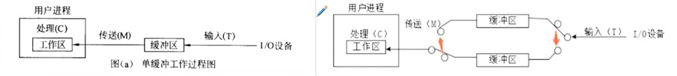
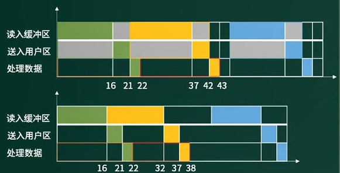

5

5、假设磁盘块与缓冲区大小相同，每个盘块读入缓冲区的时间为16us,由缓冲区送至用户区的时间是
5us,在用户区内系统对每块数据的处理时间为1us。若用户需要将大小为10个磁盘块的Doc1文件逐块
从磁盘读入缓冲区，并送至用户区进行处理，那么采用单缓冲区需要花费的时间为( ) us; 采用双缓
冲区需要花费的时间为( ) USo
A: 160；B:161 ；C:166；D:211
A:160；B:161 ；C:166；D:211

题解：这道题中处理数据有三个处理步骤:
1、从磁盘读入到缓冲区(10us) ; 
2、从缓冲区读入到(内存)用户区(6us);
3、处理(内存)用户区数据(2us)。

单缓冲区:

1. 步骤1和2都需要访问临界资源--缓冲区，所以需要合并成一个操作阶段。
2. 使用缓冲区时不能并行，必须分开执行，时间为16+5=21us，其次处理数据1uS。
3. 构造成流水线后，整个过程划分为2个阶段，分别是21us ,1us,根据流水线执行公式，流水线执行时间为
   21us+1us+(10-1)*21us= 211us*

双缓冲区:

1. 可以实现读入到缓冲区2和从缓冲区1读入到用户区的并发。
2. 读入缓冲区，和从缓冲区读入用户区，可以对不同的缓冲区进行，也就是说，可以并行处理。
3. 对于这里构造成流水线后，整个过程划分为3个阶段，1、从磁盘读入到缓冲区(16us) ; 2、从缓冲区读入到用户区(5us); 3、处理(内存)用户区数据(1us)。根据流水线执行公式，流水线执行时间为16us+5us+1us+(10-1)*16us=166uS.

6、在嵌入式操作系统中，板级支持包BSP作为对硬件的抽象，实现了( )。

A:硬件无关性，操作系统无关性
B:硬件有关性，操作系统有关性
C:硬件无关性，操作系统有关性
D:硬件有关性，操作系统无关性

7、某计算机系统采用4级流水线结构执行命令，设每条指令的执行由取指令(2△t) 、分析指令(1△t)取操作数(3△t) 、运算并保存结果(2△t)组成(注:括号中是指令执行周期)。并分别用4个子部件完成，该流水线的最大吞吐率为( ) ;若连续向流水线输入5条指令，则该流水线的加速比为()。

8、以下关于总线的说法中，正确的是( )。
A:串行总线适合**近距离高速数据传输**，但线间串扰会导致速率受限
B:并行总线适合**长距离数据传输**，易提高通信时钟频率来实现高速数据传输
C:单总线结构在一一个总线上适应不同种类的设备，设计复杂导致性能降低
D:半双工总线只能在一个方向上传输信息（**同一时刻只有一个设备发出数据，多个设备同时接收数据**）

10、CPU的频率有主频、倍频和外频。某处理器外频是200MHz,倍频是13,该款处理器的主频是( )。
A:2.6GHz；B:1300MHz；C:15.38Mhz；D:200MHz

11、把应用程序中应用最频繁的那部分核心程序作为**评价计算机性能的标准程序**，称为( )程序。()不是对Web服务器进行性能评估的主要指标。
A:仿真测试；B:核心测试；C:基准测试；D:标准测试
A:丢包率；B:最大并发连接数；C:响应延迟；D:吞吐量

14、假设某计算机系统中资源R的可用数为6,系统中有3个进程竞争R,且每个进程都需要个R,该系统可能会发生死锁的最小i值是( )。若信号量S的当前值为-2,则R的可用数和等待R的进程数分别为()。
A:1；B:2；C:3；D:4
A:0、0；B:0、1；C:1、0；D:0、2

17、计算机系统中常用的输入/输出控制方式有无条件传送、中断、程序查询和 DMA方式等。当采用()方式时，不需要CPU执行程序指令来传送数据。
A:中断；B:程序查询；C:无条件传送；D:DMA

CPU与外设之间的数据传送方式：

- 直接程序控制：在完成数据的输入输出中，整个数据输出过程是在CPU执行程序的控制下完成的

  无条件传送方式：无条件地与CPU交换数据。

  程序查询方式：先通过CPU查询外设状态，准备好之后再与CPU交换数据

- 中断控制：利用中断机制，当I/O系统外设交换数据时，CPU无须等待（也需要执行中断的指令）

- 直接存取方式：在存储器与I/O设备间直接传送数据，即在内存与I/O设备之间传送一个数据块的过程中，不需要CPU的任何干涉，是一种完全由DMA硬件完成I/O操作的方式。（CPU交出计算机系统总线的控制权，不参与内存与外设间的数据交换。）

  DMA（Direct Memory Access）直接存储器访问：允许不同速度的硬件装置来沟通，而不需要依赖于CPU的大量中断负载。

# 数据库系统

19、在数据库设计的需求分析阶段，业务流程一般采用（)表示。
A:数据流图；B:E-R图；C:程序结构图；D:功能模块图

20、在关系R(A1 A2, A3) 和S(A2, A3, A4)上进行$π_{A1A4}(σ_{A2<2017\ \wedge\ A4 ='95'},(R D< S))$，关系运算与该关系表达式等价的是( )。将该关系代数表达式转换为等价的SQL语句如下：SELECT FROM R,S WHERE R.A, < '2017’ ( )

A、$π_{1,4}(σ_{A2<2017\ \vee\ A4 ='95'},(R D< S))$；自然连接，条件是或，不是且。
B、$π_{1,6}(σ_{2<2017}\ (R)\times σ_{3 ='95'}(S))$；笛卡尔积，没有做自然连接的等值。
C、$π_{1,4}(σ_{2<2017}\ (R)\times σ_{6 ='95'}(S))$；投影错误
D、$π_{1,6}(σ_{2=4\ \wedge\ 3 =5}(σ_{2<2017}\ (R)\times σ_{3 ='95'}(S))$；先筛选再做等值连接

A: OR    S.A4< '95' OR    R.A2=S.A2 OR    R.A3=S.A3
B: AND S.A4< ‘95' OR    R.A2=S.A2 AND R.A3=S.A3
C: AND S.A4< '95’ AND R.A2=S.A2 AND R.A3=S.A3（都是错误，选最接近）
D: OR   S.A4< '95’ AND R.A2=S.A2 OR    R.A3=S.A3

21、给定关系模式R(A1, A2, A3, A), R.上的函数依赖集F={ A1A3->A2, A2->Az }, 则R ( )。若将R分解为p={(A1, A2), (A1, A3)}, 那么该分解( )。
A:有一个候选关键字A1 A3
B:有一个候选关键字A1 A2 A3
C:有两个候选关键字A1 A3 A4和A1A2 A4
D:有三个候选关键字A1 A2、A1 A3 和A1 A4
A:是无损联接的
B:是保持函数依赖的
C:既是无损联接又保持函数依赖
D:既是有损联接又不保持函数依赖

22、给定关系模式R<U,F>,其中U为属性集，F是U上的一 组函数依赖，那么Armstrong公理系统的增
广律是指()。
A:若X- +Y, X- >Z,则X-→YZ为F所蕴涵
B:若X- +Y, WY >Z,则XW-→Z为F所蕴涵
C:若X- +Y, Y-→Z为F所蕴涵，则X- >Z为F所蕴涵
D:若X- +Y为F所蕴涵，且ZEU,则XZ-→YZ为F所蕴涵

23、某数据库中有员工关系E (员工号，姓名，部门，职称，月薪) ;产品关系P (产品号，产品名称，型号，尺寸，颜色) ;仓库关系W (仓库号，仓库名称，地址，负责人) ;库存关系| (仓库号，产品号，产品数量)。

a.若数据库设计中要求:
仓库关系W中的“负责人”引用员工关系的员工号
②库存关系中的“仓库号，产品号”惟一标识中的每一个记录
③员工关系E中的职称为“工程师” 的月薪不能低于3500元
则①②③依次要满足的完整性约束是( )。

b.若需得到每种产品的名称和该产品的总库存量，则对应的查询语句为:
SELELCT 产品名称，SUM(产 品数量) FROM P，I  WHERE P.产品号=1.产品号( ) ;
A:实体完整性、参照完整性、用户定义完整性
B:参照完整性、实体完整性、用户定义完整性
C:用户定义完整性、实体完整性、参照完整性
D:实体完整性、用户定义完整性、参照完整性
A: ORDER BY产品名称 ；B: ORDER BY产品数量；C: GROUP BY产品名称；D: GROUP BY产品数量

25、在分布式数据库中，() 是指各场地数据的逻辑结构对用户不可见。
A:分片透明性；B:场地透明性；C:场地自治；D:局部数据模型透明性

场地自治：是指各场地上的数据库具有独立处理的能力，可以执行该场地上的局部应用; 

# 计算机网络

27、TCP和UDP协议均提供了()能力。
A:连接管理；B:差错校验和重传；C:流量控制；D:端口寻址

28、网络系统设计过程中，逻辑网络设计阶段的任务是：
A:确定设备的具体物理分布和运行环境
B:设计网络安全方案
C:进行软硬件和安装费用估算
D:设计网络布线方案

29、在层次化园区网络设计中，( )是汇聚层的功能。
A:高速数据传输；B:出口路由；C:广播域的定义；D:MAC地址过滤

30、假如有3块80T的硬盘，采用RAID5的容量是( )。
A:40T；B:80T；C:160T；D:240T

31、建筑物综合布线系统中的园区子系统是指( )
A:由终端到信息插座之间的连线系统
B:楼层接线间到工作区的线缆系统
C:各楼层设备之间的互连系统
D:连接各个建筑物的通信系统

32、IPV6的地址空间是IPV4的 ( )倍
A:4；B:96；C:128；D:2^96 

# 知识产权和标准化

38、() 为推荐性地方标准的代号。
A:SJ/T；B:Q/T11 ；C:GB/T；D:DB11/T

# 数学和经济管理

40、设三个煤场A1 A2, A3分别能供应煤7、12、11万吨，三个工厂B1，B2, B3,分别需要煤10、10、10万吨，从各煤场到各工厂运煤的单价(百元/吨)见下表方框内的数字。只要选择最优的运输方案，总的运输成本就能降到( )百万元。

|                | 工厂B1 | 工厂B2 | 工厂B3 | 供应量（万吨） |
| -------------- | ------ | ------ | ------ | -------------- |
| 煤场A1         | 1      | 2      | 6      | 7              |
| 煤场A2         | 0      | 4      | 2      | 12             |
| 煤场A3         | 3      | 1      | 5      | 11             |
| 需求量（万吨） | 10     | 10     | 10     |                |

题解：**贪心算法**（为了总体成本最低，每一个工厂的需求都尽量成本最低，再根据条件进行调整）。

1. B1和B3都需要从A2运输，成本最低，此时A2产量不够。需要调整。

   B1调整为A1运输成本增加1, B1调整为A3运输成本增加3; 

   B3调整为A1运输成本增加4、B3调整为A3运输成本增加3.

2. 选择成本增加少的方式，选择B1调整为A1运输成本增加1, B3从A2获取10万吨，A2剩余产量2万吨仍然分配给B1,

3. 针对B1 ：A1能够供货7万吨，A2能够供货2万吨，剩余1万吨可以从A3获取；
   针对B2: A3能够供货10万吨，针对B3: A2能够供货10万吨
   总成本=40

41、在如下线性约束条件下: 2x+3y<=30; x+2y>=10; x>=y; x>=5; y>=0,目标函数2x+3y的极小值为(17.5)。

42、有一名患者胸部长了一个肿瘤，医院X光检查结果呈阳性。据统计，胸部肿瘤为良性的概率为99%。对良性肿瘤，X光检查的正确率(星 阴性的概率)为90%;对恶性肿瘤，X光检查的正确率(呈阳性的概率)为80%。因此，可推算出该患者患恶性肿瘤的概率是( )。

题解：X光呈阳性的来源（1、假阳性: 0.99\*0.01，2、真阳性: 0.01*0.8；合计0.107）
恶性肿瘤就是真阳性，X光检测出阳性的概率是0.107，所以真阳性概率为：0.008/0.107=7.5%