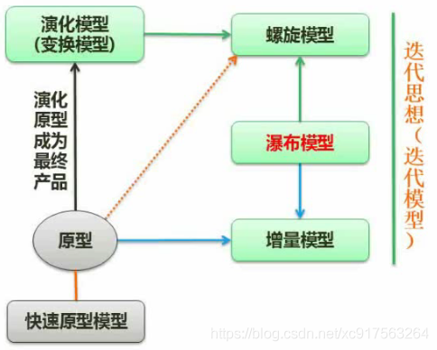
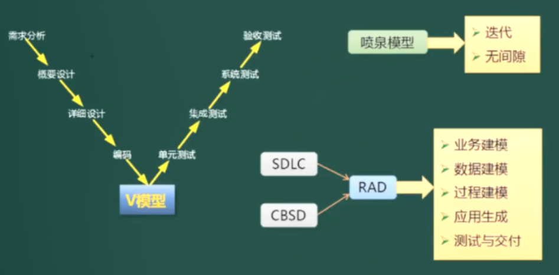
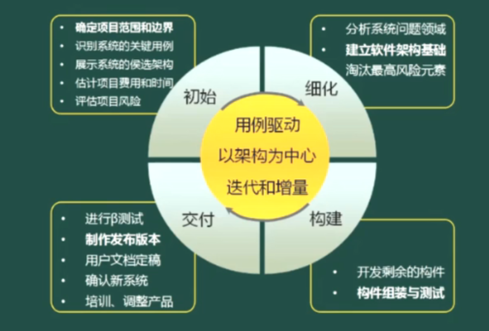
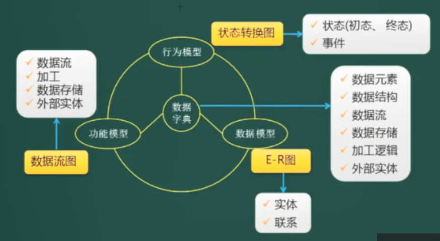
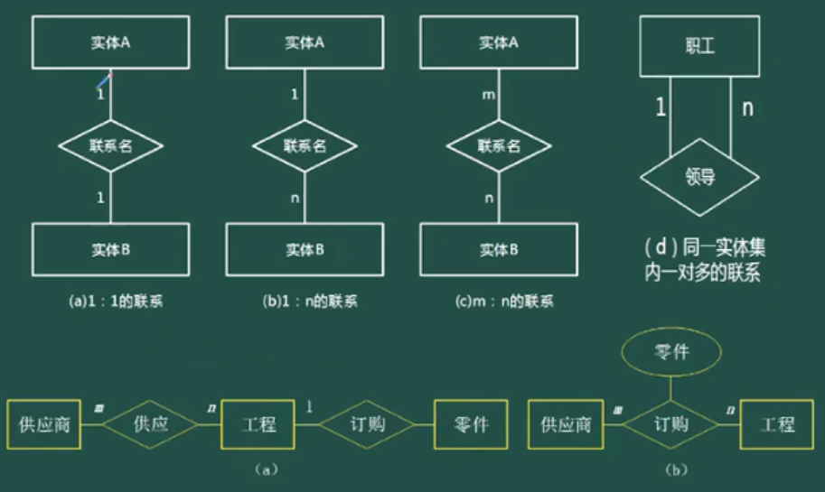
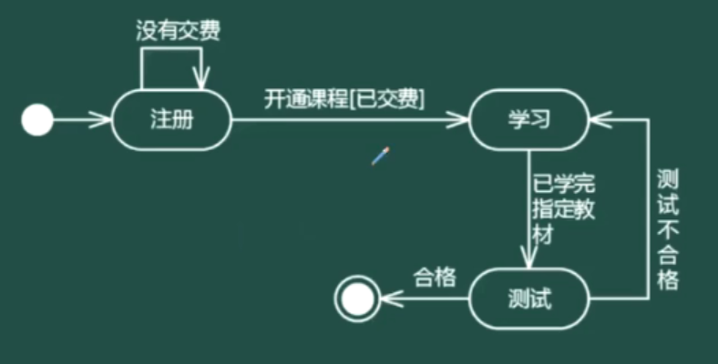

# 软件开发方法和模型

## 开发方法

- 结构化法（面向过程）
  - 用户至上
  - 严格区分工作阶段，每阶段有任务和成果
  - 强调胸痛开发过程的整体性和全局性
  - 系统开发过程工程化，文档资料标准化
  - 自顶向下，逐步分解（求精）
- 原型法（用于需求分析阶段）
  - 适用于需求不明确的开发
  - 包括抛弃型原型和进化型原型
- 面向对象方法
  - 更好的复用性
  - 关键在于建立一个全面，合理，统一的模型
  - 分析、设计、实现三个阶段，界限不明确，面向对象的分析与设计(Object-Oriented Analysis and Design，OOAD)
- 面向服务方法
  - SO（Service-Oriented）方法有三个主要的抽象级别：操作，服务，业务流程。
  - SOAD（Service-Oriented Analysis and Design）分为三个层次：基础设计层（底层业务构件）、应用结构层（服务之间的接口和服务级协定）和业务组织层（业务流程建模和服务流程编排）
  - 服务建模的三个阶段：服务发现，服务规约，服务实现。

对比：

| 名称      | 概述                                                         | 优点                                                         | 缺点                                                         |
| --------- | ------------------------------------------------------------ | ------------------------------------------------------------ | ------------------------------------------------------------ |
| 结构化    | 以算法为中心，又称为结构化分析                               | 体现了逐层分解、逐步求精的原则，有严格的规则                 | 难于检验分析结果的正确与否；对需求变更的适应能力很差；系统设计人员对分析结果的理解存在障碍 |
| 面向 对象 | 以对象（对象=数据＋算法）为中心，实现了对数据和算法的封装和继承 | 加强了对应用领域的理解，改进了沟通和交流；适应需求变化的能力较强；支持分析和设计结果的复用 | 纯技术导向，存在与业务的鸿沟；复杂度高，抽象程度低，难以实现大规模和高层次的重用 |
| 面向 构件 | 以组件或构件封装可重用的功能单元                             | 重用度进一步提高，提高了软件企业的开发效率和质量             | 组件或构件封装方法和接口标准不统一，很难实现与外部应用系统之间的互操作 |
| 面向 服务 | 以服务封装业务流程和应用系统                                 | 业务驱动技术，以开放标准实现应用系统之间服务的相互访问，乃至复合应用的组装，实现了更高级别重用 | 服务多时，需要额外的服务管理和治理，让bug查找和系统调试变得复杂。 |

## 开发模型

瀑布模型，原型模型，增量模型，螺旋模型，V模型都是结构化方法的

### **瀑布模型**

适用于需求明确的项目

- 需求分析使用原型法
- 瀑布模型适合应用的项目类型：**需求明确** 或者 **二次开发**
- 瀑布模型是结构化方法中的模型，一般应用于结构化的开发

### **螺旋模型**

螺旋模型（Spiral Model）：包含原型模式和瀑布模型，演化模型，它由多个模型组成

特点：螺旋模型具有风险分析这个特征，这是其他模型所不具备的

假设有一个需求不明确的项目，问我们使用哪一种开发模型最合适？

选项中既有原型模式也有螺旋模型，这里我们必须选择原型模式，因为题目中判定是依据最接近“需求不明确”这个前提的。

### **原型模型**

- 原型模型（Prototype Model）：适合应用的项目类型：**需求不明确**
- 原型模型强调构造一个简易的系统
- 原型，增量，螺旋，增量模型之间的关系

### 其它模型

- 增量模型
  - 增量模型（Incremental Model）由**原型模型**的思想 + **瀑布模型**的思想构成，每一个增量都发布一个可操作的版本
  - 思路：将用户的核心需求做出来，假设这个周期只有完整项目的20%的时间，现在花了2个月的时间完成核心模块的功能，将这个模块拿去给用户使用，使用过程中发现问题我们便修正问题，然后再过2个月再开发出两个模块，再去给用户使用，这样软件越变越大，直到项目完成。
  - 优点：风险低，用户会多次接触到项目的核心模块到，能尽早的发现问题并修正

- V模型（测试贯穿于始终），喷泉模型，快速(应用)开发（RAD）模型

  

  - RAD = Rapid Application Development，

    **简介：**RAD模型是由瀑布模型（SDLC）和构建组装模型（CBSD）组成

    **应用：**使用VB，Delphi，C#等可以通过拖动控件来快速实现界面地构建

    **特点：快速构建应用系统**

  - 喷泉模型（Water Fountain Model）：**特点：**它是**面向对象**的，具有**迭代**和**无间隙**的特点；

  - **V模型强调测试要伴随着整个软件开发的过程；**

    **需求分析**阶段进行验收测试&系统测试；

    **概要设计**阶段进行集成测试；

    **详细设计**阶段进行单元测试；

- 构件组装模型，基于构件的开发方法

  

  CDSD = Component-base Development Model，CDSD方法使得软件开发不再一切从头开发，开发的过程就是构件组装的过程，维护的过程就是构件升级、替换和扩充的过程。所以开发速度快。

- **基于架构的开发方法**

- 演化模型

- 模型驱动的开发方法

### 统一过程/开发方法

### 敏捷方法

- 特点：自适应开发，水晶方法，特性驱动开发，**极限编程**
- 基本原则：短平快会议，小型版本发布，较少的文档，合作为重，客户直接参与，自动化测试，适应性计划调整，结对编程，测试驱动开发，持续集成，重构
- **4大价值观**：
  - 沟通：对内，对外沟通
  - 简单：强调简单快速实现，以后进行重构，多轮迭代。不生成过多的文档，也不进行过度设计，留下扩展或冗余接口。
  - 反馈：及时和用户沟通相关问题。
  - 勇气：面对需求变更的勇气。
- 5大原则：快速反馈，简单性假设，逐步修改，提倡更改，优质工作。
- 12大最佳实践：计划游戏，结对编程，小型发布，简单设计，持续集成，现场客户，测试先行，集体代码所有制，每周工作40小时，重构，编码标准。

**敏捷开发：**

1. 敏捷开发(Agile Development)是一种以人为核心、迭代、循序渐进的开发方法。
2. 它不是一门技术，它是一种开发方法，也就是一种软件开发的流程，它会指导我们用规定的环节去一步一步完成项目的开发；而这种开发方式的主要驱动核心是人；它采用的是迭代式开发；
3. 强调以人为核心：瀑布开发模型，它是以文档为驱动的，而敏捷开发它只写有必要的文档，或尽量少写文档，敏捷开发注重的是人与人之间，面对面的交流。

**敏捷开发方法**

1. XP（Extreme programming)，在一些对费用控制严格的公司使用，已被证明时非常有效的。

2. Cockburn的水晶系列法，用最少纪律约束而仍能成功，在产出效率和易于运作上达到一种平衡，不如XP的产出，但更多的人能接受并遵循

3. 开放式源码：程序开发人员在地域上分布很广（一般敏捷开发都强调项目组成员在一起），特点是查错排障的高度并行性，发现者更改bug，由维护者并入源码库。

4. **SCRUM**：强调明确定义的可重复的方法过程，只限于明确定义的可重复的环境中，为明确定义的可重复人员使用，去解决明确定义的可重复的问题。

   1. 特点就是响应变化，它能够尽快地响应变化
   2. 三大角色：**产品负责人（Product Owner）**，**流程管理员（Scrum Master）**，**开发团队（Scrum Team）**
   3. 名词：
      1. backlog: 可以预知的所有任务， 包括功能性的和非功能性的所有任务。
      2. sprint:一次跌代开发的时间周期，一般最多以30天为一个周期.在这段时间内，开发团队需要完成一个制定的backlog,并且最终成果是一个增量的，可以交付的产品。
      3. sprint backlog:一个sprint周期内所需要完成的任务。
      4. scrumMaster: 负责监督整个Scrum进程，修订计划的一个团队成员。
      5. time-box: 一个用于开会时间段。比如每个daily scrum meeting的time-box为15分钟。
      6. sprint planning meeting: 在启动每个sprint前召开。一般为一天时间（8小时）。该会议需要制定的任务是：产品Owner和团队成员将backlog分解成小的功能模块, 决定在即将进行的sprint里需要完成多少小功能模块，确定好这个Product Backlog的任务优先级。另外，该会议还需详细地讨论如何能够按照需求完成这些小功能模块。制定的这些模块的工作量以小时计算。
      7. Daily Scrum meeting：开发团队成员召开，一般为15分钟。每个开发成员需要向ScrumMaster汇报三个项目：今天完成了什么？　是否遇到了障碍？　即将要做什么？通过该会议，团队成员可以相互了解项目进度
   4. 流程：
      1. 由Product Owner 确定一个Product Backlog（按优先顺序排列的一个产品需求列表），
      2. Scrum Team根据Product Backlog列表，做工作量的预估和安排
      3. 通过 Sprint Planning Meeting（Sprint计划会议） 来从中挑选出一个Story作为本次迭代完成的目标，这个目标的时间周期是1~4个星期，然后把这个Story进行细化，形成一个Sprint Backlog
      4. 在Scrum Team完成计划会议上选出的Sprint Backlog过程中，需要进行 Daily Scrum Meeting（每日站立会议），更新各自的 Sprint burn down（Sprint燃尽图）
      5. 一次Sprint完成后，要进行 Srpint Review Meeting（演示会议/评审会议），产品负责人和客户都要参加，每一个Scrum Team的成员都要向他们演示自己完成的软件产品。

   

5. FDD(Feature Driven Development)，功用驱动开发方法，致力于短时的迭代阶段和可见可用的功能；编程人员分两类：首席程序员和类程序员。

6. ASD（Adaptive Software Development)方法，核心是三个非线性的、重叠的开发阶段：**猜测、合作和学习**

## 逆向工程

解释：也就是山寨，破解，仿制；

过程：现有系统从代码，设计，分析的层级，找出原始需求，再融入新需求，开发生成新系统。

逆向工程包括

1. 实现级：包括程序的**抽象语法树，符号表、过程**的设计表示
2. 结构级：包括反映**程序分量之间相互依赖关系**的信息，如调用图、结构图、程序和数据结构
3. 功能级：包括反映**程序段功能及程序段之间关系**的信息，如数据和控制流模型
4. 领域级：包括反映程序分量或程序诸实体与**应用领域概念之间对应关系**的信息，如实体关系模型（UML图）

## 净室软件工程

- 净室即无尘室、洁净室，是一个受控污染级别的环境
- 使用盒结构规约（或形式化方法）进行分析和设计建模，并且强调将正确性验证，而不是测试，作为发现和消除错误的主要机制。
- 使用统计的测试来获取认证被交付的软件的可靠性所必需的出错率信息。

# 需求工程

## 概述

- 软件需求是指用户对系统在功能、行为、性能、设计约束灯方面的期望
- 软件需求是指用户解决问题或达到目标所需的条件或能力，是系统或系统部件需要满足合同、标准、规范或其它正式规定文档所需具有的条件或能力，以及反映这些条件或能力的文档说明。

**需求开发：**包括需求获取，需求分析，需求定义（产生需求规格说明书**SRS**），需求验证（得到**需求基线**，定好的规划）。

**需求管理：**包括变更控制，版本控制，需求跟踪，需求状态跟踪。用于支持需求开发，主要针对需求基线。

## 需求获取

1. 从技术的维度：
   1. 业务需求：最高层次的需求
   2. 系统需求：就是计算机化，产生功能，性能需求。
   3. 设计约束：客户要求，但不是功能或性能需求，如界面美观，数据库使用mysql
2. 从项目管理的维度：分为基本（明确提出）、期望（隐含式的）、兴奋需求

## 需求分析SA

### 数据流图DFD

（分层数据流图）：每次分层，都进一步精细化

| 元素              | 说明                                                         | 图元                                                         |
| ----------------- | ------------------------------------------------------------ | ------------------------------------------------------------ |
| 数据流            | 由一组固定成分的数据组成 表示数据的流向                      |           |
| 加工              | 加工描述了输入数据流到输出数据流之间的变换，也就是输入数据流做了什么处理后变成了输出数据流 |  |
| 数据存储 （文件） | 用来表示暂时存储的数据，每个文件都有名字 ，流向文件的数据流表示写文件，流出的表示读文件 |  |
| 外部实体          | 指存在于软件系统外的人员或组织                               |  |

- **在最上面的顶层图中，我们能够看到的信息是极为有限的，它只是把整个系统浓缩为一个节点。**
- **在0层图中，将系统细化，但是系统与外部实体键的数据流向是肯定没有变化的**

### 数据模型E-R图

### 状态转换图STD

### OOA

面向对象分析的相关概念：对象（ID，属性，方法），类（实体类，边界类，控制类），抽象，接口，继承与泛化，封装，多态，消息，组件，模式和复用（设计模式）。

1. 实体类：映射需求中每个实体，保存需要存储再永久存储体中的信息。
2. 控制类：用于控制用例工作的类，如用例“身份验证”对应的控制类，提供与身份验证相关的所有操作。
3. 边界类：用于封装在内、外流动的信息或数据流，如各类接口。

## UML

Unified Modeling Language为面向对象软件设计提供统一的、标准的、可视化的建模语言。适用于描述以用例为驱动，以体系结构为中心的软件设计的全过程。

模型图的构成元素：

1. **构造块：事物，关系，图**
   1. 结构事物：**静态部分**，包括：类，接口，协作，用例，活动类，构件和节点。
   2. 行为事物：代表时间和空间上的动作，包括：消息，动作次序，连接。
   3. 分组事物：用盒子封装，如包或构件
   4. 注释事物：UML模型的解释部分；描述、说明或标注模型的元素。
   5. 关系：泛化，包含，扩展，聚合，组合，关联，依赖
2. 规则
   1. 范围：给一个名字以特定含义的语境
   2. 可见性：怎么使用或看见名字
   3. 完整性：事物如何正确、一致的相互联系
   4. 执行：运行或模拟动态模型的含义是什么
3. 公共机制
   1. 规格说明：事物语义的细节描述
   2. 修饰：通过修饰表达更多的信息。
   3. 公共分类：类与对象，接口与实现
   4. 扩展机制：允许添加新的规则

### UML图分类

1. 静态图（结构图)
   1. 类图：一组类、接口、协作和它们之间的关系
   2. 对象图：一组对象及它们之间的关系
   3. 构件图：一个封装的类和它的接口
   4. **部署图**：软硬件之间的映射（软件的某个服务需要部署在哪个服务器上）
   5. 制品图：系统的物理结构
   6. 包图：由模型本身分解而成的组织单元，及它们之间的依赖关系
   7. 组合结构图：上面结构图的多种组合
2. 动态图（行为图）
   1. **用例图：系统与外部参与者的交互**
   2. **顺序图：强调按时间顺序**
   3. **通信图：协作图**
   4. 状态图：状态的转换变迁
   5. **活动图：类似程序流程图，有并行行为**
   6. 定时图：强调实际时间
   7. 交互概览图：

### UML4+1视图

4+1视图是一种复杂系统的架构设计方法，能够让设计人员将一个系统进行自顶向下的设计分解，并形成合理的抽象描述，组织中的所有成员，都要围绕着这个抽象进行设计、实现、验证，并在系统演进中不断完善修正它们

#### 用例视图

1. 角色：最终用户；
2. 场景：用于需求分析模型。
3. 用例视图是4+1视图的核心，确定了以下信息，其它4个视图都是需要围绕着这些信息进行设计
   - 系统边界：有了边界，才能够确定系统的设计范围；同时，通过边界能够识别出系统需要与用户或其它系统进行交互；
   - 系统用户：明确的用户定义是系统需求分析的先决条件；
   - 功能和场景：通过识别出系统与用户或其它系统的交互，可以分析出系统需要提供哪些功能，以及这些功能存在哪些应用场景；

#### 逻辑视图

1. 角色：系统分析、设计人员；

2. 应用：用于类与对象。

3. 逻辑视图是对系统职责的的逐级划分，并对各逻辑元素间的关系，也就是接口进行描述。

4. 一般，逻辑架构元素决定了开发组织。因此，逻辑元素的边界和接口也是后续多个开发组织之间进行接口控制的关系依据。

5. 下面TensorFlow的逻辑视图示例，描述了TensorFlow中各个功能组件，

   

#### 实现视图

1. 角色：开发人员；
2. 应用：物理代码文件和组件。
3. 主要包括两部分信息：
   - 对逻辑架构元素，描述其代码位置，可以是代码仓位置，或代码目录，或是开源软件的版本信息等
   - 系统的构建，即如何将代码编译成二进制交付件（比如.so/.bin）。这个构建信息需要包括构建依赖、构建工具链、构建环境信息
4. 需要满足以下要求：
   - 通过逻辑架构元素，能够找到它所有代码和所有的二进制交付件
   - 每一个代码源文件，都能够找到它所属的逻辑架构元素
   - 每一个二进制交付件，都能够找到它集成了哪些逻辑架构元素

#### 部署视图

也称为物理视图

1. 角色：系统和网络工程师；
2. 应用：软件和硬件的映射。
3. 部署信息包括：
   - 二进制交付件，与软件环境的部署关系
   - 软件环境与物理环境的部署关系

通过逻辑视图、开发视图，部署视图，我们已经可以知道系统中每一个逻辑架构元素、每一份代码，最终会运行在什么位置上。反向也可以通过运行环境上，找到所有其上运行的逻辑架构元素和代码。

#### 进程视图

也称为过程视图、运行视图或处理视图）

1. 角色：系统集成人员；

2. 应用：线程，进程，并发。关注组件间的交互关系，通常还需要考虑并发、抢占、关键资源（比如锁）访问等。

3. 运行视图就是对系统动态行为（信息）的描述，最常见的设计工具就是UML的序列图。

4. 最常见的是逻辑架构元素之间的交互关系，比如消息交互、服务调用或API调用。如下UML序列图所示。

   

### UML建模

### UML关系

# 软件系统建模

# 系统设计

# 测试与评审

# 系统运行和软件维护

扇入：被其他模块调用。多扇入：实现功能方法复用。

扇出：调用其它模块，要少扇出：越多耦合越高。

类模式：静态类实现。对象模式：需要实例化

访问者模式：数据和操作f分离