根据传统的软件生命周期方法字，可以把软件生命周期划分为**软件定义、软件开发、软件运行、软件维护**。

# 软件开发方法

软件开发生命周期：

1. 需求规格说明书包括系统名称、功能描述、接口、基本数据结构、性能、设计需求、开发标准、验收原则等。
2. 概要设计定义功能模块及功能模块之间的关系，详细设计研究模块内部，包括算法与数据结构、数据分布、数据组织、模块间信息接口和用户界面等设计。
3. 测试分为单元测试、集成测试、确认测试和系统测试。

软件开发方法是指软件开发过程所遵循的办法和步骤，从不同的角度可以对软件开发方法进行不同的分类。

- 从开发风范上开，

  - **自顶向下的开发**：先对最高层次中的问题进行定义、设计、编程和测试，而将其中未解决的问题作为一个子任务放到下一层次中去解决。

  - **自底向上的开发**：根据系统功能要求，从具体的器件、逻辑部件或者相似系统开始，通过对其进行相互连接、修改和扩大，构成所要求的系统

    在实际软件开发中，都是两种方法结合，只不过是应用于开发的不同阶段，以何者为主而已。

- 从性质上看，

  - **形式化方法**：是一种具有坚实数学基础的方法，从而允许对系统和开发过程做严格处理和论证，适用于那些系统安全级别要求极高的软件的开发。
  - **非形式化方法**：则不把严格性作为其主要着眼点，通常以各种适应范围来看，可分为整体性方法与局部性方法。适用于软件开发全过程的方法称为整体性方法；适用于开发过程某个具体阶段的软件方法称为局部性方法。

## 开发方法

- **结构化法（面向过程）**
  - 特征：用户至上、严格区分工作阶段，每阶段有任务和成果、强调系统开发过程的整体性和全局性、系统开发过程工程化，文档资料标准化、自顶向下，逐步分解（求精）
  - 优点：理论基础严密，注重开发过程的整体性和全局性。
  - 缺点：开发周期长；文档、设计说明繁琐，工作效率低；要求在开发之初全面认识系统的信息需求
- 原型化方法
  - 优点：适用于用户需求开始时定义不清、管理决策方法结构化程度不高的系统开发。
  - 缺点：如果用户配合不好、盲目修改，就会拖延开发进程
  
- **面向对象方法**
  - 更好的复用性
  - 关键点在于能否建立一个全面、合理、统一的模型，既能反映问题域，又能被计算机系统求解域所接受
  - 分析、设计、实现三个阶段，界限不明确，面向对象的分析与设计(Object-Oriented Analysis and Design，OOAD)
- **面向构件**
  - 关注于如何支持建立面向构件的解决方案
  - **基本的支持**： 多态性（可替代性）、模块封装性（高层次信息的隐藏）、后期的绑定和装载（部署独立性）、安全性（类型和模块安全性）
- **面向服务方法**
  - SO（Service-Oriented）方法有三个主要的抽象级别：操作，服务，业务流程。
  - SOAD（Service-Oriented Analysis and Design）分为三个层次：基础设计层（底层业务构件）、应用结构层（服务之间的接口和服务级协定）和业务组织层（业务流程建模和服务流程编排）
  - 服务建模的三个阶段：服务发现，服务规约，服务实现。
  - 面向对象的应用构建在类和对象之上，随后发展起来的建模技术将相关对象按照业务功能进行分组，就形成了构建的概念。对于跨构件的功能调用，则采用接口的形式暴露出来，进一步将接口的定义与实现进行解耦，则催生了服务和面向服务的开发方法。
  - 从应用的角度来看，组织内部、组织之间各种应用系统的互相通信和互操作性直接影响着组织对信息的掌握程度和处理速度。如何使信息系统快速响应需求与环境变化，提高系统可复用性、信息资源共享和系统之间的互操作性，成为影响信息化建设效率的关键问题，而面向服务的思维方式恰好满足了这类需求。它代表着不拘尼于具体技术实现方式的一种新的系统开发思想，已成为大趋势

对比：

| 名称      | 概述                                                         | 优点                                                         | 缺点                                                         |
| --------- | ------------------------------------------------------------ | ------------------------------------------------------------ | ------------------------------------------------------------ |
| 结构化    | 以算法为中心，又称为结构化分析                               | 体现了逐层分解、逐步求精的原则，有严格的规则                 | 难于检验分析结果的正确与否；对需求变更的适应能力很差；系统设计人员对分析结果的理解存在障碍 |
| 面向 对象 | 以对象（对象=数据＋算法）为中心，实现了对数据和算法的封装和继承 | 加强了对应用领域的理解，改进了沟通和交流；适应需求变化的能力较强；支持分析和设计结果的复用 | 纯技术导向，存在与业务的鸿沟；复杂度高，抽象程度低，难以实现大规模和高层次的重用 |
| 面向 构件 | 以组件或构件封装可重用的功能单元                             | 重用度进一步提高，提高了软件企业的开发效率和质量             | 组件或构件封装方法和接口标准不统一，很难实现与外部应用系统之间的互操作 |
| 面向服务  | 以服务封装业务流程和应用系统                                 | 业务驱动技术，以开放标准实现应用系统之间服务的相互访问，乃至复合应用的组装，实现了更高级别重用 | 服务多时，需要额外的服务管理和治理，让bug查找和系统调试变得复杂。 |

## 开发模型

瀑布模型，原型模型，增量模型，螺旋模型，V模型都是结构化方法的

### **瀑布模型**

瀑布模型严格按照软件生命周期的各阶段顺序执行，有利于人员的组织管理，但明显存在使用缺陷：用户并不能清晰定义及描述其需求、初始版本的呈现周期较长。

- 需求分析使用原型法
- 瀑布模型适合应用的项目类型：**需求明确** 或者 **二次开发**
- 瀑布模型是结构化方法中的模型，一般应用于结构化的开发

特点：因果关系紧密相连，==前一个阶段工作的结果是后一个阶段工作的输入。==

1. 每一个阶段都是建筑在前一个阶段正确结果之上，前一个阶段的错漏会隐蔽地带到后一个阶段。这种错误有时甚至可能是灾难性的。因此每一个阶段工作完成后，都要进行审查和确认，这是非常重要的。
2. 有利于人员的组织管理，有利于软件开发方法和工具的研究。

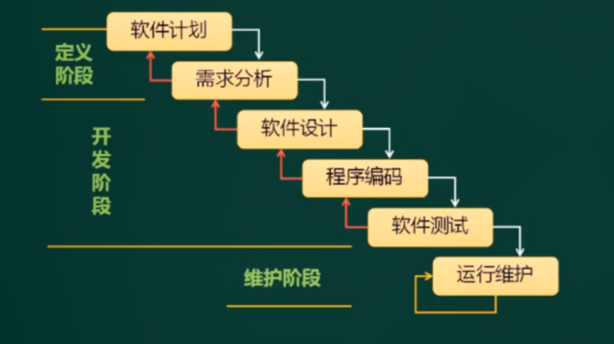

### **原型模型**

原型模型（Prototype Model）：适合应用的项目类型：**需求不明确**

原理：提前通过可视化的方式呈现需求，因此原型获取有三种途径：

1. 利用模拟软件系统的人机界面和人机交互方式。
2. 真正开发一个原型。
3. 寻求一个或几个类似的软件。

原型模型强调构造一个简易的系统，包括

- 抛弃式原型开发
- 演化式原型开发：在开发过程中逐步改进和细化原型直至产生出目标系统。

### **螺旋模型**

螺旋模型（Spiral Model）：是在**快速原型的基础上**扩展而成的。

支持大型软件开发，适用于面向规格说明、面向过程和面向对象的软件开发方法，通常将软件开发切割为多个周期，每个周期由4个阶段组成：

- ①目标设定。为该项目进行需求分析，定义和确定 这一个阶段的专门目标，指定对过程和产品的约束，并且制定详细的管理计划。
- ②**风险分析**。 对可选方案进行风险识别和详细分析，制定解决办法，采取有效的措施避免这些风险。
- ③开发和有效性验证。风险评估后，可以为系统选择开发模型，并且进行原型开发，即开发软件 产品。
- ④评审。对项目进行评审，以确定是否需要进入螺旋线的下一次回路，如果决定继续， 就要制定下一阶段计划。

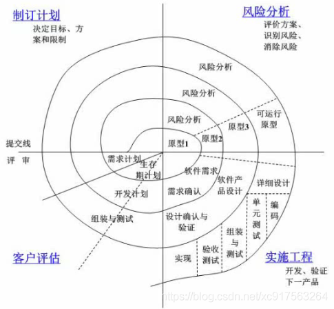

示例：假设有一个需求不明确的项目，问我们使用哪一种开发模型最合适？

- 选项中既有原型模式也有螺旋模型，这里我们必须选择原型模式，因为题目中判定是依据最接近“需求不明确”这个前提的。
- 螺旋模型具有**风险分析**这个特征，这是其他模型所不具备的

- 原型，增量，螺旋，增量模型之间的关系

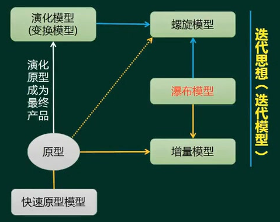

### 其它模型

- 增量模型
  - 增量模型（Incremental Model）由**原型模型**的思想 + **瀑布模型**的思想构成，每一个增量都发布一个可操作的版本
  - 思路：将用户的核心需求做出来，假设这个周期只有完整项目的20%的时间，现在花了2个月的时间完成核心模块的功能，将这个模块拿去给用户使用，使用过程中发现问题我们便修正问题，然后再过2个月再开发出两个模块，再去给用户使用，这样软件越变越大，直到项目完成。
  - 优点：风险低，用户会多次接触到项目的核心模块到，能尽早的发现问题并修正

- V模型（测试贯穿于始终），喷泉模型，快速(应用)开发（RAD）模型

  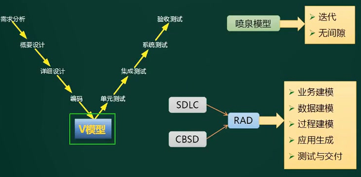

  - RAD = Rapid Application Development，快速应用开发方法

    **简介：**RAD模型是由瀑布模型（SDLC）和基于构件的软件开发 CBSD(component-based software development）组成

    **应用：**使用VB，Delphi，C#等可以通过拖动控件来快速实现界面地构建

    **特点：快速构建应用系统，适用于模块化程度较高的系统**

  - 喷泉模型（Water Fountain Model）：**特点：**它是**面向对象**的，具有**迭代**和**无间隙**的特点；

  - **V模型强调测试要伴随着整个软件开发的过程；**

    **需求分析**阶段进行验收测试&系统测试；

    **概要设计**阶段进行集成测试；

    **详细设计**阶段进行单元测试；

- 构件组装模型，基于构件的开发方法

  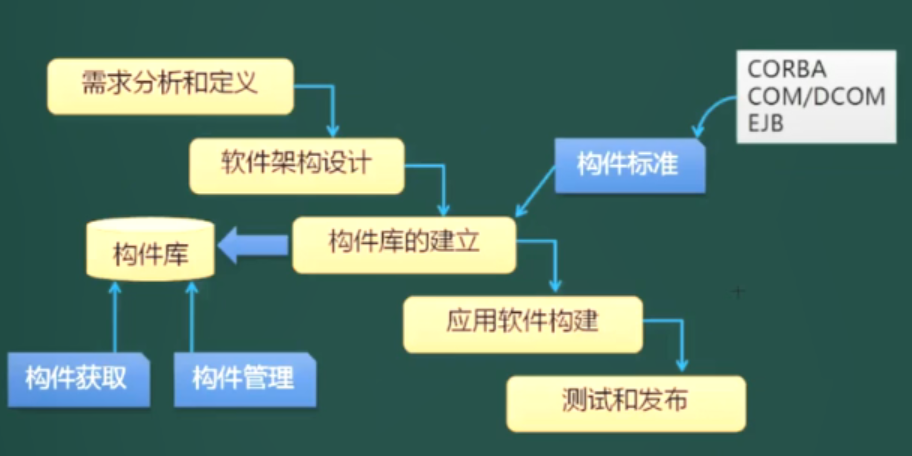

  CDSD = Component-base Development Model，CDSD方法使得软件开发不再一切从头开发，开发的过程就是构件组装的过程，维护的过程就是构件升级、替换和扩充的过程。所以开发速度快。

- **基于架构的开发方法**

- 演化模型

- 模型驱动的开发方法

## 敏捷方法

- 基本原则：短平快会议，小型版本发布，较少的文档，合作为重，客户直接参与，自动化测试，适应性计划调整，结对编程，测试驱动开发，持续集成，重构
- **4大价值观**：
  - 沟通：对内，对外沟通，设计者、开发者和客户之间。
  - 简单：满足当前需求，代码简单化。强调简单快速实现，以后进行重构，多轮迭代。不生成过多的文档，也不进行过度设计，留下扩展或冗余接口。
  - 反馈：及时和用户沟通相关问题。
  - 勇气：面对需求变更的勇气。
- 5大原则：快速反馈，简单性假设，逐步修改，提倡更改，优质工作。
- 12条过程实践原则：简单设计、测试驱动、代码重构、结对编程、持续集成、现场客户、发行版本小型化、系统隐喻、代码集体所有制、规划策略、规范代码、40小时工作机制。

**特点：**

1. 强调以人为核心，''面向人的''而非''面向过程的''：瀑布开发模型，它是以文档为驱动的，而敏捷开发它只写有必要的文档，或尽量少写文档，敏捷开发注重的是人与人之间，面对面的交流。
2. 强调"适应性"而非"预设性"：自适应开发。
3. 敏捷开发(Agile Development)是一种**以人为核心、迭代、循序渐进、增量式的开发方法**。
4. 它不是一门技术，它是一种开发方法，也就是一种软件开发的流程，它会指导我们用规定的环节去一步一步完成项目的开发；这种开发方式的**主要驱动核心是人**；以**原型开发思想为基础**，采用的是**迭代增量式开发**；

**敏捷开发方法**

1. XP（Extreme programming)极限编程，在一些对费用控制严格的公司使用，已被证明时非常有效的。

2. Cockburn的水晶系列法，用最少纪律约束而仍能成功，在产出效率和易于运作上达到一种平衡，不如XP的产出，但更多的人能接受并遵循

3. 开放式源码：程序开发人员在地域上分布很广（一般敏捷开发都强调项目组成员在一起），特点是查错排障的高度并行性，发现者更改bug，由维护者并入源码库。

4. **SCRUM**：强调明确定义的可重复的方法过程，只限于明确定义的可重复的环境中，为明确定义的可重复人员使用，去解决明确定义的可重复的问题。

   1. 特点就是响应变化，它能够尽快地响应变化
   2. 三大角色：**产品负责人（Product Owner）**，**流程管理员（Scrum Master）**，**开发团队（Scrum Team）**
   3. 名词：
      1. backlog: 可以预知的所有任务， 包括功能性的和非功能性的所有任务。
      2. sprint:一次跌代开发的时间周期，一般最多以30天为一个周期.在这段时间内，开发团队需要完成一个制定的backlog,并且最终成果是一个增量的，可以交付的产品。
      3. sprint backlog:一个sprint周期内所需要完成的任务。
      4. scrumMaster: 负责监督整个Scrum进程，修订计划的一个团队成员。
      5. time-box: 一个用于开会时间段。比如每个daily scrum meeting的time-box为15分钟。
      6. sprint planning meeting: 在启动每个sprint前召开。一般为一天时间（8小时）。该会议需要制定的任务是：产品Owner和团队成员将backlog分解成小的功能模块, 决定在即将进行的sprint里需要完成多少小功能模块，确定好这个Product Backlog的任务优先级。另外，该会议还需详细地讨论如何能够按照需求完成这些小功能模块。制定的这些模块的工作量以小时计算。
      7. Daily Scrum meeting：开发团队成员召开，一般为15分钟。每个开发成员需要向ScrumMaster汇报三个项目：今天完成了什么？　是否遇到了障碍？　即将要做什么？通过该会议，团队成员可以相互了解项目进度
   4. 流程：
      1. 由Product Owner 确定一个Product Backlog（按优先顺序排列的一个产品需求列表），
      2. Scrum Team根据Product Backlog列表，做工作量的预估和安排
      3. 通过 Sprint Planning Meeting（Sprint计划会议） 来从中挑选出一个Story作为本次迭代完成的目标，这个目标的时间周期是1~4个星期，然后把这个Story进行细化，形成一个Sprint Backlog
      4. 在Scrum Team完成计划会议上选出的Sprint Backlog过程中，需要进行 Daily Scrum Meeting（每日站立会议），更新各自的 Sprint burn down（Sprint燃尽图）
      5. 一次Sprint完成后，要进行 Srpint Review Meeting（演示会议/评审会议），产品负责人和客户都要参加，每一个Scrum Team的成员都要向他们演示自己完成的软件产品。

   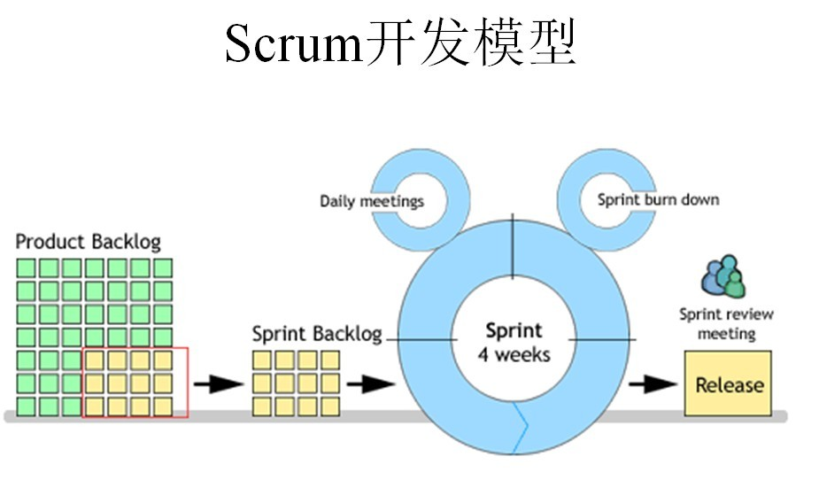

5. FDD(Feature Driven Development)，功用驱动开发方法，致力于短时的迭代阶段和可见可用的功能；编程人员分两类：首席程序员和类程序员。

6. ASD（Adaptive Software Development)方法，核心是三个非线性的、重叠的开发阶段：**猜测、合作和学习**

## RUP

**RUP（Rational Unified Process**），统一软件开发过程，统一软件过程是一个面向对象且基于网络的程序开发方法论。软件开发周期是一个二维的软件开发模型。

RUP的**9个核心工作流**：

1. 业务建模︰理解待开发系统所在的机构及其商业运作，确保所有参与人员对待开发系统所在的机构有共同的认识，评估待开发系统对所在机构的影响。
2. 需求︰定义系统功能及用户界面，使客户知道系统的功能，使开发人员理解系统的需求，为项目预算及计划提供基础。
3. 分析与设计：把需求分析的结果转化为分析与设计模型。
4. 实现︰把设计模型转换为实现结果，对开发的代码做单元测试，将不同实现人员开发的模块集成为可执行系统。
5. 测试︰检查各子系统的交互与集成，，验证所有需求是否均被正确实现，对发现的软件质量上的缺陷进行归档，对软件质量提出改进建议。
6. 部署︰打包、分发、安装软件，升级旧系统;培训用户及销售人员，并提供技术支持。
7. 配置与变更管理：跟踪并维护系统开发过程中产生的所有制品的完整性和一致性。
8. 项目管理︰为软件开发项目提供计划、人员分配、执行、监控等方面的指导，为风险管理提供框架。
9. 环境︰为软件开发机构提供软件开发环境，即提供过程管理和工具的支持。,

RUP的4个阶段：初始、细化、构造和移交。

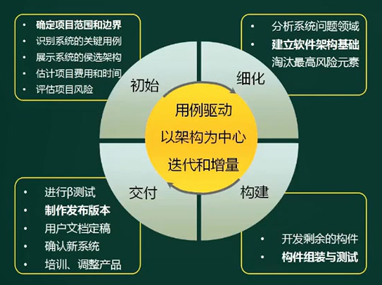

RUP的特点：

1. **用例驱动**。

2. 以体系结构为中心。

   ①体系结构的设计与代码设计无关，不依赖于程序语言。

   ②体系结构层次的设计问题包括系统的总体组织和全局控制、通信协议、同步、数据存取、给设计元素分配特定功能、设计元素的组织、物理分布、系统的伸缩性和性能。

3. 强调采用**迭代和增量**的方式来开发软件。好处是：在软件开发的早期可以对关键的，影响大的风险进行处理

4. “4+1”视图模型中，不同人员对于视图的关注重点不同

   逻辑视图：描述系统功能，最终用户关注
   实现视图：描述系统配置、装配，程序员关注
   进程视图：描述系统性能、吞吐，集成人员关注
   部署视图：描述系统安装、拓扑结构，系统工程师关注
   用例视图：描述人机互动的系统行为，分析人员和测试人员关注

5. RUP是一个通用的过程模板，包括开发指南、开发过程产物及过程中的角色说明，可用于各类项目，因体系庞大，需要针对具体实例进行适当裁剪。

6. RUP裁剪步骤。

   确定开发过程涉及的工作流。

   确定工作流的产出。

   确定4阶段间的演进。

   确定每个阶段的迭代计划。

   规划工作流内部结构（难点）。

## 总结

开发方法通常分为结构化方法和面向对象方法，对应系统开发的不同阶段：

1. 结构化方法有结构化分析（SA），结构化设计等；SA输出数据流图，ER图，状态转换图，数据字典
2. 面向对象方法有面向对象分析（OOA），面向对象设计等；OOA输出类图、用例图、活动图。

开发模型有瀑布模型，螺旋模型，构件组装模型、V模型、统一过程、敏捷开发，等等；它是项目的大致开发方式和步骤，是一种规划和套路（规定的软件开发流程），包括需求、设计、编码、测试等几个阶段都有处置方法。

区别：

1. 开发模型是一种规划和相对稳定的套路，对**系统开发阶段的不同环节**有不同的处理流程。
2. 开发方法是一种方法学，主要是针对**系统开发阶段中的设计和编码**进行**实现**。
3. 但实际应用中，二者往往重叠得很厉害，边界不是非常清晰。比如原型法，归类为开发方法，但也可以作为开发模型。

软件系统工具。

1. 软件开发工具的衡量因素：功能、易用性、稳健性、硬件要求和性能、服务和支持。
2. 软件开发工具包括需求分析工具、设计工具、编码与排错工具、测试工具等。

# 需求工程

概述：

- 软件需求是指用户对系统在功能、行为、性能、设计约束灯方面的期望
- 软件需求是指用户解决问题或达到目标所需的条件或能力，是系统或系统部件需要满足合同、标准、规范或其它正式规定文档所需具有的条件或能力，以及反映这些条件或能力的文档说明。

需求属性包括：创建时间、版本号、创建人、批准人、状态、原因和依据、涉及子系统、涉及产品版本号、验收／接受的标准、优先级、稳定性。

## 需求开发

包括需求获取，需求分析，需求定义（产生需求规格说明书**SRS**），需求验证（得到**需求基线**，定好的规划）。

### 需求获取

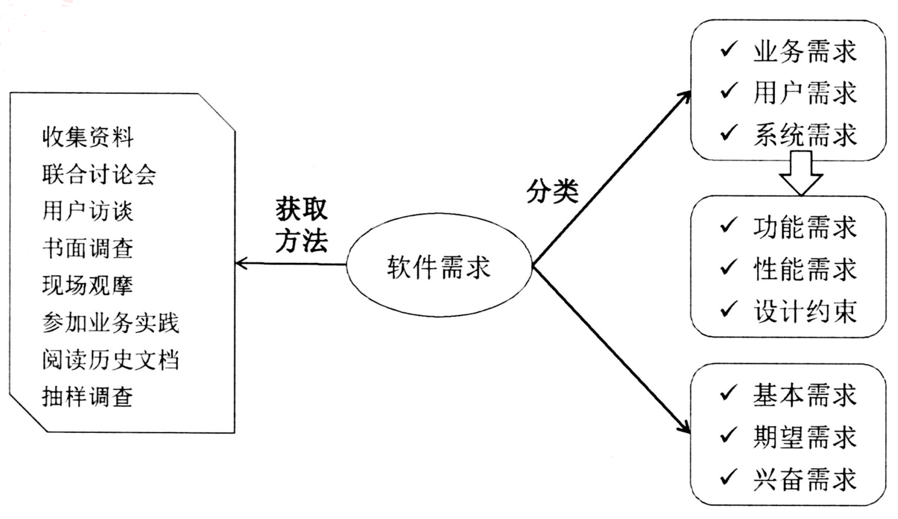

1. 从技术的维度：
   1. 业务需求：最高层次的需求
   2. 系统需求：就是计算机化，产生功能，性能需求。
   3. 设计约束：客户要求，但不是功能或性能需求，如界面美观，数据库使用mysql
2. 从项目管理的维度：分为基本（明确提出）、期望（隐含式的）、兴奋需求

### 需求分析

- 需求分析的任务不是分析系统如何实现用户的需要，而是对业务分析，形成一个体系完整，内容清晰的业务框架，以指导后续的设计开发工作。
- 需求分析就是先分解，再提炼，在这个过程中消除矛盾。
- **分解是一种自顶向下的方法**，包括以场景、业务、程序结构、数据为主线索的分解结构，按任何一种线索分解，都会破坏其他线索的完整性。所以还需要**自底向上的方法进行提炼**，抽取出共性的部分，建立针对全局的领域模型。
- 建模是需求分析的主要手段，建模方法论有：程序=数据结构+算法；结构化分析和设计；面向对象分析与设计。

### 需求定义

严格定义方法

1. 所有需求都能够被预先定义
2. 开发人员与用户之间能够准确而清晰地交流
3. 采用图形/文字可以充分体现最终系统（SRS需求规格说明书）
   1. 用结构化和自然语言编写文本型文档
   2. 建立图形化模型
   3. 编写形式化规格说明。

原型方法

1. 并非所有的需求都能在开发前被准确地说明
2. 项目参加者之间通常都存在交流上的困难
3. 需要实际的、可供用户参与的系统模型
4. 有合适的系统开发环境
5. 反复是完全需要和值得提倡的，需求一旦确定，就应遵从严格的方法

### 需求验证

过程：

1. 需求评审，需求测试（场景验证）
2. 正式评审，非正式评审
3. 用户签字确认，成为需求基线，成为验收标准之一。

## 结构化分析SA

**结构化分析方法**中，用**DFD表示功能模型**，用**状态转换图表示行为模型**，用**E-R图表示数据模型**。

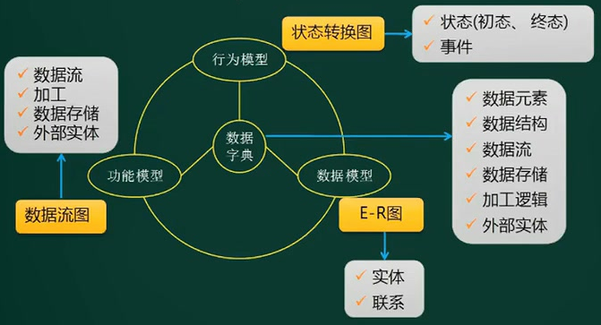

### 数据流图DFD

是SA方法中用于表示系统逻辑模型的一种工具，以图形的方式描述数据在系统中流动和处理的过程。只反映系统必须完成的逻辑功能。

（分层数据流图）：每次分层，都进一步精细化

| 元素              | 说明                                                         | 图元                                                         |
| ----------------- | ------------------------------------------------------------ | ------------------------------------------------------------ |
| 数据流            | 由一组固定成分的数据组成 表示数据的流向                      | 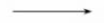          |
| 加工              | 加工描述了输入数据流到输出数据流之间的变换，也就是输入数据流做了什么处理后变成了输出数据流 |  |
| 数据存储 （文件） | 用来表示暂时存储的数据，每个文件都有名字 ，流向文件的数据流表示写文件，流出的表示读文件 |  |
| 外部实体          | 指存在于软件系统外的人员或组织                               |  |

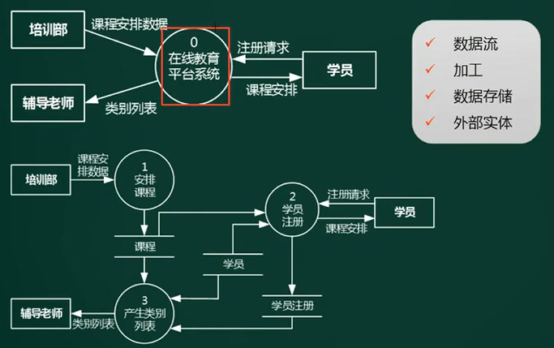

- **在最上面的顶层图中，我们能够看到的信息是极为有限的，它只是把整个系统浓缩为一个节点。**
- **在0层图中，将系统细化，但是系统与外部实体键的数据流向是肯定没有变化的**

### 数据模型E-R图

E-R图，即(Entity Relationship Diagram)实体关系图，用于显示实体集之间的关系。它提供了一种表示实体类型、属性和连接的方法；用来描述现实世界的概念模型。ER模型是数据库的设计或蓝图，将来可以作为数据库来实现。

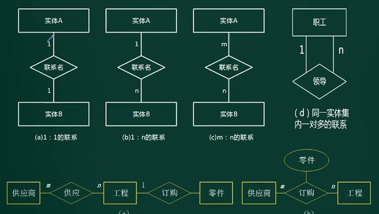

### 状态转换图STD

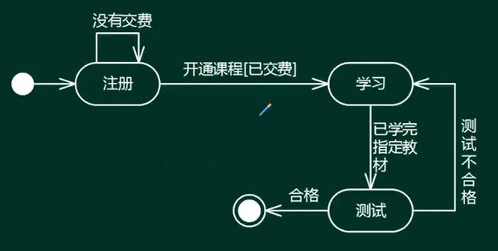

## 面向对象分析OOA

相关概念：对象（ID，属性，方法），类（实体类，边界类，控制类），抽象，接口，继承与泛化，封装，多态，消息，组件，模式和复用（设计模式）。

1. 实体类：映射需求中每个实体，保存需要存储再永久存储体中的信息。
2. 控制类：用于控制用例工作的类，如用例“身份验证”对应的控制类，提供与身份验证相关的所有操作。
3. 边界类：用于封装在内、外流动的信息或数据流，实现目标软件系统和外部系统（设备）之间的信息交流和互操作，如各类接口。

### UML定义

Unified Modeling Language为面向对象软件设计提供统一的、标准的、可视化的建模语言。适用于描述以用例为驱动，以体系结构为中心的软件设计的全过程。

模型图的构成元素：

1. **构造块：事物，关系，图**
   1. 结构事物：**静态部分**，包括：类，接口，协作，用例，活动类，构件和节点。
   2. 行为事物：代表时间和空间上的动作，包括：消息，动作次序，连接。
   3. 分组事物：用盒子封装，如包或构件
   4. 注释事物：UML模型的解释部分；描述、说明或标注模型的元素。
   5. 关系：泛化，包含，扩展，聚合，组合，关联，依赖
2. 规则
   1. 范围：给一个名字以特定含义的语境
   2. 可见性：怎么使用或看见名字
   3. 完整性：事物如何正确、一致的相互联系
   4. 执行：运行或模拟动态模型的含义是什么
3. 公共机制
   1. 规格说明：事物语义的细节描述
   2. 修饰：通过修饰表达更多的信息。
   3. 公共分类：类与对象，接口与实现
   4. 扩展机制：允许添加新的规则
4. 语法定义：

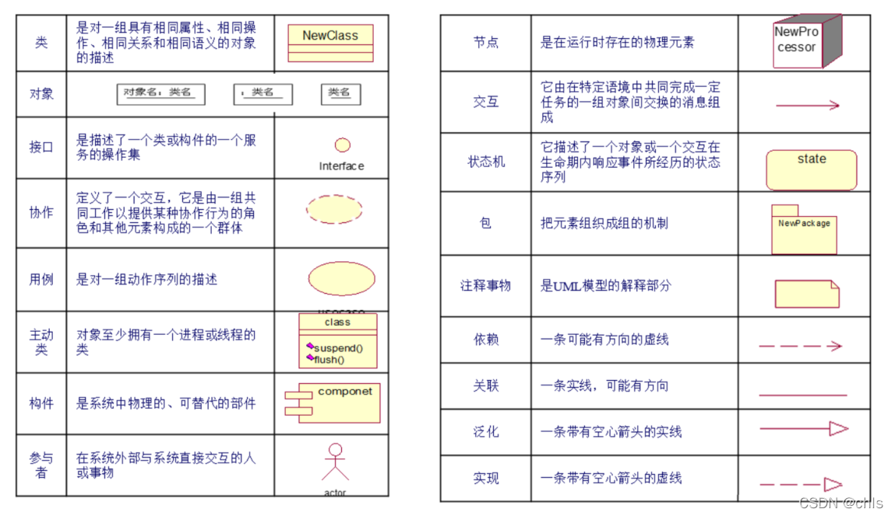

### UML图分类

1. 静态图（结构图)
   1. 类图：一组类、接口、协作和它们之间的关系。表达类的内部属性和行为，以及类集合之间的交互关系
   
   2. 对象图：一组对象及它们之间的关系。（对象图标记的是对象名，命名形式是**对象名：类名**）
   
   3. 构件图：一组构件及其之间的相互关系。
   
   4. **部署图**：也称配置图、实施图，可以用来显示系统中计算节点的拓扑结构和通信路径与节点上运行的软构件等，用于理解分布式系统。
   
      软硬件之间的映射（软件的某个服务需要部署在哪个服务器上）
   
   5. 制品图：系统的物理结构
   
   6. 包图：是一种维护和描述系统总体结构的模型的重要建模工具，描述系统的分解结构，表
      示包和包之间的关系，展现系统模块之间的依赖关系。
   
   7. 组合结构图：上面结构图的多种组合
   
2. 动态图（行为图）：
   1. **用例图：展现了一组用例、参与者及其之间的关系**，
   2. **顺序图：**又称时序图，用于显示对象之间的交互。**强调对象的交互按时间顺序**
   3. 通信图：又称协作图，描述系统的行为，**强调对象之间的组织结构**，强调通信的方式。
   4. 状态图：对类图的补充，一个对象在其生命期的动态行为。状态的转换变迁，**定义对象的内部行为**。
   5. **活动图：类似程序流程图，但有并行行为**
   6. 定时图：强调实际时间。（洗衣机洗衣服过程，洗涤，放水，甩干等每个阶段标识精确的时间）
   7. 交互概览图：

5类UML图的分类法：

- 用例图：对系统提供提供功能的描述，从外部用户角度描述系统功能，并指出功能执行者。
- 静态图：描述系统的静态结构，包括类图、对象图、包图
- 行为图：描述系统的动态行为和组成系统的对象间的交互关系，包括状态图、活动图。
- 交互图：描述对象间的交互关系（消息传递），包括 顺序图 和 协作图
- 实现图：描述软件实现系统的组成和分布状况，包括构件图和部署图。

> **注意**
>
> 动态图都可以描述系统与外部参与者的交互，但除用例图之外的图更强调内部的关联关系。

### UML4+1视图

4+1视图是一种复杂系统的架构设计方法，能够让设计人员将一个系统进行自顶向下的设计分解，并形成合理的抽象描述，组织中的所有成员，都要围绕着这个抽象进行设计、实现、验证，并在系统演进中不断完善修正它们

1. 逻辑视图。逻辑视图主要支持**系统的功能需求**，即系统提供给最终用户的服务。一般用类图和对象图描述。
2. 开发视图。开发视图也称为模块视图，在UML中被称为实现视图，它主要侧重于**软件模块的组织和管理**。该视图可描述源代码，系统文件结构。
3. 过程视图。过程视图侧重于**系统的运行特性，主要关注一些非功能性需求**，例如，系统的性能和可用性等。过程视图强调并发性、分布性、系统集成性和容错能力，以及逻辑视图中的功能抽象如何适合进程结构等，它也定义了逻辑视图中的各个类的操作具体是在哪一个线程中被执行的。
4. 物理视图。物理视图在UML中被称为部署视图，它主要考虑**如何把软件映射到硬件上**，它通常要考虑到解决系统拓扑结构、系统安装和通信等问题。当软件运行于不同的物理节点上时，各视图中的构件都直接或间接地对应于系统的不同节点上。因此，从软件到节点的映射要有较高的灵活性，当环境改变时，对系统其他视图的影响最小化。
5. 场景。场景可以看作是那些重要系统活动的抽象，它使四个视图有机联系起来，从某种意义上说场景是最重要的需求抽象。场景视图对应UML中的用例视图。

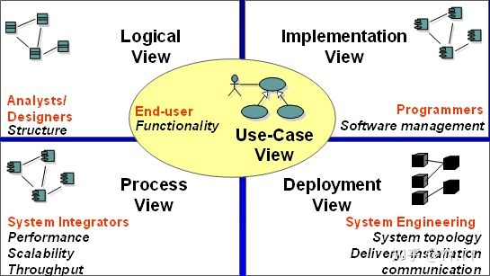

#### 用例视图

1. 角色：最终用户；
2. 场景：用于需求分析模型。
3. 用例视图是4+1视图的核心，确定了以下信息，其它4个视图都是需要围绕着这些信息进行设计
   - 系统边界：有了边界，才能够确定系统的设计范围；同时，通过边界能够识别出系统需要与用户或其它系统进行交互；
   - 系统用户：明确的用户定义是系统需求分析的先决条件；
   - 功能和场景：通过识别出系统与用户或其它系统的交互，可以分析出系统需要提供哪些功能，以及这些功能存在哪些应用场景；

#### 逻辑视图

1. 角色：系统分析、设计人员；

2. 应用：用于类与对象。用于描述对象模型，并说明系统应该为用户提供哪些服务。

3. 逻辑视图是对系统职责的的逐级划分，并对各逻辑元素间的关系，也就是接口进行描述。

4. 一般，逻辑架构元素决定了开发组织。因此，逻辑元素的边界和接口也是后续多个开发组织之间进行接口控制的关系依据。

5. 下面TensorFlow的逻辑视图示例，描述了TensorFlow中各个功能组件，

   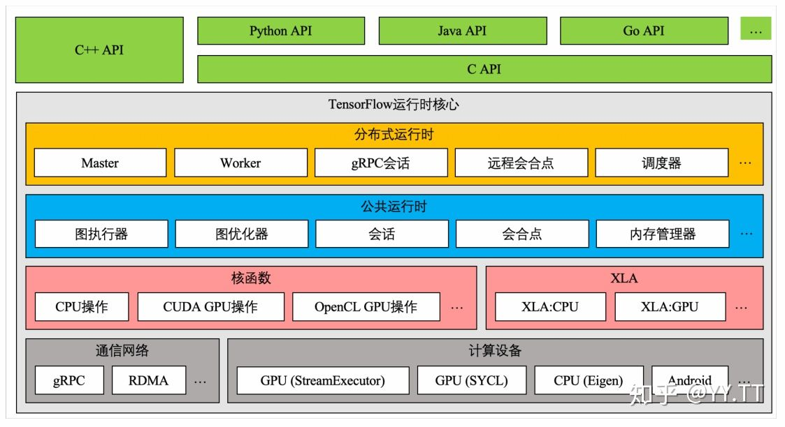

#### 实现视图

1. 角色：开发人员；
2. 应用：物理代码文件和组件。
3. 主要包括两部分信息：
   - 对逻辑架构元素，描述其代码位置，可以是代码仓位置，或代码目录，或是开源软件的版本信息等
   - 系统的构建，即如何将代码编译成二进制交付件（比如.so/.bin）。这个构建信息需要包括构建依赖、构建工具链、构建环境信息
4. 需要满足以下要求：
   - 通过逻辑架构元素，能够找到它所有代码和所有的二进制交付件
   - 每一个代码源文件，都能够找到它所属的逻辑架构元素
   - 每一个二进制交付件，都能够找到它集成了哪些逻辑架构元素

#### 部署视图

也称为物理视图

1. 角色：系统和网络工程师；
2. 应用：软件和硬件的映射。
3. 部署信息包括：
   - 二进制交付件，与软件环境的部署关系
   - 软件环境与物理环境的部署关系

通过逻辑视图、开发视图，部署视图，我们已经可以知道系统中每一个逻辑架构元素、每一份代码，最终会运行在什么位置上。反向也可以通过运行环境上，找到所有其上运行的逻辑架构元素和代码。

#### 进程视图

也称为过程视图、运行视图或处理视图，（**区别于前三个，是动态视图**）

1. 角色：系统集成人员；

2. 应用：线程，进程，并发。关注组件间的交互关系，通常还需要考虑并发、抢占、关键资源（比如锁）访问等。

3. 运行视图就是对系统动态行为（信息）的描述，最常见的设计工具就是UML的序列图。

4. 最常见的是逻辑架构元素之间的交互关系，比如消息交互、服务调用或API调用。如下UML序列图所示。

   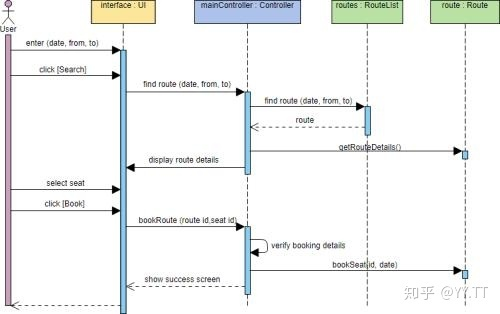

### UML建模

#### 用例模型

编写用例需识别的元素：①参与者；②用例间关系（包含，扩展，泛化）；③用例图；④用例之间的描述。

用例图：

1. 用例图描述一组用例，参与者与他们之间的关系
2. 用户角度描述系统功能
3. **参与者**是外部触发因素，是指系统以外的，需要使用系统或与系统交互的事物，包括：人或组织、设备、 外部系统、时间、温度、传感器等
4. 用例是功能单元。

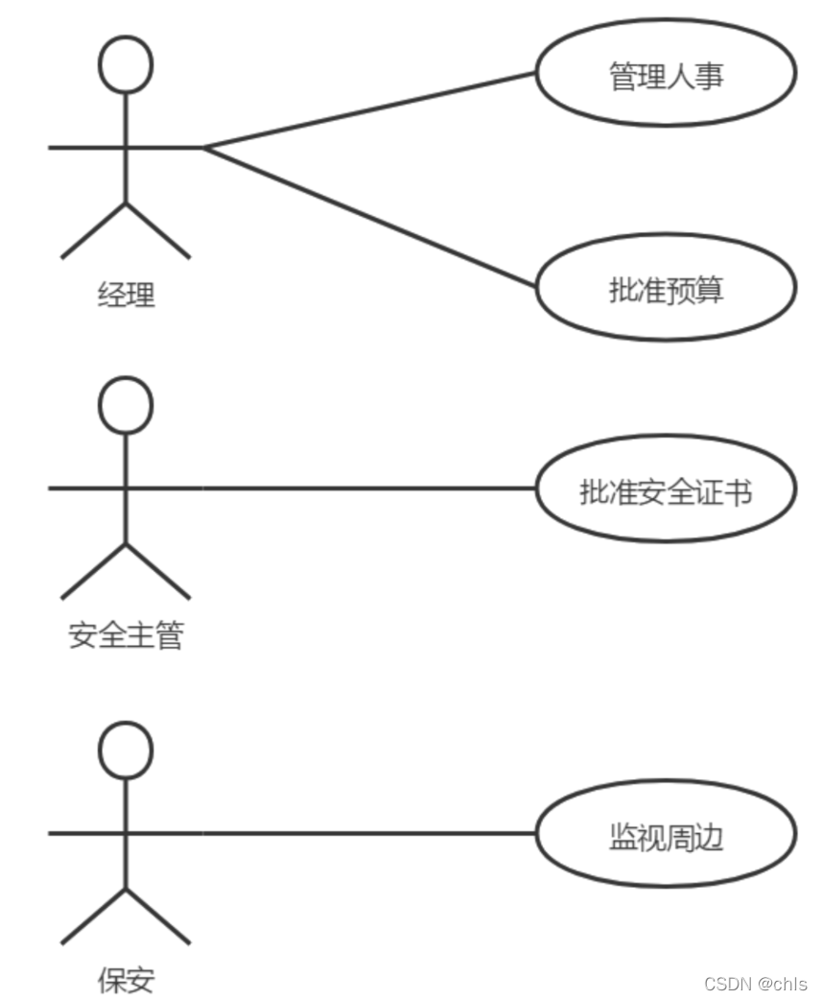

用例建模的流程：

1. 识别参与者

2. 合并需求，获得用例

3. 细化用例描述

   ```markdown
   1.用例名称∶开通课程( UCO2 )
   2.简要说明: 为用户开通学习课程的权限，将其标记为“学员”，同时修改所选修课程的选修人数。
   3.事件流∶
       3.1主事件流
           1.客服人员向系统发出“开通课程”请求。
           2.系统要求客服人员选择开通课程的类型(软考、PMP、通信课程)，
           3.客服人员做出选择后，系统显示相应界面，让客服人员输入信息，并自动根据权限规则生成权限。
           4.客服人员输入学员的相关信息，包括学员用户名、所交费用、交费时间、选修课程名称.
           5.系统确认学员所交费用和所选修课程的规定费用一致。
           6.系统将所输入的信息存储建档，开通学员课程权限。
   	3.2备选事件流
           1.如果学员所交费用少于所选修谍程的规定费用，则显示所迭修课程的规定费用﹐并要求客服人员选择修改威取消输入。
           2.客服人员选择取消输入，则结束用例，不做存储建档工作。
           3.客服人员选择修改用户所交费用后，转到5
           4.如果学员所交费用多于所选修课程的规定费用，则显示多余的费用数量...
   4.非功能需求：无特殊要求.
   5.前曾条件：客服人员登录在线教育平台系统。
   6.后百条件：修改学员权限，修改课程选修人教,
   7.扩展点：无。
   8.优先圾：品高（满意度5，不满意度5).
   ```

4. 调整用例模型，**用例之间的关系**：

   **包含关系**：从两个或以上的用例中提取公共行为（公共/抽象用例）时，应该使用包含关系表示。如学习课程 inclued 检查权限。

   **扩展关系**，如果一个用例明显的混合了两种或以上的不同场景，根据情况可能发生多种分支，则可以把这个用例分为一个基本用例和一个或多个扩展用例，使描述更加清晰，如充入学习币 extend 课程测试。

   **泛化关系**：当多个用例共同拥有一种类似的结构或行为的时候，可以将它们的共性抽象成为父用例，其它用例作为泛化关系中的子用例。

   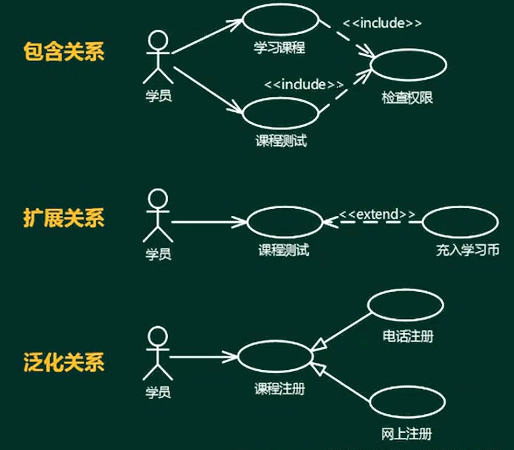

**依赖关系**（包含关系、扩展关系）：A用例需要等到B用例执行完之后才能执行。

**使用关系**也是包含关系。

#### 分析模型

流程：

1. 定义概念类（类图和对象图）

2. 识别类之间的关系：依赖，关联，聚合，组合，泛化，实现

3. 为类添加职责

4. 建立交互图（interaction diagram）

   1. 顺序图（sequence diagram序列图）：强调对象之间消息发送的顺序（**时序**），同时显示对象之间的交互

      用途：用来表示用例中的行为顺序。当执行一个用例行为时，顺序图中的每条消息对应了一个类操作或引起状态转换的触发事件

   2. 通信图（communication diagram协作图）：强调收发消息的对象或参与者的**组织结构**

      用途是表示一个类操作的实现

   3. 活动图（activity diagram）：强调对象间的控制流程。专注于系统的动态视图，有利于系统的功能建模和业务流程建模。（泳道式活动图）

   4. 状态图（state diagram)：强调事件导致的对象行为，有助于反应式系统建模。是一个由状态、转移，事件和活动组成的状态机。

#### 类图和对象图

1. 类图（class diagram）：描述一组类，接口、协作、和它们之间的关系

   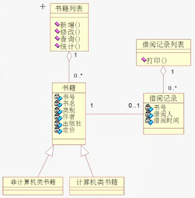

2. 对象图（object diagram）：描述在某一时刻一组对象及它们之间的关系，描述的是在类图中所建立的事物实例的静态快照。可以看作是类图在系统某一时刻的实例。

   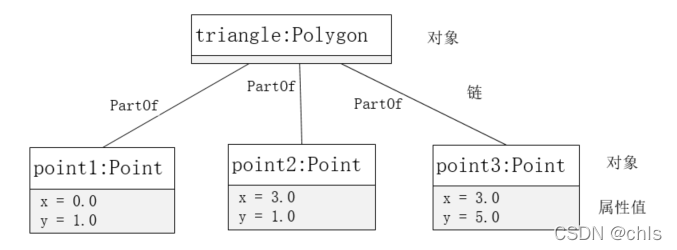

**命名**：类名，方法名，属性名。

**多重度**：一个类的实例能够与另一个类的多少个实例相关联

- 1：表示一个集合中的一个对象对应另一个集合中的1个对象
- 0..*：表示一个集合中的一个对象对应另0个集合中的多个对象（可以不对应）
- 1...*：表示一个集合中的一个对象对应另一个集合中的一个或多个对象（至少对应一个）
- *：表示一个集合中的一个对象对应另一个集合中的多个对象

**类之间关系**：

- 依赖关系：一个事物发生变化影响另一个事物（带实心箭头的虚线，指向被使用者）
- 泛化关系：**特殊、一般**关系，特殊元素的对象可替换为一般元素的对象。（带三角空心箭头的实线，箭头指向父类）
- 关联关系：描述一组链（对象之间的连接，实线），
  - 聚合关系：整体和部分**生命周期不同**（带空心菱形的实心线，菱形指向整体）
  - 组合关系：整体和部分**生命周期相同**（带实心菱形的实线，菱形指向整体）
- 实现关系：接口和类的关系（带三角空心箭头的虚线，箭头指向接口）

各种关系的强弱顺序：**泛化** **=** **实现** **>** **组合** **>** **聚合** **>** **关联** **>** **依赖** 

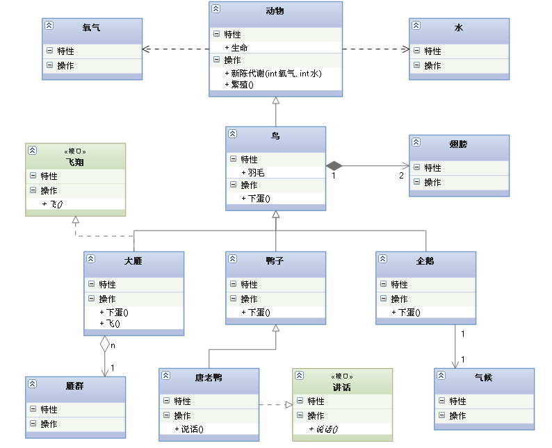

**建立类图步骤**：①研究分析问题领域确定系统需求；②确定类，明确类的含义和职责、确定属性和操作；③确定类之间的关系。

类图在系统的整个生命周期都是有效的，对象图只在系统的某一时间段存在。

#### 状态图

在订单处理的过程中，会员可以点击“取消订单"取消该订单。如果支付失败，该订单将被标记为**S1挂起状态**，可后续重新支付，如果挂起超时30分钟未支付，系统将自动取消该订单。订单支付成功后，系统判断订单类型:

1. 对于常规订单，标记为**S2备货状态**，订单信息发送到货运部，完成打包后交付快递发货**S4发货**;
2. 对于定制订单，会自动进入**S3定制状态**，定制完成后交付快递**发货**。会员在系统中点击”收货"按钮变为**S5收货状态**，结束整个订单的处理流程。

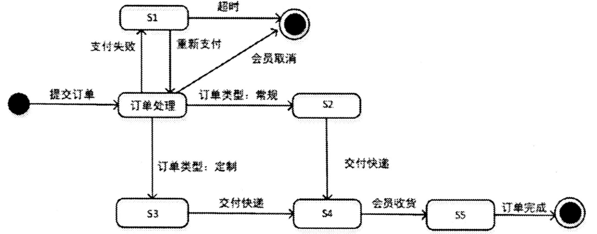

## 需求管理

其目标是：

1. 为软件需求建立基线。
2. 软件计划、产品和活动与软件需求保持一致。用于支持需求开发，主要针对需求基线。

主要活动包括**变更控制，版本控制，需求跟踪，需求状态跟踪**。

### 定义需求基线

软件需求开发的最终文档经过评审批准后，则定义了开发工作的**需求基线(baseline)**。

这个基线在用户和开发人员之间就构筑了计划产品功能需求和非功能需求的一个**约定( agreement)**，它是需求开发和需求管理之间的桥梁。

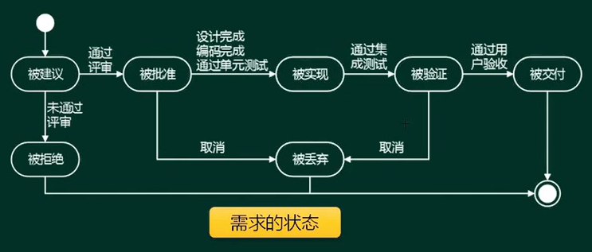

文档中考虑和明确如下属性：创建需求的时间、需求的版本号、创建需求的作 者、负责认可该软件需求的人员、需求状态、需求的原因和根据、需求涉及的子系统、需求涉及的产品版本号、使用的验证方法或者接受的测试标准、产品的优先级或者重要程度、**需求的稳定性。**

### 需求跟踪

要求维持对用户原始需求和所有产品构件需求的**双向跟踪**：

1. 正向跟踪：由原始需求可以定位到具体实现的代码模块。
   1. 客户需求向前追溯到软件需求（需求变更更新至需求规格说明书中）。
   2. 从软件需求向前追溯到下一级工作产品（逐步确保最终产品满足需求）。

2. 反向跟踪：由代码模块可以定位到对应的原始需求。
   1. 从产品部件回溯到软件需求（验证部件来源）
   2. 从软件需求回溯相应的客户需求（确认每个需求的源头）。


二维表可直观的得出，用例有没有实现任何需求，废弃的原始需求会没有用例，废弃的用例没有实现。

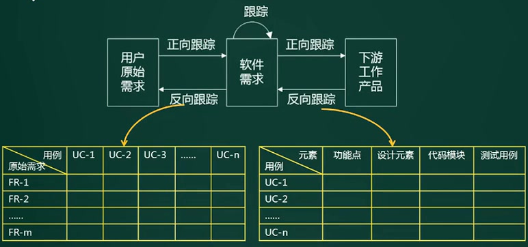

### 变更控制

为了将变更产生的负面影响降到最低，需求的变更遵循以下流程：**问题分析和变更描述、变更分析和成本计算、变更实现**。

流程：变更申请，变更评估，变更决策（各方参与，CCB变更控制委员会），变更实施，变更验证，沟通存档

- **变更控制委员会**可以由一个小组担任，也可由多个不同的组担任，负责做出决定，究竟将哪一些己建议需求变更或新产品特征付诸应用。
- 变更控制委员会对项目中任何基线工作产品的变更都可以做出决定。

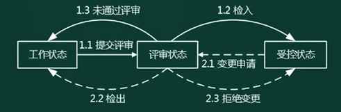

示例：签订的合同都是总金额，若变更多，乙方承担更多。

需求变更应遵循的原则：

1. 必须遵循变更控制程序。
2. 变更未经批准不得实施。
3. 变更应有变更控制委员会进行评估和决策。
4. 项目干系人有权获悉变更信息。
5. 变更库中的原始文档不得更改或删除。
6. 变更的实施均应可追溯到已批准的变更请求。
7. 变更控制委员会的总则／章程应包括变更控制委员会的目的、授权范围、成员构成、决策
   流程及操作步骤。

# 系统建模

现有系统到新系统的流程（逆向工程，正向工程）：

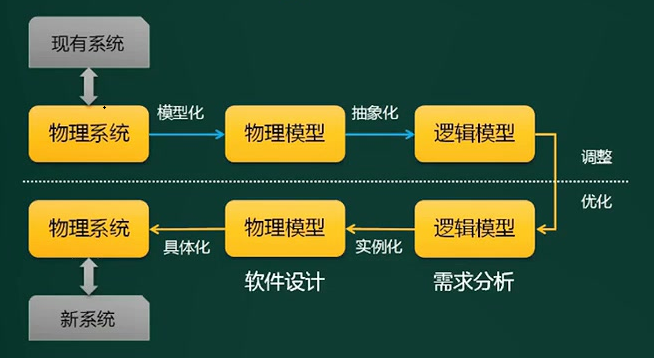

建模方法：

1. 结构化建模方法：

   以**过程**为中心的技术，可以用于分析一个现有的系统以及定义新系统的业务需求。

   绘制的模型为**数据流图（DFD）**，适用于流程比较稳定的系统。

2. 信息工程建模方法（数据库建模方法 ）

   以**数据**为中心，但过程敏感的技术。强调在分析和研究过程需求之前，首先研究和分析数据需求。

   绘制的模型为**实体联系图（ERD）**，主要用于数据建模。

3. 面向对象建模方法

   将”**数据**“和”**过程**“集成到”**对象**“的结构体中，消除了数据和过程的人为分离现象。

   绘制的模型为**对象模型**，面向对象的建模标准UML（统一建模语言），通过不同类型的模型图，以对象的形式共建一个信息（应用）系统

   目前最常用的建模方法。

**题目：论软件系统建模方法及其应用**

软件系统建模(Software System Modeling)是软件开发中的重要环节，通过构建软件系统模型可以帮助系统开发人员理解系统、抽取业务过程和管理系统的复杂性，也可以方便各类人员之间的交流。

软件系统建模是在系统需求分析和系统实现之间架起的一座桥梁，系统开发人员按照软件系统模型开发出符合设计目标的软件系统，并基于该模型进行软件的维护和改进。

请围绕"论软件系统建模方法及其应用"论题，依次从以下三个方面进行论述。

1. 概要叙述你参与的软件系统开发项目以及你所担任的主要工作。
2. 说明软件系统开发中常用的建模方法有哪几类?阐述每种方法的特点及其适用范围。
3. 详细说明你所参与的软件系统开发项目中，采用了哪些软件系统建模方法，具体实施效果如何。

# 系统设计

软件设计包括四个既独立又相互联系的活动：

- **体系结构设计**：定义软件系统各主要部件之间的关系。主要目标是开发一个模块化的程序结构，并表示出模块间的控制关系。
- **数据设计**：将模型转换成数据结构的定义。高质量的数据设计将改善程序结构和模块划分，降低过程复杂性。
- **接口设计**（人机界面设计）：软件内部，软件和操作系统之间以及软件和与用户之间的交互关系。
- **过程设计**：系统结构部件转换成软件的过程描述。确定软件各个组成部分内的算法及内部数据结构，并选定某种过程的表达形式来描述各种算法。 

## 界面设计

1. **置于用户控制之下**

   以不强迫用户进入不必要的或不希望的动作的方式来定义交互方式

   提供灵活的交互

   允许用户交互可以被**中断和撤消**

   当技能级别增加时可以使交互流水化，并允许定制交互

   使用户隔离内部技术细节

   ·设计应允许用户和出现在屏幕上的对象直接交互

2. **减少用户的记忆负担**

   减少对短期记忆的要求

   建立有意义的缺省

   定义直觉性的捷径

   界面的视觉布局应该基于真实世界的隐喻

   以不断进展的方式揭示信息

3. **保持界面的一致性**

   允许用户将当前任务放入有意义的语境·

   在应用系列内保持一致性

   如过去的交互模型已建立起了用户期望，除非有迫不得已的理由，不要改变它

## 结构化设计

传统软件工程方法学采用结构化设计方法(SD)，从工程管理角度结构化设计分为两步;

- 概要设计：将软件需求转化为**数据结构和软件系统结构**。（模块划分，接口设计）
  - 包括：设计软件的结构、确定系统功能模块及其相互关系，
  - 主要采用**模块结构图、层次图和 HIPO 图**描述程序的结构。
- 详细设计：过程设计，通过对结构细化，得到软件详细数据结构和算法。（模块具体实现）

思想：抽象化；自顶而下，逐步求精；信息屏蔽（接口调用）；**模块独立（高内聚，低耦合）** 

- 结构化程序设计采用自顶向下、逐步求精及模块化的程序设计方法。
- 通过三种基本控制结构（顺序、分支和循环）构可以构造出任何单入口单出口的程序。

高内聚 => 低内聚

| 内聚类型      | 描述                                         |
| ------------- | -------------------------------------------- |
| 功能内聚      | 完成一个单一功能，各个部分协同工作，缺一不可 |
| 顺序内聚      | 处理元素相关，而且必须顺序执行               |
| 通信内聚      | 所有处理元素集中在一个数据结构的区域上       |
| 过程内聚      | 处理元素相关，而且必须按特定的次序执行       |
| 瞬时/时间内聚 | 所包含的任务必须在同一时间间隔内执行         |
| 逻辑内聚      | 完成逻辑上相关的一组任务                     |
| 偶然内聚      | 完成一组没有关系或松散关系的任务             |

低耦合 => 高耦合

| 耦合类型   | 描述                                                         |
| ---------- | ------------------------------------------------------------ |
| 非直接耦合 | 两模块之间没有直接关系，由主模块控制和调用来实现关联         |
| 数据耦合   | 一组模块借助参数表传递简单数据                               |
| 标记耦合   | 一组模块通过参数表传递记录信息（数据结构）                   |
| 控制耦合   | 模块之间传递的信息中包含用于控制模块内部逻辑的信息           |
| 外部耦合   | 一组模块都访问同一全局简单变量，而且不是通过参数表传递该全局变量的信息 |
| 公共耦合   | 多个模块都访问同一公共数据环境                               |
| 内部耦合   | 一个模块直接访问另一个模块的内部数据：不是通过正常入口转到另一个模块的内部；两模块有部分代码重复；一个模块有多个入口。 |

**设计原则**：

1. 保持模块的大小适中

2. 尽可能减少调用的深度（少跳转和递归）

3. 多扇入，少扇出

   扇入：被其他模块调用。多扇入：实现功能方法复用。

   扇出：调用其它模块，要少扇出：越多耦合越高。

4. 单入口，单出口（goto，return不建议频繁采用，也不禁止）

5. 模块的作用域应该在模块之内

6. 功能应该是可预测的。

## 面向对象设计

- 面向对象的分析模型主要由**顶层架构图、用例与用例图、领域概念模型**构成。
- 设计模型则包含以**包图表示的软件体系结构图**、**以交互图表示的用例实现图**、完整精确的类图、**针对复杂对象的状态图**和用以**描述流程化处理过程的活动图**等

需求分析阶段得出用例模型和分析模型，

1. 基于UML进行需求分析。从业务需求描述出发获取执行者和场景，对场景进行汇总、分类、抽象，形成用例，确定执行者与用例、用例与用例之间的关系，生成用例图
2. 面向对象的设计。设计用例步骤：①提取边界类、实体类和控制类；②构造交互图；③根据交互图精化类图

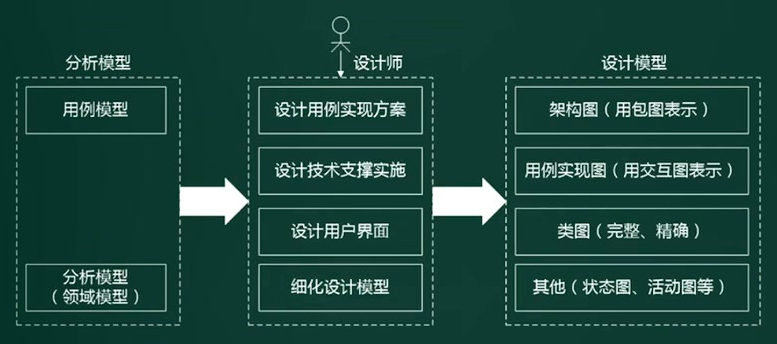

### 设计原则

- 单一设计原则：设计目的功能单一的类
- 里氏替换原则：子类可以替换父类
- 依赖倒置原则：依赖抽象，而不依赖具体实现；针对接口编程，而不是针对实现编程。
- 接口隔离原则：使用多个专门的接口比使用一个总接口要好
- 迪米特法则：最少知识法则，一个对象应当对其它对象尽可能的减少了解。
- 开闭原则：对扩展开放，对修改关闭。
- 组合重用原则：尽量使用组合，而不是继承关系达到重用目的

### 设计模式

模式的层级：在软件方面的模式（惯用法）有很多，可以分为三个层次：架构模式(Architectural Pattern)，设计模式(Design Pattern)，代码模式(Coding Pattern)。

1. **架构模式**：软件设计中的高层决策，例如C/S结构属于架构模式；架构模式反映了开发软件系统过程中所做的**基本设计决策** 
2. **设计模式**：关注软件系统的设计，于具体的实现语言无关。
3. **惯用法**：最底层的模式，关注软件系统的设计和实现，实现中通过某种特定的程序设计语言来描述构件之间的关系。每种编程语言都有自己特定的模式，即语言的惯用法。如：引用-计数就是C++语言的一种惯用法。

设计模式的分类：

1. 创建型模式：创建对象

   | 名称                         | 说明                                                         | 关键点         |
   | ---------------------------- | ------------------------------------------------------------ | -------------- |
   | 工厂方法（Factory）          | 定义一个创建对象的接口，由子类决定需要实例化哪一个类，子类实例化的过程推迟。 | 动态生产对象   |
   | 抽象工厂（Abstract Factory） | 定义一个创建一系列相关或相互依赖的对象的接口，直接指定工厂，而无需指定具体的类 | 生产成系列对象 |
   | 原型（Prototype）            | 通过拷贝原型实例来创建新对象                                 | 克隆对象       |
   | 单例（Singleton）            | 保证一个类只有一个实例，并提供全局访问点                     | 单实例         |
   | 构建器（Builder）            | 将一个复杂类的表示和其构造分离，使相同的构建过程能得到不同的表示 | 复杂对象构建   |

2. 结构性模式：更大的结构

   | 名称              | 说明                                                         | 关键点       |
   | ----------------- | ------------------------------------------------------------ | ------------ |
   | 适配器（Adapter） | 使原本不相容的接口得以协同工作                               | 转换接口     |
   | 桥接（Bridge）    | 将类的抽象部分和实现部分分离开来，各自独立的变化             | 继承树拆分   |
   | 组合（Composite） | 将对象组合成树型结构表示”整体-部分“的层次结构，对当个对象和组合对象的使用具有一致性 | 树形结构     |
   | 装饰（Decorator） | 动态给对象添加额外的职责，替换用子类（继承）来扩展功能，更灵活 | 动态附加职责 |
   | 外观（Facade）    | 定义高层接口，为系统中一组接口提供一个一致的外观，简化使用   | 对外统一接口 |
   | 享元（Flyweight） | 支持大量细粒度对象的共享                                     | 汉字编码     |
   | 代理（Proxy）     | 使用一个代理来控制一个对象的访问                             | 快捷方式     |

3. 行为型模式：交互及职责分配

   | 名称                             | 说明                                                         | 关键点           |
   | -------------------------------- | ------------------------------------------------------------ | ---------------- |
   | 责任链（Chain of Responsibility) | 将接受对象链接起来，在链中传递请求，直到有一个对象处理这个请求，减少请求的发送者和接收者之间的耦合。 | 传递职责         |
   | 命令（Command）                  | 将请求封装成一个命令对象，可用不同请求对客户进行参数化。     | 日志记录，可撤销 |
   | 解释器（Interpreter）            | 根据文法表示来解释语言中的句子                               | 虚拟机机制       |
   | 迭代器（Iterator）               | 提供顺序访问一个聚合对象中的元素，且不需要暴露对象的内部表示 | 数据集           |
   | 中介者（Mediator）               | 用中介对象封装一系列的对象交互。使各对象不需要显示的相互调用，达到低耦合，且可以独立改变对象间的i交互 | 不直接引用       |
   | 备忘录（Memento）                | 在不破坏封装的前提下，保存一个对象的内部状态，并可以在以后将该对象恢复到原先保存的状态 | 游戏存档         |
   | 观察者（Observer）               | 定义对象间一对多的关系，当一个对象的状态发生变化，所有依赖于它的对象都得到通知并自动更新 | 联动             |
   | 状态（State）                    | 允许一个对象在其内部状态改变时，改变它的行为                 | 封装状态         |
   | 策略（Strategy）                 | 定义并封装一系列算法，可以互相替换，从而让算法独立于使用它的用户而变化 | 多方案切换       |
   | 模板方法（Template Method)       | 定义一个操作中的算法骨架，将一些步骤延迟到子类中，使子类可以不改变算法结构，即可重新定义算法的某些步骤 | 框架             |
   | 访问者（Visitor）                | 表示一个作用于某对象结构中的各元素的操作，使得在不改变各元素的前提下定义作用于这些元素的新操作 | 数据与操作分离   |

类模式和对象模式

1. **工厂方法，适配器，解释器，模板方法**既可以是类模式，也可以是对象模式；其它都是对象模式。
2. 类模式就像静态类，不需要实例化对象。

应用场景及特点

1. 状态模式：酒店房间的状态，未入住时，可以被预定不可退房；有入住时，可以被退房不可预定。把不同的房间状态用单独的类来描述
2. 策略模式：商家做的活动有打5折、满100减20，可以使用策略接口调用执行，可以灵活切换活动方案。
3. 访问者模式：数据稳定，但操作不稳定。超市的销售流水数据封装成数据对象，但操作者有收银员，经理，总经理，对数据关注的点不同，所以操作也不同。
4. 命令模式和备忘录模式的区别：应用场景不同，如文档编辑，
   - 内容编辑时，每次的输入和操作都可以撤销，使用命令模式
   - 保存文档到本地时，需要的时候可以使用之前的保存的副本进行恢复，此时是备忘录模式

# 测试与调试

## 软件测试

思想：

1. 尽早，不断的进行测试
2. 程序员避免测试自己设计的程序
3. 既要选择有效、合理的数据，也要选择无效、不合理的数据
4. 修改后应进行回归测试
5. 尚未发现的错误数据量与该程序已发现错误数成正比

测试方法的类型

1. 动态测试（允许程序）：黑盒（**边界值分析**），白盒（**逻辑覆盖、基本路径**），灰盒测试法
2. 静态测试（不依赖计算机）：桌前检查，代码审查，代码走查

**黑盒测试法**（不知道程序内部结构）

1. 等价类划分：选择不同的测试用例进行测试。如积分等级会员，选择不同积分段的会员，进行测试。
2. 边界值分析：范围的边界值测试。使用范围两端的有效和无效数据。
3. 错误推测：经验
4. 因果图

**白盒测试法**：（能看到程序内部结构）

1. 基本路径测试
2. 循环覆盖测试
3. 逻辑覆盖测试（语句<最弱>、判定、条件、条件判定、修正的条件判断、条件组合、点、边、路径<最强，程序流程分支>覆盖）

**测试阶段**：

- 单元测试：模块测试，包括模块功能，性能，接口等。技术依据是**软件详细设计文档**。
- 集成测试：模块间的接口关系。技术依据是**软件概要设计文档**。
  - 一次性组装：所有的模块集成在一次进行测试。速度快。
  - 增量式组装：先用两个模块进行测试，不断附加模块。细致。又分为：自定而下，自底而上，混合式。
- **系统测试**：真实环境下，验证完整的软件配置项能否和系统正确的连接。
  - 包括恢复测试，安全性测试，压力测试，性能（负载，强度，容量）测试，可靠性测试，可维护性测试，安装测试。
  - 技术依据是**需求分析文档**。
- **确认测试**：**验证软件功能、性能及其它特性是否与用户需求的一致性**。包括内部确认测试，产品测试（Alpha测试，Beta测试，由用户做的测试），验收测试。技术依据是**需求分析文档**。
- 回归测试：测试软件变更之后，变更部分的正确性对变更需求的符合性。

**V模型**：表示各个阶段的技术依据。

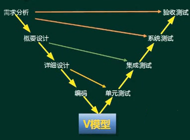

**面向对象的测试：**

1. 算法层（**单元测试**）：包括等价类划分测试，组合功能测试（基于判定表），递归函数测试和多态消息测试。
2. 类层（**模块测试**）：包括不变式边界测试、模态类测试和非模态类测试
3. 模板层/类树层（**集成测试**）：包括多态服务测试和展平测试。
4. 系统层（系统测试）：

**自动化测试的实现：**设计测试用例和运行脚本，可以重复测试。

## 软件调试 

**调试方法：**

1. 蛮力法：通过计算机找错，
2. 回溯法：从出错处沿控制流程往回追踪，直到发现出错的根源；复杂程序由于路径多，难以实施。（反向）
3. 原因排除法：主要思想是归纳和演绎，用二分法实现。（正向）

调试和测试的区别：

1. 调试的目的是定位错误并修改程序，以修正错误
2. 测试可以事先设计，进度可以事先确定，并从一个已知条件开始，使用预先定义的过程，有预知结果
3. 调试不能描述过程和持续时间。

# 系统运行和软件维护

## 系统转换计划

**遗留系统演化策略：技术水平和业务价值**

- 集成（高水平，低价值）：
  - 低价值说明该系统**只完成某个部门的业务管理**，但对于整个企业属于信息孤岛，系统之间没有互联互通，
  - 所以需要通过集成进行打通，提高业务价值
- **改造（高水平，高价值）**：
  - 高价值，说明能满足企业业务运作和决策支持的需要。
  - 改造包括**系统功能的增强**（增加新的应用要求），和**数据模型的改造**（旧数据模型转换为新的）两方面。
- 继承（低水平，高价值）：
  - 遗留系统的技术含量低，**已经满足企业运作的功能和性能要求，具有较高的商业价值**，企业的业务还需紧密依赖该系统。
  - 使用继承策略，新系统需要**完全兼容遗留系统的功能模型和数据模型**，继承需求和业务流程，使用新的技术。
- 淘汰（低水平，低价值）：企业业务发生根本变化，遗留系统不再适应企业运作的需要

**新旧系统的切换（转换）策略：**

1. 直接转换策略：旧系统停掉，运行新系统（风险高）
2. 并行转换策略：两个系统一起运行，部分用户使用新系统。
3. 分段转换策略：比如多个子系统依次替换，或是地域上替换部署

数据转换和迁移：

1. 抽取：旧数据库
2. 转换：工具迁移，手工录入，新系统生成
3. 装载：新数据库

## 软件维护

1. 正确（改正）性维护：指改正在系统开发阶段已发生而系统测试阶段尚未发现的错误（改bug）。
2. 适应性维护：指使应用软件适应信息技术变化和管理需求变化而进行的修改。企业的外部市场环境和管理需求的不断变化也使得各级管理人员不断提出新的信息需求。如**操作系统、数据库、软件环境变化**，导致系统无法运行。
3. 完善性维护：**扩充功能和改善性能**而进行的修改。对已有的软件系统增加一些在系统分析和设计阶段中没有规定的功能与性能特征。
4. 预防性维护：为了**改进应用软件的可靠性和可维护性**，为了**适应未来**的软硬件环境的变化，应主动增加预防性的新的功能，以使用系统适应各类变化而不被淘汰。如将专用报表功能改成通用报表生成功能，以适应将来报表格式的变化。如代码注释。

# 软件重用

软件重用（软件复用）是使用已有的软件产品（如设计、代码和文档等）来开发新的 软件系统的过程。 

软件重用的形式大体可分为垂直式重用和水平式重用。

- 水平式重用：是重用**不同应用领域中的软件元素**。 任何软件都能用，所以是水平式重用。
  - **标准函数库**是一种典型的**原始的**横向重用机制。
  - **构件、设计模式**是面向对象设计时的方法，**不是原始的**。
- 垂直式重用：是在一类具有**较多公共性的应用领域**之间重用软件构件。如只在电力系统中用到的构件。

优势：提高生产率、降低开发成本、缩短开发周期、改善软件质量、提高灵活性和标准化程度。

# 逆向工程

所谓软件的逆向工程就是分析已有的程序，寻求比源代码更高级的抽象表现形式，一般认为，凡是在软件生命周期内将软件某种形式的描述转换成更为抽象形式的活动都可称为逆向工程。

逆向工程是在不同抽象层级中进行溯源行为。

与之相关的概念是:

- 重组（restructuring），指在同一抽象级别上转换系统描述形式；

- 设计恢复（design recovery），指借助工具从已有程序中抽象出有关数据设计、总体结构设计和过程设计的信息（不一定是原设计）。

- 重构/再工程（re-engineering），也称修复和改造工程，它是在逆向工程所获信息的基础上修改或重构已有的系统，产生系统的一个新版本。

  是在同一抽象层级中转换系统描述的活动。

解释：也就是山寨，破解，仿制；

过程：现有系统从代码，设计，分析的层级，找出原始需求，再融入新需求，开发生成新系统。

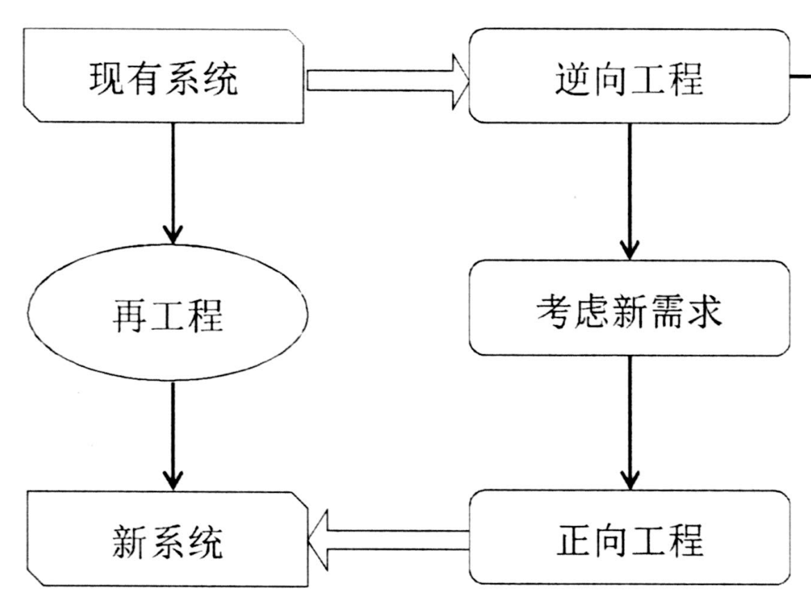

逆向工程包括

1. 实现级：包括程序的**抽象语法树，符号表、过程**的设计表示
2. 结构级：包括反映**程序分量之间相互依赖关系**的信息，如调用图、结构图、程序和数据结构
3. 功能级：包括反映**程序段功能及程序段之间关系**的信息，如数据和控制流模型
4. 领域级：包括反映程序分量或程序诸实体与**应用领域概念之间对应关系**的信息，如实体关系模型（UML图）

# 净室软件工程

- 净室即无尘室、洁净室，是一个受控污染级别的环境
- 使用盒结构规约（或**形式化方法**）进行分析和设计建模，并且强调将**正确性验证**，而不是测试，作为发现和消除错误的主要机制。
- 强调统计质量控制技术，包括对客户软件使用预期的测试
- 使用统计的测试来获取认证被交付的软件的可靠性所必需的出错率信息。

**形式化方法**：使用标准化的方式（利用数学模型做证明），只适用于简单的，固化的应用问题，而不适合复杂的应用问题。

优势：能精确的表述和研究应用问题及其软件实现。

# 题目

软件系统的文档分为

1. 用户文档：描述系统功能和使用方法，如功能描述，安装文档，使用手册，参考手册，操作员指南等。
2. 系统文档：描述系统设计、实现和测试等内容，如需求说明书，系统设计文档，系统测试计划等。

不同软件开发方法所使用的模型的描述：

1. 进行结构化分析时，**必须（错误用词）**使用数据流图和软件结构图两种模型。
2. 采用面向对象开发方法时，**可以使用（正确用词）**状态图和活动图对系统的动态行为进行建模
3. 实体联系图（E-R图）是在**数据库逻辑结构设计（应是概念结构设计）**时才开始创建的模型
4. UML的活动图与程序流程图的表达能力**等价**。(**活动图有并发并行行为，流程图没有**)

需求开发是将用户需求转化为**应用系统成果（已完成的系统）**的过程。

迪米特法则：

1. 违背最少知识法则的设计：在类结构的设计上，每个类都应当尽可能提高对其属性和方法的访问权限。
2. 正确：在类的结构设计上，每一个类都应当尽量降低成员的访问权限。一个类不应当 public自己的属性，而应当提供取值和赋值的方法让外界间接访问自己的属性。

对于**违反里氏替换原则**的两个类A和B，可以采用的候选解决方案中，正确的是

- A.尽量将一些需要扩展的类或者存在变化的类设计为抽象类或者接口，并将其作为基类，在程序中尽量使用基类对象进行编程
- B.创建一个新的抽象类C，作为两个具体类的超类，将A和B共同的行为移动到C中，从而解决A和B行为不完全一致的问题（**只是泛化过程，提取公共行为，但无法解决行为并不一致的问题**）
- C.将B到A的继承关系改成组合关系（**不符合里氏替换原则**）
- D.区分是“Is-a”还是“Has-a”。如果是Is-a，可以使用继承关系，如果是Has-a ,应该改成组合或聚合关系 （**不符合里氏替换原则**）

> 里氏替换原则：子类可以扩展父类的功能,但不能改变父类原有的功能，如，企鹅、鸵鸟和几维鸟从生物学的角度来划分，它们属于鸟类；但从类的继承关系来看，由于它们不能继承“鸟”会飞的功能，所以它们不能定义成“鸟”的子类；需要定义一个层级更高的基类，如动物类。
>
> A，B违反里氏替换原则，说明A和B有泛化关系（B继承A），B中重写了A中的某个方法，当把父类（实例）替换为子类时，运行结果出错。

自顶向下开发方法

1. 自顶向下过程因为单元测试而比较耗费时间（**主要进行集成测试**）
2. 自顶向下过程可以更快地发现系统性能方面的问题（**底层模块未开发，如数据访问，消息处理，所以性能未知**）
3. 相对于自底向上方法，自顶向下方法可以更快地得到系统的演示原型
4. 在自顶向下的设计中，如发现了一个错误，通常是因为底层模块没有满足其规格说明(因为高层模块已经被测试过了）（**底层模块未开发，只是模拟出来，不会有错**）

系统建议方案（在需求分析之前）：

1. 前置部分。包括标题、目录和摘要。摘要部分以1～2页的篇幅总结整个系统建议方案报告，提供系统方案中的重要时间、地点、人物、原因，以及系统方案是如何实现的等信息。因为多数高层管理人员没有时间读完整个报告，他们可能只阅读摘要。因此，摘要部分显得特别重要。
2. **系统概述**。包括系统建议方案报告的目的、对问题的陈述、项目范围和报告内容的叙述性解释.
3. **系统研究方法**。简要地解释系统建议方案报告中包含的信息是如何得到的，研究工作是如何进行的。例如，通过各种调查技术获取用户初步需求，通过座谈和观察获取现有系统的资料等。
4. **候选系统方案及其可行性分析**。系统阐述每个候选系统方案，并进行可行性评价。
5. **建议方案**。在对各个候选系统方案进行可行性评价之后，通常会推荐一个解决方案，并且要给出推荐该解决方案的理由。
6. 结论。简要地描述摘要的内容，再次指出系统开发的目标和所建议的系统方案。同时，需要再次强调项目的必要性和可行性，以及系统建议方案报告的价值。
7. 附录。系统分析师认为阅读者可能会感兴趣的所有信息，但这些信息对于理解系统建议方案报告的内容来说不是必要的。

联合需求计划(Joint Requirement Planning,JRP）

1. 在JRP实施之前，应制定详细的议程，并严格遵照议程进行
2. 在讨论期间尽量避免使用专业术语
3. JRP是一种相对来说成本较高但十分有效的需求获取方法
4. JRP的主要目的是**需求获取**。

**需求工程流程**：

1. 周期一：理清框架与脉络

   任务：理清需求的结构框架(领域类图)，行为脉络(流程图和用例图)。

   输入：需求定义阶段产生的业务时间列表和报表列表。

   输出：领域模型和用例模型。

   该任务对应于RUP中细化阶段的第一次迭代，该阶段的结束标志是标识除了绝大部分用例，生成了领域模型。

   1. 业务流程分析：具体来说就是识别，分析现有业务活动，确定活动之间的关系，了解活动需要接受哪些信息，产生哪些数据，确定数据传输路线，标识出活动是由哪些部门，岗位负责。

      流程是有层次和类型的。要使用模型来描述流程，最常使用的有三种：跨职责流程图，活动图和数据流图

   2. 业务实体分析：了解这个问题域中有哪些业务实体，它们之间存在什么样的逻辑关系，数量关系，以及有什么相应的结构规则。产物有两种可选模型：类图，ER图。

   3. 角色与使用场景分析：用例分析技术，能更好地以用户的角度，将系统当作一个黑盒子，了解并梳理需求，解释如何使用系统(场景)。产物是用例图。

2. 周期二：确定需求细节

   任务：是对上一阶段产出的用例模型和领域模型进行细节填充。

   对于行为需求的用例，我们要填充事件流，包括：相关需求或功能点，界面原型，用例规则与约束。

   对于数据需求的领域类，我们要填充字段与格式，包括字段信息，字段格式与规则，计算规则，结构规则。

   1. 确定行为需求的细节：用例描述模板，业务用例与系统用例，界面原型，规则与约束（业务规则，数据规则，界面规则）
   2. 确定结构需求细节：领域模型的组织，数据窗口分析，数据组成与格式

   产物：完整的用例描述，完整的领域类细节，界面流转图，页面原型

3. 其他需求分析包括：接口需求，全局性的非功能需求和全局性的设计约束。

**用例的来源**：如何从需求中归纳出用例。

1. 自顶向下导出法：就是从流程图中派生出用例图。而流程图是通过划分主题域，再从主题域标识业务事件，然后通过业务事件绘制出来流程图。拿到流程图后，我们首先可以跟客户进行边界确定和角色确定，以得出表示系统边界的用例图。

   1 边界确定。首先排除掉不直接使用系统的岗位。

   2 确定角色。对剩下的职责带区进行角色化。

   3 确定用例。用例是从职责带区中的业务活动中派生出来的。

   4 绘制用例图。有了以上分析，我们得到了角色，参与者，用例，就可以绘制出用例图了。

2. 自底向上合并法：对于一些中小项目而言，流程并非泾渭分明，从流程开始梳理会比较困难，就适合采用自底向上合并法，从需求捕获阶段得到的需求列表着手，合并出需要的用例。

   1 收集原始需求。2 确定参与者。3 合并用例。4 绘制用例图。

3. 用例的注意事项：

   1 用例图的颗粒度取决于业务价值。

   2 用业务动词命名用例十分重要，不要在用新增xx，修改xx，删除xx，查询xx了。

   3 采用先事后人的方式分析，而非先人后事。

**架构模式和设计模式**：（14）的选择是开发一个软件系统时的基本设计决策;_(5)_是最低层的模式，关注软件系统的设计与实现，描述了如何实现构件及构件之间的关系。引用计数是C++管理动态资源时常用的一种_(6)_.
(4 )A.架构模式（**软件开发过程中的基本设计决策**）；B．惯用法；C．设计模式；D.分析模式 
(5 )A.架构模式；B.  惯用法（**是最底层的模式**）；C.设计模式；D.分析模式
(6 )A架构模式；B．惯用法（**特定语言的特定模式**）；c.设计模式；D.分析模式