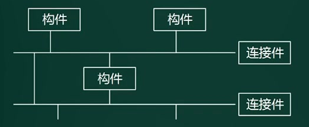

# 概念

架构的概念滞后于软件开发模型（如瀑布模型）。结构化开发方法中没有架构的概念。

- 位置：**架构处于需求分析和软件设计之间**，填补了业务层和技术层的鸿沟。
- 体系结构==架构：**架构就是需求分配，即将满足需求的职责分配道组件上**。

描述和作用：

1. 架构设计的一个核心问题是否能达到架构级的软件复用
2. 软件架构为软件系统提供了一个结构、行为和属性的高级抽象，有构成系统的元素的描述，元素的相互作用，指导元素集成的模式以及这些模式的约束组成。
3. 软件架构是项目干系人进行交流的手段，明确了对系统实现的约束条件，决定了开发和维护组织的组织结构，制约着系统的质量属性。
4. 软件架构使推理和控制更加简单，有助于循序渐进的原型设计，可以作为培训的基础。
5. 软件架构是**可传递和可复用**的模型，通过研究软件架构可能预测软件的质量。

发展史：

1. 无架构阶段：汇编语言
2. 萌芽阶段：程序结构设计
3. 初级阶段：统一建模语言UML
4. 高级阶段：4+1视图

建模分类：

- **结构模型**:以架构的构件、连接件和其他概念来刻画结构
- 框架模型:不太侧重描述结构的细节而更侧重于整体的结构
- **动态模型**:系统的“大颗粒”的行为性质D
- 过程模型:构建系统的步骤和过程
- 功能模型:由一组功能构件按层次组成，下层向上层提供服务

4+1视图和UML的对应关系：

# 风格

定义：

- **软件架构风格**是描述某一特定应用领域中系统组织方式的惯用模式。
- 架构风格定义一个系统家族，即一个体系结构定义一个词汇表（**描述系统的术语表**）和一组约束（**指导构建系统的规则**）。词汇表中包含一些构件和连接件类型，而这组约束指出系统是如何将这些构件和连接件组合起来的。
- 架构风格反映领域中众多系统所共有的结构和语义特性，并指导如何将各个构件组织成一个完整的系统。

5种类型：

1. 数据流风格：批处理序列，管道-过滤器。（用于按流程对数据处理）
2. 调用/返回风格：主程序/子程序，面向对象、层次结构
3. 独立构件风格：进程通信，事件驱动系统（隐式调用）
4. 虚拟机风格：解释器（工作流引擎），基于规则的系统。
5. 仓库风格：数据库系统，超文本系统，黑板系统。

## 数据流风格

特点：数据处理，严格流程。

批处理序列：

1. 构件为一系列固定顺序的计算单元，构件之间只通过数据传递交互
2. 每个处理步骤都是一个独立的程序，每一步必须在其前一步结束才能开始。
3. **数据必须是完整的，以整体的方式传递**。

管道-过滤器：

1. 每个构件都有一组输入和输出，构件读输入的**数据流**，经过内部处理，然后产生输出数据流。
2. 过程通常通过对输入**数据流**的变换或计算来完成，包括通过计算和增加信息以丰富数据，通过浓缩和删除精简数据，通过改变记录方式以转化数据，递增的转化数据等
3. 这里的**构件被成为过滤器**，连接件就是**数据流传输的管道**，将一个过滤器的输出传到另一个过滤器的输入。
4. **早期编译器采用这种架构风格，若要一步步处理，均可考虑使用此架构风格。**

区别：

1. 数据量不同：批处理序列可以一次处理大量的数据，管道过滤器一般都是一个个的单独处理
2. 数据要求不同：批处理序列要求数据完整，管道过滤器支持数据流（流式处理）。如在线视频播放，流媒体采用流式处理，实现边下载边播放。

## 调用/返回风格

主程序/子程序（结构化）：

- 单线程控制，把问题划分为若干个处理步骤，构件即为主程序和子程序，子程序通常可合成为模块。
- 过程调用作为交互机制，充当连接件的角色。
- 调用关系具有层次性，语义逻辑表现为：主程序的正确性取决于它调用子程序的正确性。

面向对象：

- 构件是对象，对象是抽象数据类型的实例，在抽象数据类型种，数据的表示和相应操作被封装起来，对象的行为体现在其接受和请求的动作。
- 连接件即是对象间交互的方式，对象是通过函数和过程的调用来交互的。

层次结构：

- 构件组织成一个层次结构，连接件通过决定层间如何交互的协议来定义。
- 每层为上一层提供服务，使用下一层的服务，只能见到与自己邻接的层。
- 通过层次结构，可以将大的问题分解为若干个渐进的小问题逐步解决，可以隐藏问题的复杂度。
- 修改某一层，最多影响其相邻的两层（通常只能影响上层）

优点：

1. 这种风格支持基于可增加抽象层的设计，允许**将一个复杂问题分解成一个增量步骤序列的实现**。
2. 不同层次处于不同的抽象级别：越靠近底层，抽象级别越高；越靠近顶层，抽象级别越低。
3. 由于每一层最多只影响**两层**，同时只要给相邻层提供相同的接口，允许每层用不同的方法实现，并为**软件复用**提供强大的支持。。

缺点：

1. 并不是每个系统都可以很容易的划分为分层的模式
2. 很难找到一个合适的、正确的层次抽象方法。

## 独立构件风格

进程通信：

- 构件是独立的进程，连接件是消息传递。
- 构件通常是命名过程，消息传递的方式包括点对点、异步/同步方式，远程过程（方法）调用等。

事件驱动系统（隐式调用）

- 构件不直接调用一个过程，而是触发或广播一个或多个事件。
- 构件中的过程在一个或多个事件中注册，当某个事件触发时，系统自动调用在这个事件中注册的所有过程。一个事件的触发就导致另一个模块中的过程调用
- 这种风格中的构件是匿名的过程，它们之间交互的连接件往往以过程之间的隐式调用来实现。
- 优点：为软件复用提供强大的支持，为构件的维护和演化带来了方便
- 缺点：构件放弃了对系统计算的控制。

各个构件独立演化，实现解耦。

## 虚拟机风格

应用于支持自定义需求的场景。

解释器：

- 通常包括一个完成解释工作的解释引擎，一个包含将被监视的代码的存储区，一个记录解释引擎当前工作状态的数据结构，以及一个记录源代码被解释执行的进度的数据结构。
- 具有解释器风格的软件中含有一个虚拟机，可以仿真硬件的执行过程和一些关键应用。
- 缺点：执行效率比较低。

基于规则的系统：

- 包括规则集，规则解释器，规则/数据选择器，工作内存。
- 一般用于人工智能领域和DSS中。

## 仓库风格

也叫数据共享或以数据为中心的风格，构件分两种：**中央数据结构（中心仓库，保存系统的当前状态）**，**独立构件（对中央数据存储进行操作）**；

**数据库系统**：如mysql，处理数据文件。

**黑板系统**：包括知识源、黑板、控制三部分

- 知识源包括若干独立计算的不同单元，提供解决问题的知识。

- 黑板是一个全局数据库，包含问题域解空间的全部状态。是知识源相互作用的唯一媒介。知识源响应黑板的变化，只修改黑板。

- 知识源响应是通过黑板状态的变化来控制的。

- 通常应用于解决问题没有确定性的算法的软件中，如**语音识别、信号处理、问题规划和编译器优化**等。

- 

  结构和数据库系统类似，黑板系统通常以数据库系统为基础；黑板系统把一个公共数据区域，不仅用于数据存储，也作为数据传递、共享，控制的机制（如教室的黑板）。

**超文本系统**：

- 构件以网状链接方式相互连接，用户可以在构件之间进行按照人类的联想思维方式任意跳转道相关构件。
- 超文本是一种非线性的网状信息组织方法，以结点为基本单位，链为结点之间的联想式关联。
- 通常应用于互联网领域

**现代集成编译环境一般采用这种架构风格，**原因是：

1. 传统编译过程：源代码=> 词法分析=> 语法分析=> 语义分析=> 代码生成和优化=>编译成exe文件；
   1. 每一段处理过程都是以独立功能模块的形式存在，程序源代码作为一个整体，依次在不同模块中传递，最终完成编译；
   2. 所以传统编译器采用了**批处理序列-数据流风格**
2. 现代编译过程：构造一个**语法树（黑板）**，在其基础上对接很多工具（**处理部件**），如编辑器，调试器，变量监控，断点追踪
   1. 随着编译、链接，调试、执行等开发过程的一体化趋势发展，集成开发环境（IDE）随之出现。
   2. IDE集成了编译器、连接器、调试器等多种工具，支持代码的增量修改与处理，能够实现不同工具之间的信息交互，覆盖整个软件开发生命周期。针对这种需求，IDE采用(**黑板**)架构风格比较合适。
   3. IDE强调交互式编程，用户在修改程序代码后，会同时触发语法高亮显示、语法错误提示、程序结构更新等多种功能的调用与结果呈现，针对这种需求，通常采用（**隐式调用**）架构风格比较合适。
3. 现代集成编译环境可以使用多种风格，至少包括仓库风格和隐式调用风格：若强调牵一发而动全身，则使用事件驱动系统-独立构件风格；若侧重于对同一颗语法树进行操作，则是仓库风格。

## 其它风格

### 闭环控制架构 

也叫**过程控制**，分为开环（遥控器）和闭环（空调比较环境温度和设置温度）。

- 当软件用来操作一个物理系统时，软件和硬件之间可以粗略的表示为一个**反馈循环**，这个反馈循环通过接受一定的输入（如环境变量），确定一系列的输出，不断进行调整平衡，最终使环境达到一个新的状态。
- **适用于嵌入式系统，涉及连续的动作与状态**。

变频空调：不会全功率执行降温，持续维持温度，而不是关了开，开了关。

### C2风格

是一种并行构件网络，基本规则：

1. 构件和连接件都有一个顶部和一个底部
2. 构件的顶部要连接到连接件的底部，构件的底部要连接连接件的顶部，构件之间不允许直连。
3. 一个连接件可以和任意数目的其它构件和连接件相连
4. 当两个连接件进行直接连接时，必须有其中一个的底部到另一个的顶部

处于理论研究阶段，可参考《软件体系结构》

## 常用风格

### 层次架构风格

两层C/S：数据库是数据层，客户端时表示层。缺点：开发成本高，客户端程序设计复杂，信息内容和形式单一，用户界面风格不一，软件移植、升级、维护困难，新技术不能轻易应用

三层C/S：增加功能层，更加灵活。缺点：需要安装客户端。

**三层B/S**，**应用服务器变成web服务器**，解决安装客户端的问题；

早期的缺点：

1. B/S架构缺乏对动态页面的支持能力，没有集成有效的数据库处理功能
2. 采用B/S架构的应用系统，在数据查询等响应速度上，要远远低于C/S架构
3. B/S架构的数据提交一般以页面为单位，数据的动态交互性不强，不利于OLTP应用
4. B/S架构的安全性难以控制

混合架构：企业外部和内部采用不同架构风格

三层结构：

1. 表现层：**MVC，MVP，MVVM**
2. 中间层（业务逻辑层）
3. 数据访问层：**ORM**
4. 数据架构层：数据库

### MVC架构风格

分为主动MVC和被动MVC

1. Model（模型）：是应用程序中用于处理**数据逻辑**的部分。通常模型对象负责在数据库中存取数据
2. View（视图）：是应用程序中处理**数据显示**的部分。通常视图是依据模型建立的。
3. Controller（控制器）：是应用程序中处理**用户交互**的部分。通常控制器负责从视图读取数据，控制用户输入，并向模型发送数据。

缺点：层次架构风格，每一层只和相邻两层对接，MVC有跨层级，View和Model耦合

### MVP架构风格

- MVP是MVC的变种，实现了V和M之间的解耦（V不直接使用M，修改互不影响）
- 更好的支持单元测试（业务逻辑在P中，可以脱离V来测试逻辑；可以将一个P用于多个V，而不需要改变P的逻辑）
- V处理界面事件，P处理业务逻辑，M处理数据模型

### MVVM架构风格

与MVP的思想相同，只是进行技术的革新。

### 富互联网应用RIA

- RIA结合了C/S架构反应速度快，交互性强的优点，以及B/S架构传播范围广及容易传播的特性。
- RIA简化并改进了B/S架构的用户交互
- 数据能被缓存在客户端，从而实现一个比基于HTML的响应速度更快且数据往返服务的次数更少的用户界面
- 特点：第一次打开时需要加载资源，速度很慢，但之后的运行表现力强，运行速度快。如网页游戏。

### 基于服务的架构SOA

定义：服务是一种为了满足某项业务需求的操作、规则等的逻辑组合，它包括一系列有序活动的交互，为实现用户目标提供支持。两种实现方式：ESB总线和WebService

SOA三大特点：**松散耦合，粗颗粒，标准化接口**。对象到构件，颗粒度变大，并且标准化，容易复用。服务是在构件的基础上，进一步做标准化。

服务构件和传统构件的区别：

1. 服务构件粗颗粒，传统构件细粒度居多
2. 服务构件的接口是标准的，主要是WSDL接口，传统构件常以具体的API形式出现
3. 服务构件的实现与语言无关，传统构件绑定某种特定语言。
4. 服务构件可以通过构件容器提供QoS的服务，传统构件完全由程序代码控制。

#### 实现方式

**Web Service**

1. 用来封装单个服务的技术，可以跨平台，跨语言。
2. 包括：底层传输协议、服务通信协议、服务描述层、服务层、业务流程层、服务注册层
3. **服务描述**：可以使用WSDL协议，用于标识服务的功能。
4. 动态绑定是指：服务请求者询问服务注册中心，找到可用的服务提供者，再进行绑定。

**ESB总线**

- 采用中介者模式，将服务之间点对点连接的复杂网状结构，简化成星型结构。
- 解决不同的服务（协议，语言、标准不同）之间的互联互通。
- 提供位置透明性的消息路由和寻址服务。
- 提供服务注册和命名的管理功能
- 支持多种的消息传递范围、多种可以广泛使用的传输协议，多种数据格式及其相互转换
- 提供日志和监控性能。

ESB和WebService的关系：如同电脑和交换机的关系，是协作互补的关系，而不能作为同种类型进行对比。

 **服务注册表**

1. 服务注册:应用开发者（服务提供者)向注册表公布服务的功能
2. 服务位置:服务使用者（服务应用开发者)，帮助他们查询注册服务，寻找符合自身要求的服务
3. 服务绑定:服务使用者利用检索到的服务接口来编写代码，所编写的代码将与注册的服务绑定、调用注册的服务，以及与它们实现互动

#### 关键技术

| 功能       | 协议                 |
| ---------- | -------------------- |
| 发现服务   | UDDI、DISCO          |
| 描述服务   | WSDL、XML Schema     |
| 消息格式层 | SOAP、REST           |
| 编码格式层 | XML（DOM，SAX）      |
| 传输协议层 | HTTP，TCP/IP，SMTP等 |

1. WSDL就是WebService接口对应的WSDL文件，该文件通过XML格式说明如何调用，可以看作WebService的接口文档（使用说明书）

2. SQAP（Simple Object Access Protocol）简单对象访问协议，是一种网络通信协议。它是基于XML的简易协议，可以使不同平台、语言的应用程序在HTTP上进行信息交换（通讯）。

   SOAP协议 = HTTP协议 + XML数据格式。是HTTP+XML进行基于Web通信的技术

3. REST，强调信息本身，称为资源，特点是：

   1. 网络上的所有事务都被抽象为资源
   2. 每个资源对应一个唯一的资源标识
   3. 通过通用的连接器接口对资源进行操作
   4. 对资源的各种操作不会改变资源标识
   5. 所有的操作都是无状态的。

REST和REST Ful的区别：一个是方法论，一个是实现。

### 微服务

介绍：

1. 是一种架构模式，属于面向服务架构的一种。提倡将单一应用程序划分成一组小的服务，服务之间互相调用，互相配合，为用户提供最终价值。

2. 每个服务运行在独立的进程中，服务和服务之间采用轻量级的通信机制互相沟通（通常是基于HTTP协议的RESTful API）。

3. 每个服务都围绕具体业务进行构建，能被独立部署到生产环境，类生产环境等。

4. 要避免统一的、集中式的服务管理机制，对具体的一个服务而言，应根据服务上下文，选择合适的语言、工具对其进行构建。

5. 微服务架构的技术支撑：

   

6. 微服务和单体架构的区别

   

**特点**：

1. 小，且专注于做一件事情
2. 轻量级的通信机制
3. 松耦合、独立部署。

**优势**：技术异构性（使用不同语言、架构、技术）、弹性（颗粒度小，组合变化容易）、扩展、简化部署（自动化部署）、与组织结构相匹配（服务分为不同开发小组负责）、可组合性、对可替代性的优化。

**挑战**：分布式系统的复杂度、运维成本、部署自动化、DevOps和组织结构、服务间依赖测试和管理。

**发展**：容器出现后，微服务的部署环境问题得到解决，进而发展加快。

**SOA和微服务的区别**：

| 微服务（活字印刷）           | SOA（雕版印刷）                                          |
| ---------------------------- | -------------------------------------------------------- |
| 能拆分就拆分                 | 是整体的，服务能放一起的都放一起                         |
| 纵向业务划分                 | 水平业务划分                                             |
| 由单一组织负责（独立子公司） | 按层级划分不同部门的组织负责（大公司划分出的业务单元BU） |
| 细粒度（组件少）             | 粗粒度（存在较复杂的组件）                               |
| 功能简单，描述少             | 功能复杂，描述多                                         |
| 业务逻辑存在于每一个服务中   | 业务逻辑跨多个业务领域                                   |
| 使用轻量级的通信方式，如HTTP | 企业服务总线（ESB）充当服务间通信的角色                  |

| 微服务架构实现                   | SOA实现                          |
| -------------------------------- | -------------------------------- |
| 团队级，自底向上开展实施         | 企业级，自顶向下开展实施         |
| 一个系统被拆分成多个服务，细粒度 | 服务由多个子系统组成，粗粒度     |
| 松散的服务架构，无集中式总线     | 企业服务总线，集中式的服务架构   |
| 集成方式简单（HTTP/REST/JSON)    | 集成方式复杂（ESB/WS/SOAP)       |
| 服务能独立部署                   | 单块架构系统，相互依赖，部署复杂 |

### 模型驱动架构MDA

Model Driven Architecture：起源于分离系统规约和平台实现的思想，就是先建立模型，再通过映射生成代码，最终得到软件系统，不需要通过测试被动的发现问题。

- Model：客观事物的抽象表示
- Architecture：构成系统的部件、连接件及其约束的规约。
- Model-Driven：使用模型完成软件的分析、设计、构建、部署、维护等开发工作

**主要目标：**Portability（可移植性），interoperability（互通性），Reusability（可重用性）

3种核心模型：

1. 平台独立模型（PIM）：具有高抽象层次，独立于任何实现技术的模型。（如**UML与平台语言无关**）
2. 平台相关模型（PSM）：为某种特定实现技术量身定做，让你用这种技术种可用的实现构造来描述系统的模型。PIM会通过**变换工具**变成一个或多个PSM。
3. 代码Code：用源代码对系统的描述（规约），每个PSM都将通过**变换工具**变成代码。

### 特定领域软件架构DSSA

理念：以架构为导向，通过分析**行业的共性**，完成业务领域的架构设计和实现，为之后大量的应用做基础。（**行业解决方案**）

基本活动：

领域分析机制：

1. **领域专家**：有经验的用户、从事该领域中系统的需求分析、设计、实现以及项目管理的有经验的工程师等，主要任务是提供关于领域中**系统的需求规约和实现的知识**。（提建议，不干活）
2. **领域分析人员**：由具有知识工程背景的有经验的系统分析员
3. **领域设计人员**：由经验的软件设计人员。
4. **领域实现人员**：由经验的程序设计人员。

建立过程：定义领域范围 => 定义领域特定的元素 => 定义领域特定的设计和实现需求约束 => 定义领域模型和架构 => 产生、搜集可复用的产品单元（再并发、递归、反复、螺旋型的到开始阶段）。

**三层次模型**：

1. 领域开发环境：指开发共性的东西。
2. 领域特定的应用开发环境：指利用共性，结合用户需求，调整并定型。
3. 应用执行环境：

## 架构的描述语言ADL

ADL是这样一种**形式化语言**，它在底层语义模型的支持下，为软件系统的概念体系结构建模提供了具体语法和概念框架。基于底层语义的工具为体系结构的表示、分析、演化、细化、设计过程等提供支持。

**ADL的三个基本元素**：

1. 构件：计算或数据存储单元
2. 连接件：用于构件之间交互建模的体系结构构造块及其支配这些交互的规则。
3. 架构配置：描述体系结构的构件与连接件的连接图。

## 题目

1. 某公司欲开发一个基于图形用户界面的集成调试器。该调试器的编辑器和变量监视器可以设置调试断点。当调试器在断点处暂停运行时，编辑程序可以自动卷屏到断点，变量监视器刷新变量数值。针一对这样的功能描述，采用( **事件驱动系统 - 隐式调用 - 独立构件** )的架构风格最为合适。

   原因：题目描述的是事件触发其它模块的调用。

2. 某公司欲开发一个漫步者机器人，用来完成火星探测任务。机器人的控制者首先定义探测任务和任务之间的时序依赖性（**解释器**），机器人接受任务后，需要根据自身状态和外界环境进行动态调整（**过程控制**），最终自动完成任务。针对这些需求，该机器人应该采用(）架构风格最为合适。

# 设计-ABSD

**基于架构的软件设计ABSD**（Architecture Based Software Design的概念和基本思想：

- ABSD方法是架构驱动，即强调**业务、质量和功能需求的组合**驱动架构设计
- 设计活动可以从项目总体功能框架明确就开始，意味着需求获取和分析还没完成，就开始软件设计
- 三个基础：**功能分解**（使用已有的基于模块的内聚和耦合技术），通过**选择架构风格来实现质量和业务需求**，**软件模板的使用**（利用一些软件系统的结构）。
- ABSD方法是**递归的**，且迭代的每一个步骤都是清晰定义的。
- 视角和视图：从不同的视角来检查，会有不同的视图。
- **用例用来捕获功能需求，特定场景用来捕获质量需求**（性能，可靠性）。
- ABSD能很好的支持软件重用。

开发过程：

1. 架构文档化过程的输出结果：**架构规格说明，测试架构需求的质量设计说明书**
2. 文档注意事项：文档要从使用者的角度进行编写，必须分发给所有与系统有关的开发人员，且要保证都是最新。
3. 架构复审的目的：标识潜在的风险，及早发现架构设计中的缺陷和错误。
4. O:N表示迭代次数，可能一次就过，不需要迭代，也可能需要多次迭代。

# 评估

前言：

- 为什么要进行架构评估？
  - 和开发过程中的**架构复审**阶段对应。
  - 瀑布模型的缺陷：强调一次性完成系统的设计和开发，所以在需求阶段出现的问题会延续到设计，编码和实现的阶段，从而导致一步错步步错。
  - 体现了需求的重要性，设计中的高层设计就是架构设计，在需求之后设计之前。所以完成架构设计，需要进行评估，及早的发现并解决问题。
- 架构评估到底评什么
  - 评的是与需求的匹配度，架构是需求的解决方案，是否能解决用户所提的需求。
  - 分为：功能性（如需求）和非功能性（如质量属性）
- 架构评估怎么评

## 质量属性

1. 性能（performance）：指系统的响应能力，即要经过多长时间才能对某个事件做出响应，或者在某段时间内系统所能处理的事件的个数。

   代表参数：响应时间，吞吐量		设计策略：优先级队列，资源调度

2. 可用性（availability）：是系统能**正常运行的时间比例**。经常用两次故障之间的时间长度或出现故障时系统能够恢复正常的速度来表示。

   代表参数：故障间隔时间			设计策略：冗余（集群）、心跳线

3. 安全性（security）：指系统在**向合法用户提供服务的同时，能阻止非授权用户使用的企图或拒绝服务的能力**。安全性又可划分为机密性、完整性、不可否认性及可控性等。

   设计策略：追踪审计（记录每个用户的操作日志，用于分析和审计）

4. 可修改性（modifiability）：指能快速的以**较高的性能代价比对系统进行变更的能力**，通常以某些具体的变更为基准，通过考察这些变更的代价衡量可修改性。

   主要策略：信息隐藏，高内聚低耦合。

5. 可靠性（reliability）：是软件系统在应用或系统错误面前，在意外或错误使用的情况下，维持软件系统的功能特性的基本能力。主要考虑两个方面：容错、健壮性。**可靠性决定可用性**。

   代表参数：MTTF、MTBF			设计策略：冗余、心跳线。

6. 功能性（完成所期望的功能的能力），可变性（系统的体系结构变更为新体系结构），互操作性（与其它系统或自身环境相互作用）。

重点前四项（**性能，可用性，安全，可修改性**），是**选定架构的重要指标**。

练习题，质量属性的表现形式：

1. 用户提交搜索请求后，系统必须在1秒内显示结果;（**性能**）
2. 用户信息数据库**授权**必须保证99.9%可用；（**安全性**：授权不可用，如用户名为空但可以登录，可以访问任意信息，但数据库是可用的）
3. 系统由MySQL数据库升级为Oracle数据库，必须在1人月内完成;（**可修改性**）
4. 主服务器出现严重问题无法提供服务时，备用系统10分钟内能接替其工作;（**可用性** - 既是可靠性又可以是可用性的，一律填默认答案 - 可用性）
5. 需要在3人周内为系统添加一种新的支付方式——支付宝;（**可修改性**：而不是功能性，因为有时间限制）
6. 视频点播时，超清模式必须保证画面具有1280*720的分辨率;（**性能**）
7. 主站点断电后，需要在3秒内将访问请求重定向到备用站点。（**可用性**）

## 三大特性

- 风险点：指架构设计中潜在的、存在问题的架构决策所带来的隐患。

- 敏感点：指为了实现某种特定的质量属性，一个或多个构件所具有的特性。

  如设计中的某些构件参数的调整，对结果影响大，需要管控，在可控范围内变化。

- 权衡点：是影响多个质量属性的特性，是多个质量属性的敏感点。

  如安全和性能，只能折中平衡。

评估的方法：

1. 度量：先定出标准，由经验丰富的架构设计人员进行评分，可行性不高。

2. 场景：架构是否满足场景的要求。系统在场景中，受到刺激（进行的操作），系统接受指令后发生的响应。具体化客观问题，验证架构的可行性。

   获取功能方面需求时，用的是用例；获取非功能的质量属性时，用场景。

## 基于场景的方法

过程：

1. 确定应用领域的功能和软件架构的结构之间的映射。
2. 设计用于体现待评估质量属性的场景。
3. 分析软件架构对场景的支持程度。

三种分析法：

1. **软件架构分析法（SAAM）**：最初用于分析架构可修改性，后扩展到其它质量属性。

   

2. **架构权衡分析法（ATAM）**：在**SAAM的基础上**发展起来，主要针对性能、实用性、安全性和可修改性，在系统开发之前，**对这些质量属性进行评价和折中**。

   1. 第一阶段：**场景和需求（约束、环境）收集**，需求（场景）有优先级，则质量属性有优先级。
   2. 第二阶段：**架构视图和场景实现**，
   3. 第三阶段：**属性模型构造和分析**，特定属性分析（优秀的单一理论：先一个个分析，再把有冲突的做折中）
   4. 第四阶段：**标志折中和敏感度**。（可迭代，进入第一阶段）

3. 成本效益分析法（CBAM）

## 质量效应树

作用：将之前的内容联系起来

效用：

1. 性能
   1. 数据延迟：
      1. （M，L）把数据库的存储延迟到最小值（200ms）
      2. （H，M）提供实时视频图像
   2. 交易吞吐量：：（M，M）使认证服务器的平均吞吐量最大化
2. 可修改性
   1. 新产品目录
   2. 商业产品的改变
      1. （L，H）以小于20人/月的工作量添加CORBA中间件
      2. （H，L）以小于4人/周的工作量更改web用户界面
3. 可用性
   1. 硬件故障
      1. （L，H）若站点1断电，要求在3秒内将任务重定向到站点3
      2. （M，M）若磁盘出现故障，要在5分钟内重新启动
      3. （H，M）要在1.5分钟内检测并恢复网络故障。
   2. 商业软件故障
4. 安全性：
   1. 数据机密性
      1. （L，H）信用卡交易在99.9999%的时间内是安全的。
      2. （L，H）客户数据库认证在99.9999%的时间内能正常工作。
   2. 数据完整性

# 软件产品线

特定领域软件架构DSSA的扩展。将一系列技术串起来，形成一套解决方案，适用于业务聚焦，多年深耕积累，把产品化的过程用产品线实现。多种技术综合应用，适合做行业解决方案。

共性，个性化。

# 构件和中间件技术

服务是对构件的标准封装。构件就是组件。

# Web架构设计