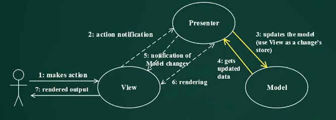
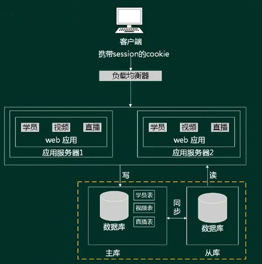
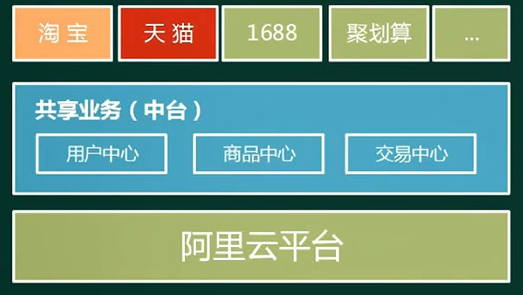

# 概念

架构的概念滞后于软件开发模型（如瀑布模型）。结构化开发方法中没有架构的概念。

- 位置：**架构处于需求分析和软件设计之间**，填补了业务层和技术层的鸿沟。
- 体系结构==架构：**架构就是需求分配，即将满足需求的职责分配道组件上**。

描述和作用：

1. 架构设计的一个核心问题是否能达到架构级的软件复用
2. 软件架构为软件系统提供了一个结构、行为和属性的高级抽象，有构成系统的元素的描述，元素的相互作用，指导元素集成的模式以及这些模式的约束组成。
3. 软件架构是项目干系人进行交流的手段，明确了对系统实现的约束条件，决定了开发和维护组织的组织结构，制约着系统的质量属性。
4. 软件架构使推理和控制更加简单，有助于循序渐进的原型设计，可以作为培训的基础。
5. 软件架构是**可传递和可复用**的模型，通过研究软件架构可能预测软件的质量。

发展史：

1. 无架构阶段：汇编语言
2. 萌芽阶段：程序结构设计
3. 初级阶段：统一建模语言UML
4. 高级阶段：4+1视图

建模分类：

- **结构模型**:以架构的构件、连接件和其他概念来刻画结构
- 框架模型:不太侧重描述结构的细节而更侧重于整体的结构
- **动态模型**:系统的“大颗粒”的行为性质D
- 过程模型:构建系统的步骤和过程
- 功能模型:由一组功能构件按层次组成，下层向上层提供服务

**4+1视图和UML的对应关系**：

# 风格

定义：

- **软件架构风格**是描述某一特定应用领域中系统组织方式的惯用模式。
- 架构风格定义一个系统家族，即一个体系结构定义一个词汇表（**描述系统的术语表**）和一组约束（**指导构建系统的规则**）。词汇表中包含一些构件和连接件类型，而这组约束指出系统是如何将这些构件和连接件组合起来的。
- 架构风格反映领域中众多系统所共有的结构和语义特性，并指导如何将各个构件组织成一个完整的系统。

5种类型：

1. 数据流风格：批处理序列，管道-过滤器。（用于按流程对数据处理）
2. 调用/返回风格：主程序/子程序，面向对象、层次结构
3. 独立构件风格：进程通信，事件驱动系统（隐式调用）
4. 虚拟机风格：解释器（工作流引擎），基于规则的系统。
5. 仓库风格：数据库系统，超文本系统，黑板系统。

## 数据流风格

特点：数据处理，严格流程。

批处理序列：

1. 构件为一系列固定顺序的计算单元，构件之间只通过数据传递交互
2. 每个处理步骤都是一个独立的程序，每一步必须在其前一步结束才能开始。
3. **数据必须是完整的，以整体的方式传递**。

管道-过滤器：

1. 每个构件都有一组输入和输出，构件读输入的**数据流**，经过内部处理，然后产生输出数据流。
2. 过程通常通过对输入**数据流**的变换或计算来完成，包括通过计算和增加信息以丰富数据，通过浓缩和删除精简数据，通过改变记录方式以转化数据，递增的转化数据等
3. 这里的**构件被成为过滤器**，连接件就是**数据流传输的管道**，将一个过滤器的输出传到另一个过滤器的输入。
4. **早期编译器采用这种架构风格，若要一步步处理，均可考虑使用此架构风格。**

区别：

1. 数据量不同：批处理序列可以一次处理大量的数据，管道过滤器一般都是一个个的单独处理
2. 数据要求不同：批处理序列要求数据完整，管道过滤器支持数据流（流式处理）。如在线视频播放，流媒体采用流式处理，实现边下载边播放。

## 调用/返回风格

主程序/子程序（结构化）：

- 单线程控制，把问题划分为若干个处理步骤，构件即为主程序和子程序，子程序通常可合成为模块。
- 过程调用作为交互机制，充当连接件的角色。
- 调用关系具有层次性，语义逻辑表现为：主程序的正确性取决于它调用子程序的正确性。

面向对象：

- 构件是对象，对象是抽象数据类型的实例，在抽象数据类型种，数据的表示和相应操作被封装起来，对象的行为体现在其接受和请求的动作。
- 连接件即是对象间交互的方式，对象是通过函数和过程的调用来交互的。

层次结构：

- 构件组织成一个层次结构，连接件通过决定层间如何交互的协议来定义。
- 每层为上一层提供服务，使用下一层的服务，只能见到与自己邻接的层。
- 通过层次结构，可以将大的问题分解为若干个渐进的小问题逐步解决，可以隐藏问题的复杂度。
- 修改某一层，最多影响其相邻的两层（通常只能影响上层）

优点：

1. 这种风格支持基于可增加抽象层的设计，允许**将一个复杂问题分解成一个增量步骤序列的实现**。
2. 不同层次处于不同的抽象级别：越靠近底层，抽象级别越高；越靠近顶层，抽象级别越低。
3. 由于每一层最多只影响**两层**，同时只要给相邻层提供相同的接口，允许每层用不同的方法实现，并为**软件复用**提供强大的支持。。

缺点：

1. 并不是每个系统都可以很容易的划分为分层的模式
2. 很难找到一个合适的、正确的层次抽象方法。

## 独立构件风格

进程通信：

- 构件是独立的进程，连接件是消息传递。
- 构件通常是命名过程，消息传递的方式包括点对点、异步/同步方式，远程过程（方法）调用等。

事件驱动系统（隐式调用）

- 构件不直接调用一个过程，而是触发或广播一个或多个事件。
- 构件中的过程在一个或多个事件中注册，当某个事件触发时，系统自动调用在这个事件中注册的所有过程。一个事件的触发就导致另一个模块中的过程调用
- 这种风格中的构件是匿名的过程，它们之间交互的连接件往往以过程之间的隐式调用来实现。
- 优点：为软件复用提供强大的支持，为构件的维护和演化带来了方便
- 缺点：构件放弃了对系统计算的控制。

各个构件独立演化，实现解耦。

## 虚拟机风格

应用于支持自定义需求的场景。

解释器：

- 通常包括一个完成解释工作的解释引擎，一个包含将被监视的代码的存储区，一个记录解释引擎当前工作状态的数据结构，以及一个记录源代码被解释执行的进度的数据结构。
- 具有解释器风格的软件中含有一个虚拟机，可以仿真硬件的执行过程和一些关键应用。
- 缺点：执行效率比较低。

基于规则的系统：

- 包括规则集，规则解释器，规则/数据选择器，工作内存。
- 一般用于人工智能领域和DSS中。

## 仓库风格

也叫数据共享或以数据为中心的风格，构件分两种：**中央数据结构（中心仓库，保存系统的当前状态）**，**独立构件（对中央数据存储进行操作）**；

**数据库系统**：如mysql，处理数据文件。

**黑板系统**：包括知识源、黑板、控制三部分

- 知识源包括若干独立计算的不同单元，提供解决问题的知识。

- 黑板是一个全局数据库，包含问题域解空间的全部状态。是知识源相互作用的唯一媒介。知识源响应黑板的变化，只修改黑板。

- 知识源响应是通过黑板状态的变化来控制的。

- 通常应用于解决问题没有确定性的算法的软件中，如**语音识别、信号处理、问题规划和编译器优化**等。

- 

  结构和数据库系统类似，黑板系统通常以数据库系统为基础；黑板系统把一个公共数据区域，不仅用于数据存储，也作为数据传递、共享，控制的机制（如教室的黑板）。

**超文本系统**：

- 构件以网状链接方式相互连接，用户可以在构件之间进行按照人类的联想思维方式任意跳转道相关构件。
- 超文本是一种非线性的网状信息组织方法，以结点为基本单位，链为结点之间的联想式关联。
- 通常应用于互联网领域

**现代集成编译环境一般采用这种架构风格，**原因是：

1. 传统编译过程：源代码=> 词法分析=> 语法分析=> 语义分析=> 代码生成和优化=>编译成exe文件；
   1. 每一段处理过程都是以独立功能模块的形式存在，程序源代码作为一个整体，依次在不同模块中传递，最终完成编译；
   2. 所以传统编译器采用了**批处理序列-数据流风格**
2. 现代编译过程：构造一个**语法树（黑板）**，在其基础上对接很多工具（**处理部件**），如编辑器，调试器，变量监控，断点追踪
   1. 随着编译、链接，调试、执行等开发过程的一体化趋势发展，集成开发环境（IDE）随之出现。
   2. IDE集成了编译器、连接器、调试器等多种工具，支持代码的增量修改与处理，能够实现不同工具之间的信息交互，覆盖整个软件开发生命周期。针对这种需求，IDE采用(**黑板**)架构风格比较合适。
   3. IDE强调交互式编程，用户在修改程序代码后，会同时触发语法高亮显示、语法错误提示、程序结构更新等多种功能的调用与结果呈现，针对这种需求，通常采用（**隐式调用**）架构风格比较合适。
3. 现代集成编译环境可以使用多种风格，至少包括仓库风格和隐式调用风格：若强调牵一发而动全身，则使用事件驱动系统-独立构件风格；若侧重于对同一颗语法树进行操作，则是仓库风格。

## 其它风格

### 闭环控制架构 

也叫**过程控制**，分为开环（遥控器）和闭环（空调比较环境温度和设置温度）。

- 当软件用来操作一个物理系统时，软件和硬件之间可以粗略的表示为一个**反馈循环**，这个反馈循环通过接受一定的输入（如环境变量），确定一系列的输出，不断进行调整平衡，最终使环境达到一个新的状态。
- **适用于嵌入式系统，涉及连续的动作与状态**。

变频空调：不会全功率执行降温，持续维持温度，而不是关了开，开了关。

### C2风格

是一种并行构件网络，基本规则：

1. 构件和连接件都有一个顶部和一个底部
2. 构件的顶部要连接到连接件的底部，构件的底部要连接连接件的顶部，构件之间不允许直连。
3. 一个连接件可以和任意数目的其它构件和连接件相连
4. 当两个连接件进行直接连接时，必须有其中一个的底部到另一个的顶部

处于理论研究阶段，可参考《软件体系结构》

## 常用风格

### 层次架构风格

两层C/S：数据库是数据层，客户端时表示层。缺点：开发成本高，客户端程序设计复杂，信息内容和形式单一，用户界面风格不一，软件移植、升级、维护困难，新技术不能轻易应用

三层C/S：增加功能层，更加灵活。缺点：需要安装客户端。

**三层B/S**，**应用服务器变成web服务器**，解决安装客户端的问题；

早期的缺点：

1. B/S架构缺乏对动态页面的支持能力，没有集成有效的数据库处理功能
2. 采用B/S架构的应用系统，在数据查询等响应速度上，要远远低于C/S架构
3. B/S架构的数据提交一般以页面为单位，数据的动态交互性不强，不利于OLTP应用
4. B/S架构的安全性难以控制

混合架构：企业外部和内部采用不同架构风格

三层结构：

1. 表现层：**MVC，MVP，MVVM**
2. 中间层（业务逻辑层）
3. 数据访问层：**ORM**
4. 数据架构层：数据库

### MVC架构风格

分为主动MVC和被动MVC

1. Model（模型）：是应用程序中用于处理**数据逻辑**的部分。通常模型对象负责在数据库中存取数据
2. View（视图）：是应用程序中处理**数据显示**的部分。通常视图是依据模型建立的。
3. Controller（控制器）：是应用程序中处理**用户交互**的部分。通常控制器负责从视图读取数据，控制用户输入，并向模型发送数据。

缺点：层次架构风格，每一层只和相邻两层对接，MVC有跨层级，View和Model耦合

**J2EE体系结构中**

- 视图（View）：**JSP**
- 控制（Controller）：**Servlet**
- 模型（Model）：**EntityBean，SessionBean**

### MVP架构风格

- MVP是MVC的变种，实现了V和M之间的解耦（V不直接使用M，修改互不影响）
- 更好的支持单元测试（业务逻辑在P中，可以脱离V来测试逻辑；可以将一个P用于多个V，而不需要改变P的逻辑）
- V处理界面事件，P处理业务逻辑，M处理数据模型

### MVVM架构风格

与MVP的思想相同，只是进行技术的革新。

### 富互联网应用RIA

- RIA结合了C/S架构反应速度快，交互性强的优点，以及B/S架构传播范围广及容易传播的特性。
- RIA简化并改进了B/S架构的用户交互
- 数据能被缓存在客户端，从而实现一个比基于HTML的响应速度更快且数据往返服务的次数更少的用户界面
- 特点：第一次打开时需要加载资源，速度很慢，但之后的运行表现力强，运行速度快。如网页游戏。

### 基于服务的架构SOA

定义：服务是一种为了满足某项业务需求的操作、规则等的逻辑组合，它包括一系列有序活动的交互，为实现用户目标提供支持。两种实现方式：ESB总线和WebService

**SOA可以根据需求通过网络对松散耦合的粗粒度应用组件进行分布式部署、组合和使用。服务层是SOA的基础，可以直接被应用调用，从而有效控制系统中与软件代理交互的人为依赖性。**

SOA三大特点：**松散耦合，粗颗粒，标准化接口**。对象到构件，颗粒度变大，并且标准化，容易复用。服务是在构件的基础上，进一步做标准化。

服务构件和传统构件的区别：

1. 服务构件粗颗粒，传统构件细粒度居多
2. 服务构件的接口是标准的，主要是WSDL接口，传统构件常以具体的API形式出现
3. 服务构件的实现与语言无关，传统构件绑定某种特定语言。
4. 服务构件可以通过构件容器提供QoS的服务，传统构件完全由程序代码控制。

#### 实现方式

**Web Service**

1. 用来封装单个服务的技术，可以跨平台，跨语言。
2. 包括：底层传输协议、服务通信协议、服务描述层、服务层、业务流程层、服务注册层
3. **服务描述**：可以使用WSDL协议，用于标识服务的功能。
4. 动态绑定是指：服务请求者询问服务注册中心，找到可用的服务提供者，再进行绑定。

**ESB总线**

- 采用中介者模式，将服务之间点对点连接的复杂网状结构，简化成星型结构。
- 解决不同的服务（协议，语言、标准不同）之间的互联互通。
- 提供位置透明性的消息路由和寻址服务。
- 提供服务注册和命名的管理功能
- 支持多种的消息传递范围、多种可以广泛使用的传输协议，多种数据格式及其相互转换
- 提供日志和监控性能。

ESB和WebService的关系：如同电脑和交换机的关系，是协作互补的关系，而不能作为同种类型进行对比。

 **服务注册表**

1. 服务注册:应用开发者（服务提供者)向注册表公布服务的功能
2. 服务位置:服务使用者（服务应用开发者)，帮助他们查询注册服务，寻找符合自身要求的服务
3. 服务绑定:服务使用者利用检索到的服务接口来编写代码，所编写的代码将与注册的服务绑定、调用注册的服务，以及与它们实现互动

#### 关键技术

| 功能       | 协议                 |
| ---------- | -------------------- |
| 发现服务   | UDDI、DISCO          |
| 描述服务   | WSDL、XML Schema     |
| 消息格式层 | SOAP、REST           |
| 编码格式层 | XML（DOM，SAX）      |
| 传输协议层 | HTTP，TCP/IP，SMTP等 |

1. WSDL就是WebService接口对应的WSDL文件，该文件通过XML格式说明如何调用，可以看作WebService的接口文档（使用说明书）

2. SQAP（Simple Object Access Protocol）简单对象访问协议，是一种网络通信协议。它是基于XML的简易协议，可以使不同平台、语言的应用程序在HTTP上进行信息交换（通讯）。

   SOAP协议 = HTTP协议 + XML数据格式。是HTTP+XML进行基于Web通信的技术

3. REST，强调信息本身，称为资源，特点是：

   1. 网络上的所有事务都被抽象为资源
   2. 每个资源对应一个唯一的资源标识
   3. 通过通用的连接器接口对资源进行操作
   4. 对资源的各种操作不会改变资源标识
   5. 所有的操作都是无状态的。

REST和REST Ful的区别：一个是方法论，一个是实现。

### 微服务

介绍：

1. 是一种架构模式，属于面向服务架构的一种。提倡将单一应用程序划分成一组小的服务，服务之间互相调用，互相配合，为用户提供最终价值。

2. 每个服务运行在独立的进程中，服务和服务之间采用轻量级的通信机制互相沟通（通常是基于HTTP协议的RESTful API）。

3. 每个服务都围绕具体业务进行构建，能被独立部署到生产环境，类生产环境等。

4. 要避免统一的、集中式的服务管理机制，对具体的一个服务而言，应根据服务上下文，选择合适的语言、工具对其进行构建。

5. 微服务架构的技术支撑：

   

6. 微服务和单体架构的区别

   

**特点**：

1. 小，且专注于做一件事情
2. 轻量级的通信机制
3. 松耦合、独立部署。

**优势**：技术异构性（使用不同语言、架构、技术）、弹性（颗粒度小，组合变化容易）、扩展、简化部署（自动化部署）、与组织结构相匹配（服务分为不同开发小组负责）、可组合性、对可替代性的优化。

**挑战**：分布式系统的复杂度、运维成本、部署自动化、DevOps和组织结构、服务间依赖测试和管理。

**发展**：容器出现后，微服务的部署环境问题得到解决，进而发展加快。

**SOA和微服务的区别**：

| 微服务（活字印刷）           | SOA（雕版印刷）                                          |
| ---------------------------- | -------------------------------------------------------- |
| 能拆分就拆分                 | 是整体的，服务能放一起的都放一起                         |
| 纵向业务划分                 | 水平业务划分                                             |
| 由单一组织负责（独立子公司） | 按层级划分不同部门的组织负责（大公司划分出的业务单元BU） |
| 细粒度（组件少）             | 粗粒度（存在较复杂的组件）                               |
| 功能简单，描述少             | 功能复杂，描述多                                         |
| 业务逻辑存在于每一个服务中   | 业务逻辑跨多个业务领域                                   |
| 使用轻量级的通信方式，如HTTP | 企业服务总线（ESB）充当服务间通信的角色                  |

| 微服务架构实现                   | SOA实现                          |
| -------------------------------- | -------------------------------- |
| 团队级，自底向上开展实施         | 企业级，自顶向下开展实施         |
| 一个系统被拆分成多个服务，细粒度 | 服务由多个子系统组成，粗粒度     |
| 松散的服务架构，无集中式总线     | 企业服务总线，集中式的服务架构   |
| 集成方式简单（HTTP/REST/JSON)    | 集成方式复杂（ESB/WS/SOAP)       |
| 服务能独立部署                   | 单块架构系统，相互依赖，部署复杂 |

### 模型驱动架构MDA

Model Driven Architecture：起源于分离系统规约和平台实现的思想，就是先建立模型，再通过映射生成代码，最终得到软件系统，不需要通过测试被动的发现问题。

- Model：客观事物的抽象表示
- Architecture：构成系统的部件、连接件及其约束的规约。
- Model-Driven：使用模型完成软件的分析、设计、构建、部署、维护等开发工作

**主要目标：**Portability（可移植性），interoperability（互通性），Reusability（可重用性）

3种核心模型：

1. 平台独立模型（PIM）：具有高抽象层次，独立于任何实现技术的模型。（如**UML与平台语言无关**）
2. 平台相关模型（PSM）：为某种特定实现技术量身定做，让你用这种技术种可用的实现构造来描述系统的模型。PIM会通过**变换工具**变成一个或多个PSM。
3. 代码Code：用源代码对系统的描述（规约），每个PSM都将通过**变换工具**变成代码。

### 特定领域软件架构DSSA

理念：以架构为导向，通过分析**行业的共性**，完成业务领域的架构设计和实现，为之后大量的应用做基础。（**行业解决方案**）

基本活动：

领域分析机制：

1. **领域专家**：有经验的用户、从事该领域中系统的需求分析、设计、实现以及项目管理的有经验的工程师等，主要任务是提供关于领域中**系统的需求规约和实现的知识**。（提建议，不干活）
2. **领域分析人员**：由具有知识工程背景的有经验的系统分析员
3. **领域设计人员**：由经验的软件设计人员。
4. **领域实现人员**：由经验的程序设计人员。

建立过程：定义领域范围 => 定义领域特定的元素 => 定义领域特定的设计和实现需求约束 => 定义领域模型和架构 => 产生、搜集可复用的产品单元（再并发、递归、反复、螺旋型的到开始阶段）。

**三层次模型**：

1. 领域开发环境：指开发共性的东西。
2. 领域特定的应用开发环境：指利用共性，结合用户需求，调整并定型。
3. 应用执行环境：

## 架构的描述语言ADL

ADL是这样一种**形式化语言**，它在底层语义模型的支持下，为软件系统的概念体系结构建模提供了具体语法和概念框架。基于底层语义的工具为体系结构的表示、分析、演化、细化、设计过程等提供支持。

**ADL的三个基本元素**：

1. 构件：计算或数据存储单元
2. 连接件：用于构件之间交互建模的体系结构构造块及其支配这些交互的规则。
3. 架构配置：描述体系结构的构件与连接件的连接图。

## 题目

1. 某公司欲开发一个基于图形用户界面的集成调试器。该调试器的编辑器和变量监视器可以设置调试断点。当调试器在断点处暂停运行时，编辑程序可以自动卷屏到断点，变量监视器刷新变量数值。针一对这样的功能描述，采用( **事件驱动系统 - 隐式调用 - 独立构件** )的架构风格最为合适。

   原因：题目描述的是事件触发其它模块的调用。

2. 某公司欲开发一个漫步者机器人，用来完成火星探测任务。机器人的控制者首先定义探测任务和任务之间的时序依赖性（**解释器**），机器人接受任务后，需要根据自身状态和外界环境进行动态调整（**过程控制**），最终自动完成任务。针对这些需求，该机器人应该采用(）架构风格最为合适。

# 设计

## ABSD概念

**基于架构的软件设计ABSD**（Architecture Based Software Design的概念和基本思想：

- ABSD方法是架构驱动，即强调**业务、质量和功能需求的组合**驱动架构设计
- 设计活动可以从项目总体功能框架明确就开始，意味着需求获取和分析还没完成，就开始软件设计
- 三个基础：**功能分解**（使用已有的基于模块的内聚和耦合技术），通过**选择架构风格来实现质量和业务需求**，**软件模板的使用**（利用一些软件系统的结构）。
- ABSD方法是**递归的**，且迭代的每一个步骤都是清晰定义的。
- **视角和视图：从不同的视角来检查，会有不同的视图。**
- 需求描述：**用例用来捕获功能需求，特定场景用来捕获质量（非功能）需求**（性能，可靠性）。
- ABSD能很好的支持软件重用。

## 开发过程

1. **架构文档化**过程的输出结果：**架构规格说明，测试架构需求的质量设计说明书**

   文档注意事项：文档要从使用者的角度进行编写，必须分发给所有与系统有关的开发人员，且要保证都是最新。
2. **架构复审**的目的：标识潜在的风险，及早发现架构设计中的缺陷和错误。

   O:N表示迭代次数，可能一次就过，不需要迭代，也可能需要多次迭代。

# 评估

前言：

- 为什么要进行架构评估？
  - 和开发过程中的**架构复审**阶段对应。
  - 瀑布模型的缺陷：强调一次性完成系统的设计和开发，所以在需求阶段出现的问题会延续到设计，编码和实现的阶段，从而导致一步错步步错。
  - 体现了需求的重要性，设计中的高层设计就是架构设计，在需求之后设计之前。所以完成架构设计，需要进行评估，及早的发现并解决问题。
- 架构评估到底评什么
  - 评的是与需求的匹配度，架构是需求的解决方案，是否能解决用户所提的需求。
  - 分为：功能性（如需求）和非功能性（如质量属性）
- 架构评估怎么评

## 质量属性

1. **性能**（performance）：指系统的响应能力，即要经过多长时间才能对某个事件做出响应，或者在某段时间内系统所能处理的事件的个数。

   代表参数：响应时间，吞吐量		设计策略：优先级队列，**资源调度**

2. **可用性**（availability）：是系统能**正常运行的时间比例**。经常用两次故障之间的时间长度或出现故障时系统能够恢复正常的速度来表示。

   代表参数：故障间隔时间			设计策略：**冗余**（集群）、心跳线

3. **安全性**（security）：指系统在**向合法用户提供服务的同时，能阻止非授权用户使用的企图或拒绝服务的能力**。安全性又可划分为机密性、完整性、不可否认性及可控性等。

   设计策略：**追踪审计**（记录每个用户的操作日志，用于分析和审计）

4. **可修改性**（modifiability）：指能快速的以**较高的性能代价比对系统进行变更的能力**，通常以某些具体的变更为基准，通过考察这些变更的代价衡量可修改性。

   主要策略：**信息隐藏**，高内聚低耦合。

5. 可靠性（reliability）：是软件系统在应用或系统错误面前，在意外或错误使用的情况下，维持软件系统的功能特性的基本能力。主要考虑两个方面：容错、健壮性。**可靠性决定可用性**。

   代表参数：MTTF、MTBF			设计策略：冗余、心跳线。

6. 功能性（完成所期望的功能的能力），可变性（系统的体系结构变更为新体系结构），互操作性（与其它系统或自身环境相互作用）。

重点前四项（**性能，可用性，安全，可修改性**），是**选定架构的重要指标**。

练习题，质量属性的表现形式：

1. 用户提交搜索请求后，系统必须在1秒内显示结果;（**性能**）
2. 用户信息数据库**授权**必须保证99.9%可用；（**安全性**：授权不可用，如用户名为空但可以登录，可以访问任意信息，但数据库是可用的）
3. 系统由MySQL数据库升级为Oracle数据库，必须在1人月内完成;（**可修改性**）
4. 主服务器出现严重问题无法提供服务时，备用系统10分钟内能接替其工作;（**可用性** - 既是可靠性又可以是可用性的，一律填默认答案 - 可用性）
5. 需要在3人周内为系统添加一种新的支付方式——支付宝;（**可修改性**：而不是功能性，因为有时间限制）
6. 视频点播时，超清模式必须保证画面具有1280*720的分辨率;（**性能**）
7. 主站点断电后，需要在3秒内将访问请求重定向到备用站点。（**可用性**）

## 三大特性

- 风险点：指架构设计中潜在的、存在问题的架构决策所带来的隐患。

- 敏感点：指为了实现某种特定的质量属性，一个或多个构件所具有的特性。

  如设计中的某些构件参数的调整，对结果影响大，需要管控，在可控范围内变化。

- 权衡点：是影响多个质量属性的特性，是多个质量属性的敏感点。

  如安全和性能，只能折中平衡。

三者区别：

1. 敏感点：强调某个质量属性变化或受到刺激，引起系统其它方面的变化，（强调变化）
2. 风险点：由于考虑不周，导致架构中存在隐患。（强调不好的变化）
3. 权衡点：安全级别的调整，带来了安全性和性能的变化。

评估的方法：

1. 度量：先定出标准，由经验丰富的架构设计人员进行评分，可行性不高。

2. 场景：架构是否满足场景的要求。系统在场景中，受到刺激（进行的操作），系统接受指令后发生的响应。具体化客观问题，验证架构的可行性。

   获取功能方面需求时，用的是用例；获取非功能的质量属性时，用场景。

## 基于场景的方法

过程：

1. 确定应用领域的功能和软件架构的结构之间的映射。
2. 设计用于体现待评估质量属性的场景。
3. 分析软件架构对场景的支持程度。

三种分析法：

1. **软件架构分析法（SAAM）**：最初用于分析架构可修改性，后扩展到其它质量属性。

   

2. **架构权衡分析法（ATAM）**：在**SAAM的基础上**发展起来，主要针对性能、实用性、安全性和可修改性，在系统开发之前，**对这些质量属性进行评价和折中**。

   1. 第一阶段：**场景和需求（约束、环境）收集**，需求（场景）有优先级，则质量属性有优先级。
   2. 第二阶段：**架构视图和场景实现**，
   3. 第三阶段：**属性模型构造和分析**，特定属性分析（优秀的单一理论：先一个个分析，再把有冲突的做折中）
   4. 第四阶段：**标志折中和敏感度**。（可迭代，进入第一阶段）

3. 成本效益分析法（CBAM）

## 质量效应树

作用：将之前的内容联系起来

效用：

1. 性能
   1. 数据延迟：
      1. （M，L）把数据库的存储延迟到最小值（200ms）
      2. （H，M）提供实时视频图像
   2. 交易吞吐量：：（M，M）使认证服务器的平均吞吐量最大化
2. 可修改性
   1. 新产品目录
   2. 商业产品的改变
      1. （L，H）以小于20人/月的工作量添加CORBA中间件
      2. （H，L）以小于4人/周的工作量更改web用户界面
3. 可用性
   1. 硬件故障
      1. （L，H）若站点1断电，要求在3秒内将任务重定向到站点3
      2. （M，M）若磁盘出现故障，要在5分钟内重新启动
      3. （H，M）要在1.5分钟内检测并恢复网络故障。
   2. 商业软件故障
4. 安全性：
   1. 数据机密性
      1. （L，H）信用卡交易在99.9999%的时间内是安全的。
      2. （L，H）客户数据库认证在99.9999%的时间内能正常工作。
   2. 数据完整性

# 软件产品线

## 基本概念

1. **特定领域软件架构DSSA**的扩展。将一系列技术串起来，形成一套解决方案。
2. 适用于业务聚焦，多年深耕积累，把产品化的过程用产品线实现。
3. 多种技术综合应用（软件架构，软件工程，DSSA），适合做行业解决方案。

## 过程模型

运作方式：双生命周期模型，类似DSSA。

1. 领域工程完成共性，应用工程完成个性化。
2. 领域分析的产出物作为应用工程的需求输入，增补新的系统需求。
3. 领域设计将需求中共性的模块抽离设计出来，作为单个应用工程的设计输入。

## 建立方式

|              | 演化方式                                                     | 革命方式                                                     |
| ------------ | ------------------------------------------------------------ | ------------------------------------------------------------ |
| 基于现有产品 | 基于现有产品架构设计产品线的架构，经演化现有构件，开发产品线构件（**稳**） | 核心资源的开发基于现有产品集的需求和可预测的、将来需求的超集 |
| 全新产品线   | 产品线核心资源随产品新成员的需求而演化                       | 开发满足所有预期产品线成员的需求的核心资源（**风险高**）     |

从两个维度形成4种方法论：

1. 将现有产品演化为产品线
2. 用软件产品线替代现有产品集
3. 全新软件产品线的演化
4. 全新软件产品线的开发

## 组织结构

类型：

1. 设立**核心资源小组**：负责核心产品；应用组，负责个性化应用、实施。
2. 动态的组织结构，不设立独立的核心资源小组。

成功实施产品线，主要取决于一下因素：

1. 对该领域具备长期和深厚的经验
2. 一个用于构建产品的好的核心资源库
3. 好的产品线架构
4. 好的管理（软件资源，人员组织，过程）支持。

# 构件和中间件技术

## 构件

### 概念

1. 定义1：**软件构件是一种组装单元，它具有规范的接口规约和显式的语境依赖。软件构件可以被独立的部署并由第三方任意的组装**。（广义的构件还包含文档）
2. 定义2：构件是某系统中有价值的、几乎独立的并可替换的一个部分，它在良好定义的体系结构语境内满足某清晰的功能。
3. 定义3：构件是一个独立发布的功能部分，可以通过其接口访问它的服务。
4. 服务是对构件的标准封装。构件就是组件。中间件是构件的一种。

构件，对象，模块的区别：

| 构件的特性                                                   | 对象的特性                                                   | 模块的特性               |
| ------------------------------------------------------------ | ------------------------------------------------------------ | ------------------------ |
| 1、独立部署单元 2、作为第三方的组装单元 3、没有（外部的）可见状态 | 1、一个实例单元，具有唯一的标志 2、可能具有（外部可见）状态 3、封装了自己的状态和行为 | 结构化开发的产物（函数） |

**构件系统架构特性**：

1. 构件系统体系结构由一组平台决策、一组构件框架之间的互操作设计组成。**构件框架**是一种专用的体系结构（通常围绕一些关键的机制），同时亦是一组固定的作用域构件层次机制的策略。
2. 概念框架的互操作设计包括：系统体系结构连接的所有框架件的互操作规则。
3. **构件**是一组通常需要同时部署的原子构件。构件和原子构件之间的区别在于：大多数原子构件永远不会被单独部署，尽管它们可以被单独部署。
4. 一个**原子构件**是一个模块和一组资源。
5. **模块**是一组类和可能的非面向对象的结构体，比如过程或函数。
6. 资源是一个类型化的项的固定集合。

**资源**这个概念可以包括代码资源，进而包括模块。问题在于除了编译器编译一个模块或包生成的资源外，还可能存在其它资源。在“纯对象”的方法中，资源是**外部化的不可改变的对象**（不可改变是因为构件没有持久化标志，而且复制不能被区分）。

### 复用

流程：**检索与提取构件 => 理解和评价构件 => 修改构件 => 组装构件**

1. 检索与提取构件
   1. 基于关键字的检索：系统在图形用户界面上将构件库的关键字树形结构直观的展示给用户，复用者通过对树形结构的逐级浏览，寻找需要的关键字并提取相应的构件
   2. 刻面检索法：该方法基于刻面分类法，由三步构成，构造查询、检索构件、对构件进行排序。优点是易于实现相似构件的查找，但复用者在构造查询时比较麻烦。
   3. 超文本检索法：复用者使用一个或数个关键字，系统在构件的说明文档中进行精确或模糊的语法匹配，匹配成功后，向复用者列出相应的构件说明。优点是用户界面友好，但某些情况下复用者难以在超文本浏览过程中正确的选取构件。
2. 理解和评价构件
   1. 要复用构件，特别是对构件修改时，必须准确的理解构件。
   2. 为达到目的，必须要求构件的开发过程遵循公共标准
   3. 一般构件库的说明文档会说明以下内容：构件的功能和行为、相关的邻域知识、可适应性约束条件与例外情形、可以预见的修改部分及修改方法。
3. 修改构件
   1. 理想状态时直接复用构件库中现成的构件，但大多数情况下，需要对构件进行修改，以应对新需求。
   2. 为了减少构件修改的工作量，要求开发时尽量使构件的功能、行为和接口的设计更为抽象化、通用化、参数化。复用者可以通过对实参的选取来调整构件的功能和行为，也可以借助设计信息和文档修改构件。
   3. 构件库中若无可修改使用的构件，则按新需求开发构件，并存入构件库
4. 组装构件
   1. 基于功能的组装技术：采用子程序调用和参数传递的方式将构件组装起来。要求库中的**构件以子程序、过程、函数的形式出现**，并且接口说明必须清晰。当使用这种组装技术进行软件开发时，开发人员要对新系统进行功能分解，将系统分解为松耦合、强内聚的功能模块；然后根据各模块的功能需求提取构件，进行适应性修改后，再挂接再上述功能分解框架中。
   2. 基于数据的组装技术：先根据当前软件问题的核心数据结构设计出一个框架，然后在根据框架中各节点的需求提取构件，并进行适应性修改，再将构件逐个分配到框架中的适当位置。此后，构件的组装方式仍然是传统的子程序调用与参数传递。要求库中的构件必须以子程序的形式出现，但依赖的软件设计方法不再是功能分解，而是面向数据的设计方法，如Jackson系统开发方法。
   3. 面向对象的组装技术：由于封装和继承特征，面向对象方法比其软件开发方法更适合支持软件复用。面向对象的开发方法中，如果从类库中检索出来的基类能够完全满足新系统的需求，则可以直接应用。否则必须以基类为父类，生成相应的子类，以满足新系统的需求。

构件组装过程中失配问题：

1. 由构件引起的失配，包括由于系统对**构件基础设施、构件控制模型和构件数据模型**的假设存在冲突引起的失配。
2. 由连接子引起的失配，包括由于系统对**构件交互协议、连接子数据模型**的假设存在冲突引起的失配。
3. 由于系统成分对**全局体系结构**的假设存在冲突引起的失配等。

要解决失配问题，首先需要检测出失配问题，并在此基础上通过适当的手段消除检测出的失配问题。

## 中间件

### 概念

定义：

1. 中间件是一种**独立的系统软件或服务程序**，可以帮助分布式应用软件在不同的技术之间共享资源。如消息中间件，ODBC，JDBC。
2. 属于构件的一种，是**一类系统软件**（系统软件为应用软件提供支持和服务）

作用：

1. 负责客户机和服务器之间的连接和通信，以及客户机与应用层之间的高效率通信机制
2. 提供应用层不同服务之间的互操作机制，以及应用层和数据库之间的连接和控制机制
3. 提供多层架构的应用开发和运行的平台，以及应用开发框架，支持模块化的应用开发
4. 屏蔽硬件、操作系统、网络和数据库的差异。
5. 提供应用的负载均衡和高可用性、安全机制与管理功能，以及交易管理机制，保证交易的一致性
6. 提供一组通用的服务去执行不同的功能，避免重复的工作和使应用之间可以协作。

**优点**：

1. 面向需求：设计师可以集中精力于业务逻辑本身。
2. 业务的分隔和包容性：应用开发人员可以按照不同的业务进行功能的划分，体现为不同的接口或交互模式。
3. 设计与实现隔离：构件对外发生作用或构件间的交互，都是通过接口进行的，构件使用者只知道构件的接口，不必关心其内部实现。
4. 隔离复杂的系统资源：架构的重要功能使将系统资源和应用构件隔离，是保证构件可以复用、“即插即用”的基础，和中间件的意图一致。
5. 符合标准的交互模型：中间件实现了架构的模型，实现了标准的协议
6. 软件复用：中间件提供了构件封装、交互规则、与环境的隔离等机制，为软件复用提供了方便的解决方案。
7. 提供对应用构件的管理：基于中间件的软件可以方便的进行管理，因为构件可以通过标识机制进行划分。

### Corba

原理：构建代理的机制。客户端有服务端的对象引用（即代理），则使用本地调用的方式，而不需要考虑远程问题。当客户端调用对象引用时，请求调用会传递到服务端的伺服对象，执行完成后返回结果。

**Common Object Rrquest Broker Architecture公共对象请求代理体系结构**，角色有：

1. 伺服对象（Servant）：CORBA对象的真正实现，负责完成客户端请求。

2. 对象适配器（Object Adapeter）：用于屏蔽ORB内核的实现细节，为服务器对象的实现者提供抽象接口，以便使用ORB内部的功能。

3. 对象请求代理（Object Request Broker）：解释调用并负责查找实现该请求的对象，将参数传给找到的对象，并调用方法返回结果。客户方不用了解服务对象的位置、通信方式、实现、激活或存储机制。起到衔接各方，进行信息交换的作用，类似于总线。

   

CORBA体系的主要内容：

1. 对象请求代理（Object Request Broker,ORB)：负责对象在分布环境中透明的收发请求和响应，是构建分布对象应用，在异构或同构环境下实现应用间互操作的基础。
2. 对象服务（Object Services）：为使用和实现对象而提供的基本对象集合，独立于应用领域。
3. 公共设施（Common Facilitites)：向终端用户提供一组共享服务接口，例如系统管理，组合文档，电子邮件等。
4. 应用接口（Application Interfaces）：由销售商提供可控制其接口的产品，相当于传统的应用层表示，处于参考模型的最高层。
5. 领域接口（Domain Interfaces）：为应用领域服务提供的接口，如OMG组织为PDM系统制定的规范。

### J2EE

Bean运行于**EJB容器**（MVC中的M）之中，共分三类：

1. 会话Bean：描述于客户端的一个短暂的会话
2. 实体Bean：持久化数据，O/R映射
3. 消息驱动Bean：会话Bean+JMS，客户把消息发送给JMS目的地，然后JMS提供者和EJB容器协作，把消息发给消息驱动Bean。支持异步消息。

核心组成：

1. 容器：Applet Container, Applicateion Container, Web Container, EJB Container
2. 组件：Applet，Application，JSP/Servlet，EJB
3. 服务：
   1. HTTP(Hypertext Transfer Protocol)超文本传输协议
   2. RMI-IIOP(Remote Method Invocation ober the Internet Inter-ORB Protocol):远程方法调用，融合了Java RMI和CORBA在使用Application或Web 端访问EJB端组件是使用
   3. Java IDL(Java Interface Definition Language): Java接口定义语言，主要用于访问外部的CORBA 服务
   4. JTA (Java Transaction API):用于进行事务处理操作的 API
   5. JDBC (Java Database Connectivity):为数据库操作提供的一组APIJMS(Java Massage Service):用于发送点对点消息的服务
   6. JavaMail:用于发送邮件
   7. JAF (Java Activation Framework):用于封装传递的邮件数据
   8. JNDI (Java Naming and Directory Interface )
   9. JAXP (Java API for XML Parsing ):专门用于XML解析操作的API
   10. JCA (J2EE Connector Architecture ) :Java连接器构架
   11. JAAS (Java Authenticati on and Authorization Service)
   12. JSF (Java Server Faces)
   13. JSTL(JSP Standard Tag Library)
   14. SAAJ (SOAP with Attachments API for JAVA)
   15. JAXR (Java Apl for XML Registries)

# Web架构设计

## 概述

多个维度的技术：

1. 从架构来看：MVC，MVP，MVVM，REST，Webservice，微服务，中台
2. 从缓存来看：MemoryCache，Redis，Squid
3. 从并发分流来看：集群（负载均衡），CDN
4. 从数据库来看：主从库（主从复制），内存数据库，反规范化技术，NoSQL，分区（分表）技术，视图与物化视图
5. 从持久化来看：Hibernate，Mybatis
6. 从分布存储来看：Hadoop，FastDFS，区块链
7. 从数据编码看：XML，JSON
8. 从Web应用服务器来看：Apache，WebSphere，WebLogic，Tomcat，JBOSS，IIS
9. 其它：静态化，有状态与无状态，响应式Web设计。

访问量增加后，优化有两方面：

1. 升级单台服务器，提高性能和存储。如：微型计算机 => 小型机
2. 增加服务器，分担任务。如集群。

**系统演变历程**：单台服务器 => 数据库和Web服务器分离 => 应用服务器集群

**此时的问题**：

1. 用户的请求**由谁来转发**到具体的应用服务器。（负载均衡，负责调度）
2. 用户如果每次访问到的服务器不一样，如何维护**session的一致性**。（有状态和无状态问题）

## 负载均衡

定义：负载均衡就是最为常见的路由机制实现方案，能够**根据请求来选择合适的服务实例**，也就是可以把请求的流量转发到集群中的各个服务实例，从而达到**流量分摊**的效果。而支持这个过程的技术组件就叫**负载均衡器**。负载均衡器需要掌握各个服务实例的运行状态（当前服务实例列表信息）

多种分流的方法：

1. **基于特定软件的负载均衡（HTTP重定向）（应用层）**：HTTP重定向是应用层的请求转发，用户的请求已到了HTTP重定向负载均衡服务器，服务器根据算法要求用户重定向，用户收到重定向请求后，再次请求真正的服务器。

   特点：实现简单，但性能差。

2. **反向代理负载均衡（应用层）**：在用户的请求到达反向代理服务器时（已到达网站机房），由反向代理服务器根据算法转发到具体的服务器。常用的apache，nginx。

   特点：部署简单，但代理服务器可能成为性能的瓶颈。

3. **基于DNS的负载均衡（传输层）**，域名解析时，映射不同服务器的IP。用户请求DNS服务器，获取相对应的IP地址时，DNS服务器直接给出负载均衡后的服务器IP。

   特点：效率比HTTP重定向高，较少维护负载均衡服务器成本。但一个应用服务器故障，不能及时通知DNS（即使及时更新DNS，但有时候缓存还在），而且DNS负载均衡的控制权在域名服务器那里，网站无法做更多的改善和管理。

4. **基于NAT的负载均衡（传输层）**：将一个外部IP地址映射为多个IP地址，对每次连接请求动态的转换为一个内部节点的地址。

   特点：技术较成熟，一般在网关位置，可以通过硬件实现。如四层交换机采用此技术。

5. **混合型负载均衡**

**分发策略**：来自客户端的请求通过中间的负载均衡器被分发到了各个服务实例当中，然后根据分发策略的不同会产生不同的分发结果。

1. 静态算法：
   1. 轮询（Round Robin）：服务器按照顺序循环接受请求。
   2. 随机（Random）：随机选择一台服务器接受请求。
   3. 权重（Weight）：给每个服务器分配一个权重值，根据权重来分发请求到不同的机器中。
   4. IP哈希（IP Hash）：根据客户端IP计算Hash值取模访问对应服务器。
   5. URL哈希（URL Hash）：根据请求的URL地址计算Hash值取模访问对应服务器。
   6. 一致性哈希（Consistent Hash ）：采用一致性Hash算法，相同IP或URL请求总是发送到同一服务器。
   7. 轮询+权重：加权轮询
2. 动态算法：
   1. 最少连接数（Least Connection）：将请求分配给最少连接处理的服务器。
   2. 最快响应（Fastest Response）：将请求分配给响应时间最快的服务器。
   3. 观察（Observed）：以连接数和响应时间的平衡为依据请求服务器。
   4. 预测（Predictive）：收集分析当前服务器性能指标，预测下个时间段内性能最佳服务器。
   5. 动态性能分配（Dynamic Ratio-APM）：收集服务器各项性能参数，动态调整流量分配。
   6. 最少连接数/最快响应+权重:可以根据响应时间动态调整服务器的权重，达到负载均衡。
3. 区别：是否**依赖于当前服务的运行状态**，这些状态信息包括服务过去一段时间内的平均调用时延和所承受的连接数等。根据当前服务器的负载情况进行动态调整的算法，就是动态算法。
4. 自定义负载均衡算法
   1. 
   2. 灰度发布：平滑过渡的发布方式，可以降低发布失败风险，减少影响范围，发布出现故障时可以快速回滚，不影响用户。
   3. 版本隔离：为了兼容或者过度，某些应用会有多个版本，保证1.0版本不会调到1.1版本服务。
   4. 故障隔离：生产出故障后将出问题的实例隔离，不影响其他用户，同时也保留故障信息便于分析。
   5. 定制策略：根据业务情况定制跟业务场景最匹配的策略。

方式：

- 硬件负载均衡：F5
- 软件负载均衡：LVS、Nginx、HAproxy、Dubbo

Nginx

- RoundRobin：轮询。
- WeightedRoundRobin：加权轮询。
- IPHash：按访问IP的Hash选择服务器。
- URLHash：按请求URL的Hash选择服务器。
- Fair：根据后端服务器的响应时间判断负载情况，从中选出负载最轻的机器进行分流。

Dubbo

- RandomLoadBalance：加权随机。
- RoundRobinLoadBalance：加权轮询。
- LeastActionLoadBalance：最少链接数。
- ShortestResponseLoadBalance：最短响应时间。
- ConsistentHashLoadBalance：一致性Hash。

## 有状态和无状态

- 无状态服务（Stateless Service）对单词请求的处理，不依赖其它请求；处理一次请求所需的全部信息，要么包含在这个请求里，要么从外部（数据库）获取到，服务器本身不存储任何信息。
- 有状态服务（Stateful Service)，会在自身保存一些数据，先后的请求是有关联的。

维护Session的一致性：

1. 可以使用cookie存储session信息到客户端；
2. 可以使同一ip发出的请求访问同一服务器。
3. 使用Redis中间件存储session信息，统一访问。

## 高性能数据库集群

高性能数据库集群的实现方式：

- 第一种方式是“读写分离”，其本质是将访问压力分散到集群中的多个节点，但是没有分散存储压力；
- 第二种方式是“分库分表”，既可以分散访问压力，又可以分散存储压力。

### 读写分离

基本原理是：将数据库读写操作分散到不同的节点上：

基本实现是：

- 数据库服务器搭建主从集群，一主一从、一主多从都可以；
- 数据库主机负责读写操作，从机只负责读操作；
- 数据库主机通过复制将数据同步到从机，每台数据库服务器都存储了所有的业务数据；
- 业务服务器将写操作发给数据库主机，将读操作发给数据库从机

> 主从：从机一般需要提供服务，如提供读数据的功能；
> 主备：备机一般被认为仅仅提供备份功能，不提供访问功能；

两个细节点将引入设计复杂度：**主从复制延迟**和**分配机制**

1. 复制延迟：以 MySQL 为例，主从复制延迟可能达到 1 秒~1分钟。

   主从复制延迟会带来一个问题：如果业务服务器在数据写入主机后，在数据还未复制到从机时读取数据，会出现数据不存在问题。

   **解决主从复制延迟有几种常见的方法**：

   1. 写操作后的读操作指定发给数据库主服务器：这种方式和业务强绑定，对业务的侵入和影响较大，
   2. 读从机失败后再读一次主机：二次读取和业务无绑定，只需要对底层数据库访问的 API 进行封装即可，实现代价较小，不足之处在于如果有很多二次读取，将大大增加主机的读操作压力，进而出现崩溃
   3. **关键业务读写操作全部指向主机，非关键业务采用读写分离**：例如，对于一个用户管理系统来说，注册 + 登录的业务读写操作全部访问主机，用户的介绍、爱好、等级等业务，可以采用读写分离，因为即使用户改了自己的自我介绍，在查询时却看到了自我介绍还是旧的，业务影响与不能登录相比就小很多，还可以忍受

2. 分配机制：将读写操作区分开来，然后访问不同的数据库服务器，一般有两种方式：

   1. **程序代码封装**：在代码中抽象一个数据访问层（也称这种方式为中间层封装），实现读写操作分离和数据库服务器连接的管理

      开源的实现方案：淘宝的 TDDL（Taobao Distributed Data Layer），是一个通用数据访问层，所有功能封装在 jar 包中提供给业务代码调用。其基本原理是一个基于集中式配置的 jdbc datasource 实现，具有主备、读写分离、动态数据库配置等功能

      **特点**：

      - 实现简单，而且可以根据业务做较多定制化的功能；
      - 和编程语言相关，如果一个业务包含多个编程语言写的多个子系统，则重复开发的工作量比较大；
      - 故障情况下，如果主从发生切换，则可能需要所有系统都修改配置并重启

   2. **中间件封装**：是独立一套系统出来，实现读写操作分离和数据库服务器连接的管理。中间件对业务服务器提供 SQL 兼容的协议，业务服务器无须自己进行读写分离。

      开源实现方案（数据库中间件）有： MySQL Router，Atlas(基于 MySQL Proxy 实现)，Apache的ShardingSphere

      特点：

      - 能够支持多种编程语言，因为数据库中间件对业务服务器提供的是标准 SQL 接口；
      - 数据库中间件要支持完整的 SQL 语法和数据库服务器的协议（例如，MySQL 客户端和服务器的连接协议），实现比较复杂，细节特别多，很容易出现 bug，需要较长的时间才能稳定。
      - 数据库中间件自己不执行真正的读写操作，但所有的数据库操作请求都要经过中间件，中间件的性能要求也很高；
      - 数据库主从切换对业务服务器无感知，数据库中间件可以探测数据库服务器的主从状态。例如，向某个测试表写入一条数据，成功的就是主机，失败的就是从机。

总结：

1. 读写分离适用单机并发无法支撑并且读的请求更多的情形。
2. 在单机数据库情况下，表上加索引一般对查询有优化作用却影响写入速度，读写分离后可以单独对读库进行优化，写库上减少索引，对读写的能力都有提升，且读的提升更多一些。
3. 如果并发写入特别高，单机写入无法支撑，则读写分离也无法解决这个问题；
4. 如果通过缓存技术或者程序优化能够满足要求，则无需读写分离；

> 缓存一般用在查询类业务上

### 分库分表

读写分离分散了数据库读写操作的压力，但没有分散存储压力，当数据量达到千万甚至上亿条的时候，单台数据库服务器的存储能力会成为系统的瓶颈，主要体现在这几个方面：

1. 数据量太大，读写的性能会下降，即使有索引，索引也会变得很大，性能同样会下降；
2. 数据文件会变得很大，数据库备份和恢复需要耗费很长时间；
3. 数据文件越大，极端情况下丢失数据的风险越高；

所以单个数据库服务器存储的数据量不能太大，需要控制在一定的范围内。为了满足业务数据存储的需求，就需要将存储分散到多台数据库服务器上。

1. 业务分库：**按照业务模块将数据分散到不同的数据库服务器**，

   带来的问题：Join操作（跨库查询），事务问题（采用分布式事务），成本问题（多台服务器的备份）。

2. 分表：将不同业务数据分散存储到不同的数据库服务器，能够支撑百万甚至千万用户规模的业务，但如果业务继续发展，同一业务的单表数据也会达到单台数据库服务器的处理瓶颈，此时需要对单表数据进行拆分

   - 垂直分表即表记录数相同但包含不同的列：适合将表中某些不常用且占了大量空间的列拆分出去。复杂性表现为，一条完整数据需要查询多次，

   - 水平分表即表的列相同但包含不同的行数据：适合表行数特别大的表。复杂性体现为某条数据具体属于哪个切分后的子表，需要增加路由算法进行计算。

     常见路由算法：范围（易扩充，分布不均匀）、Hash（分布均匀，不易扩充）、配置（使用灵活，性能不好需要多查一次）

实现方法：“程序代码封装”和“中间件封装”，但实现会更复杂。除了要判断操作类型SELECT、UPDATE、INSERT、DELETE 外，还要判断 SQL 中具体需要操作的表、操作函数（例如 count 函数)、join，order by、group by 操作等，然后再根据不同的操作进行不同的处理。例如 order by 操作，需要先从多个库查询到各个库的数据，然后再重新 order by 才能得到最终的结果。

## 缓存技术

- MemoryCache：是一个高性能的分布式的内存对象缓存系统。用于动态Web应用以减轻数据库负载。

  通过在内存中维护一个统一的Hash表，用于存储各种格式的数据，包括图像、文件、视频以及数据库检索结果等。

- Redis：是一个开源额使用ANSI C语言编写、支持网络、可基于内存亦可持久化的日志型、Key-Value数据库，并提供多种语言的API

- Squid：是一个高性能的代理缓存服务器，支持FTP、gopher、HTTPS和HTTP协议。用一个单独的、非模块化的、I/O驱动的进程来处理所有的客户端请求。

Redis与Memcache的差异：

1. 都是内存数据库，都支持Key-Value类型，Redis还支持list、set、hash等数据结构的存储。
2. Redis支持数据的持久化，可以将内存中的数据保存在磁盘中，重启后可以再次加载进行使用，数据丢失后可恢复。Memcache挂掉后，数据就没了，不可恢复。
3. Redis中，并不是所有的数据都一直存储在内存中，当物理内存用完时，一些很久没用的value会交换到磁盘。
4. Redis是一个数据库系统，而Memcache知识简单的K/V缓存。
5. 所以有**持久化**方面的需求、或对**数据类型和处理**有要求，选择Redis；简单的**K/V存储**使用Memcache。

Redis常见问题：

1. **缓存雪崩：大部分缓存失效 => 数据库崩溃**

   解决方案：缓存的高可用性，缓存降级，Redis备份，提前演练。

2. **缓存穿透：查询无数据返回 => 直接查询数据库**

   解决方案：

   - 若查询结果为空，设置一个默认值放到缓存，并设置不超过5分钟的过期时间，以便能正常的更新缓存；
   - 设置布隆过滤器，将所有可能存在的数据哈希到一个大的bitmap中，一个一定不存在的数据会被这个bitmap拦截掉，从而避免了对底层存储系统的查询压力。

## CDN

定义：内容分发网络（Content Delivery Network，简称CDN）是建立并覆盖在承载网之上，由分布在不同区域的边缘节点服务器群组成的分布式网络。

思路：尽可能避开互联网上有可能影响数据传输速度和稳定性的瓶颈和环节，使内容传输的更快，更稳定。

CDN应用广泛，支持多种行业、多种场景内容加速，例如：图片小文件、大文件下载、视音频点播、直播流媒体、全站加速、安全加速。

示例：假设通过CDN加速的域名为`www.a.com`，接入CDN网络，开始使用加速服务后，当终端用户（北京）发起HTTP请求时，处理流程如下：

1. 当终端用户（北京）向`www.a.com`下的指定资源发起请求时，首先向LDNS（本地DNS）发起域名解析请求。
2. LDNS检查缓存中是否有`www.a.com`的IP地址记录。如果有，则直接返回给终端用户；如果没有，则向授权DNS查询。
3. 当授权DNS解析`www.a.com`时，返回域名CNAME `www.a.tbcdn.com`对应IP地址。
4. 域名解析请求发送至阿里云DNS调度系统，并为请求分配最佳节点IP地址。
5. LDNS获取DNS返回的解析IP地址。
6. 用户获取解析IP地址。
7. 用户向获取的IP地址发起对该资源的访问请求。
   1. 如果该IP地址对应的节点已缓存该资源，则会将数据直接返回给用户，例如，图中步骤7和8，请求结束。
   2. 如果该IP地址对应的节点未缓存该资源，则节点向源站发起对该资源的请求。获取资源后，结合用户自定义配置的缓存策略，将资源缓存至节点，例如，图中的北京节点，并返回给用户，请求结束。

工作原理：

- CDN的加速资源是跟域名绑定的。
- 通过域名访问资源，首先是通过DNS分查找离用户最近的CDN节点（边缘服务器）的IP
- 通过IP访问实际资源时，如果CDN上并没有缓存资源，则会到源站请求资源，并缓存到CDN节点上，这样，用户下一次访问时，该CDN节点就会有对应资源的缓存了。

## XML和JSON

1. **扩展标记语言XML（Extensible Markup Language）**，用于标记电子文件使其具有结构性的标记语言，可以用来标记数据、定义数据类型，是一种允许用户对自己的标记语言进行定义的源语言
   1. 优点：格式统一，符合标准；容易和其它系统进行远程交互，数据共享比较方便。
   2. 缺点：XML文件大，格式复杂，传输占带宽；服务端和客户端都需哟解析XML，代码复杂不易维护，且花费较多的资源和时间；客户端不同浏览器之间解析ML的方式不一致，需要重复编写代码。
2. **JS对象简谱 JSON（Javascript Object Notation）**：一种轻量级的数据交换格式，具有良好额可读和便于快速读写的特性。可在不同平台之间进行数据交换。
   1. 优点：数据格式简单，易于读写，格式都是压缩的，占带宽小；易于解析，客户端JavaScript通过eval()进行JSON数据的读取；支持多种服务端语言，便于服务端解析；JSON格式能直接为服务端代码使用，简化了服务端和客户端的代码开发量，且易于维护。
   2. 缺点：功能少。

## Web应用服务器

可以理解为两层意思：

1. web服务器：其职能单一，接收浏览器发过来的Request请求，返回HTML页面。
2. 应用服务器：进行业务逻辑的处理

常用：

1. Apache：Web服务器，市场占有率达60%左右。它可以运行在几乎所有的Unix、Windows,Linux系统平台上。
2. IIS：早期Web服务器，目前小规模站点仍有应用。
3. Tomcat：开源、运行servlet和JSP Web应用软件的基于Java的Web应用软件容器。
4. JBOSS：是基于J2EE的开放源代码的应用服务器。一般与Tomcat或Jetty绑定使用。
5. WebSphere：一种功能完善、开放的Web应用程序服务器，它是基于Java的应用环境，用于建立、部署和管理Internet和Intranet Web应用程序。
6. WebLogic：BEA WebLogic Server是一种多功能、基于标准的web应用服务器，为企业构建自己的应用提供了坚实的基础。

7. Jetty：Jetty是一个开源的servlet容器，它为基于Java的web容器

## REST

**表述性状态转移 REST（Representational State Transfer）**，是一种只使用HTTP和XML进行基于Web通信的技术，可以降低开发的复杂性，提高系统的可伸缩性。

REST的5个原则：

1. 网络上的所有事物都被抽象为资源
2. 每个资源对应一个唯一的资源标识
3. 通过通用的连接件接口对资源进行操作
4. 对资源的各种操作不会改变资源的标识
5. 所有的操作都是无状态的。

## 响应式Web设计

响应式Web设计使一种网络页面设计布局，其理念是：集中创建页面的图片排版大小，可以智能的根据用户行为以及使用的设备环境进行相对应的布局。

方法和策略：

1. 采用流式布局和弹性化设计：使用相对单位，设定百分比而非具体值的方式设置页面元素的大小
2. 响应式图片：不仅要同比的缩放图片，还要在小设备上降低图片自身的分辨率。

## 中台

中台是一套结合互联网技术和行业特性，将企业核心能力以共享服务形式沉淀，形成“**大中台，小前台**”的组织和业务机制，供企业快速低成本的进行业务创新的企业架构。

中台进一步划分：业务中台，数据中台等，本质上都是对企业通用能力在不同层面的沉淀，并对外能力开放。

淘宝：C2C（Consumer to Consumer），天猫B2C（Business-to-Consumer）

业务中台和数据中台：

1. 多个电商渠道使用一个下单服务，一个订单接口同时为多个前台系统**提供服务**（业务中台）
2. 多个前台系统，根据一个用户的手机号，获取**对应的画像，用户的标签**。（数据中台）
3. 将多个支付通道，抽象建立成一个**支付API**，暴露给前台业务系统。（业务中台）
4. 通过一个订单编号，来获取可能的**商品推荐清单**，从而做到交叉销售。（数据中台）

# 题目

1、架构复审是基于架构开发中一个重要的环节。以下关于架构复审的叙述中，错误的是_( 2)_。
A.架构复审的目标是标识潜在的风险，及早发现架构设计的缺陷和错误
B.架构复审过程中，**通常会对一个可运行的最小化系统进行架构评估和测试**
C.架构复审人员由系统设计与开发人员组成.（**复审对应架构评估，需要有客户方的人员，识别哪些场景重要**）
D.架构设计、文档化和复审是一个迭代的过程

2、某公司欲开发一种工业机器人，用来进行汽车零件的装配。公司的架构师经过分析与讨论，给出了该机器人控制软件的两种候选架构方案:闭环控制和分层结构。以下对于这两种候选架沟的选择理由，错误的是_(4)_.
A.应该采用闭环控制架构，因为闭环结构给出了将软件分解成几个协作构件的方法，这对于**复杂任务特别适合**（适用于简单任务）
B.应该采用闭环控制结构，因为闭环控制架构中机器人的主要构件监控器、传感器、发动机等）是彼此分开的，并能够独立替换
C.应该采用分层结构，因为分层结构很好地组织了用来协调机器人操作的构件，系统结构更加清晰
D.应该采用分层结构，因为抽象层的存在，满足了处理不确定性的需要:在较低层次不确定的实现细节在较高层次会变得确定

3、Architecture Tradeoff Analysis Method ( ATAM )是一种软件架构的评估方法，以下关于该方法的叙述中，正确的是_(5)_.
A. ATAM是一种**代码**评估方法（**架构评估方法**）
B .ATAM需要评估软件的需求是否准确（**架构设计及评估和软件的需求没有关系，架构设计和评估衡量解决方案是否能达成目标，目标是否准确是需求分析时的事情**。）
C. ATAM需要对软件系统进行**测试**（**架构的设计和评估在需求分析和软件设计、开发之间**）
D. ATAM不是一种精确的评估工具（ATAM是基于场景的方法，**场景是较为客观的评估方式，不精确**）

4、软件架构是降低成本、改进质量、按时和按需交付产品的关键因素。以下关于软件架构的描述，错误的是_(8)_.
A. 根据用户需求，能够确定一个**最佳的**软件架构，指导整个软件的开发过程（**正确的说法应该是适合的，不可能开始就得到最佳的，说话太嚣张也不对**）
B. 软件架构设计需要满足系统的质量属性，如性能、安全性和可修改性等
C. 软件架构设计需要确定组件之间的依赖关系，支持项目计划和管理活动
D. 软件架构能够指导设计人员和实现人员的工作

5、基于软件架构的设计（Architecture Based Software Development ，ABSD)强调由商业、质量和功能需求的组合驱动软件架构设计。它强调采用**_(视角和视图)_**来描述软件架构，采用_**(用例和质量场景）**_来描述需求。

6、( 11)描述了一类软件架构的特征，它独立于实际问题，强调软件系统中通用的组织结构选择。垃圾回收机制是**Java语言管理内存资源时常用**的一种_(12）_.
( 11)A．架构风格；B.开发方法；c.设计模式；D.分析模式
(12 )A．架构风格；B.开发方法；c.设计模式；D.分析模式（**特定语言java，具体实现，可复用，是惯用法；但没有惯用法时，选择相近的设计模式**）

7、某企业内部现有的主要业务功能已经封装为Web服务。为了拓展业务范围，需要**将现有的业务功能进行多种组合，形成新的业务功能**。针对业务灵活组合这一要求，采用_( 13)_架构风格最为合适。
A.管道-过滤器；B．**解释器（多种组合形成新的业务功能，就是自定义**；C．显式调用；D．黑板

8、识别风险点、非风险点、敏感点和权衡点是软件架构评估过程中的关键步骤。针对某系统所作的架构设计中，“系统需要支持的最大并发用户数量**直接影响**传输协议和数据格式”描述了系统架构设计中的一个_( 14)_;“由于系统的业务逻辑目前尚不清楚，因此现有系统三层架构中的第二层可能会**出现功能重复**，这会影响系统的可修改性”描述了系统架构设计中的一个_(15)_.
(14)A.敏感点（**只是产生某些方面的影响）；B.风险点；c．非风险点；D.权衡点
(15)A．敏感点；B .风险点（**由于某些因素，导致明显不利的影响和隐患**）；C．非风险点；D.权衡点

9、以下关于软件中间件的叙述，错误的是_(16)_.
A. 中间件通过标准接口实现与应用程序的关联，提供特定功能的服务
B. 使用中间件可以提高应用软件可移植性
C. 使用中间件将增加应用软件设计的复杂度.（如ESB，将网状关联结构优化为星型结构，结构简单，设计复杂度降低）
D. 使用中间件有助于提高开发效率

10、以下叙述，_(17）__不是软件架构的主要作用。
A. 在设计变更相对容易的阶段，考虑系统结构的可选方案
B. 便于技术人员与非技术人员就软件设计进行交互
C. 展现软件的结构、属性与内部交互关系
D. 表达系统是否满足用户的功能性需求（**是非功能性需求，架构只关心4大属性**）