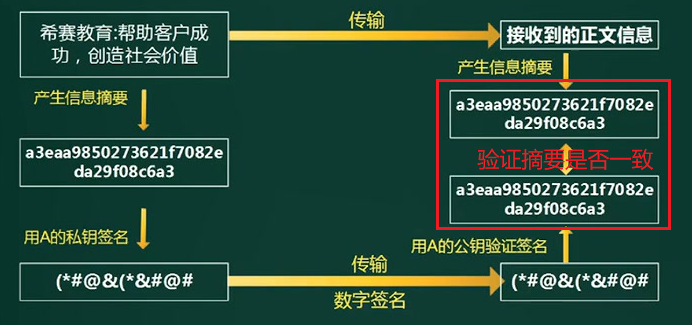
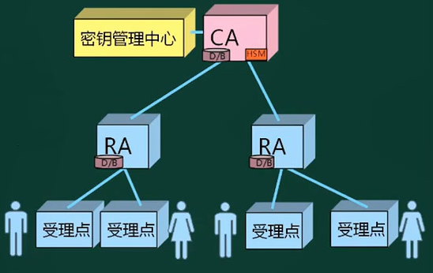
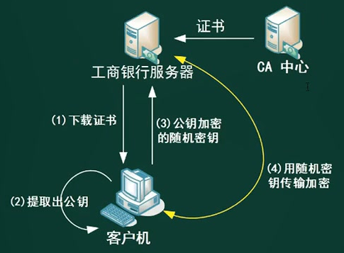
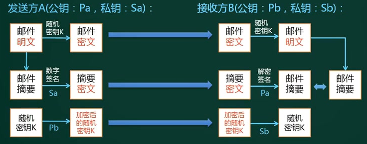
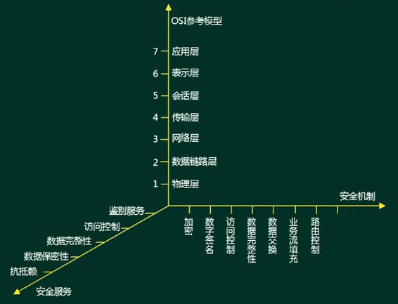

# 安全基础技术

## 对称加密

Symmetric Cryptography：是最快、最简单的一种加密方式，加密（encryption）与解密（decryption）用的是同样的密钥（secret key）。

密钥的大小一般小于256 bit，相对较小。因为密钥越大，加密越强，但加密与解密的过程越慢。既要照顾到安全性，也要照顾到效率，是一个trade-off（权衡点）。

缺点：

1. 虽然效率高，但加密强度不高，
2. 密钥的管理与分配有风险，发送密钥的过程容易被拦截。

常见对称密钥加密算法：

1. DES：**替换+移位**、56位密钥、64位数据块、速度快、密钥易产生。

2. 3DES(三重DES)：两个56位的密钥K1、K2，

   加密：K1加密->K2解密->K1加密；

   解密：K1解密->K2加密->K1解密

3. RC-5 ：RSA数据安全公司的很多产品都使用了RC-5。

4. IDEA：128位密钥、64位数据块、比DES的加密性好、对计算机功能要求相对低，PGP

5. AES：高级加密标准，又称Rijndael加密法，是美国政府采用的种区块加密标准。

## 非对称加密

Asymmetric Cryptography：使用了一对密钥，公钥（public key）和私钥（private key）；一般是公钥加密，私钥解密。

优点：是简化了密钥的发放及管理的过程，支持数字签名等安全认证技术，安全性提高

缺点：是加密和解密的计算过程特别复杂，运行数据加密和解密的速度比较慢。

最常用的非对称加密算法

1. RSA算法：2048位（或1024位）密钥，计算量大，难破解
2. Elgamal：安全性依赖于计算有限域上离散
3. ECC：椭圆曲线算法。

## 数字信封

原理：

1. 发送方使用**对称密钥加密数据**，然后使用收件方的**公钥加密对称密钥**，产生一个数字信封，发送到收件方。
2. 接收方使用私钥对数字信封进行解密，得到对称加密的密钥，然后双方可以使用对称加密来进行沟通。

特点：

1. 数字信封结合对称密钥加密技术的高效性、安全性，克服该技术发放密钥过程的复杂性，
2. 结合非对称密钥加密技术的灵活性，避免该技术对数据进行加密需要非常长时间的困扰，保证数据传输的完整性、真实性、高效性。

## 信息摘要

定义：消息摘要算法也被称为**哈希（Hash）算法或散列算法**，是一个单向散列函数、固定长度的散列值。

主要特征：是加密过程不需要密钥，并且经过加密的数据无法被解密。

著名的摘要算法：MD5算法（散列值128），SHA-1算法（散列值160）及其大量的变体。由于SHA的密钥长度较长，因此安全性高于MD5.

**缺点**：因为哈希碰撞，所以有可能原文不一样，摘要一样。

应用：

1. 一致性验证：防篡改，核对下载的文件与发送方提供的文件是否相符（两个文件的摘要是否一致）
2. 安全访问认证：
   1. 注册时提交的口令经过Hash计算后存入数据库，验证时提交的口令同样进行Hash计算。
   2. 这可以避免用户的密码被具有系统管理员权限的用户知道，以此保护敏感信息。即使数据库被不法分子窃取，也很难获知用户的真正口令。

## 数字签名

定义：数字签名是只有信息的发送者才能产生的别人无法伪造的一段数字串，这段数字串类似于写在纸上的物理签名，用于鉴别数字信息的真伪，同时也是对信息的发送者身份真实性的一个有效证明。

数字签名是公钥加密技术与消息摘要技术的结合应用：

1. 明文通过Hash算法（MD5）得到信息摘要（摘要是明文的缩影，节省空间）
2. 发送者使用自己的私钥，进行加密（RSA），生成数字签名。发送数字签名+明文。
3. 接收者接收后验证：将数字签名使用发送者的公钥解密（RSA），得到信息摘要；明文使用Hash算法（MD5）得到信息摘要；两者进行对比，一致说明没有被篡改。

## 数字证书

问题描述：

1. 接收方利用发送方的公钥解密对方的数字签名，来验证信息是否是由发送方所提供，但却**无法证实发送方与其所声明的数据的拥有者是一致的**。同时，虽然公钥是公开的，但是不排除有安全漏洞，数字签名有可能被伪造。
2. 示例：公钥是公开的并且可以自行导入到电脑，如果有人比如C偷偷在B的电脑用自己公钥替换了A的公钥，然后用自己的私钥给B发送Email，这时B收到邮件其实是被C冒充的但是他无法察觉。
3. 安全漏洞根源就是A的公钥很容易被替换

解决方案：

1. 采用签发数字证书来解决以上问题。
2. A去找证书中心CA为公钥做认证。证书中心用自己的私钥，对A的公钥和一些相关信息一起加密，生成"数字证书"（Digital Certificate）
3. A在邮件正文下方除了数字签名，另外加上这张数字证书
4. B收到Email后用CA的公钥解密这份数字证书，拿到A的公钥，然后验证数字签名

原理：数字证书实际上是由认证中心颁发的包含证书持有人的真实身份信息、公开密钥信息等信息一段数据。而且其功能与日常用的居民**身份证**相似，身份认证机构签发的数字签名可以保障数字证书信息的真实性。

**内容：**

1. 证书的版本信息
2. 证书的序列号（唯一）
3. 证书所用的签名算法
4. 证书的发行机构名称，命名规则一般采用X.500格式
5. 证书的有效期，一般采用UTC时间格式，计时范围哦1950~2049
6. 证书所有人的名称，命名规则一般采用X.500格式
7. 证书所有人的公开密钥
8. 证书发行者对证书的签名。

USBKey：包含证书和私钥，物理隔离。完成一笔转账后，对交易做数字签名，确保安全。

问题：

- 假设数字证书被伪造了呢？
  答案：传输中数字证书有可能被篡改。因此数字证书也是经过数字签名的，B收到邮件后可以先验证这份数字证书的可靠性（是否被篡改），通过后再验证数字签名。
- 要是有1万个人要给B发邮件，难道B要保存1万份不同的CA公钥吗？
  答案：不需要，CA认证中心给可以给B一份“根证书”，里面存储CA公钥来验证所有CA分中心颁发的数字证书。CA中心是分叉树结构，类似于公安部->省公安厅->市级派出所，不管A从哪个CA分支机构申请的证书，B只要预存根证书就可以验证下级证书可靠性。
- 如何验证根证书可靠性？
  答案：无法验证。根证书是自验证证书，CA机构是获得社会绝对认可和有绝对权威的第三方机构，这一点保证了根证书的绝对可靠。如果根证书都有问题那么整个加密体系毫无意义。

## PKI公钥体系

定义：公钥基础设施(Public Key Infrastructure, PKI)是典型的密码应用技术。

原理：

1. PKI 系统中， 由**注册机构RA验证用户身份**，由**证书认证机构CA生成和签发数字证书**（绑定用户的身份信息和公钥）。 
2. PKI 依赖方(Relying Party)预先存储有自己所信任的根 CA 自签名证书,，用来验证与之通信的 PKI 用户的证书链，从而可信地获得该用户的公钥、用于各种安全服务。

PKI 系统由认证机构 CA(Certification Authority,)、注册审批机构 RA（Registration Authority）、数字证书库、密钥备份及恢复系统、证书撤销系统、密钥更新机制等组成。

### https应用

数字签名和数字证书可以用于文件，当然也能用于html网页数据

http的安全缺陷

1. 无法验证服务端的身份
2. 无法保证数据完整性
3. 无法保证数据传输不被窃听

而https就是专门解决这三个问题，https使用数字签名+数字证书解决了前2个问题。

https协议是由**SSL+http**构建的可进行加密传输、身份认证的网络协议，要比 http安全，可防止数据在传输过程中被窃取、改变，确保数据的完整性。

1. CA中心合适工商银行身份，签发数字证书。保存在服务器上。
2. 客户端下载证书，核实访问服务器是否正确
3. 客户端加密：客户端获取证书中的公钥信息，并生成随机密钥，再用公钥加密随机密钥，发送给服务器
4. 服务器解密：使用私钥解密获取随机密钥。信息传输都使用随机密钥进行加密。

## 总结

习题：请设计一个安全邮件传输系统，要求：该邮件以加密方式传输，邮件最大附件**内容可达2GB（智能使用对称加密，非对称加密会很慢）**，发送者**不可抵赖（数字签名）**，若邮件被第三方截获，第三方**无法篡改（信息摘要）**。

对称加密算法加密强度不高，容易破解，所以使用随机密钥。

# 网络安全

刚开始的TCP/IP通信协议,，只考虑了连通性，没有考虑安全性。所以保障安全的方式就是加密。

## 网络层次的安全保障

网络七层的安全保障措施：

1. 应用层：PGP（Pretty Good Privacy优良保密协议），Https（http+SSL）
2. 表示层：SSL（Secure Sockets Layer安全套接字协议，工作在**传输层到应用层**）
3. 会话层
4. 传输层:：TLS（Transport Layer Security传输层安全协议），SET（Secure Electronic Transaction安全电子交易协议，**用于电子商务，保证交易双方不抵赖**）
5. 网络层：防火墙（检查站，防外不防内），IPSec（Internet Proocol Security互联网安全协议，对IP包加密）.
6. 数据链路层：链路加密，PPTP，L2TP
7. 物理层：隔离（USBKey，物理隔离)、屏蔽（无线电信号屏蔽）。

## 邮件安全

MIME(Multipurpose Internet Mail Extensions)中文名为：多用途互联网邮件扩展类型。

S/MIME (Secure Multipurpose Internet Mail Extensions)是对 MIME 在安全方面的扩展。它可以把 MIME 实体(比如数字签名和加密信息等)封装成安全对象，增强安全服务。

- 例如具有接收方确认签收的功能，这样就可以确保接收者不能否认已经收到过的邮件。还可以用于提供数据保密、完整性保护、认证和鉴定服务等功能。 
- **提供安全电子邮件服务**：只保护邮件的邮件主体，对头部信息则不进行加密，以便让邮件成功地在发送者和接收者的网关之间传递.

## 网络威胁和攻击

被动攻击：收集信息为主，破坏保密性

| 攻击名称   | 描述                                                         |
| ---------- | ------------------------------------------------------------ |
| 窃听       | 网络监听，用各种合法或非法的手段窃取系统中的**信息资源和敏感信息** |
| 业务流分析 | 通过对系统进行长期监听，利用统计分析方法对**通信频度、通信的信息流向、通信总量的变化**等参数进行研究，从而发现**有价值的信息和规律** |
| 非法登录   | 非法登录后，只是浏览信息。**若恶意删除、修改数据，则为主动攻击。** |

主动攻击：主要类别有**中断（破坏可用性），篡改（破坏完整性），伪造（破坏真实性）**

| 攻击名称        | 描述                                                         |
| --------------- | ------------------------------------------------------------ |
| 假冒身份        | 通过欺骗通信系统（或用户）达到非法用户冒充成为合法用户，或者特权小的用户冒充特权大的用户的目的。 |
| 抵赖            | 是一种来自用户的攻击（否认自己曾经发布过的某条信息，伪造一份对方来信等） |
| 旁路控制        | 攻击者利用系统的安全缺陷获得非授权的权利                     |
| 重放攻击        | 所截获的某次合法的通信数据拷贝，出于非法的目的被重新发送（**加时间戳**能识别并应对重放攻击） |
| 拒绝服务（DOS） | 对信息或其它资源的合法访问被无条件阻止（多台肉机访问服务器，超过其最大并发量，耗尽服务器资源，让其无法处理其它客户端的请求） |

## 安全保护等级

计算机信息系统安全保护等级划分准则（GB17859-1999）

1. 用户自主保护级：适用于普通内联网用户

   系统破坏后，**对公民、法人、其它组织权益有损害**，但不损害国家安全、社会秩序、公共利益。

2. 系统审计保护级：适用于通过内联网或国际网进行**商务活动**，需要保密的非重要单位。

   系统破坏后，**对公民、法人、其它组织权益有严重损害**，或**损害社会秩序、公共利益**，但不损害国家安全。

3. 安全标记保护级：适用于地方各级国家机关、金融机构、邮电通信、能源、水源供给部门、交通运输、大型工商与信息技术企业、重点工程建设等单位

   系统破坏后，**对社会秩序、公共利益造成严重损害**，或对**国家安全造成损害**

4. 结构化保护级：适用于中央级国家机关、广播电视部门、重要物资储备单位、社会应急服务部门、尖端科技企业集团、国家重点科研机构、国防建设等部门

   系统破坏后，**对社会秩序、公共利益造成特别严重损害**，对**国家安全造成严重损害**

5. 访问验证保护级：适用于国防关键部门和依法需要对计算机信息系统**实施特殊隔离**的单位

   系统破坏后，**对国家安全造成特别严重损害**

| 保护级   | 公民、法人、组织权益 | 社会秩序、公共利益 |   国家安全   |
| -------- | :------------------: | :----------------: | :----------: |
| 用户自主 |         损害         |                    |              |
| 系统审计 |       严重损害       |        损害        |              |
| 安全标记 |                      |      严重损害      |     损害     |
| 结构化   |                      |    特别严重损害    |   严重损害   |
| 访问验证 |                      |                    | 特别严重损害 |

## 信息安全体系结构

**5大安全服务：**

1. 鉴别（认证）服务：在网络交互过程中，对收发双方的身份及数据来源进行验证。

   **实现方式：**用户名+口令，数字证书、生物特征识别（指纹，声音、人脸识别）

2. 访问控制：防止未授权用户非法访问资源，包括用户身份认证和用户权限确认。

   **实现方式**：**自主访问控制DAC**（指定某个客体对主体的访问权），访问控制列表ACL（对客体指定允许访问的主体，如ip白名单，回帖可见），**强制访问控制MAC**（主客体分级后匹配），**基于角色的访问控制RBAC**、基于任务的访问控制TBAC（工作流中，加入某个任务才有权限）

3. 数据完整性：防止数据在传输过程中被篡改

   **阻止对媒体访问的机制**：隔离、访问控制、路由控制

   **探测非授权修改的机制**：**数字签名**、数据重复、数字指纹、消息序列。

4. 数据保密性：防止数据在传输过程中被破解、泄露。

   **实现方式：**禁止访问、加密机制

5. 抗抵赖：防止发送方与接收方双方在执行各自操作后，否认各自所做的操作。

   **实现方式：**数字签名。

防护软件：

1. 防火墙无法阻止和检测基于数据内容的黑客攻击和病毒入侵，同时也无法控制内部网络之间的违规行为。
2. 扫描器无法发现正在进行的入侵行为，而且它有可能成为攻击者的工具。
3. 防毒软件对基于网络的攻击行为(如发描、针对漏洞的攻击）无能为力。
4. 目前市场上鲜见成熟的安全审计系统，即使存在冠以审计名义的产品，也更多的是从事入侵检测的工作。

# 题目

1、信息安全策略应该全面地保护信息系统整体的安全，网络安全体系设计是网络逻辑设计工作的重要内容之一，可从物理线路安全，网络安全、系统安全、应用安全等方面来进行安全体系的设计与规划。其中，数据库的容灾属于(7)_的内容。
A. 物理线路安全与网络安全
B. 网络安全与系统安全
C. 物理线路安全与系统安全
D. 系统安全与应用安全（**数据库是系统软件，所以属于系统安全；数据库中存储业务数据，所以属于应用安全**）

2、安全审计系统（先采集信息，分析后查找异常）是保障计算机系统安全的重要手段之一，其作用不包括__(13)_. 
A.	检测对系统的入侵
B.	发现计算机的滥用情况
C.	提供系统运行的日志，从而能发现系统入侵行为和潜在的漏洞
D．保证可信网络内部信息不外泄（**审计只能发现问题，而无法实时的解决问题**）

3、防火墙把网络划分为几个不同的区域，一般把对外提供网络服务的设备（如wwW服务器、FTP服务器)放置于_(14)_区域。
A．信任网络；B.非信任网络；D.DMZ（非军事化区，**中间隔离区**)；C.半信任网络

4、如果杀毒软件报告一系列的**Word文档**被病毒感染，则可以推断病毒类型是_(15）_;如果用磁盘检测工具（CHKDSK、SCANDISK等）检测磁盘发现大量**文件链接地址**错误，表明磁盘可能被_(16)_病毒感染。
(15)A．文件型（**可执行文件**）；B.引导型；C.目录型；D．宏病毒
(16)A．文件型；B.引导型；C.目录型；D．宏病毒

