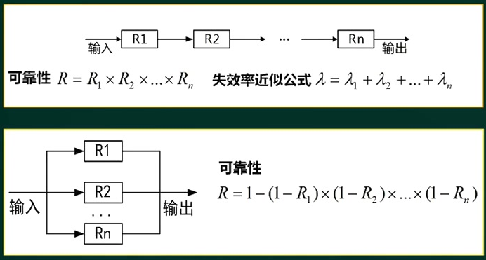
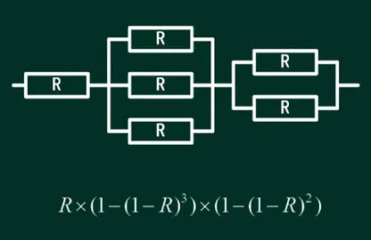
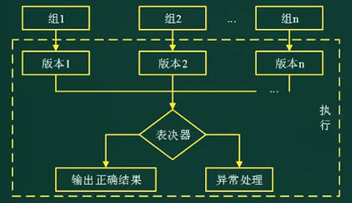
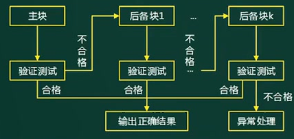
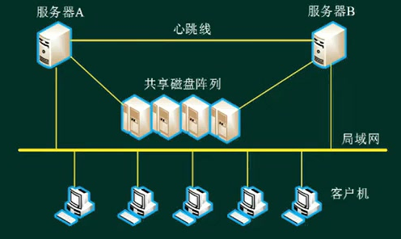
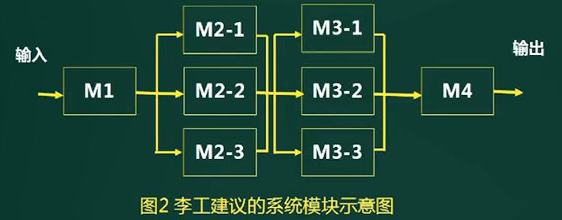

# 基本概念

**系统可靠性**：是系统在规定时间内及规定的环境条件下，完成规定功能的能力，也就是系统无障碍运行的概率。（一般用于论文）

**系统可用性**：是指在某个给定时间点上系统能够按照需求执行的概率。（一般用于设计时的质量属性）

**软件可靠性 ≠ 硬件可靠性**

- 复杂性：软件复杂性比硬件高，大部分问题都来自于软件失效
- 物理退化：硬件失效主要是物理退化所致，软件不存在
- 唯一性：软件时唯一的，每个copy版本都一样；硬件不可能一样，有误差。
- 版本更新周期：软件快，硬件慢。

# 系统可靠性分析

可靠性指标：

1. 平均无故障时间：MTTF=1/失效率
2. 平均故障修复时间：MTTR=1/修复率
3. 平均故障间隔时间：MTBF = MTTR + MTTF
4. 系统可用性：MTTF/(MTTR + MTTF) * 100%

> 实际情况下，MTTR很小，通常人为 **MTBF ≈ MTTF**

串联系统和并联系统的可靠度计算：

混合系统（串并联合）的可靠度计算：

# 可靠性设计

**提升可靠性的措施：**

1. **避错技术**：通过测试，评审等，在交付之前解决发现的错误。

2. **容错技术**：即使出错，系统依然能处理请求的业务，需要有冗余，及时切换。

   冗余思想：结构冗余（硬件、软件冗余）、信息冗余（一个数据不同的表达，如校验码）、时间冗余（重复多次进行相同的计算，若结果相同则认为结果可靠）

   方法论：N版本程序设计（静态冗余），恢复块设计（动态冗余），防卫式程序设计。

3. **检错技术**：出错后报警，人工处理，成本低。

4. **降低复杂度设计**：

## N版本程序设计

原理：多个版本同时由不同的组开发，完成后全部部署。每次任务执行，生成多个版本执行的结果，然后在表决器中选择正确的结果并输出。

- N版本程序设计增加了3个新的阶段：相异成分规范评审、相异性确认、背对背测试
- N版本程序的同步、N版本程序之间的通信、表决算法（全等表决，非精确表决、Cosmetie表决）、一致比较问题、数据相异性。
- 用高成本来提高系统的可靠性。比如航天。

## 恢复快设计

原理：主块执行任务的结果无法通过验证，则回退到后备块重新执行，知道结果合格并输出。

- 设计时应保证实现主块和后备块之间的独立性，避免相关错误的产生，使主块和备份块之间的共性错误降到最低程度。
- 必须保证验证测试程序的正确性，（比如用户的年龄超过200就出错，用数据范围验证）

### 两者区别

|                | 恢复快方法                       | N版本设程序设计                            |
| -------------- | -------------------------------- | ------------------------------------------ |
| 硬件运行环境   | 单机                             | 多机                                       |
| 错误检测方法   | 验证测试程序                     | 表决器                                     |
| 恢复策略       | 后向恢复                         | 前向恢复                                   |
| 实时性         | 差                               | 好                                         |
| 方案的组合方式 | 串行（一个方案不行，再换另一个） | 并行（多个方案同时执行，选结果数量最多的） |

- 前向恢复：当前计算往下继续，选择正确的结果，把系统恢复成连贯的正确状态
- 后向恢复：系统恢复到上一个正确状态，回退并重新执行。

## 防卫式程序设计

就是使用**try-catch**

- 对于程序中存在的错误和不一致性，通过在程序中包含**错误检查代码和错误恢复代码**（封装容易出错的代码），使得一旦错误发生，程序能撤销错误状态，恢复到一个已知的正确状态。
- 实现策略：错误检测，破坏估计、错误恢复。
- 应用：文件的操作。

## 双机容错

是集群的雏形。

- 双机热备模式：主系统，备用系统
- 双机互备模式：同时提供不同的服务，心不跳则接管
- 双机双工模式：同时提供相同的服务，集群的一种

## 集群技术

**集群系统**对比**高性能主机系统**的优点：可伸缩性，高可用性，可管理性，高性价比，高透明性。

# 软件可靠性分析

# 案例分析

阅读以下信息系统可靠性问题的说明，在答题纸上回答问题1至问题3.【说明】

某软件公司开发一项基于数据流的软件，其系统的主要功能是对输入数据进行多次分析、处里和加工，生成需要的输出数据。需求方对该系统的软件可靠性要求很高，要求系统能够长时间无故障运行。该公司将该系统设计交给王工负责。王工给出该系统的模块示意图如图1所示。王工解释∶只要各个模块的可靠度足够高，失效率足够低，则整个软件系统的可靠性是有保证的。
图1王工建议的软件系统模块示意图：**输入=》M1=》M2=》M3=》输出**

李工对王工的方案提出了异议。李工认为王工的说法有两个问题:第一，即使每个模块的可靠度足够高，但是整个软件系统模块之间全部采用串联，则整个软件系统的可靠度明显下降。假没各个模块的可靠度均为0.99，则整个软件系统的可靠度为0.99^4~0.96;第二，软件系统模块全部采用串联结构时，一旦某个模块失效，则意味着整个软件系统失效。

李工认为，应该在软件系统中采用冗余技术中的动态冗余或者软件容错的N版本程序设计技术，对容易失效或者非常重要的模块进行冗余设计，将模块之间的串联结构部分变为并联结构，来提高整个软件系统的可靠性。同时，李工给出了采用动态冗余技术后的软件系统模块示意图，如图2所示。

刘工建议，李工方案中M1和M4模块没有采用容错设计，但M1和M4发生故障有可能导致严重后果。因此，可以在M1和M4模块设计上采用检错技术，在软件出现故障后能及时发现并报警提醒维护人员进行处理。

注:假设各个模块的可靠度均为0.99。

【问题1】（4分)
在系统可靠性中，可靠度和失效率是两个非常关键的指标，请分别解释其含义.

- 可靠度就是系统在规定的条件下、规定的时间内不发生失效的概率。
- 失效率又称风险函数，也可以称为条件失效强度，是指运行至此刻系统未出现失效的情况下，单位时间系统出现失效的概率。

【问题2】 (13分)
请解释李工提出的动态冗余和N版本程序设计技术，给出图1中模块M2采用图2云态冗余技术后的可靠度。
请给出采用李工设计方案后整个系统可靠度的计算方法并计算结果。

- 动态冗余又称为主动冗余，它是通过故障检测、故障定位及故障恢复等手段达到容错的目的。其主要方式是多重模块待机储备，当系统检测到某工作模块出现错误时，就用一个备用的模块来替代它并重新运行。各备用模块在其待机时，可与主模块一样工作，也可以不工作。前者叫冷备份系统(双工系统、双份系统），后者叫热备份系统(双重系统)。
- N版本程序设计是一种静态的故障屏蔽技术，其设计思想是用N个具有相同功能的程序同时执行一项计算，结果通过多数表决来选择。其中N个版本的程序必须由不同的人独立设计，使用不同的方达、设计语言、开发环境和技术实现，目的是减少N个版本的程序在表决点上相关错误的概率。
- M2采用动态冗余后的可靠度为:R= 1 - ( 1-0.99 ) ^3 ≈ 0.999999
  李工的方案同时采用了串联和并联方式，其计算方法为首先计算出中间M2和M3两个并联系统的可靠度，再按照串联系统的计算方法计算出整个系统的可靠度
  R= 0.99*0.999999*0.999999*0.99 ≈ 0.98

【问题3】（ 8分)
请给出检错技术的优缺点，并说明检测技术常见的实现方式和处理方式。

- 检错技术实现的代价一般低于容错技术和冗余技术，但有一个明显的缺点，就是不能自动解决故障，出现故障后如果不进行人工干预，将最终导致软件系统不能正常运行。
- 检错技术常见的实现方式∶最直接的一种实现方式是判断返回结果，如果返回结果超出正常范围，则进行异常处理;计算运行时间也是一种常用技术，如果某个模块或函数运行时间超过预
  期时间，可以判断出现故障;还有置状态标志位等多种方法，自检的实现方式需要根据实际情况来选用。
- 检错技术的处理方式，大多数都采用“查处故障-停止软件运行-报警”的处理方式。但根据故障的不同情况，也有采用不停止或部分停止软件系统运行的情况，这一般由故障是否需要实时处理来决定。