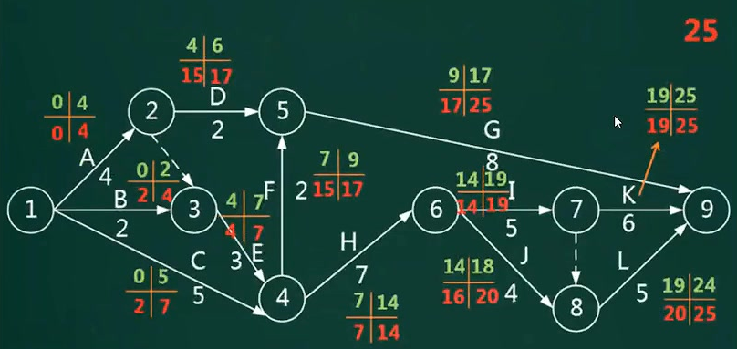

# 范围管理

范围定义的输入包括：项目章程（初始的范围说明书）、项目范围管理计划、组织过程资产（过程性成果）、批准的变更申请。

定义：确定项目的边界，包含哪些工作，一般是用例图的业务范围。

流程：

1. 范围计划编制。
2. 范围定义：产品范围（用户的功能需求），工作范围（开发管理）。
3. 创建WBS（工作分解结构）：WBS和WBS字典。
4. 范围确认和控制。

在初步项目范围说明书中已文档化的主要的可交付物、假设和约束条件的基础上准备详细的项目范围说明书，是项目成功的关键。范围定义的输入包括以下内容： 

- ① 项目章程。
- ② 项目范围管理计划。
- ③ 组织过程资产。 
- ④ 批准的变更申请

# 时间管理

定义：也叫进度管理，采用科学的方法，确定进度目标，编制进度计划和资源供应计划，进行进度控制，在与质量、成本目标协调的基础上，实现工期目标

**过程**：

1. **活动定义**：WBS工作包再次拆分成多个活动

2. **活动排序**：优先级，拓扑图。

3. **活动资源估算**：资源包括时间、人力和机器等。

   估算方法有专家判断法（有经验的人）、功能点估算法、

   自上而下的估算、自下而上的估算（更准确，拆分细）。

   **三点估算法**：是三种情况下的结果，如**最优工期**3天，**期望工期**5天，**最差工期**8天，计算结果为(3+5+8)/3，但期望工期实现的概率大，所以它的**权重为4**，最优和最差的权重是1，则**项目最可能的开发工期**的计算方式：(3+5*4+8)/6.

4. **活动历时估算**：整理并行和串行任务，并估算持续时间。

   并行的任务可以通过增加人员来减少花费的时间，但对于复杂的任务，增加人员也会增加沟通成本。

5. **制定进度计划**：关键路径法，网络图，甘特图

6. **进度控制**：

   1. 分析延误任务：是否为关键活动，偏差是否大于总时差，偏差是否大于自由时差。
   2. 大于自由时差时的措施：赶工（增加资源，加班），快速跟进（活动并行执行）

## 前导图法PDM

图形化的网络模型有两种：

**单代号网络图**（只有一个活动编号）：也叫PERT（项目评估与评审技术）图，描述一个项目中任务和任务之间的关系，每个节点表示一个任务。通常包括活动编号、持续时间、松弛时间，开始和结束时间。

绘制流程：先定义活动A，B，C......，再对活动排序，通过对活动资源的估算，得到活动的持续时间，**绘制PDM图，并计算最短工期**。

最短工期对应最长关键路径，关键路径推导方法：

1. 开始时间默认为0，从A开始，根据持续时间算出每个任务的最早开始和完成时间，

   对于多个并行任务，只有耗时最多的完成，才算都完成。

2. H中的最早完成时间48就是目标，再**逆推最迟时间**（在不影响工期的情况下，什么时候开始和结束）
   1. 为达到目标，所以H的最迟开始时间也是38，最迟完成时间也是48.
   2. F和G要在H开始之前完成，所以它们的最迟完成时间是38，最迟开始时间是最迟完成时间减去持续时间。
   3. D和E要在F和G开始之前完成，所以它们的最迟完成时间是F和G的最迟开始时间的最小值。

3. 通过公式 LS - ES 或 LF - EF，计算每个任务的总时差。

4. 总时差为0的任务就是关键节点，关键节点相连得到关键路径。（若并行任务持续时间相同，则会有多条关键路径）

   总时差的意义：当前任务最多可以延误多长时间，而不会延误总工期。

问题：B任务最早开始时间是5，但是第6天才开始，经过两天，第7天结束。开始时间是0不是1的原因，节省计算时，需要减1的过程。

**双代号网络图**（边和节点都有代号）：节点表示事件，边表示活动。

虚线表示虚活动，既不占时间也不占资源。用于展现逻辑依赖关系，表达一个活动的前驱活动有哪些。

## 关键路径法

应用：用在单代号和双代号网络图。

定义：是在**制定进度计划**时使用的一种进度网络分析技术。关键路线法沿着项目进度网络路线进行**正向与反向分析**，从而计算出所有计划活动理论上的最早开始与完成日期、最迟开始与完成日期，不考虑任何资源限制。

概念：

- **总时差（松弛时间）**：在不延误总工期的前提下（不影响紧后活动的**最晚开始时间**），该活动的机动时间。
  - 计算方式：活动的最早开始（完成）时间和最迟开始（完成）时间的之差
- **自由时差**：在不影响紧后活动的**最早开始时间**前提下，该活动的机动时间，
  - 计算方式：有紧后活动，则等于所有**紧后活动的最早开始时间**和**本活动最早完成时间**之差的最小值。
  - 若没有紧后活动，也就是以网络计划终点节点为完成节点的活动，它的自由时差等于计划工期和本活动最早完成时间之差
- 对于网络计划终点节点为完成节点的活动，其自由时差等于总时差。当总时差为0，则自由时差必然为0.

示例：模块A1的总时差是3，自由时差是2（如果是3，不会影响总工期，但会影响紧后任务的最早开始时间）

## 甘特图Gantt

定义：是一种简单的水平条形图，它以一个日历为基准描述项目任务，横坐标表示时间，纵坐标表示任务，图中水平线段表示对一个任务的进度安排，线段的起点和终点对应在横坐标上的时间分别表示任务的开始和结束时间，线段长度表示完成该任务所需的时间。

细线表示计划，实线表示实际完成工作

优点：直观、简单，易于理解，清晰的标识出每一项任务的起始和结束时间，适用于简单的小型项目，可用于WBS的任何层次，进度控制、资源优化、编制资源和费用计划。

缺点：不能系统的表达一个项目所包含的**各项工作之间的复杂关系**，难以进行定量的计算和分析，以及计划的优化

**三种图例的区别：**

1. 单代号网络图：描述不同任务之间的依赖关系，逻辑结构清晰、直观。
2. 双代号网络图：描述不同任务之间的依赖关系，主要解决资源调配的复杂问题，
3. 甘特图Gantt：主要描述不同任务之间的重叠关系。

# 成本管理

定义：在项目实施过程中，为确保项目在批准的预算条件下，尽可能保质按期完成，而对所需的各个过程进行管理和控制。

流程：

1. 成本估算：自顶而下的估算，自底而上的估算，差别估算法。

2. 成本预算：直接成本与间接成本，管理储备，零基准预算。

   将总的成本估算分配到各项活动和工作包上，来建立一个**成本的基线**

3. 成本控制：挣值分析

## 挣值管理

概念：

- **已完成工作量的实际成本（AC）**：直接给出。
- **已完成工作量的预算成本（EV）**：已完成工作量✖预算定额，也就是挣值（计件工资）
- **计划工作量的预算成本（PV）**：计划工作量✖预算定额
- **完工预算（BAC）**：完工时的PV总和。

计算：

- 进度偏差：SV = EV - PV；进度绩效指数：SPI = EV/PV
- 成本偏差：CV = EV - AC；成本绩效指数：CPI = EV/AV
- 剩余工作的成本：无偏差时，ETC = BAC - EV；有偏差时，ETC = （BAC - EV）/ CPI 
- 完工估算：EAC = AC + ETC 

示例：希赛教育在线测试项目涉及对10个函数代码的编写(假设每个函数代码的编写工作量相等),项目由2个程序员进行**结对编程（两个人干一个人的活）**，计划在10天内完成，总体预算是1000元，每个函数的平均成本是100元。项目进行到了第5天，实际消耗费用是400元，完成了3个函数代码的编写。

答：题目中：AC=400，EV=300，PV = 500，BAC=1000；计算得：SV = -200，CV = -100

# 软件质量管理

概念：

- 质量保证：每隔一段时间进行的，主要通过系统得质量审计和过程分析来保证项目得质量。

  独特工具：**质量审计和过程分析**。如质量标准体系认证ISO9001，CMMI

  强调规范的开发系统，遵循规范的流程，结果不会出大问题。而结果对了，流程不一定对。

- 质量控制：实时监控项目的**具体结果**，以判断它们是否符合相关质量标准，制定有效方案，以消除产生质量问题的原因。

两者关系：一定时间内质量控制的结果也是质量保证的质量审计对象。质量保证的成果又可以指导下一阶段的质量工作，包括质量控制和质量改进。

## 软件评审

包括技术评审和管理评审。要点：

1. 不应以测试代替评审
2. 评审人员应关注产品而不应评论开发人员
3. 评审人员应关注于实质性问题
4. 评审会议不应变为问题解决方案讨论会
5. 评审应被安排进入项目计划
6. 评审参与者应了解整个评审过程
7. 评审人员事先应对评审材料充分了解
8. 应重视评审的组织工作（**涉及到需求和验收，需要客户的参与**）

## 软件过程改进-CMMI

CMM（Capacity Maturity Model） 即**软件开发能力成熟度模型**，是用来指导软件过程改进的。

该模型描述了软件处理能力的5个成熟级别。为了达到过程能力成熟度模型的第二级，组织机构必须具有**6个关键过程域**（Key Process Areas, KPA）

1.  第一级：初始级(Initial)；**无序，随意**
           初始级的软件过程是无序的，项目的执行是随意甚至是混乱的。工作方式处于救火状态，不断的应对突如其来的危机；
2. 第二级：可重复级(Repeatable)；**基本的项目管理管理**
          建立了基本的项目管理过程来跟踪费用，进度和功能特性，制定了必要的过程纪律，能重复早先类似的应用项目取得的成功。
3. 第三级：已定义级(Defined)；**标准化，文档化**
          已经将软件管理核工程两方面的过程文档化，标准化，并综合成组织的标准软件过程，所有项目均使用该标准开发维护软件。
4. 第四级：已管理级(Managed)；**可预测**
          收集对软件过程和产品质量的详细度量，对软禁啊过程和产品都有定量的理解和控制。
5. 第五级：优化级(Optimizing)。**优化**
          过程的量化反馈和先进的新思想，新技术促使过程不断改进。

阶段式：组织能力成熟度

| 成熟度等级 | 过程域                                                       |
| ---------- | ------------------------------------------------------------ |
| 已管理级   | 需求管理、项目计划、配置管理、项目监督与控制、供应商合同管理、度量和分析、过程和产品质量保证（项目级管理） |
| 已定义级   | 需求开发、技术解决方案、产品集成、验证、确认、组织级过程焦点、**组织级**过程定义、组织级培训、集成项目管理、风险管理、集成化的团队、决策分析和解决方案、组织级集成环境 |
| 定量管理级 | 组织级过程性能、定量项目管理                                 |
| 优化级     | 组织级改革与实施、因果分析和解决方案                         |

连续式：软件过程能力

| 连续式分组 | 过程域                                                       |
| ---------- | ------------------------------------------------------------ |
| 过程管理   | 组织级过程焦点、组织级过程定义、组织级培训、组织级过程性能、组织级改革与实施 |
| 项目管理   | 项目计划、项目监督与控制、供应商合同管理、集成项目管理风险管理、集成化的团队、定量项目管理 |
| 工程       | 需求管理、需求开发、技术解决方案、产品集成、验证、确认       |
| 支持       | 配置管理、度量和分析、过程和产品质量保证、决策分析和解决方案、组织级集成环境、因果分析和解决方案 |

# 软件配置管理

配置管理是通过技术和行政手段对产品及其开发过程和生命周期进行控制、规范的一系列措施和过程。

软件产品配置是指一个软件产品在生存周期各个阶段所产生的各种形式和各种版本的文档、计算机程序、部件及数据的集合。该集合的每一个元素称为该产品配置中的—个配置项。

**配置项**

- 配置项是构成产品配置的主要元素，分为两类
  - 属于**产品组成部分**的工作成果：如需求文档、设计文档、源代码、和测试用例（必选项）
  - 属于**项目管理和机构支撑过程域**产生的文档：如工作计划、项目质量报告、项目跟踪报告等（可选项）
- 干扰项：不属于配置项的有：**设备清单，CASE工具操作手册**等。
- 主要属性：名称、标识符、文件状态、版本、作者、日期。
- 若有配置项都被保存在配置库中，确保不会混淆、丢失；配置项及其历史记录反映软件的演化过程。

**配置库**

- 开发库（动态库、程序员库、工作库）：可以随意修改
- 受控库（主库，系统库）：必须先申请，通过后才有权限修改。主要管理基线，除非需求需要变更。
- 产品库（备份库、静态库）：不能修改。（若一定要修改，需要回退到受控库或开发库）

**软件工具**

按照软件过程活动将软件工具分为：

- **软件开发工具**：需求分析工具，设计工具，编码与排错工具。
- **软件维护工具**：**版本控制工具**（VSS，SVN，CVS，SCCS），文档分析工具，开发信息库工具、逆向工程工具、再工程工具。
- **软件管理和支持工具**：项目管理工具、配置管理工具、软件评价工具、软件开发工具的评价和选择。

**变更控制**

配置管理与整体需求变更管理是相互结合在一起，配套使用的，

- 整体需求管理里约定了变更的流程
- 配置管理中提供软件系统的支撑。

流程：变更申请，变更评估，变更决策，变更实施，变更验证，沟通存档。

**版本控制**

- 草稿：处于草稿状态的配置项的版本号格式是**0YZ（YZ的数字范围是01~99）**

- 正式：处于正式状态的配置项的版本号格式是**X.Y（X是主版本号，Y为次版本号，取值范围都是1~9）**

  配置项第一次正式发布时，版本号是1.0

  若配置项的版本升级幅度比较小，一般只增大Y值，X不变；只有升级幅度较大时，才增大X值。

- 修改：处于草稿状态的配置项的版本号格式是**X.YZ**，修改配置项时，一般只增加Z值，X.Y保持不变。

**项目管理工具**

- **能做什么（项目管理相关辅助工作）**：任务调度，成本估算、资源分配、预算跟踪、人时统计配置控制、确定关键路径、松弛时间、超前时间和滞后时间，生成一定格式的报表和报告。
- **不能做什么（开发技术相关辅助工作，开发工具）**：不能指导软件设计人员按软件生存周期各个阶段的适用技术进行设计工作。

# 风险管理

风险是不确定性事件，主要**关心未来、变化、选择**。

重点：

1. **基本属性：随机选和相对性**（可发生或不发生，对我是有利，对别人不利）
2. 风险存在的特性：客观性、普遍性、可变性、多样性、多层次性
3. 某一具体风险发生的偶然性和大量风险发生的必然性。

分类：

1. **项目风险**：潜在的预算、进度、人员和组织、资源、用户和需求问题；项目复杂性、规模和结构的不确定性
2. 技术风险：潜在的设计、实现、接口、测试和维护方面的问题；规格说明的多义性、技术上的不确定性、技术陈旧、新技术不成熟。
3. 商业风险：市场风险，策略风险，销售风险，**管理风险（重点转移或人员变动而失去上级支持），预算风险（开发过程没有得到预算或人员的保证）**。

风险曝光度（(Risk Exposure) ：

- 计算方式：风险出现的概率乘以风险可能造成的损失。
- 假设正在开发的软件项目可能存在一个未被发现的错误，而这个错误出现的概率是0.5%，给公司造成的损失将是1000000元，那么这个错误的风险曝光度就应为1000000×0.5%=5000元。