# 计算机组成

计算机由主机和外设

1. 主机：CPU（Central Processing Unit）中央处理器（**运算器，控制器**），内**存储器**（内存），
2. 外设：外存储器（硬盘），输入设备，输出设别。

结构上开始以运算器为中心，现在以存储器为中心。

**CPU频率**

1. 主频：即CPU的时钟频率，计算机的操作在时钟信号的控制下分步执行，每个时钟信号周期完成一步操作，时钟频率的高低在很大程度上反映了CPU速度的快慢。

   **主频 = 外频 * 倍频**

   主频表示在CPU内数字脉冲信号震荡的速度（在工作时的单位时钟内的频率），

   主频和实际的运算速度存在一定的关系，但并不是一个简单的线性关系。CPU的运算速度要看CPU的流水线的各方面的性能指标(缓存、指令集，CPU的位数等。也就是说主频仅仅是CPU性能表现的一个方面，而不代表CPU的整体性能。

2. 外频，就是外部频率，指的是系统总线频率。

3. 倍频的全称是倍频系数，倍频系数是指CPU主频与外频之间的相对比例关系。

   最初CPU主频和系统总线速度是一样的， 但CPU的速度越来越快，倍频技术也就相应产生。它的作用是使系统总线工作在相对较低的频率上，而CPU速度可以通过倍频来提升。

# Flynn分类法

图灵分类法的两个维度：指令流Instruction和数据流data，Single、Multiple

| 体系结构类型       | 结构                                                 | 关键特性                                   | 代表                                                   |
| ------------------ | ---------------------------------------------------- | ------------------------------------------ | ------------------------------------------------------ |
| 单指令单数据流SISD | 控制部分：一个 处理器：一个 主存模块：一个 |                                            | 单处理器系统                                           |
| 单指令多数据流SIMD | 控制部分：一个 处理器：多个 主存模块：多个 | 各处理器以异步的形式执行同一条指令         | 并行处理机， **阵列处理机**， 超级向量处理机 |
| 多指令单数据流MISD | 控制部分：多个 处理器：一个 主存模块：多个 | 被证明不可能，不实际。                     | 目前没有，文献中有**流水线计算机**                     |
| 多指令多数据流MIMD | 控制部分：多个 处理器：多个 主存模块：多个 | 能够实现**作业、任务、指令**等各级全面并行 | 多处理机系统、多计算机                                 |

# CISC与RISC

微处理器中提高效率的两个维度：

CISC（Complex Instruction Set Computers）复杂指令集计算机：每增加一个新功能，就增加一条指令。

RISC（Reduced Instruction Set Computers）精简指令集计算机：每增加一个新功能，使用原有指令组合实现

| 指令系统类型 | 指令                                                         | 寻址方式   | 实现方式                                                     | 其它                       |
| ------------ | ------------------------------------------------------------ | ---------- | ------------------------------------------------------------ | -------------------------- |
| CISC复杂     | 数量多，使用频率差别大，可变长格式                           | 支持多种   | 微程序控制技术                                               | 研制周期长                 |
| RISC精简     | 数量少，使用频率接近、定长格式， 大部分为为单周期指令，**操作寄存器**，只有Load/Store操作内存。 | 支持方式少 | **增加了通用寄存器**；硬布线逻辑控制为主；**适合采用流水线** | 优化编译，有效支持高级语言 |

可变长格式（解决使用频率差别大的问题）：使用频率高的指令，编址时用短指令；使用频率低的用长指令。

寄存器寻址：最接近CPU的存储器，速度比内存快

时钟周期：是主频的倒数，指一次脉冲传递数据的时间。

单指令周期：一条指令利用的时间。

# 存储系统

## 冯.诺伊曼结构

定义：也叫普林斯顿结构，是一种程序指令和数据存储器合并在一起的存储器结构。

特点：

1. 一般用于PC处理器（I7)
2. 指令和数据存储器合并在一起
3. 指令和数据都通过相同的数据总线传输。

## 哈佛结构

定义：是一种将程序指令存储和数据存储分开的存储器结构。哈佛结构式一种并行体系结构。

特点：

1. 一般用于嵌入式系统处理器（DSP-Digital Signal Processing 数字信号处理）
2. 指令和数据分开存储，指令存储器和数据存储器独立编址、独立访问，可以并行读取，有较高数据的吞吐率
3. 有4条总线：指令的数据、地址总线，数据的数据、地址总线。

## 层次化存储结构

出现层次化的原因：硬件成本；其**理论依据是局部性原理**。

| 层次  | 描述                     | 大小  | 速度 |
| ----- | ------------------------ | ----- | ---- |
| CPU   | 寄存器                   | 64bit | 快   |
| Cache | 按内容存取（相联存储器） | 16Mb  |      |
| 内存  | 主存                     | 8GB   |      |
| 外存  | 硬盘，光盘、U盘          | 512GB | 慢   |

- **Cache高速缓存**：通常由SRAM组成，位于CPU和内存间的一种容量和规模较小，速度很高的存储器。

  - **CPU和存储系统之间速度容量不匹配的问题**，从主存直接复制数据。

  - 功能：提高CPU数据输入输出的速率，突破**冯.诺伊曼瓶颈，即CPU与存储系统间数据传送带宽限制**。

  - 在计算机存储系统中，Cache是除寄存器外，访问速度最快的层次，。

  - **使用Cache改善系统性能的依据是局部性原理**

  - 以读操作为例，使用Cache + 主存储器的系统平均周期为t3，则 t3 = h * t1 + (1 - h) * t2

    h：对Cache的访问命中率（90%以上）；1 - h：失效率（未命中率）；

    t1：Cache存储数据的周期时间（1ns左右）；

    t2：主存储器周期时间（100ns 和Cache的时间约百倍以上)

- **局部性原理**

  - 时间局部性：指程序中的某条指令一旦执行，不久以后该指令可能**再次执行**；是由于程序中存在大量的**循环操作**。
  - 空间局部性：指一旦程序访问了某个存储单元，不久后，其附近的存储单元也将被访问，即程序在一段时间内所访问的地址可能集中在一定的范围内；是由于程序顺序执行，如数组的处理。
  - 工作集理论：工作集是进行运行时被频繁访问的页面集合。

- 主存

  - 分类：

    - 随机存取存储器Random Access Memory，如DRAM动态（硬件是电容器，隔段时间动态刷新，常用于**主存**）、DRAM（带同步接口），SRAM静态（使用晶体管，速度快，价格贵，用于Cache），
    - 只读存储器Read-Only Memory（MROM掩模式 - 生产时生成，PROM一次可编程ROM，EPROM可擦除的PROM，闪速存储器flash memory），如**BIOS系统**

  - 编址：

    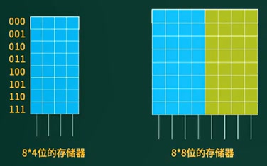

    - 编址方式：==按字节编址（默认1B=8bit），按字编址（字长32或64位）==

    - ==存储单元个数==：**最大地址 + 1 - 最小地址**；

      示例：内存地址从AC000H到C7FFFH，共有 **112** K个存储单元。

      计算：H表示内存地址为16进制数，存储单元个数为C7FFFH + 1 - AC000H = 1C000H

      转换为K：先转10进制再除1024，1C000H按权展开(1*16^4 + 12\*16^3 ) / 2^10。

      或者直接转二进制，1C000H = 1 1100 0000 0000 0000 B，再约掉后面10个0.

    - ==单个芯片的存储单元的总容量：存储单元个数 * 编址内容。==

    - ==多个芯片的存储单元的总容量：单位芯片容量 * 芯片个数==

      示例：若该内存地址按字（16bit）编址，有28片存储器芯片构成。已知构成此内存的芯片每片有16K维护存储单元，则该芯片每个存储单元存储 **4** 位。

      总容量 = 112K * 16bit，单个芯片容量则除28 = S；单个存储单元的容量 = S/16k=4.

## 磁盘

磁盘读取数据流程：磁头先在垂直方向上寻道。然后磁盘一直保持匀速旋转，磁头定位到等待读写的扇区。

### 组成结构

磁盘由多个盘面组成，每个盘面都有单独固定的磁头，所有磁头的运动都是同步的。

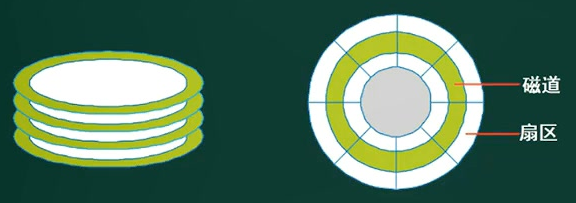

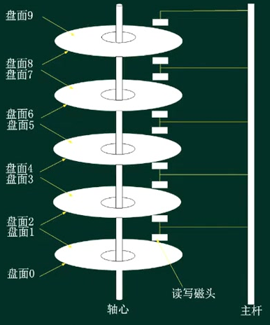

### 存取时间

**存取时间**（磁头找到数据的时间） = 寻道时间 + 等待时间

- 寻道时间：也叫平均定位时间，指磁头移动到磁道（同心圆）所需的时间。
- 等待时间：也叫旋转延迟，指等待读写的扇区旋转到磁头下方所用的时间。

试题：假设某磁盘的每个磁道划分成11个物理块，每块存放1个逻辑记录。逻辑记录R0，R1，. . . ,R11存放在同一个磁道上，记录的存放顺序如下表所示:

| 物理块   | 1    | 2    | 3    | 4    | 5    | 6    | 7    | 8    | 9    | 10   | 11   |
| -------- | ---- | ---- | ---- | ---- | ---- | ---- | ---- | ---- | ---- | ---- | ---- |
| 逻辑记录 | R0   | R1   | R2   | R3   | R4   | R5   | R6   | R7   | R8   | R9   | R10  |

如果磁盘的旋转周期为33ms，磁头当前处在R的开始处。若系统使用**单缓冲区顺序处理**这些记录，每个记录处理时间为3ms，则处理这11个记录的最长时间为(**366ms**) ;若对信息存储进行**优化分布**后，处理11个记录的最少时间为(**66ms**) 。

题解：

- (3 + 3) + 10 * (30 + 3 +3) = 366；因为是但单缓冲区顺序处理，所以R0读取完后，在缓冲区处理后，磁头指向R2，需要再绕10个物理块到R1。
- 优化分布后，磁盘只需转两圈 33 * 2 = 66，即可读取全部记录。

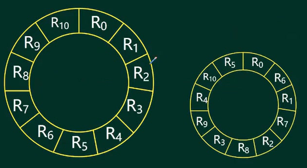

### 磁盘调度

移臂调度算法：磁头寻道的方式，多个磁头同步读取数据

每一个盘面的0号磁道连成一个空心圆柱，也叫**柱面**（包含多个磁道）。

- FCFS（First-Come，First Served）先来先服务

  任务按序号执行。平均寻道长度 = 移动距离的总和 / 任务数。

  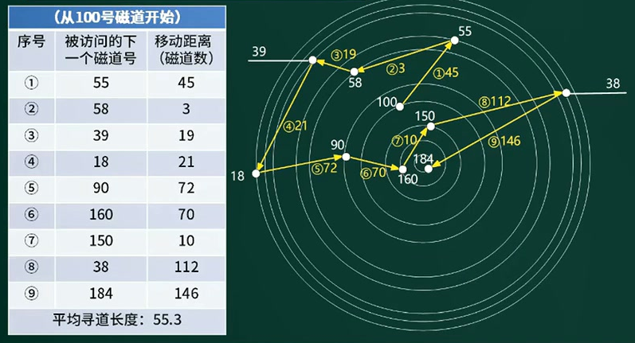

- SSTF（Shortest Seek Time First）最短寻道时间优先

  任务按离当前磁道最近的执行

  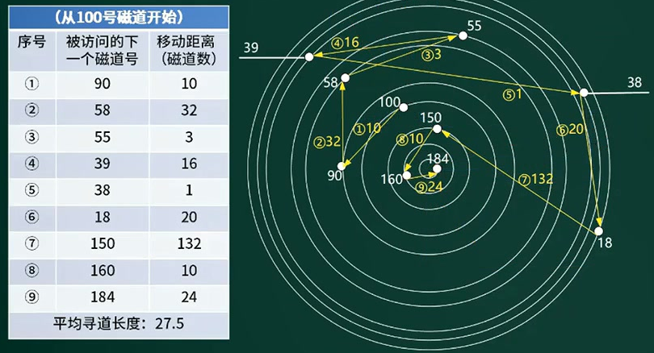

试题：在磁盘调度管理中，应先进行移臂调度，再进行旋转调度。假设磁盘移动臂位于21号柱面上，进程的请求序列如下表所示。如果采用最短移臂调度算法，那么系统的响应序列应为（**283 571 46 9**）。

| 请求序列 | 柱面号 | 磁头号 | 扇区号 |
| -------- | ------ | ------ | ------ |
| 1        | 17     | 8      | 9      |
| 2        | 23     | 6      | 3      |
| 3        | 23     | 9      | 6      |
| 4        | 32     | 10     | 5      |
| 5        | 17     | 8      | 4      |
| 6        | 32     | 3      | 10     |
| 7        | 17     | 7      | 9      |
| 8        | 23     | 10     | 4      |
| 9        | 38     | 10     | 8      |

题解：**只需确定最近的柱面**就可以，**柱面上的磁头读取的顺序是随机的**。顺序是23、17、32、38

# 流水线技术

## 概念

定义：流水线是指在程序执行时**多条指令重叠进行操作**的一种**准并行**处理实现技术。各种部件同时处理是针对不同指令而言的，它们可同时为多条指令的不同部分进行工作，以提高各部件的利用率和指令的平均执行速度。

- 指令的执行过程有三个步骤：取指、分析、执行，不同步骤使用不同的部件。
- 多个指令串联执行，耗时长，且取指、分析、执行中的部件有空余时间，
- 流水线执行：利用空闲时间后，多条指令在不同部件上同时执行多条指令，称为准并行。

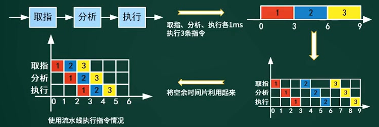

## 计算

1. **流水线执行时间**

   1. **流水线周期**：部件（t1~tk）中执行时间最长的一段。

      流水线建立时间：第一条指令执行完成的时间。

   2. 计算公式：1条指令执行时间 + （指令条数 - 1）* 流水线周期

      **理论公式**（t1+...+tk) + (n-1) * t，实践公式：k*t + (n-1) * t

   3. 示例：一条指令的执行过程可以分解为取指、分析和执行三步，在取指时间t取指=3△t、分析时间t分析=2△t、执行时间t执行=4△t的情况下，若按串行方式执行，则10条指令全部执行完需要**(90)**△t; 若按流水线的方式执行，流水线周期为**(4)**△t，则10条指令全部执行完需要**(45)**△t。

      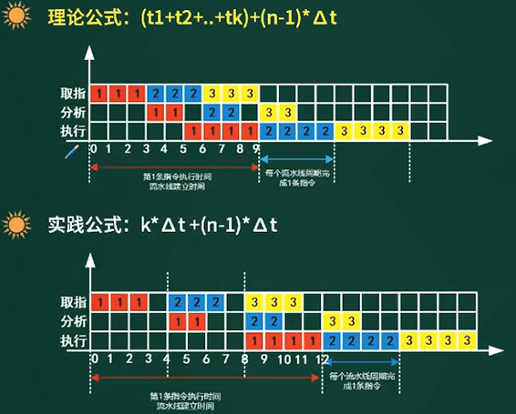

   4. 考试中使用理论公式，只有理论公式找不到答案，才考虑实践公式；实践公式是在流水线建立时间中增加冗余，为了容错，易扩展。

   5. 超标量流水线：成组扩展。分组后以最大的组来计算。（n-1)是排除第一条指令

      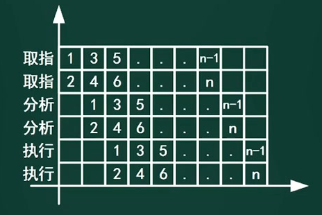

2. **流水线吞吐率**

   1. **TP**（Though Putrate）是指**在单位时间内流水线完成的任务数量或输出的结果数量**。

      **计算公式**：TP = 指令条数 / 流水线执行时间

   2. **流水线最大吞吐率**：流水线周期的倒数，个数/秒（n接近于无穷大时，K-1可以省略）

      **计算公式**：$TP_{max} =\displaystyle  \lim_{n \to \infty}{\frac{n}{(K+n-1)*\Delta t}} =\frac{1}{\Delta t} $

3. **流水线加速比**：完成同样一批任务，**加速比一定大于1**，

   **计算公式**：S = 不使用流水线的执行时间 / 使用流水线的执行时间。

4. 流水线效率：在时空图上（概念图），指令执行的部分占全部执行过程的比例，如 3*3 / 3\*5。 

# 总线

定义：总线（Bus）是计算机各种功能部件之间传送信息的公共通信干线，它是由导线组成的传输线束。它是cpu、内存、输入、输出设备传递信息的公用通道，主机的各个部件通过总线相连接，外部设备通过相应的接口电路再与总线相连接，从而形成了计算机硬件系统

- 总线是**半双工模式**：一条总线同一时刻仅允许一个设备发送，但允许多个设备接收。（对讲机）

- 双工模式：同一时间允许多个设备同时发送和接收。

按照功能的分类：

1. **数据总线（Daa Bus DB）**：在CPU和RAM之间**来回传送需要处理或是需要存储的数据。**
2. **地址总线（Address Bus AB）**：用来指定在RAM之中存储的**数据地址**。
3. **控制总线（Control Bus CB）**： 将微处理器**控制单元（Control Unit）的信号**，传送到周边设备。
4. 扩展总线（Expansion Bus）：可连接扩展槽和电脑。
5. 局部总线（Local Bus）：取代更高速数据传输的扩展总线。

按照实现方式的分类：

1. 并行总线：并行通信传输中有**多个数据位（一组一组的发送）**，同时在两个设备之间传输。发送设备将这些数据位通过 对应的数据线传送给接收设备，还可附加一位数据校验位。接收设备可同时接收到这些数据，不需要做任何变换就可直接使用。

   并行总线是数字电路里最早也是最普遍采用的总线结构。在这种总线上，要传输的数据线、地址线、控制线等都是并行传输，比如要传输8位的数据宽度，就需要8根数据信号线同时传输。

   这一组线是一起传输的，无论哪位产生错误，数据都不会正确的传送过去，只有重新传输。因为在电路板布板的时候，很难做到总线阻抗匹配，所以每根线的速度有快有慢，要想统一收下一次通信数据，就由最慢的那根线决定，木桶原理。所以**数据线每根线要等长**，必须得绕几下才行。

   优点：总线的逻辑时序比较简单，电路实现起来比较容易，**适合近距离高速数据传输**。

   缺点：并行总线的**信号线数量非常多**，会占用大量的管脚和布线空间，因此芯片和PCB板的尺寸很难实现小型化，特别是如果要用电缆进行远距离传输时，由于信号线的数量非常多，使得电缆变得非常昂贵和笨重。

   问题：**总线的吞吐量很难持续提升**，总线吞吐量=数据线位数×数据速率。以个人计算机里曾经非常流行的PCI总线为例，其最早推出时总线是32位的数据线，工作时钟频率是33MHz，其总线吞吐量=32bit×33MHz;后来为了提升其总线吞吐量推出的PCI-X总线，把总线宽度扩展到64位，工作时钟频率最高提升到133MHz，其总线吞吐量=64bit×133MHz。

   随着人们对于总线吞吐量的要求的不断提高，这种提升总线带宽的方式遇到了瓶颈。首先由于芯片尺寸和布线空间的限制，64位数据宽度已经几乎是极限了。另外一方面，这64根数据线是共用一个采样时钟，为了保证所有的信号都满足其建立保持时间的要求，在PCB上布线、换层、拐弯时需要保证精确等长。而总线工作速率越高，对于各条线的等长要求就越高，对于这么多根信号要实现**等长的布线**是很难做到的。

   **线间串扰**：更致命的是这种总线上通常挂有多个设备，且读写共用，各种信号分叉造成的反射问题使得信号质量进一步恶化。

2. 串行总线：串行数据传输时，**数据是一位一位地在通信线上传输的**，先由具有几位总线的计算机内的发送设备，将几位并行数据经并--串转换硬件转换成串行方式，再逐位经传输线到达接收站的设备中，并在接收端将数据从串行方式重新转换成并行方式，以供接收方使用

   优点：减少需要的走线数量，同时也不需要再考虑多根线之间的等长关系，且工作速率一般要比相应的并行总线高很多，所以在提高数据传输速率的同时节省了布线空间，同时芯片的功耗也降低了。**适用于长距离数据传输**。

   缺点：串行数据传输的速度要比并行传输慢得多，提高传输速度提高时钟频率。

# 嵌入式系统

## 芯片

1. DSP：也叫**数字信号处理器**，是一种适合进行**数字信号处理运算**的微处理器，主要应用是**实时快速的实现各种数字信号处理算法**。
2. SoC（System on Chip）：即片上系统，是有专用目标的集成电路。狭义的角度上，它是信息系统核心的芯片集成，是将系统关键部件集成在一块芯片上；广义角度上，SoC是一个微小型系统，若CPU是大脑，SoC是包括大脑、心脏、手、眼睛的系统。
3. MPU：微机中的**中央处理器CPU**也称为**微处理器MPU**，是构成微机的**核心部件**，控制整个微型计算机工作，产生控制信号对相应的部件进行控制，并执行相应的操作。
4. MCU（Microcontroller Unit）：**微控制单元**，又叫**单片微型计算机（Single Chip Microcontroller）**或者单片机，是把中央处理器CPU（Central Process Unit）的频率和规格做适当缩减，并将内存、计数器、USB，A/D转换、UART、PLC、DMA等周边接口，和LCD驱动电路整合在单一芯片上，形成**芯片级的计算机**，为不同的应用场合做不同组合控制。

## 交叉开发环境

交叉编译环境：开发系统和实际目标系统不是同一系统。

过程：在宿主机上进行开发、链接和调试，通过以太网和仿真器连接到目标机，在目标机上刻录系统。

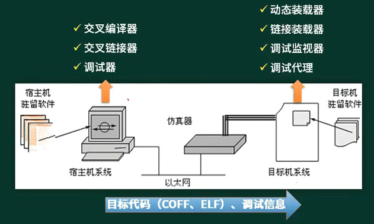

## 初始化过程

执行顺序：

1. 片级初始化：完成嵌入式微处理器的初始化。包括设置嵌入式微处理器的核心寄存器、控制寄存器、核心工作模式、局部总线模式等。片级初始化把嵌入式微处理器从上电时的默认状态逐步设置成系统所要求的工作状态，是一个纯硬件的初始化过程。
2. 板级初始化：完成嵌入式微处理器以外的其它硬件设备的初始化。设置某些软件的数据结构和参数，为之后的系统初始化和应用程序的运行建立硬件和软件环境。是一个包含软硬件两部分的初始化过程。
3. 系统初始化：以软件初始化为主，主要进行操作系统的初始化。BSP将对嵌入式微处理器的控制权转交给嵌入式操作系统，由操作系统完成余下的初始化工作，包含加载和初始化与硬件无关的设备驱动程序，建立系统内存区，加载并初始化其它系统软件模块，如网络系统、文件系统等。最后操作系统创建应用程序环境，病假控制权交给应用程序的入口。

# 校验码

检查传递的信息是否正确。

## 奇偶校验

编码方法：由若干位有效信息（如一个字节），再加上一个二进制位（校验位）组成校验码。

两种校验方式的合成：

- 奇校验：校验码（有效信息位 + 校验位）中的“1”的个数为奇数。就是让原有数据序列中（包括你要加上的一位）1的个数为奇数。

  示例：1000110（0）校验位必须添0，这样原来有3个1已经是奇数，所以添上0之后1的个数还是奇数个。

- 偶校验：校验码（有效信息位 + 校验位）中的“1”的个数为偶数。

**奇偶校验，可以检查奇数位的错误（两位出错因为奇偶性会相互抵消），不可纠错（只有个数，没有错误位置）**。

## 循环校验码

CRC（Cyclic Redundancy Check）循环冗余校验的特点：**可检错，不可纠错**。

编码方法：在k位信息码之后拼接r位校验码。

应用关键：

1. 如何从k位信息位简便的得到r位校验码（编码）
2. 如何从k+r位信息码判断是否出错。

编码规律：

1. 把待编码的N位有效信息标识为多项式M(X)
2. 把M(X)左移K位，得到M(X) * X^K，这样空出K位，以便拼装K位余数（即校验位）
3. 选取一个K+1位的产生多项式G(X)，对$M(X)\times X^K$做模2除
4. 把左移K位以后的有效信息和余数R(X)做模2加减，拼接为CRC码，共N+K位。

**模2除法：**是指在做除法运算的过程中**不计其进位**的除法（同异或）。

与普通除法的区别：普通除法若101比110小，则加上下一位再除1011/110（100/20，10不足20，向后加一位）

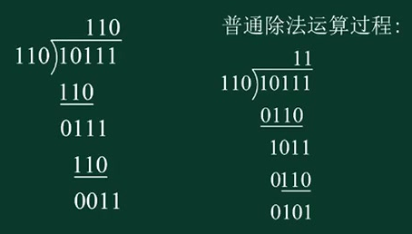

示例：**已知原始报文为“10111”**，：**已知生成多项式$G(X)=x^4+x+1$**

1. 由多项式公式获取每个指数下x的系数，最后为10011，作为被除数
2. 系数的长度是5，所以余数的长度最大只有4位（多项式的最高次幂）。
3. 原始报文补4个0作为校验位，得10111 0000
4. 模2除后得1100（若余数为11，则高位补0），再与10111 0000做模2加减，最终传递CRC码为10111 1100.

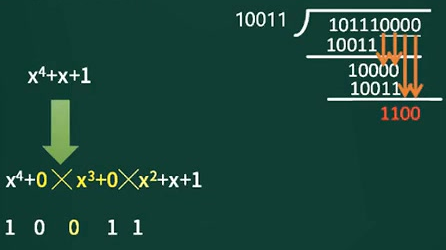

验证：若接收到的CRC码用约定的生成多项式G(X)去除（10111 1100 / 10011），如果正确，则余数为0；如果某一位出错，则余数不为0，不同的位数出错其余数不同，余数和出错位序号之间由唯一的对应关系。

## 海明校验码

特点：**可检错，也可纠错**。

原理：再有效信息位中加入几个校验位形成海明码（一般在$2^0,2^1...2^k$上)，使码距比较均匀的拉大，并把海明码的每个二进制位分配到几个奇偶校验组中。当某一位出错，就会引起有关的几个校验位的值发生变化，所以不但能发现错误，还能指出错误的位置，为自动纠错提供依据。

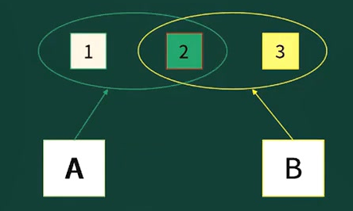

**信息位为m时，求校验位r的公式，找最小值：$2^r\geq m+r+1$（当m=10，r的最小值是4）**

示例：求信息1011的海明码

1. 计算校验码位数为3：$2^3\geq4+3+1$，分别放在$2^0=1,2^1=2,2^2=4$位上

2. 列出校验公式（异或），并根据公式得r2=0，r1=0，r0=1，生成海明码为：1010 101

   $7=2^2+2^1+2^0,6=2^2+2^1,5=2^2+2^0,3=2^1+2^0$

   $r_2=l_4\bigoplus l_3\bigoplus l_2=1\bigoplus0\bigoplus1=0$

   $r_1=l_4\bigoplus l_3\bigoplus l_1=1\bigoplus0\bigoplus1=0$

   $r_0=l_4\bigoplus l_2\bigoplus l_1=1\bigoplus1\bigoplus1=1$

   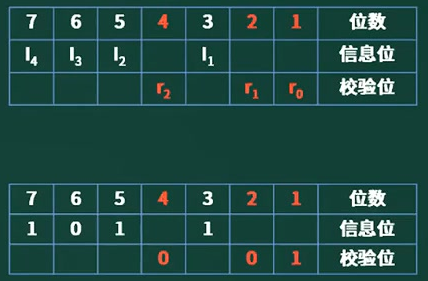

3. 验证：若收到信息为1011 101，则异或后，

   $r_2\bigoplus l_4\bigoplus l_3\bigoplus l_2=1\bigoplus1\bigoplus0\bigoplus1=1$

   $r_1\bigoplus l_4\bigoplus l_3\bigoplus l_1=0\bigoplus1\bigoplus0\bigoplus1=1$

   $r_0\bigoplus l_4\bigoplus l_2\bigoplus l_1=1\bigoplus1\bigoplus1\bigoplus1=0$