# 概述

操作系统（Operating System，OS）是计算机系统中的核心系统软件，负责管理和控制计算机系统中硬件和软件资源，合理地组织计算机工作流程和有效地利用资源，在计算机与用户之间起接口的作用。

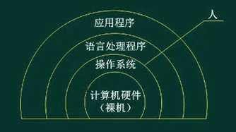

**作用**：

- 管理系统的硬件、软件、数据资源
- 控制程序运行
- 人机之间的接口
- 应用软件和硬件之间的接口

**特征**：并发性(concurrency)、共享性(sharing)、虚拟性(virtual)、不确定性(non-determinacy)。

**功能模块**：进程管理、存储管理、文件管理、作业管理、设备管理

典型的操作系统的分类：

1. 批处理操作系统。
   1. 原理:通过把用户提交的作业分类，将一批中的作业编成一个作业执行序列
   2. 批处理的分类：联机批处理和脱机批处理。
   3. 主要特征：用户脱机使用计算机、成批处理、多道程序运行。
2. 分时操作系统。
   1. 原理：采用分时技术，使多个用户同时以会话方式控制自己程序的运行，每个用户都感到似乎各自有一台独立的、支持自己请求服务的系统。分时技术把处理机的运行时间分成很短的时间片，按时间片轮流把处理机分配给各联机作业使用。若某个作业在分配给它的时间片内不能完成其计算，则该作业暂时中断，把处理机让给另一作业使用，等待下一轮时再继续运行
   2. 主要特征：交互性、多用户同时性、独立性。
3. 实时操作系统。
   1. 原理：实时操作系统往往是专用的，系统与应用很难分离，紧密结合在一起。实时系统不强调资源利用率，而更关心及时性（时间紧迫性)、可靠性和完整性。
   2. 分类实时系统:分为实时过程控制与实时信息处理。
   3. 主要特征:提供即时响应、高可靠性。
4. 网络操作系统
   1. 原理：按照网络架构的各个协议标准进行开发，包括网络管理、通信、资源共享、系统安全和多种网络应用服务等。在网络系统中，各计算机的操作系统可以互不相同，它需要有一个支持异种计算机系统之间进程通信的网络环境，以实现协同工作和应用集成。
   2. 主要特征:互操作性、协作处理。
5. 分布式操作系统。
   分布式操作系统要求有个统一的操作系统，实现系统操作的统一性，负责全系统的资源分配和调度，为用户提供统一的界面。它是一个逻辑上紧密耦合的系统。目前还没有真正实现的网络操作系统。

# 进程管理

进程（Process）是计算机中的程序关于某数据集合上的一次运行活动，是系统进行资源分配和调度的基本单位。

进程和程序的比较；

1. 进程是程序的一次执行，是一个动态的概念，而程序是静态的概念，是指令的集合，具有动态性和并发性。
2. 程序是进程运行所对应的运行代码，一个进程对应于一个程序，一个程序可同时对应于多个进程。

进程的组成：

- 从静态的观点看，进程由程序、数据和进程控制块(Process Control Block，PCB）组成。

- 从动态的观点看，进程是计算机状态的一个有序集合。

**进程控制块PCB**：是进程存在的唯一标志，PCB描述了进程的基本情况。

- 其内容可分为
  - 调度信息：供进程调度使用，包括进程当前的一些基本属性。
  - 执行信息：即现场，刻画了进程的执行情况。
- 其组织方式有：
  - **线性表方式**：不论进程的状态如何，将所有的 PCB 连续地存放在内存的系统区。这种方式适用于系统中进程数目不多的情况。 
  - **索引表方式**：该方式是线性表方式的改进，系统按照进程的状态分别建立就绪索引表、阻塞索引表等。
  - **链接表方式**：系统按照进程的状态将进程的 PCB 组成队列，从而形成就绪 列、阻塞队列、运行队列等

## 进程的状态

进程状态：一个进程的生命周期可以划分为一组状态，这些状态刻画了整个进程。

进程状态会根据CPU资源和非CPU资源的分配而变化。

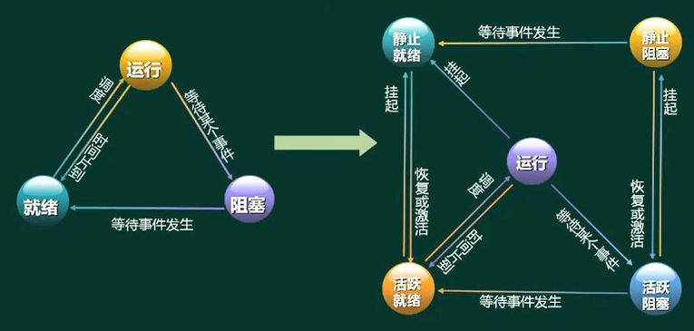

**三态模型**，假设所有进程都在内存中时，可以将进程的状态分为三种，即**就绪状态，运行状态，阻塞状态**。

1. 运行态：进程占用CPU，并在CPU上运行；
2. 就绪态：进程已经具备运行条件，但是CPU还没有分配过来；
3. 阻塞态：进程因等待某件事发生而暂时不能运行；

状态切换：一个进程在创建后将处于就绪状态，运行状态的进程将由于出现阻塞事件而进入阻塞状态，当阻塞事件结束之后，阻塞状态的进程将进入就绪状态，而处理器的调度策略又会引起运行状态和就绪状态之间的切换。

状态转换的原因：

- ①运行态→阻塞态:等待使用资源。
- ②阻塞态→就绪态:进程运行所需资源得到满足。
- ③运行态→就绪态:运行时间片结束，或者出现**更高优先权**的进程。
- ④就绪态→运行态:CPU 空闲时选择一个就绪进程。

==每个进程在执行过程中，任一时刻当且仅当处于上述三种状态之一==

**五态模型**：是具有挂起进程功能的系统中的进程状态，包括静止就绪、活跃阻塞、静止就绪、活跃阻塞、运行。

1. 通过挂起操作变成静止状态，静止状态只能通过恢复或激活变成活跃状态。
2. 静止就绪态表明进程具备运行条件但目前在二级存储器（外存储器、外存、辅存）中，只有当它被对换到内存才能被调度执行。
3. 静止阻塞态则表明进程正在等待某一个事件且在二级存储器中。

## 前驱图

拓扑排序针对**有向无环图**，找到一个可以执行的线性顺序，就是前驱图。

## 信号量和PV操作

在操作系统中，进程之间经常会存在互斥（都需要共享独占性资源时）和同步（完成异步的两个进程的协作）两种关系。为了有效地处理这两种情况，W.Dijkstra在1965年提出信号量和PV操作。

**同步和互斥**

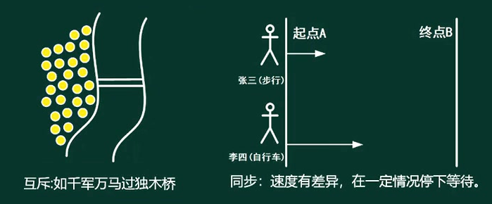

- 互斥：资源可以共享使用，但同一时刻只允 许1个进程来使用。**间接制约关系**，由资源来制约。
- 同步：多个进程之间，同时执行，全部完成。**直接制约关系**，由进程来制约。

**概念：**

定义：PV操作是一种实现进程互斥与同步的有效方法。PV操作和信息量的处理相关，荷兰文中，**通过**叫passeren，**释放**叫vrijgeven。 

- **临界资源**：进程间需要**互斥方式**对其进行共享的资源。如打印机。

- **临界区：**每个进程中访问临界资源的**那段代码**。

- **信号量**：是一种特殊的**变量**（全局变量S），表现形式是一个整型S和一个队列。

  表示访问权（初始为0，直接等待；初始为1，可以向下执行）

- PV操作是典型的**同步机制**之一，

原理：用PV操作来管理共享资源时，首先要确保PV操作自身执行的正确性。由于P(S)和V(S)都是在同一个**信号量S**上操作，为了使得它们在执行时不发生因交叉访问信号量S而可能出现的错误，约定P(S)和V(S)必须是两个不可被中断的过程，即让它们在屏蔽中断下执行。把不可被中断的过程称为**原语**。于是，P操作和V操作实际上应该是**P操作原语和V操作原语**

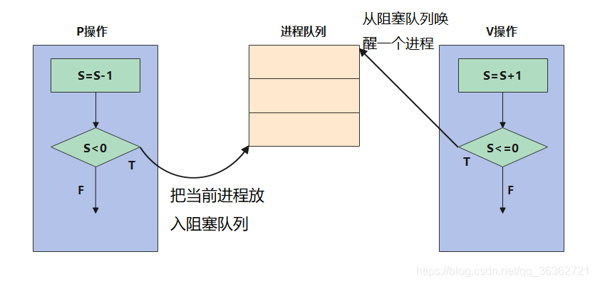

1. P操作，S=S-1：表示申请占用1个资源后（锁定），剩下的资源数。
2. 判断资源是否足够：S<0表示资源不够，进入阻塞队列。（**S表示可用的资源数**）
3. V操作，S=S+1：释放资源
4. 检查是否有人排队：S<=0表示有人排队，通知并唤醒一个阻塞进程（**S表示排队进程数量**）

**互斥模型：**

1. **每个程序中用户实现互斥的P、V操作必须成对出现，先做P操作，进临界区，后做V操作，出临界区**。若有多个分支，要认真检查其成对性。
2. P、V操作应分别紧靠临界区的头尾部，临界区的代码应尽可能短，不能有死循环。
3. **互斥信号量的初值一般为1（若为0，则P操作直接进入阻塞队列）**。

**同步模型：**

1. **分析进程间的制约关系，确定信号量种类**。在保持进程间有正确的同步关系情况下，哪个进程先执行，哪些进程后执行，彼此间通过什么资源（信号量）进行协调，从而明确要设置哪些信号量。

2. **（资源）信号量的初值**与相应资源的数量有关，也与P、V操作在程序代码中出现的位置有关。

3. **同一信号量的P、V操作要成对出现，但它们分别在不同的进程代码中**。

4. 最简单的同步形式是进程A在另一个进程B到达L2以前，不应前进到超过点L1，

   这样就可以使用如下程序：进程A，Ll:P(信号量)；进程B，L1:V(信号量)

   要确保进程B执行V操作之前，不让进程A的运行超过Ll，就要设置信号量S的初值为0。这样，如果进程A先执行到Ll，那么执行Р操作(S=S-1)后，S<0)，则停止执行。直到进程B执行到L2时,执行V操作(S=S+1)，唤醒A以继续执行。

理解：

- **信号量与PV操作是用来解决并发问题**的，而在**并发问题中最重要的是互斥与同步**两个关系，在解题时，应该先从寻找互斥与同步关系开始。
- 通常一个互斥或一个同步关系可以使用一个信号量来解决。
- 信号量的初值通常就是表示资源的可用数。而且通常对于**初始为0的信号量，会先做V操作**。
- **在资源使用之前，将会使用Р操作；在资源用完之后，将会使用V操作**。
  - 在互斥关系中，PV操作是在一个进程中成对出现的；
  - 在同步关系中，PV 操作一定是在两个进程甚至是多个进程中**成对出现**的。

### PV操作的应用

**生产者—消费者**是一个经典的问题，它不仅要解决生产者进程与消费者进程的同步关系，还要处理缓冲区的互斥关系，因此通常需要3个信号量来实现，见下表

| 信号量 | 功能类别 | 功能说明                                                     |
| ------ | -------- | ------------------------------------------------------------ |
| empty  | 同步     | 说明空闲的缓冲区数量，因为程序开始时，缓冲区全部为空。所以，其初始值应为缓冲区的总个数 |
| full   | 同步     | 说明已填充的缓冲区数量，因为程序开始时，所有缓冲区都为空（未填充)，所以，其初始值应为0 |
| mutex  | 互斥     | 保证同时只有一个进程在写缓冲区,因此，其初始值应为1           |

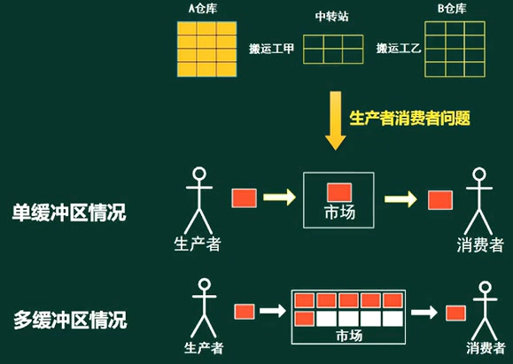

**生产者和消费者**（S1初始值为1，S2初始值为0，**先生产后消费**）

- P(S)负责检查，不满足条件则阻塞
- V(S)负责唤醒，唤醒阻塞队列中可以继续的生产者或消费者，
- 缓冲区的访问权可以加PV(S3)操作，进行加锁，实现互斥访问。

| 进程   | p1                    | p2                      | p3              | p4              |
| ------ | --------------------- | ----------------------- | --------------- | --------------- |
| 生产者 | 生产一个产品          | P(S1)检查缓冲区是否已满 | 送产品到缓冲区  | V(S2)唤醒消费者 |
| 消费者 | P(S2)检查缓冲区是否空 | 从缓冲区取产品          | V(S1)唤醒生产者 | 消费产品        |

**题目**：某书店有一个收银员，该书店最多允许n个购书者进入。将收银员和购书者看作不同的进程，其工作流程如下图所示。利用PV操作实现该过程，设置信号量S1、S2和Sn,初值分别为0，0,n。则图中a1和a2应填入（**V(S1)，P(S2)**），图中b1和b2应填入（**P(S1)，V(S2)**）。

题解：

1. 购书者进程中，多个购书者进程是互斥关系，使用Sn；购书者和收银员进程是同步关系，使用S1和S2
2. 收银员线程：P(S1)检查是否有人需要收费，收费后，V(S2)当前购书者已付款，并释放，让下一个购书者付款
3. 购书者进程：P(Sn),V(SN)保证每个购书者买的书不重复。购书后，使用V(S1) 唤醒收银员进行收费，P(S2)检查是否完成付款，等待或离开书店。
4. S1的初始值为0，**待付款队列**，收银员需要等待购书者进行付款，所以是先P后V。
5. S2的初始值为0，**已付款队列**，购书者需要等待收银员进行收款，所以是先V后P。
6. **收银员一直等待中，由购书者触发同步过程。**

### 前驱图的PV操作

进程P1、P2、P3、P4、P5的前趋图如下图所示。若用PV操作控制进程并发执行的过程，则需要设置4个信号量S1、S2、S3和S4，且信号量初值都等于零。图中**a=V(S1)，b=V(S2)，c=P(S1)，P(S2)，d=V(S3)，V(S4)，e=P(S3)，f=P(S4)**

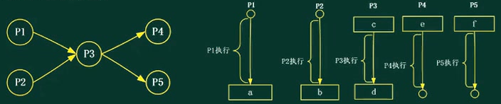

- 每一个节点，都要先判断前驱节点是否执行完成，再执行节点任务（任务中唤醒后驱的任务节点）。

### PV操作代码

假设某系统采用**非抢占式优先级调度算法**，若该系统有两个优先级相同的进程P1和P2，各进程的程序段如下所示，若信号量S1和S2的初值都为0。进程P1和P2并发执行后a、b和c的结果分别为: a= (4) ， b=(5),c=(6 ）。

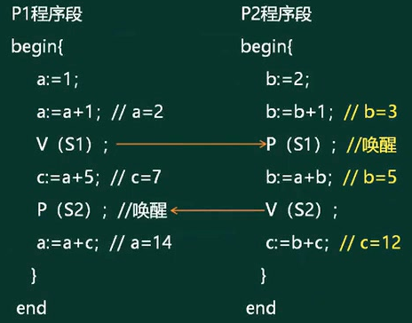

题解：

执行流程：因为S1，S2初始值为0，则P1会先执行，P2等待，a=2，c=7，b=3 => b=5，c=12，a=14

**非抢占式方式**：在采用这种调度方式时，一旦把处理机分配给某进程后，就一直让它运行下去，决不会因为时钟中断或任何其它原因去抢占当前正在运行进程的处理机，直至该进程完成，或发生某事件而被阻塞时，才把处理机分配给其它进程。

**抢占式方式**：这种调度程序根据某种原则，去暂停某个正在执行的进程，将已分配给该进程的处理机重新分配给另一个进程。

## 管程与线程

**管程**

1. 组成：管程由管程名、局部子管程的变量说明、使用共享资源并在数据集上进行操作的若干过程，以及对变量赋初值的语句4个基本部分组成。
2. 执行过程：每一个管程管理一个临界资源。当有几个进程调用某管程时，仅允许一个进程进入管程，其他调用者必须等待。方法是通过调用特定的管程入口进入管程，然后通过管程中的一个过程使用临界资源。
   1. 当某进程通过调用请求访问某临界资源而未能满足时，管程调用相应同步原语使该进程等待，并将它排在等待队列上。
   2. 当使用临界资源的进程访问完该临界资源并释放之后，管程又调用相应的同步原语唤醒等待队列中的队首进程。
   3. 为了表示不同的等待原因，设置条件变量，条件变量不能取任何值，只是一个排队栈。

**线程**

1. **线程是进程的活动成分，是处理器分配资源的最小单位**，它可以共享进程的资源与地址空间，通过线程的活动，进程可以提供多种服务（对服务器进程而言）或实行子任务并行(对用户进程而言)。采用线程机制的最大优点是节省开销、创建时间短。
2. 多线程系统：在多线程系统中，一个进程可以由一个或多个线程构成，每一线程可以独立运行，一个进程的线程共享这个进程的地址空间。核心级线程和用户级线程以及二者的组合方式都可以实现多线程系统。
3. 多线程实现的并行避免了进程间并行的缺点：创建线程的开销要比创建进程小，同一进程的线程共享进程的地址空间，所以线程切换（处理器调度）比进程切换快。

## 死锁问题

(1）如果一个进程在等待一个不可能发生的事件，则进程就死锁了。如果一个或多个进程产生死锁，就会造成系统死锁。
(2）发生的必要条件。

**定义**：死锁是指多个进程之间互相等待对方的资源，而在得到对方资源之前又不释放自己的资源，造成循环等待的一种现象。若一个进程再等待一个不可能发生的事件，则进程就死锁了。而如果一个或多个进程产生死锁，就会造成系统死锁。

**死锁资源数的计算**：系统有3个进程:A、B、C。这3个进程都需要5个系统资源。如果系统至少有多少个资源，则不可能发生死锁。

1. 资源数量范围是：0~4，则一定死锁，进程无法执行。

2. 资源数量范围是：5~12，可能会死锁。特殊情况，12个资源平均分配，每个进程4个资源，都无法执行。

3. 资源数量范围是：13....，不可能死锁。

4. 所以K个进程，每个进程需要W个资源，系统所需的最少资源M的公式：**K * ( W - 1) +1 <= M**

   若每个进程的资源数都不同如W1，W2，W3，则系统所需的最少资源公式：**( W1 + W2 + W3 ) - K + 1**

   每个进程的资源数都减一再相加，最后加1.

产生死锁的根本原因在于系统提供的资源个数少于并发进程所要求的该类资源数。**产生死锁有4个必要条件**:：

1. **互斥条件**：即一个资源每次只能被一个进程使用。
2. **请求保持条件**：有一个进程已获得了一些资源，但因请求其他资源被阻塞时，对已获得的资源保持不放。
3. **不可剥夺条件**：有些系统资源是不可抢占的，当某个进程已获得这种资源后，系统不能强行收回，只能由进程使用完时自己释放。
4. **环路条件**：若干个进程形成环形链，每个都占用对方要申请的下一个资源。

死锁的预防：**打破四大条件**，死锁的4个条件只要打破任何一个，都不会产生死锁。

死锁的避免：**有序资源分配法，银行家算法。**

## 银行家算法

银行家算法是指在分配资源之前先看清楚资源分配后是否会导致系统死锁。如果会死锁，则不分配;否则就分配。按照银行家算法的思想，当进程请求资源时，系统将按如下原则分配资源:

**分配资源的原则**：

1. 当一个进程对资源的最大需求量不超过系统中的资源数时，可以接纳该进程。
2. 进程可以分期请求资源，但请求的总数不能超过最大需求量。
3. 当系统的现有的资源不能满足进程尚需资源数时，对进程的请求可以推迟分配，但总能使进程在有限的时间里得到资源。
4. 当系统现有的资源能满足进程尚需资源数时，必须测试系统现存的资源能否满足该进程尚需的最大资源数，若能满足则按当前的申请量分配资源;否则也要推迟分配。

**示例**：假设系统中有三类互斥资源R1、R2、R3，可用资源分别是9、8、5。在TO时刻系统中有P1、P2、P3、P4和P5五个进程，这些进程对资源的最大需求量和已分配资源数如下所示，如果进程按序列（**P2-P4-P5-P1-P3**）执行那么系统状态是安全的。

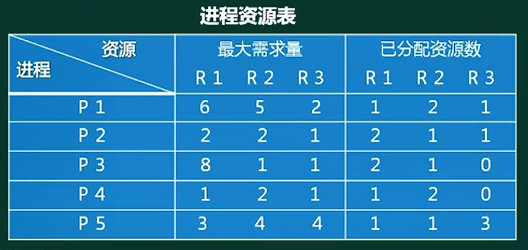

题解：求取剩余资源数，先执行资源满足的进程，然后释放进程资源，再进行查找。

# 存储管理

引言：层次化存储结构中，Cache解决CPU和内存之间速度容量不匹配的问题，而存储管理解决内存与外存的存储关系。

概念：

1. 存储管理的主要任务：提高主存的利用率、扩充主存以及对主存信息实现有效保护。
2. 存储管理的对象：主存储器（简称主存或内存)。
3. 逻辑地址和物理地址：用户编程所用的地址称为逻辑地址（虚地址)，而实际的内存地址则称为物理地址（实地址)。**每次访问内存时都要进行逻辑地址到物理地址的转换**，这种转换是由硬件完成的，而内存和外存间的信息动态调度是硬件和操作系统两者配合完成的。
4. 地址重定位：程序的逻辑地址被转换成主存的物理地址的过程。有两种方式：静态重定位和动态重定位。
5. 最常见的虚存组织有分段技术、分页技术、段页式技术三种

| 项目     | 段式管理                                                  | 页式管理                          | 段页式管理                                                   |
| -------- | --------------------------------------------------------- | --------------------------------- | ------------------------------------------------------------ |
| 划分方式 | 段（不定长)，每个作业一张段表                             | 页（定长)，每个进程一张页表       | 先将内存分为等长页,每个作业一张段表(通常有一个基号指向它)，每段对应一组页表 |
| 虚地址   | (S,d)，即（段内偏移)                                      | (P,d)，即（页号，页内偏移)        | (S,P,d)即(段号，段内页号，页内偏移)                          |
| 虚实转换 | 段表内找出起始地址，加段内偏移                            | 页表内找出起始地址,然后加页内偏移 | 先在段表中找到页表的起始地址,然后在表中找到起始地址,最后加页内偏移 |
| 主要优点 | 简化了任意增长和收缩的数据段管理,利于进程间共享过程和数据 | 消除了页外碎片                    | 结合了段与页的优点,便于控制存取访问                          |
| 主要缺点 | 段外碎片降低使用率                                        | 存在页内碎片                      | 提高复杂度,增加硬件存在页内碎片                              |

## 页式存储组织

 定义：将**程序与内存**均划分为同样大小的块，以页为单位将程序写入内存。

1. 将进程逻辑空间等分成若干大小的页面 
2. 相应的把物理内存空间分成与页面大小相同的物理块 
3. 以页面为单位把进程空间装进物理内存中分散的物理块
4. 页表：记录**进程逻辑空间和物理空间的映射关系的表**。（程序中的页放在内存中的那个块。）

页面大小：

- 页面大小应当适中，过大难以分配，过小内存碎片过多。**通常是512B~8K**
- 在`32位`逻辑地址空间的分页系统，规定页面大小为`4KB`，因为32位系统进程的寻址空间位4G，则在每个进程页表中的页表项可达`1M(4G/4K=2^20)`个，如果每个页表项占用`1Byte`，故每个进程仅仅页表就要占用`1MB`的内存空间。

页的地址：页面大小为4k时，**页内地址（页内偏移量，相对位置）**需要用12个二进制位表示

1. 高级编程语言中使用逻辑地址。     **逻辑地址 =   页号   + 页内地址**，如  10 1100 1101 1110

2. 运行状态，内存中使用物理地址。 **物理地址 = 页帧号 + 页内地址**，如110 1100 1101 1110

3. 逻辑地址转物理地址：页内地址不变，在页表中查找页号和页帧号的对应关系，将页号替换位页帧号。

   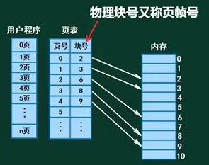

**特点：**

- 优点：利用率高，碎片小，分配及管理简单。
- 缺点：增加系统开销（地址转换），可能产生抖动现象（页面中断，页面不停淘汰和存入）。

### 页面淘汰

CPU先在内存中查找，若查找的内容不在内存中，则发生缺页中断。再次从外存查找数据，并存入内存。若逻辑页对应分配的物理页都存满了，则会**淘汰已有页面**。

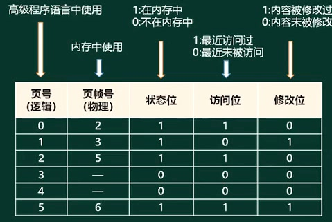

页表信息如上图所示，**页面淘汰原则**：

- 优先淘汰访问位为0的页。
- 多个访问位为0时，其次考虑淘汰修改位为0的页。

## 段式存储组织

定义：按**用户作业中的自然段**来划分逻辑空间，然后调入内存，段的长度可以不一样。

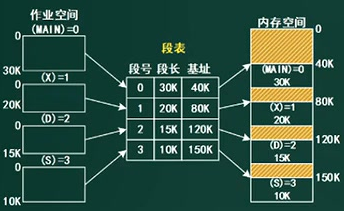

- 段表：记录作业空间和内存空间的映射关系。基址就是段在物理空间的起始位置。
- 优点：多道程序共享内存，各段程序修改互不影响。
- 缺点：内存利用率低，内存碎片浪费大（橙色阴影部分不能有效利用，比它大的无法插入）

逻辑地址（段号，段内偏移量）

- 合法段地址（0，25K）：段表中，段号为0对应基址为40K，段内偏移量25K小于段长30K，到了65K位置，处于有效的内存空间中。
- 非法段地址（0，35K）：段表中，段号为0对应基址为40K，段内偏移量35K大于段长30K，到了75K位置，处于无效的内存空间中（**橙色阴影空间为无效的内存空间**）。

## 段页式存储组织

定义：段式和页式的综合体。先分段，再分页。一个程序由若干段，每个段中可以有若干页，每个页的大小相同，但每个段的大小不同。

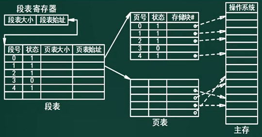

- 优点：空间浪费少，存储共享容易，存储保护容易、能动态连接
- 缺点：由于管理部件的增加，复杂性和开销也随之增加，需要的的硬件以及所占用的内存也增加，使得执行速度下降。

**快表和慢表：**

- 将页表（段表）存在**Cache**上，则是快表。是一块小容量的相联存储器（Associative Memory），有高速缓存器组成，速度快，并可以从硬件上保证按内容并行查找，一般用于存放当前访问最频繁的少数活动页面的页号。
- 将页表（段表）存在**内存**上，则是慢表。

# 文件管理

文件管理：是针对外存中的文件

文件存储：文件会被打散成多个物理块（物理地址）存储，形成逻辑上连续，物理上分散的数据。

文件查找：是从0开始连续的逻辑地址，通过页表或段表，查询分散存储的物理地址。

示例：如果文件大小为60GB，物理块(页)大小为4K，1个盘块号大小是4B（**B字节，b比特位**），则需要60G/4K*4B=60\*2^20B的空间，来存储文件和物理盘块的对应关系。

为了节省空间，引入索引结构。

## 索引文件结构

索引文件结构本身的容量很有限，所以引入一种**扩展机制**，可以很方便对索引文件扩容。

定义：索引可以理解为指针，盘块号，地址。索引表可以使用一个长度为13的数组存储。

结构：Unix系统的索引文件结构默认有13个节点，编号从0~12，并分成4部分：

1. 直接索引：节点0-9是直接索引，它们的地址直接对应物理盘块（**数据页**），物理盘块存程序文件的内容（**逻辑页号是连续的**）

2. 一级间接索引：节点10存的是物理盘块的地址，一个物理盘块的大小是4K，每个地址假设占4个字节，那么就能存1024个物理盘块（**索引页**）的地址（4k/4b=1024）。

   每个物理盘块的地址对应物理盘块，在物理盘块再存程序文件的内容（1024\*4k）

3. 二级间接索引：节点11存的是物理盘块地址的地址，地址的地址映射到地址，地址对应物理盘块（1024*1024\*4k）

4. 三级间接索引：节点12同理（1024\*1024\*1024*4k）

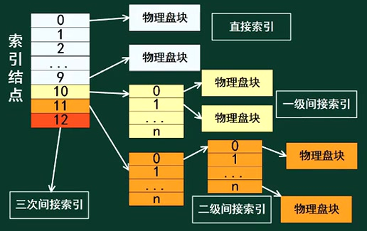

例题：假设文件系统采用索引节点管理，且索引节点有8个地址项iaddr[0] ~iaddr[7]，每个地址项大小为4字节，iaddr[0] ~iaddr[4]采用直接地址索引，iaddr[5]和iaddr[6]采用一级间接地址索引，iaddr[7]采用二级间接地址索引。假设磁盘索引块和磁盘数据块大小均为1KB字节，文件File1的索引节点如下图所示。若用户访问文件File1中逻辑块号为5和261的信息，则对应的物理块号分别为 （**58和187**）;101号物理块存放的是（**二级间接索引**）

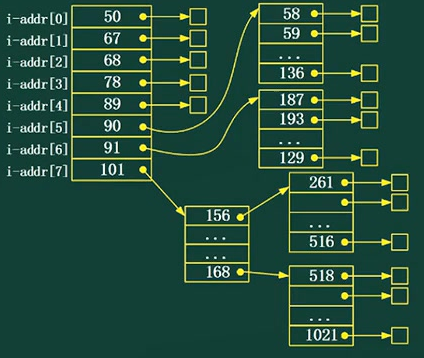

题解：**逻辑页号是连续的**，所以直接索引对应的是0~4号逻辑页。通过逻辑块号，查找物理块号。

- 5号逻辑页放在在下一个索引节点（一级间接索引 ）的第一个位置，58

- 索引块为1KB，每个地址项大小为4字节，则每个索引块包含的索引地址有1KB/4B=256个

  索引块iaddr[5]是一级间接索引，逻辑页起始块号为5，可以**计算结束块号 X-5+1=256，X=260**

  逻辑块号为261的逻辑页放在下一个索引节点（一级间接索引 ）的第一个位置，187。

## 文件和树形目录结构

**文件属性**：R只读，A存档，S系统，H隐藏

**文件名组成**：驱动器型号，路径，主文件名，扩展名。

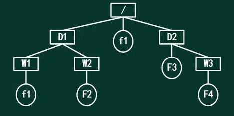

也叫多级目录结构：若当前目录为D1，求F2的路径。

- 绝对路径：从盘符开始的路径。F2路径是：/D1/W2/F2
- 相对路径：从当前目录开始的路径。F2路径是：W2/F2

## 空闲存储空间管理

管理方法有：空闲区表法，空闲链表法，**位示图法（1表示占用，0表示空闲）**、成组链接法。

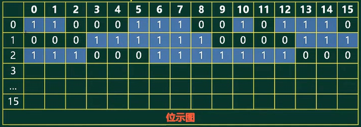

**试题**：某文件管理系统在磁盘上建立了位示图(bitmap)，记录磁盘的使用情况。若磁盘上的物理块依次编号为:0、1、2、...，系统中字长为32位，每一位对应文件存储器上的一个物理块，取值0和1分别表示空闲和占用，如下图所示。假设**将4195号物理块分配给某文件（修改为1）**，那么该物理块的使用情况在位示图中的第（**132**）个字中描述;系统应该将（**该字的第3位置设为“1”**）

题解：

- 字号 = 取整（（物理块号+1）/ 字长）+ 1
  - 因为物理块是从0开始编号，所以4195号物理块是第4196个物理块。物理块总数 = 块号 + 1。
  - 字长为32，所以4195所在的字的位置为：（4195+1）/ 32=131.125，向上取整，第132字。
- 位号 = 求余（（物理块号+1）/ 字长）- 1
  - 之前的131个字存放131*32=4192个位，范围是0~4191
  - 在第132个字中，如图示位从0开始编号，4192是0位置，则4195是第3位置。

注意：若没有说明，则默认位从0开始编号，字从1开始编号。

# 设备管理

## 数据传输控制方式

负责主存与外设之间进行数据传输，**I/O输入/输出控制方式**如下：**效率越来越高**

- **程序控制（查询）方式**：在完成数据的输入输出中，整个数据输出过程是在CPU执行程序的控制下完成的

  无条件传送方式：无条件地与CPU交换数据。

  程序查询方式：先通过CPU查询外设状态，准备好之后再与CPU交换数据。

  方法简单，硬件开销小，但I/O能力不高，严重影响CPU的利用率

- **程序中断方式**：利用中断机制，当I/O系统外设交换数据时，CPU无须等待（也需要执行中断的指令）

  因为CPU无需等待而提高了传输请求的响应速度。如键盘。

- **DMA方式**：DMA为了在内存与外设之间实现高速、批量数据交换而设置。如硬盘。

  直接存储器存取（Direct Memory Access，DMA）是指数据在主存与 I/O 设备间的直接成块传送， 即在存储器与 I/O 设备间传送数据块的过程中，**不需要 CPU 作任何干涉**，只需在过程开始启动（即向 设备发出“传送一块数据”的命令）与过程结束（CPU 通过轮询或中断得知过程是否结束和下次操作是否准备就绪）时由 CPU 进行处理，实际操作由 DMA 硬件直接完成，CPU 在传送过程中可做其它事情。（CPU交出计算机系统总线的控制权，不参与内存与外设间的数据交换。）

- **通道方式**

- **I/O处理机**

## 虚设备和SPOOLING技术

假脱机技术（并没有实现真正的脱机），经常用于打印机，打印机自存储区：多人打印，打印任务放入缓冲区（任务队列）中，逐条打印。

# 操作系统介绍

## 微内核操作系统

### 前言UNIX

随着 CPU 技术的发展，UNIX 于1969年诞生了，这是一个真正意义上的**分时操作系统**，而且Dennis Ritchie 为开发 UNIX 设计了**C语言**，C语言成为了所有流行的现代编程语言的主要设计来源。

借助新的 CPU 技术的支持，UNIX 将软件系统划分为**内核（kernel）**和**用户态程序（userland programs）**

- 内核是一组中断处理程序的集合，把硬件的能力封装为操作系统功能调用（system calls），
- 用户态程序通过系统调用使用硬件功能，用户态程序运行于各自的进程中，所有用户态进程都共享同一个内核
- 每当系统调用或中断发生，UNIX 便陷入（trap）内核，内核执行系统调用，与此同时，**内核中的分时调度算法**将决定把 CPU 交给哪个进程，并管理进程的上下文切换
- UNIX 把（几乎）所有硬件都封装为文件
- UNIX 还提供了一个特殊的用户态程序 shell，供用户直接使用系统，通过内核提供的进程间通信能力，shell让 用户可以把一系列应用程序组合起来，处理复杂的需求。作者称这个**设计思想为「KISS」**（Keep It Simple and Stupld）

### 引入微内核

问题：UNIX「**一切皆文件**」的设计带来了用户程序设计的很多便利，但它要求**所有对硬件的封装都要在内核态**，因此内核中模块的 bug 会让整个系统受到影响，比如说：

1. 如果某个设备驱动有内存泄漏，所有使用该设备的用户态进程都会有内存泄漏，
2. 如果某个内核模块有安全漏洞，整个系统的安全性将不再可控。

解决方案：**微内核的本质是让操作系统的内核态只保留内存地址管理、线程管理和进程间通讯（IPC）**这些基本功能，而把其它功能如**文件系统、设备驱动、网络协议栈、GUI 系统等都作为单独的服务**，这类服务一般是单独的**用户态 daemon 进程**。

1. 用户态应用程序通过 **IPC** 访问这些服务，从而访问操作系统的全部功能
2. 如此一来，需要陷入内核的系统调用数量将大大减少，系统的**模块化更加清晰**
3. **系统更加健壮**，只有内核中的少量系统调用才有权限访问硬件的全部能力，如设备驱动的问题只会影响对应服务，而不是影响整个系统

|          | 实质                                                         | 优点                                                         | 缺点                                                       |
| -------- | ------------------------------------------------------------ | ------------------------------------------------------------ | ---------------------------------------------------------- |
| 单体内核 | 将图形、设备驱动及文件系统等功能全部在内核中实现，运行在内核状态和同一地址空间 | 减少进程间通信和状态切换的系统开销、获得**较高的运行效率**   | 内核庞大，占用资源多且不易剪裁。**系统稳定性和安全性不好** |
| 微内核   | 只实现基本功能（**请求和应答**），将图形系统、文件系统、设备驱动及通信功能放在用户态 | 内核精炼，便于剪裁和一直。系统服务程序运行在用户地址空间，**系统可靠性、稳定性和安全性高**。**可用于分布式** | 用户态和内核态需要频繁切换，从而导致效率不如单体内核       |

## 嵌入式操作系统

嵌入式操作系统运行在嵌入式智能芯片环境中，对整个智能芯片以及它所操作、控制的各种部件装置等资源进行统一协调、处理、指挥和控制。其主要特点:

- ①微型化（代码质量高）。从性能和成本角度考虑，希望占用资源和系统代码量少，如内存少、字长短、运行速度有限、能源少(用微小型电池)。
- ②可定制（专业化，可剪裁、可配置），从减少成本和缩短研发周期考虑，要求嵌入式操作系统能运行在不同的微处理器平台上，能针对硬件变化进行结构与功能上的配置，以满足不同应用需要。
- ③实时性。嵌入式操作系统主要应用于过程控制、数据采集、传输通信、多媒体信息及关键要害领域需要迅速响应的场合，所以对实时性要求高。
- ④可靠性。系统构件、模块和体系结构必须达到应有的可靠性，对关键要害应用还要提供容错和防故障措施。
- ⑤易移植性。为了提高系统的易移植性，通常采用硬件抽象层 (HardwareAbstraction Level; HAL)和板级支持包(Board Support Package, BSP)的底层设计技术(硬件无关性)。

实时嵌入式操作系统的内核服务：异常和中断、计时器、I/O管理。

常见的嵌入式实时操作系统RTOS（Real-Time Operating System)：VxWorks，RT-Linux，QNX，pSOS

| 比较类型           | VxWorks                            | RT-Linux                           |
| ------------------ | ---------------------------------- | ---------------------------------- |
| 工作方式           | 操作系统和应用程序处于同一存储空间 | 操作系统和应用程序处于不同存储空间 |
| 多任务（线程）支持 | 支持                               | 支持                               |
| 实时性             | 实时系统                           | 实时系统                           |
| 安全性             | 任务间无隔离保护                   | 支持进程间隔离保护                 |
| 标准API            | 支持                               | 支持                               |

1. 实时系统的**正确性**依赖于运行结果的逻辑正确性和运行结果产生的时间正确性，即**实时系统必须在规定的时间范围内正确地响应外部物理过程的变化**。 
2. 实时多任务操作系统是根据操作系统的工作特性而言的。实时是指物理进程的真实时间。
3. 实时操作系统是指具有实时性，能支持实时控制系统工作的操作系统。**首要任务是调度一切可利用的资源来完成实时控制任务**，其次才着眼于提高计算机系统的使用效率，重要特点是要满足对时间的限制和要求。
4. 一个实时操作系统可以在不破坏规定的时间限制的情况下完成所有任务的执行。任务执行的时间可以根据系统的软硬件的信息而进行确定性的预测。也就是说，如果硬件可以做这件工作，那么实时操作系统的软件将可以确定性的做这件工作。 **实时操作系统可根据实际应用环境的要求对内核进行裁剪和重新配置，根据不同的应用，其组成有所不同**

嵌入式系统设计一般要考虑低功耗，软件设计也要考虑低功耗设计，主要可以从以下方面展开：

1.  软硬件协同设计，即软件的设计要与硬件的匹配，考虑硬件因素。 
2.  编译优化，采用低功耗优化的编译技术。
3.  减少系统的持续运行时间，可从算法角度进行优化。
4.  用“中断”代替“查询” 
5.  进行电源的有效管理

## 机器人操作系统

概念：

1. 定义：**ROS （robot operating system）**，这一机器人操作系统是一系列开源软件库和开源工具，它可以帮助我们搭建起自己的机器人应用平台。

   如今，ROS平台被广泛的用于移动机器人，飞行器，双目相机，机械臂抓取平台

2. 目的：是为了搭建起一个融合不同研究结果，算法实现和代码复用的通用的机器人初始平台。

3. 数据结构：Messages（消息）在整个ROS系统中扮演关键的作用。消息在通讯中是传递信息的关键媒介。其中消息的类型有很多种，比如在KinectV2中/KinectV2/ rgb/Image_raw话题的消息是sensor_msgs/ Image。同样在位姿估计中，我们经常会看到话题发布的geometry_msgs/Pose。

4. ROS 的架构定义了 ROS 系统由多个各自独立的节点(组件)组成，并且各个节点之间可以通过发布/订阅(Publish/Subscribe)消息模型进行通信。

ROS有以下几个主要的特征：分布式架构，多语言支持，足够好的稳定性以及开源。

- 具有分布式进程框架，以点对点设计以及服务和节点管理器方式，使得执行程序可以各自独立地设计，松散地、实时地组合起来。这些进程可以按照功能包和功能 包集的方式分组，因而可以容易地分享和发布。
- ROS对于OpenCV以及PCL具有很好的兼容性，它们可以在图像处理中发挥巨大作用。比如可以实现物体的识别和位姿估计。
- RVIZ作为ROS中的可视化平台，可以生动的展现三维信息，比如，可以通过TF树展示机械臂，相机以及目标物体的坐标变换。

ROS的通讯主要包含三种方式：Topic（话题），Service（服务），以及Action通讯

1. 主题(Topic) ：适合用于传输传感器信息(数据流) ，可能让系统过载(数据太多)、一对多模式
2. 服务(Service) ：能够知道是否调用成功 、服务执行完会有反馈、可以监控长时间执行的进程、服务执行完之前，程序会等待。
3. 动作(Action)：建立通信较慢； 较复杂、有握手信号。