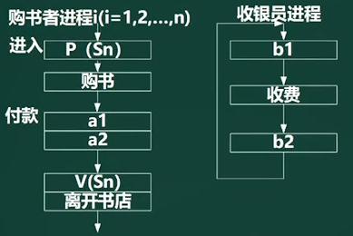

# 概述

操作系统OS（Operating System），最接近计算机硬件。

**作用**：

- 管理系统的硬件、软件、数据资源
- 控制程序运行
- 人机之间的接口
- 应用软件和硬件之间的接口

**功能模块**：进程管理、存储管理、文件管理、作业管理、设备管理

# 进程管理

进程（Process）是计算机中的程序关于某数据集合上的一次运行活动，是系统进行资源分配和调度的基本单位。

## 进程的状态

进程状态：一个进程的生命周期可以划分为一组状态，这些状态刻画了整个进程。

进程状态会根据CPU资源和feiCPU资源的分配而变化。

三态模型，即**就绪状态，运行状态，阻塞状态**。

1. 运行态：进程占用CPU，并在CPU上运行；
2. 就绪态：进程已经具备运行条件，但是CPU还没有分配过来；
3. 阻塞态：进程因等待某件事发生而暂时不能运行；

五态模型：就绪、阻塞、运行通过挂起操作变成静止状态，静止状态只能通过恢复或激活变成活跃状态。

## 前驱图

拓扑排序针对**有向无环图**，找到一个可以执行的线性顺序，就是前驱图。

**同步和互斥**

- 互斥：资源可以共享使用，但同一时刻只允 许1个进程来使用。**间接制约关系**，由资源来制约。
- 同步：多个进程之间，同时执行，全部完成。**直接制约关系**，由进程来制约。

**典型模型**：生产者和消费者

## 信号量和PV操作

定义：PV操作是一种实现进程互斥与同步的有效方法。PV操作和信息量的处理相关，荷兰文中，**通过**叫passeren，**释放**叫vrijgeven。 

- **临界资源**：进程间需要**互斥方式**对其进行共享的资源。如打印机。
- **临界区：**每个进程中访问临界资源的**那段代码**。
- **信号量**：是一种特殊的**变量**（全局变量S），表示访问权（初始为0，直接等待；初始为1，可以向下执行）
- PV操作是典型的**同步机制**之一，

原理：用PV操作来管理共享资源时，首先要确保PV操作自身执行的正确性。由于P(S)和V(S)都是在同一个**信号量S**上操作，为了使得它们在执行时不发生因交叉访问信号量S而可能出现的错误，约定P(S)和V(S)必须是两个不可被中断的过程，即让它们在屏蔽中断下执行。把不可被中断的过程称为**原语**。于是，P操作和V操作实际上应该是**P操作原语和V操作原语**

1. P操作，S=S-1：表示申请占用1个资源后（锁定），剩下的资源数。
2. 判断资源是否足够：S<0表示资源不够，进入阻塞队列。（**S表示可用的资源数**）
3. V操作，S=S+1：释放资源
4. 检查是否有人排队：S<=0表示有人排队，通知并唤醒一个阻塞进程（**S表示排队进程数量**）

**互斥模型：**

1. **每个程序中用户实现互斥的P、V操作必须成对出现，先做P操作，进临界区，后做V操作，出临界区**。若有多个分支，要认真检查其成对性。
2. P、V操作应分别紧靠临界区的头尾部，临界区的代码应尽可能短，不能有死循环。
3. **互斥信号量的初值一般为1（若为0，则P操作直接进入阻塞队列）**。

**同步模型：**

1. **分析进程间的制约关系，确定信号量种类**。在保持进程间有正确的同步关系情况下，哪个进程先执行，哪些进程后执行，彼此间通过什么资源（信号量）进行协调，从而明确要设置哪些信号量。
2. **（资源）信号量的初值**与相应资源的数量有关，也与P、V操作在程序代码中出现的位置有关。
3. **同一信号量的P、V操作要成对出现，但它们分别在不同的进程代码中**。

### PV操作的应用

**生产者和消费者**（S1初始值为1，S2初始值为0，**先生产后消费**）

- P(S)负责检查，不满足条件则阻塞
- V(S)负责唤醒，唤醒阻塞队列中可以继续的生产者或消费者，
- 缓冲区的访问权可以加PV(S3)操作，进行加锁，实现互斥访问。

| 进程   | p1                    | p2                      | p3              | p4              |
| ------ | --------------------- | ----------------------- | --------------- | --------------- |
| 生产者 | 生产一个产品          | P(S1)检查缓冲区是否已满 | 送产品到缓冲区  | V(S2)唤醒消费者 |
| 消费者 | P(S2)检查缓冲区是否空 | 从缓冲区取产品          | V(S1)唤醒生产者 | 消费产品        |

**题目**：某书店有一个收银员，该书店最多允许n个购书者进入。将收银员和购书者看作不同的进程，其工作流程如下图所示。利用PV操作实现该过程，设置信号量S1、S2和Sn,初值分别为0，0,n。则图中a1和a2应填入（**V(S1)，P(S2)**），图中b1和b2应填入（**P(S1)，V(S2)**）。

题解：

1. 购书者进程中，多个购书者进程是互斥关系，使用Sn；购书者和收银员进程是同步关系，使用S1和S2
2. 收银员线程：P(S1)检查是否有人需要收费，收费后，V(S2)当前购书者已付款，并释放，让下一个购书者付款
3. 购书者进程：P(Sn),V(SN)保证每个购书者买的书不重复。购书后，使用V(S1) 唤醒收银员进行收费，P(S2)检查是否完成付款，等待或离开书店。
4. S1的初始值为0，**待付款队列**，收银员需要等待购书者进行付款，所以是先P后V。
5. S2的初始值为0，**已付款队列**，购书者需要等待收银员进行收款，所以是先V后P。
6. **收银员一直等待中，由购书者触发同步过程。**

### 前驱图的PV操作

进程P1、P2、P3、P4、P5的前趋图如下图所示。若用PV操作控制进程并发执行的过程，则需要设置4个信号量S1、S2、S3和S4，且信号量初值都等于零。图中**a=V(S1)，b=V(S2)，c=P(S1)，P(S2)，d=V(S3)，V(S4)，e=P(S3)，f=P(S4)**

- 每一个节点，都要先判断前驱节点是否执行完成，再执行节点任务（任务中唤醒后驱的任务节点）。

### PV操作代码

假设某系统采用**非抢占式优先级调度算法**，若该系统有两个优先级相同的进程P1和P2，各进程的程序段如下所示，若信号量S1和S2的初值都为0。进程P1和P2并发执行后a、b和c的结果分别为: a= (4) ， b=(5),c=(6 ）。

题解：

执行流程：因为S1，S2初始值为0，则P1会先执行，P2等待，a=2，c=7，b=3 => b=5，c=12，a=14

**非抢占式方式**：在采用这种调度方式时，一旦把处理机分配给某进程后，就一直让它运行下去，决不会因为时钟中断或任何其它原因去抢占当前正在运行进程的处理机，直至该进程完成，或发生某事件而被阻塞时，才把处理机分配给其它进程。

**抢占式方式**：这种调度程序根据某种原则，去暂停某个正在执行的进程，将已分配给该进程的处理机重新分配给另一个进程。

## 死锁问题

**定义**：进程管理是操作系统的核心，若一个进程再等待一个不可能发生的事，则进程就死锁了。而如果一个或多个进程产生死锁，就会造成系统死锁。

**死锁资源数的计算**：系统有3个进程:A、B、C。这3个进程都需要5个系统资源。如果系统至少有多少个资源，则不可能发生死锁。

1. 资源数量范围是：0~4，则一定死锁，进程无法执行。

2. 资源数量范围是：5~12，可能会死锁。特殊情况，12个资源平均分配，每个进程4个资源，都无法执行。

3. 资源数量范围是：13....，不可能死锁。

4. 所以K个进程，每个进程需要W个资源，系统所需的最少资源公式：**K * ( W - 1) +1**

   若每个进程的资源数都不同如W1，W2，W3，则系统所需的最少资源公式：**( W1 + W2 + W3 ) - K + 1**

   每个进程的资源数都减一再相加，最后加1.

死锁的四大条件：**互斥、保持和等待、不剥夺，环路等待**。

死锁的预防：**打破四大条件**

死锁的避免：**有序资源分配法，银行家算法。**

## 银行家算法

**分配资源的原则**：

1. 当一个进程对资源的最大需求量不超过系统中的资源数时，可以接纳该进程。
2. 进程可以分期请求资源，但请求的总数不能超过最大需求量。
3. 当系统的现有的资源不能满足进程尚需资源数时，对进程的请求可以推迟分配，但总能使进程在有限的时间里得到资源。

**示例**：假设系统中有三类互斥资源R1、R2、R3,可用资源分别是9、8、5。在TO时刻系统中有P1、P2、P3、P4和P5五个进程，这些进程对资源的最大需求量和已分配资源数如下所示，如果进程按序列（**P2-P4-P5-P1-P3**）执行那么系统状态是安全的。

题解：求取剩余资源数，先执行资源满足的进程，然后释放进程资源，再进行查找。

# 存储管理

引言：层次化存储结构中，Cache解决CPU和内存之间速度容量不匹配的问题，而存储管理解决内存与外存的存储关系。

## 页式存储组织

 定义：将**程序与内存**均划分为同样大小的块，以页为单位将程序写入内存。

1. 将进程逻辑空间等分成若干大小的页面 
2. 相应的把物理内存空间分成与页面大小相同的物理块 
3. 以页面为单位把进程空间装进物理内存中分散的物理块
4. 页表：记录**进程逻辑空间和物理空间的映射关系的表**。（程序中的页放在内存中的那个块。）

页面大小：

- 页面大小应当适中，过大难以分配，过小内存碎片过多。**通常是512B~8K**
- 在`32位`逻辑地址空间的分页系统，规定页面大小为`4KB`，因为32位系统进程的寻址空间位4G，则在每个进程页表中的页表项可达`1M(4G/4K=2^20)`个，如果每个页表项占用`1Byte`，故每个进程仅仅页表就要占用`1MB`的内存空间。

页的地址：页面大小为4k时，**页内地址（页内偏移量，相对位置）**需要用12个二进制位表示

1. 高级编程语言中使用逻辑地址。     逻辑地址 =   页号   + 页内地址，如  10 1100 1101 1110

2. 运行状态，内存中使用物理地址。 物理地址 = 页帧号 + 页内地址，如110 1100 1101 1110

3. 逻辑地址转物理地址：页内地址不变，在页表中查找页号和页帧号的对应关系，将页号替换位页帧号。

   

**特点：**

- 优点：利用率高，碎片小，分配及管理简单。
- 缺点：增加系统开销（地址转换），可能产生抖动现象（页面中断，页面不停淘汰和存入）。

## 页面淘汰

CPU先在内存中查找，若查找的内容不在内存中，则发生缺页中断。再次从外存查找数据，并存入内存。若逻辑页对应分配的物理页都存满了，则会**淘汰已有页面**。

页表信息如上图所示，**页面淘汰原则**：

- 优先淘汰访问位为0的页。
- 多个访问位为0时，其次考虑淘汰修改位为0的页。

## 段式存储组织

定义：按**用户作业中的自然段**来划分逻辑空间，然后调入内存，段的长度可以不一样。

- 段表：记录作业空间和内存空间的映射关系。基址就是段在物理空间的起始位置。
- 优点：多道程序共享内存，各段程序修改互不影响。
- 缺点：内存利用率低，内存碎片浪费大（橙色阴影部分不能有效利用，比它大的无法插入）

逻辑地址（段号，段内偏移量）

- 合法段地址（0，25K）：段表中，段号为0对应基址为40K，段内偏移量25K小于段长30K，到了65K位置，处于有效的内存空间中。
- 非法段地址（0，35K）：段表中，段号为0对应基址为40K，段内偏移量35K大于段长30K，到了75K位置，处于无效的内存空间中（**橙色阴影空间为无效的内存空间**）。

## 段页式存储组织

定义：段式和页式的综合体。先分段，再分页。一个程序由若干段，每个段中可以有若干页，每个页的大小相同，但每个段的大小不同。

- 优点：空间浪费少，存储共享容易，存储保护容易、能动态连接
- 缺点：由于管理部件的增加，复杂性和开销也随之增加，需要的的硬件以及所占用的内存也增加，使得执行速度下降。

**快表和慢表：**

- 将页表（段表）存在**Cache**上，则是快表。是一块小容量的相联存储器（Associative Memory），有高速缓存器组成，速度快，并可以从硬件上保证按内容并行查找，一般用于存放当前访问最频繁的少数活动页面的页号。
- 将页表（段表）存在**内存**上，则是慢表。

# 文件管理

文件管理：是针对外存中的文件

文件存储：文件会被打散成多个物理块（物理地址）存储，形成逻辑上连续，物理上分散的数据。

文件查找：是从0开始连续的逻辑地址，通过页表或段表，查询分散存储的物理地址。

示例：如果文件大小为60GB，物理块(页)大小为4K，1个盘块号大小是4B（**B字节，b比特位**），则需要60G/4K*4B=60\*2^20B的空间，来存储文件和物理盘块的对应关系。

为了节省空间，引入索引结构。

## 索引文件结构

索引文件结构本身的容量很有限，所以引入一种**扩展机制**，可以很方便对索引文件扩容。

定义：索引可以理解为指针，盘块号，地址。索引表可以使用一个长度为13的数组存储。

结构：Unix系统的索引文件结构默认有13个节点，编号从0~12，并分成4部分：

1. 直接索引：节点0-9是直接索引，它们的地址直接对应物理盘块（**数据页**），物理盘块存程序文件的内容（**逻辑页号是连续的**）

2. 一级间接索引：节点10存的是物理盘块的地址，一个物理盘块的大小是4K，每个地址假设占4个字节，那么就能存1024个物理盘块（**索引页**）的地址（4k/4b=1024）。

   每个物理盘块的地址对应物理盘块，在物理盘块再存程序文件的内容（1024\*4k）

3. 二级间接索引：节点11存的是物理盘块地址的地址，地址的地址映射到地址，地址对应物理盘块（1024*1024\*4k）

4. 三级间接索引：节点12同理（1024\*1024\*1024*4k）

例题：假设文件系统采用索引节点管理，且索引节点有8个地址项iaddr[0] ~iaddr[7]，每个地址项大小为4字节，iaddr[0] ~iaddr[4]采用直接地址索引，iaddr[5]和iaddr[6]采用一级间接地址索引，iaddr[7]采用二级间接地址索引。假设磁盘索引块和磁盘数据块大小均为1KB字节，文件File1的索引节点如下图所示。若用户访问文件File1中逻辑块号为5和261的信息，则对应的物理块号分别为 （**58和187**）;101号物理块存放的是（**二级间接索引**）

题解：**逻辑页号是连续的**，所以直接索引对应的是0~4号逻辑页。通过逻辑块号，查找物理块号。

- 5号逻辑页放在在下一个索引节点（一级间接索引 ）的第一个位置，58

- 索引块为1KB，每个地址项大小为4字节，则每个索引块包含的索引地址有1KB/4B=256个

  索引块iaddr[5]是一级间接索引，逻辑页起始块号为5，可以**计算结束块号 X-5+1=256，X=260**

  逻辑块号为261的逻辑页放在下一个索引节点（一级间接索引 ）的第一个位置，187。

## 文件和树形目录结构

**文件属性**：R只读，A存档，S系统，H隐藏

**文件名组成**：驱动器型号，路径，主文件名，扩展名。

也叫多级目录结构：若当前目录为D1，求F2的路径。

- 绝对路径：从盘符开始的路径。F2路径是：/D1/W2/F2
- 相对路径：从当前目录开始的路径。F2路径是：W2/F2

## 空闲存储空间管理

管理方法有：空闲区表法，空闲链表法，**位示图法（1表示占用，0表示空闲）**、成组链接法。

**试题**：某文件管理系统在磁盘上建立了位示图(bitmap)，记录磁盘的使用情况。若磁盘上的物理块依次编号为:0、1、2、...，系统中字长为32位，每一位对应文件存储器上的一个物理块，取值0和1分别表示空闲和占用，如下图所示。假设**将4195号物理块分配给某文件（修改为1）**，那么该物理块的使用情况在位示图中的第（**132**）个字中描述;系统应该将（**该字的第3位置设为“1”**）

题解：

- 字号 = 取整（（物理块号+1）/ 字长）+ 1
  - 因为物理块是从0开始编号，所以4195号物理块是第4196个物理块。物理块总数 = 块号 + 1。
  - 字长为32，所以4195所在的字的位置为：（4195+1）/ 32=131.125，向上取整，第132字。
- 位号 = 求余（（物理块号+1）/ 字长）- 1
  - 之前的131个字存放131*32=4192个位，范围是0~4191
  - 在第132个字中，如图示位从0开始编号，4192是0位置，则4195是第3位置。

注意：若没有说明，则默认位从0开始编号，字从1开始编号。

# 设备管理

## 数据传输控制方式

负责主存与外设之间进行数据传输，**I/O控制方式**如下：**效率越来越高**

- **程序控制（查询）方式**：分为无条件传送和程序查询方式两种。方法简单，硬件开销小，但I/O能力不高，严重影响CPU的利用率
- **程序中断方式**：因为CPU无需等待而提高了传输请求的响应速度。如键盘。
- **DMA方式**：DMA为了在内存与外设之间实现高速、批量数据交换而设置。如硬盘。
- **通道方式**
- **I/O处理机**

## 虚设备和SPOOLING技术

假脱机技术（并没有实现真正的脱机），经常用于打印机，打印机自存储区：多人打印，打印任务放入缓冲区（任务队列）中，逐条打印。

# 微内核操作系统

## 前言UNIX

随着 CPU 技术的发展，UNIX 于1969年诞生了，这是一个真正意义上的**分时操作系统**，而且Dennis Ritchie 为开发 UNIX 设计了**C语言**，C语言成为了所有流行的现代编程语言的主要设计来源。

借助新的 CPU 技术的支持，UNIX 将软件系统划分为**内核（kernel）**和**用户态程序（userland programs）**

- 内核是一组中断处理程序的集合，把硬件的能力封装为操作系统功能调用（system calls），
- 用户态程序通过系统调用使用硬件功能，用户态程序运行于各自的进程中，所有用户态进程都共享同一个内核
- 每当系统调用或中断发生，UNIX 便陷入（trap）内核，内核执行系统调用，与此同时，**内核中的分时调度算法**将决定把 CPU 交给哪个进程，并管理进程的上下文切换
- UNIX 把（几乎）所有硬件都封装为文件
- UNIX 还提供了一个特殊的用户态程序 shell，供用户直接使用系统，通过内核提供的进程间通信能力，shell让 用户可以把一系列应用程序组合起来，处理复杂的需求。作者称这个**设计思想为「KISS」**（Keep It Simple and Stupld）

## 引入微内核

问题：UNIX「**一切皆文件**」的设计带来了用户程序设计的很多便利，但它要求**所有对硬件的封装都要在内核态**，因此内核中模块的 bug 会让整个系统受到影响，比如说：

1. 如果某个设备驱动有内存泄漏，所有使用该设备的用户态进程都会有内存泄漏，
2. 如果某个内核模块有安全漏洞，整个系统的安全性将不再可控。

解决方案：**微内核的本质是让操作系统的内核态只保留内存地址管理、线程管理和进程间通讯（IPC）**这些基本功能，而把其它功能如**文件系统、设备驱动、网络协议栈、GUI 系统等都作为单独的服务**，这类服务一般是单独的**用户态 daemon 进程**。

1. 用户态应用程序通过 **IPC** 访问这些服务，从而访问操作系统的全部功能
2. 如此一来，需要陷入内核的系统调用数量将大大减少，系统的**模块化更加清晰**
3. **系统更加健壮**，只有内核中的少量系统调用才有权限访问硬件的全部能力，如设备驱动的问题只会影响对应服务，而不是影响整个系统

|          | 实质                                                         | 优点                                                         | 缺点                                                       |
| -------- | ------------------------------------------------------------ | ------------------------------------------------------------ | ---------------------------------------------------------- |
| 单体内核 | 将图形、设备驱动及文件系统等功能全部在内核中实现，运行在内核状态和同一地址空间 | 减少进程间通信和状态切换的系统开销、获得**较高的运行效率**   | 内核庞大，占用资源多且不易剪裁。**系统稳定性和安全性不好** |
| 微内核   | 只实现基本功能（**请求和应答**），将图形系统、文件系统、设备驱动及通信功能放在用户态 | 内核精炼，便于剪裁和一直。系统服务程序运行在用户地址空间，**系统可靠性、稳定性和安全性高**。**可用于分布式** | 用户态和内核态需要频繁切换，从而导致效率不如单体内核       |

# 嵌入式操作系统

系统特点：微型化，代码质量高，专业化，实时性强，可剪裁、可配置

实时嵌入式操作系统的内核服务：异常和中断、计时器、I/O管理。

常见的嵌入式实时操作系统RTOS（Real-Time Operating System)：VxWorks，RT-Linux，QNX，pSOS

| 比较类型           | VxWorks                            | RT-Linux                           |
| ------------------ | ---------------------------------- | ---------------------------------- |
| 工作方式           | 操作系统和应用程序处于同一存储空间 | 操作系统和应用程序处于不同存储空间 |
| 多任务（线程）支持 | 支持                               | 支持                               |
| 实时性             | 实时系统                           | 实时系统                           |
| 安全性             | 任务间无隔离保护                   | 支持进程间隔离保护                 |
| 标准API            | 支持                               | 支持                               |