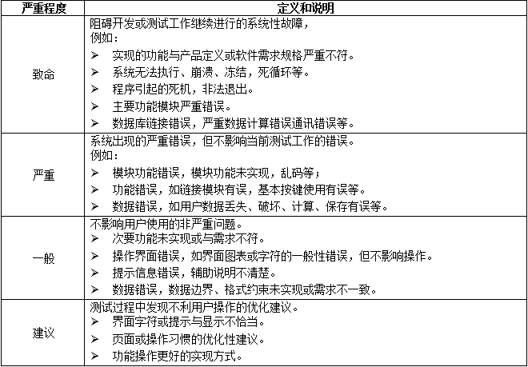
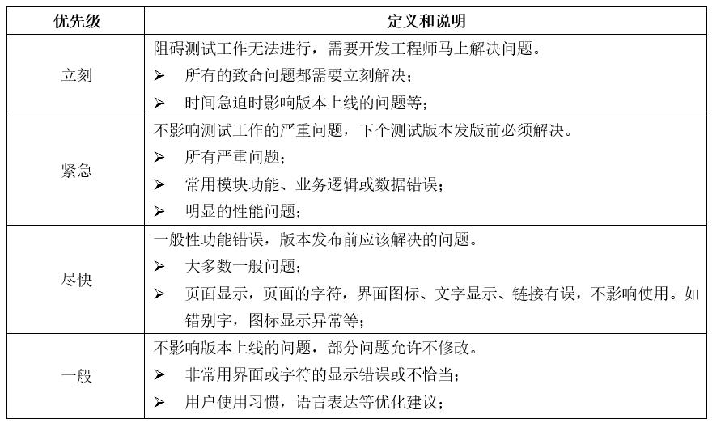
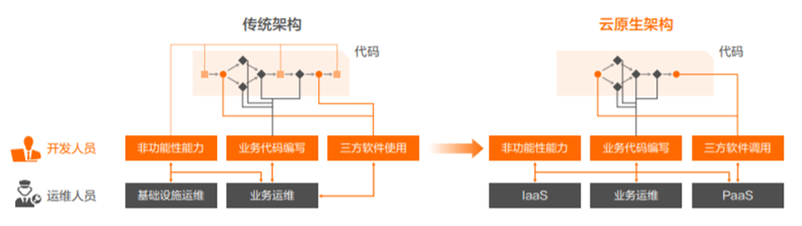

# 设计模式

关注软件系统的设计，与具体的实现语言无关。

## 目的分类

1. 创建型：主要描述如何创建对象，主要特点是“将对象的创建与使用分离”，为设计类实例化新对象提供指南。

   | 名称                         | 说明                                                         | 关键点         |
   | ---------------------------- | ------------------------------------------------------------ | -------------- |
   | 工厂方法（Factory）          | 定义一个创建对象的接口，由子类决定需要实例化哪一个类，子类实例化的过程推迟。 | 动态生产对象   |
   | 抽象工厂（Abstract Factory） | 定义一个创建一系列相关或相互依赖的对象的接口，直接指定工厂，而无需指定具体的类 | 生产成系列对象 |
   | 原型（Prototype）            | 通过拷贝原型实例来创建新对象                                 | 克隆对象       |
   | 单例（Singleton）            | 保证一个类只有一个实例，并提供全局访问点                     | 单实例         |
   | 构建器（Builder）            | 将一个复杂类的表示和其构造分离，使相同的构建过程能得到不同的表示 | 复杂对象构建   |

2. 结构型：主要用于处理类或对象的组合，描述如何将类或对象按某种布局形成更大的结构。

   | 名称              | 说明                                                         | 关键点       |
   | ----------------- | ------------------------------------------------------------ | ------------ |
   | 适配器（Adapter） | 使原本不相容的接口得以协同工作                               | 转换接口     |
   | 桥接（Bridge）    | 将类的抽象部分和实现部分分离开来，各自独立的变化             | 继承树拆分   |
   | 组合（Composite） | 将对象组合成树型结构表示”整体-部分“的层次结构，对单个对象和组合对象的使用具有一致性 | 树形结构     |
   | 装饰（Decorator） | 动态给对象添加额外的职责，替换用子类（继承）来扩展功能，更灵活 | 动态附加职责 |
   | 外观（Facade）    | 定义高层接口，为系统中一组接口提供一个一致的外观，简化使用   | 对外统一接口 |
   | 享元（Flyweight） | 支持大量细粒度对象的共享                                     | 汉字编码     |
   | 代理（Proxy）     | 使用一个代理来控制一个对象的访问                             | 快捷方式     |

3. 行为型：主要用于描述类或对象之间怎样相互协作共同完成单个对象无法单独完成的任务，以及职责的分配，对类之间交互以及分配责任的方式提供指南。

   | 名称                             | 说明                                                         | 关键点           |
   | -------------------------------- | ------------------------------------------------------------ | ---------------- |
   | 责任链（Chain of Responsibility) | 将接受对象链接起来，在链中传递请求，直到有一个对象处理这个请求，减少请求的发送者和接收者之间的耦合。 | 传递职责         |
   | 命令（Command）                  | 将请求封装成一个命令对象，可用不同请求对客户进行参数化。     | 日志记录，可撤销 |
   | 解释器（Interpreter）            | 根据文法表示来解释语言中的句子                               | 虚拟机机制       |
   | 迭代器（Iterator）               | 提供顺序访问一个聚合对象中的元素，且不需要暴露对象的内部表示 | 数据集           |
   | 中介者（Mediator）               | 用中介对象封装一系列的对象交互。使各对象不需要显示的相互调用，达到低耦合，且可以独立改变对象间的i交互 | 不直接引用       |
   | 备忘录（Memento）                | 在不破坏封装的前提下，保存一个对象的内部状态，并可以在以后将该对象恢复到原先保存的状态 | 游戏存档         |
   | 观察者（Observer）               | 定义对象间一对多的关系，当一个对象的状态发生变化，所有依赖于它的对象都得到通知并自动更新 | 联动             |
   | 状态（State）                    | 允许一个对象在其内部状态改变时，改变它的行为                 | 封装状态         |
   | 策略（Strategy）                 | 定义并封装一系列算法，可以互相替换，从而让算法独立于使用它的用户而变化 | 多方案切换       |
   | 模板方法（Template Method)       | 定义一个操作中的算法骨架，将一些步骤延迟到子类中，使子类可以不改变算法结构，即可重新定义算法的某些步骤 | 框架             |
   | 访问者（Visitor）                | 表示一个作用于某对象结构中的各元素的操作，使得在不改变各元素的前提下定义作用于这些元素的新操作 | 数据与操作分离   |

根据作用范围，分为类模式和对象模式

1. **类模式**用于处理类与子类之间的关系，这些关系通过继承来建立，是静态的，在编译时刻便确定下来了

2. **对象模式**用于处理对象之间的关系，这些关系可以通过组合或聚合来实现，在运行时刻是可以变化的，更具动 态性。

   **工厂方法，（类）适配器，解释器，模板方法**既可以是类模式，也可以是对象模式；其它都是对象模式。

## 描述

1. 设计模式（Design Pattern）是前辈们对代码开发经验的总结，是解决特定问题的 一系列套路。它不是语法规定，而是一套用来提高代码可复用性、可维护性、可读性、 稳健性以及安全性的解决方案。
2. 由于传统的结构化的软件设计方法不符合面向对象的设计原则，无法很好的实现高内聚和低耦合的要求。模块之间过于紧密，给软件扩展和维护带来很多困难。在这种情况下，设计模式的出现和广泛应用给问题的解决提供了一种有效方法。通过利用设计模式，可以帮助开发者复用已有的设计方法，设计出结构合理、易于复用和可维护的软件,当用户需要发生改变时，可以通过修改少量代码或不修改原有代码即可满足新的需求，增强了系统的可修改性和稳定性，降低系统开发成本，对优化软件结构，提高软件质量具有重要的指导意义。
3. 一般而言，一个设计模式具有模式名称和定义、适应场景、解决方案和效果四个方面的基本要素。
4. 以上设计模式的选用基本达到了预期的效果。首先是，这些设计模式都是一些常用的设计方法，在架构设计师、系统分析师、开发人员之间，形成了良好的沟通桥梁，大家很容易进行交流和沟通。其次，在使用设计模式过程中，软件的开发效率较高，能够节省开发成本。最重要的是，这些模式都是一些经过反复使用的成熟设计方案，符合面向对象中设计规范，比如:面向接口编程、里氏替换原则、单一职责原则、依赖倒转等设计原则，最大限度的提高软件的标准化，为日后的系统维护打下了很好的基础

## 应用

1. **抽象工厂**

   1. 定义：为创建一组相关或者相互依赖的对象提供一个接口，而不需要指定它们的具体类

   2. 实现过程：对工厂模式又进行了一层抽象，不单单是像工厂模式只生成一类产品，而是一系列产品，并且可以像零件一样灵活配置给各工厂。（产品族：两个相互影响的产品线。)

   3. 应用场景：一组对象有相同的约束。如不同系统下的文本和图片编辑器，==共同的约束条件操作系统类型==

   4. 优点：

      **封装性，分离了具体的类**：Abstract Factory 模式帮助你控制一个应用创建对象的类。因为一个工厂封装创建产品对象的责任和过程，它将客户与类的实现分离。客户通过它们的抽象接口操纵实例。产品的类名也在具体工厂的实现中被分离；它们不出现在客户代码中。

      **使得易于交换产品系列：** 一个具体工厂类在一个应用中仅出现一次—即在它初始化的时候。这使得改变一个应用的具体工厂变得很容易。它只需改变具体的工厂即可使用不同的产品配置，这是因为一个抽象工厂创建了一个完整的产品系列，所以整个产品系列会立刻改变。

      **产品族内的约束为非公开状态，有利于产品的一致性**：当一个系列中的产品对象被设计成一起工作时，一个应用一次只能使用同一个系列中的对象，这一点很重要。而AbstractFactory很容易实现这一点。

   5. 缺点：**难以支持新种类的产品，产品族的扩展困难**。是因为AbstractFactory接口确定了可以被创建的产品集合。 支持新种类的产品就需要扩展该工厂接口，这将涉及 AbstractFactory类及其所有子类的改变。

   6. 项目应用：支持多个数据库、通用的数据库访问层

      对于不同数据库的访问，只有Connection、Command、Adapter、Parameter对象类型不同，而实现逻辑大部分相同，所以**可以针对 Oracle、MySQL、DB2 等分别建立抽象工厂，如指定当前工厂为 Oracle 工厂，则创建出来的数据库连接，数据集等一系列的对象都是符合 Oracle 操作要求的，这样便于数据库之间的切换.。**

      通过使用DbProviderFactory抽象类来生成不同数据库下的Connection和Adapter，将公共的数据库访问逻辑提取出来，组成一个抽象类DBHelper。而每个数据库都有单独的处理类，且都继承DBHelper，可以实现其特有的处理逻辑。 
      
      数据库的切换：使用简单工厂模式和配置文件，将编译期创建对象转化为运行时期创建对象。
      
   7. 系统采取分布式架构部署，不同的模块根据不同的业务需求，选用了不同类型的数据库，包括MySQL、Oracle、SQL Server三种。在程序设计过程中如果直接使用每种数据库的原生访问方法，将会使业务逻辑复杂化，并且在开发完成后很难再变更为其他数据库类型。为了解决这一问题，我们使用了工厂方法模式。在设计工厂方法模式中，我们定义了抽象产品、具体产品、抽象工厂、具体工厂四种角色。抽象产品定义了数据库操作DataAccess类，包括数据库连接开关、查询执行、事务等基本公用方法；具体产品继承自抽象产品类，根据数据库类型，建立MySQLDataAccess、OracleDataAccess、SQLServerDataAccess类，分别进行了不同的具体实现；抽象工厂建立一个DataAccessFactory类，定义一个通用的返回数据库操作类的方法；具体工厂继承自抽象工厂，根据不同的数据库类型，分别实现返回不同种数据库具体的操作类。通过使用工厂方法模式，可以有效解决不同数据库类型对软件程序的影响，当需要更换和添加新的数据库类型时，也不需要修改具体的业务逻辑，具有很好的可扩展性。

2. **责任链模式**

   1. 定义：使多个对象都有机会处理请求，从而避免请求的发送者和接收者之间的耦合关系。将多个对象连成一条链，沿着这条链传递该请求，直到有一个对象处理它为止。
   
   2. 优点;  客户只需要将请求发送到责任链上即可，无须关心请求的处理细节和请求的传递 过程，所以责任链将请求的发送者和请求的处理者解耦了； 具有可扩展性; 灵活性; 责任分担;
   
      请求和处理都包含状态属性，通过状态，让符合条件的处理来接收请求。
   
   3. 缺点：链比较长时, 性能问题, 可控性差，职责多级传递，不知道何处出错。
   
4. 应用：
      1. 事件模型中，如DOM中，从外到内的事件捕捉，从内到外的事件冒泡。
      2. 框架，容器中，如Java Servlet的Filter机制。
      3. 异常处理机制：需要分模块分时间分批次完成，不同抽象层次的对象处理不同层次的异常，通过包装提升异常的抽象层次，交予上级处理。
      
   5. 方法捕捉异常的处理情形：
   
      1. 不在方法规范的职责内，将异常和必要信息以更抽象的形式包装，抛给更高层。
      2. 部分由该方法负责，处理并抛出。
      3. 完全由该方法负责，处理异常，不抛出。
   
   6. 涉及：单一职责原则，间接原则，保变原则，迪米特法则。
   
   7. 综合应用：责任链关注职责的分解，侧重行为，装饰者关心职责的结合，侧重结构。责任链的每一环为某个对象进行装饰和包装。
   
   8. 项目应用，MVC的架构中，需要对某些接口的请求和响应进行校验和处理，比如接口请求日志、JWT校验、参数校验、对外接口签名校验、格式化返回结果、接口权限等。为了给不同接口访问增加控制，对指定请求增加过滤器，每个请求都要经过一些过滤器组成的责任链，进行校验和处理。按照由高到低的顺序，依次进行处理，直到符台某个标准为止，并完成信息处理，将对象信息按照审核的分档标准，存入信息库。通过这个方法，可以实现农产品对象，与处理方法的分离。
   
3. **代理模式**

   1. 定义：对其它对象提供一种代理，用来控制对这个对象的访问。
   2. 特点：保持对象的接口（代理对象和对象的接口相同），限制接口的服务（代理对象中增加业务逻辑）
   3. 优点：
      1. 职责清晰（具体主题不用关心非本职的事务，代理类可以扩展其它功能），
      2. 高扩展性(具体主题的变化，不会影响代理类）。
   4. 实现：

      1. 普通代理(给代理对象指定真实对象,不允许直接创建真实角色)，
      2. 强制代理(真实对象指定代理对象,不允许直接访问真实角色)，
      3. 动态代理(反射动态生成，被代理类必须实现一个接口；实现横切面编程，在不改变代码的前提下，增强或控制对象的行为).
   5. 应用，某些重要业务中，进行增删改数据后，需要写数据操作日志；进行增改前，需要检测数据是否重复。为了保证在不修改已有代码的前提下，完成这个需求，采用动态代理模式来实现。它的本质是创造一个实现了同一个接口的Proxy代理类，去进行真正的调用。先设计一个接口，包含两个方法：执行前和执行后；以及继承这个接口的两个类：数据操作日志和数据重复检测。在动态代理模式中，会使用接口和类型反射生成代理对象，代理对象可以用接口接收，最后用代理对象来执行业务中的增删改方法。好处是不仅对增删改方法做了增强，而且不会影响代理类，也提高了代码的复用，以及灵活性。

4. 策略模式 

   1. 定义: 该模式定义了一系列算法，并将每个算法封装起来，使它们可以相互替换，且算 法的变化不会影响使用算法的客户。 
   2. 优点: 多重条件语句不易维护，而使用策略模式可以避免使用多重条件语句。 
   3. 例子: 坐标系的转换, 高德/ 百度/ 标准 wgs84 , 如原始空间数据的坐标系为高德坐标, 需要转换为其它坐标系, 定义一个抽象策略类和两个具体策略类, 具体策略类 A—标准转高 德, 具体策略类 B—标准转百度, 还有一个环境类, 持有一个策略类的引用, 最终给客户端调用。
   4. 根据业务需求，OJ系统的评测机需要同时支持对C语言、C++、Java、PHP、Python等多种常用编程语言程序的评测。不同语言对应的编译与执行方法存在较大差异，例如：C语言需要先调用cl再调用link，生成exe后执行；Java需要先调用jdk的javac编译器，生成class后，再调用jre执行；Python等语言无需编译可直接解释执行。为了解决此问题，我们采用了策略模式将不同语言的编译和执行方法封装起来，并使它们可以相互替换。在设计策略模式中，我们定义了三种角色：环境角色、抽象策略角色、具体策略角色。环境角色持有一个抽象策略角色StrategyCompile接口的引用，并通过StrategyCompile接口，来实现一个具体的编译和执行方法；抽象策略角色定义所有具体策略类所需的统一访问接口；具体策略角色包装了不同语言编译程序的具体调用方法，给每种语言分别定义了CStrategyCompile、JavaStrategyCompile、PythonStrategyCompile等具体策略类。通过使用策略模式，评测机可根据不同的语言类型，选择不同的具体方法来编译执行程序代码，降低了模块的耦合度，提高了软件的可扩展性和可维护性。

装饰器模式
  OJ系统中，全部的试题数据都存放在题库服务中，包括题目介绍、测试用例等公共内容。同一试题在自由练习、实验作业、考试、比赛等不同使用场景下，需要增加不同的扩展功能。例如：实验作业功能需要限定编程语言，并且只允许用户在给定的代码框架中编辑指定的部分。为了解决此问题，我们使用了装饰器模式，给试题对象动态添加职责。在设计装饰器模式中，我们定义了四种角色：被装饰对象的基类、具体被装饰对象、装饰者抽象类、具体装饰者。被装饰对象的基类定义为Problem类，定义一个可动态添加职责的对象接口；具体被装饰对象定义为ConcreteProblem类，继承自Problem类，用以实现具体试题内容；装饰者抽象类定义为Decorator类，维持一个指向Problem实例的引用，并定义一个一致的接口；具体装饰者类根据不同的场景，分别定义为TaskDecorator、TestDecorator、ContestDecorator等类，用以实现不同场景的扩展功能。通过使用装饰器模式，我们可以在任何时候实现新的装饰器，给试题功能添加新的职责，而无需修改原有试题功能，比继承方式拥有更好的灵活性。

# 设计原则

- 单一设计原则：设计目的功能单一的类
- 里氏替换原则：子类可以替换父类
- 依赖倒置原则：依赖抽象，而不依赖具体实现；针对接口编程，而不是针对实现编程。
- 接口隔离原则：使用多个专门的接口比使用一个总接口要好
- 迪米特法则：最少知识法则，一个对象应当对其它对象尽可能的减少了解。
- 开闭原则：对扩展开放，对修改关闭。
- 组合重用原则：尽量使用组合，而不是继承关系达到重用目的

# 软件容错技术

提高软件系统**可靠性**的技术主要分为：容错技术、避错技术。容错技术主要通过冗余实现，分为结构冗余、时间冗余、信息冗余、冗余附加。结构冗余又分为静态冗余、动态冗余和混合冗余。软件避错技术主要有N版本程序设计、恢复块方法和防卫式程序设计。

软件的容错与避错处理：

1. 应用：集群技术
   1. 集群并行工作：耗时的操作需要统一存入MQ队列中排队
   2. 结合服务管理中心的软负载均衡功能：多个服务并行工作，可提高处理效率，
   3. 在部分服务宕机时，工作交由其他正常服务分担，以留出供故障服务机重置恢复的时间，防止了因单台服务机宕机致整个平台不可用的问题出现，保证了业务的连续性，提高了系统的可靠性。
2. 数据库：主从形式
   1. 实现读写分离。从库可升级为主库，达到容错的效果
   2. 数据库宕机报警
   3. 硬件存储采用了基于RAID6的磁盘阵列，最高可容许两块硬盘同时发生故障，降低数据文件丢失的可能性。
3. 程序设计：防卫式程序设计
   1. 网络阻塞或丢包：使用try-catch机制加10次重试的容错处理机制

不足：短时间内提交了大量不安全代码，导致所有服务实例全部宕机。我们对问题分析和试验后，将原部署在物理机上的服务改为部署在虚拟化平台，结合心跳机制，自动回滚快照重置失效实例，省去了物理机系统重启的时间，将单个服务实例的恢复时间缩短到了10秒内。

总结：提高系统的可用性、安全性和可扩展性方面起到了很好的效果，满足了系统的性能需求，保证了系统的稳定运行，使整个系统达到了可靠性和实时性的要求。

# 软件设计方法

软件设计(SoftwareDesign，SD）根据软件需求规格说明书设计软件系统的整体结构、划分功能模块、确定每个模块的实现算法以及程序流程等，形成软件的具体设计方案。软件设计把许多事物和问题按不同的层次和角度进行抽象，将问题或事物进行模块化分解，以便更容易解决问题。分解得越细，模块数量也就越多，设计者需要考虑模块之间的耦合度。

软件设计方法包括有：模型驱动设计，面向对象设计，结构化设计，快速应用开发，原型设计，信息工程法。

1. 棋型驱动设计：是一种系统设计方法，强调通过绘刎图形化系统模型描述系统的技术和实现。通常从模型驱动分析中开发的逻辑模型导出系统设计模型，最终系统设计模型将作为构造和实现新系统的蓝图。

2. 结构化设计：是一种面向过程的系统设计技术,它将系统过程分解成一个容易实现和维护的计算机程序模块。把一个程序设计成一个自顶向下的模块层次，一个模块就是一组指令一个程序片段，程序块，子程序或者子过程，这些模块自顶向下按照各种设计规则和设计指南进行开发，模块需要满足高内聚松散耦合的特征。

3. 信息工程法：是一种用来计划，分析和设计信息系统的模型驱动的，以数据为中心的但对过程敏感的技术。信息工程模型是一些说明和同步系统的数据和过程的图形。信息工程的主要工具就是数据模型图（物理实体关系图)。

4. 原型设计：原型法是一种反复迭代过程，它需要设计人员和用户之间保持紧密的工作关系，通过构造一个预期系统的小规模的，不完整的但可以工作的示例来与用户交互设计的结果。原型设计方法鼓励并要求最终用户主动参与，这增加了最终用户对项目的信心和支持。更好地适应用户总是想改变想法的自然情况。原型是主动的模型，最终用户可以看到并与之交互。

5. 面向对象设计：是一种新的设计策略，用于精炼早期面向对象分析阶段确定的对象需求定义，并定义新的与设计相关的对象。面向对象设计是面向对象分析的延伸,有利于消除数据和过程的分离。

   写作参考：

   ​	在我们惯常的项目开发中，经常会使用各种设计工具来做系统分析，制作各种设计图并以之为基础和客户进行讨论，经过确认达成一致后作为系统分析的产物。然而一旦进入到开发阶段，开发人员根本不会按照之前的设计来实现，很多时候代码只是实现了功能，大部分实现都经过重新设计，而分析模型则直接被扔在了一边。导致这样做的一个根本原因，是我们缺乏一套建模范式。它可以采用统一的方式，并可以非常方便的将模型转化为代码设计并可以保持模型与设计之间的映射关系。面向对象设计(Object-OrientedDesign）是目前为止公认的可以实现该要求的建模范式。

   ​	抽象出关键的领域知识（名词定义）并支持有效的实现（设计范式)，是模型驱动设计的核心二要素。

   ​	开发人员要意识到代码和模型是整个系统的一体两面，改变代码即意味着改变模型。如果忽略了这一点，到最后模型则将失去指导作用，并逐渐变得不可用。同时，建模人员也应花时间去了解代码。双方通过使用统一领域语言保持模型和实现的一致性。

   ​	如何使用面向对象设计来实现领域驱动。

6. 快速应用开发：是一种系统设计方法，是各种结构化技术(特别是数据驱动的信息工程)与原型化技术和联合应用开发技术的结合，用以加速系统的开发。快速应用开发要求反复的使用结构化技术和原型技术来定义用户的需求并设计最终系统。

## ABSD

基于架构的软件设计方法ABSD

随着业务不断迭代之后，每个模型的边界和管理会越来越复杂和逻辑冗余。

考虑到系统的复杂性，项目整体采用软件体系结构设计，指的是**从宏观层次对需要开发的目标系统进行描述。用不同的视图从不同的视角对目标系统进行分析与设计**的过程。具体的过程可以分为，体系结构需求，体系结构设计，体系结构文档化，体系结构复审，体系结构实现，体系结构的演化等重要过程。

1. 在体系结构**需求**阶段：先对目标系统的质量目标进行分解并结合用户提出的需求，分别整理出，功能性需求和非功能性需求。架构必须同时满足功能性需求及非功能性需求。通过分析得到以下几个架构核心关注点: 

   1. 数据的存储模型，由于每个商品可以分为普通商品和活动商品等不同类型，活动又分为预热期和活动期，以及周年大促、会员日、节日活动
   2. 由于面向广大互联网用户每次商品、订单等查询时间必须小于2秒，7*24小服务，故障恢复时间不能大于1小时。
   3. 本系统是一个交易类系统必须有动态参数设置及监控界面。

2. **标识构件**：通过分析系统的核心需求，架构组决定采用构件化开发进行整体的架构设计。设计基于模型属性和模型能力的抽象开发方法，设计使用event事件作为一个原子，组装和重发事件驱动，设计无锁的队列存储优化操作相同资源的性能。使用消费事件的方式提升开发效率，对物理模型和业务逻辑进行解耦。

  构件识别技术，比如构件的独立性，无可见状态，接口规约的版本一致性

3. 标识**构件之间的关系**：根据总体架构设计形成了高层的构件，包括对象及对象状态构件、外部实体行为构件.消息事件构件、服务框架管理构件。业务模型继承和实现这些构件，如此商品，库存，支付，营销，权益，配送等业务模型都统一的具备了状态，行为，事件的能力构件，骨架完成后再填充各自的业务逻辑。

  外部实体行为构件原子的业务逻辑完成后，通过策略选择，迭代模式来配置和组装原子逻辑成为完整的业务流程功能。例如可以通过业务的策略来选择支付方式，也可以配置多条迭代校验规则完成业务上对商品的校验,这些策略和迭代规则都是配置化可以随意拆分组装。

  消息事件构件事件体系也是交易系统内部抽象的模型，它定义唯一的事件名称和唯一一的事件ID,它支持同步或异步执行，支持不同线程上下文信息传递，支持写数据库设定，支持重试次数设定，支持自动的重试触发，支持无锁队列ringbuffer存放事件排队，支持多个事件组合成事件组，支持监控报警。以上是这个事件体系的特点。

  服务框架管理构件:在下单支付等动作完成后，系统根据状态机映射触发对应的行为，行为中包括了系统服务调用和事件触发。在触发前把事件id，上下文信息放入redis缓存或数据库，事件自动存入无锁队列，系统的事件 handle自动从队列中拉取对象和逻辑处理。在处理发生异常时，事件根据配置自动存入数据库等待重试或者丢弃。对于处理失败有通用的重试机制和监控报警规则，让开发快速发现线上问题。

4. 技术选择：由于主从架构已经在大数据领域成功应用，同时也有成熟的开源组件。通过与客户讨论决定采用ZooKeeper为核心注册及主从架构管理组件实现负载。数据存储采用两级存储，MySQL作为核心数据存储，Redis数据库作为数据缓存，减少核心数据库的读压力。RabbitMQ作为消息核心组件。系统间通信采用基于HTTP协议的Restful接口形式。

5. 架构文档化：根据设计意图，架构组采用4+1视图模型，对核心业务场景逻辑功能，开发架构，设计架构，部署架构，存储架构进行了描述并形成架构说明文档及需求质量设计说明书初版。

6. 架构复审与细化：架构组与客户专家组对架构说明书，质量设计说明书进行了复审，并提出架构应考虑到数据的安全性，建议对数据库中的关键数据的加密，传输过程中的敏感数据采用加密和超时控制。架构组认为，数据库中的核心数据可以采用两种加密分别对不同数据加密。用户密码敏感信息采用MD5数字摘要算法进行加密，对于重要的金额数据采用对称加密。首次复审会议后架构组进行了架构的细化，确定了通信协义种类，主要接口，核心业务设计模式。并且对主要核心类进行的属性和方法的识别。再次经过与客户专家组讨论与评估，最终确定了XXAPP电商系统的架构。

不足和改进：单改成多线程模式，消息通知失败的重试机制等部分，但总体结构稳定。系统上线后经客户专家组的验收反馈，本系统架构解决了需求中的核心关注点，并取得了很好的效果，关键是可以对系统运算能力进行水平扩展，能满足未来一定时期的业务需要。

# 架构评估

对于软件系统，尤其是大规模复杂软件系统而言，软件系统架构对于确保最终系统的质量具有十分重要的意义。在系统架构设计结束后，为保证架构设计的合理性、完整性和针对性，保证系统质量，降低成本及投资风险，需要对设计好的系统架构进行评估架构评估是软件开发过程中的重要环节.

- 详细闸述有哪些不同的软件系统架构评估方法，并从评估目标、质量属性和评估活动等方面论述其区别。
- 详细说明你所参与的软件开发项目中，使用了哪种评估方法，具体实施过程和效果如何.

常见的系统体系架构分析方法有SAAM 和ATAM。

1. SAAM (Scenarios-basedArchitectureAnalysisMethod)是一种非功能质量属性的体系架构分析方法。最初用于比较不同的体系架构，分析架构的可修改性，后来也用于其他的质量属性，如可移植性、可扩充性等。

2. 特定目标：对描述应用程序属性的文档，验证基本体系结构假设和原则。SAAM不仅能够评估体系结构对于特定系统需求的适用能力，也能被用来比较不同的体系结构。

3. 评估活动，

   SAAM的过程包括了五个步骤:即场景开发，体系结构描述，单个场景评估，场景交互总体评估。

   ATAM (ArchitectureTradeoffAnalysisMethod）是在SAAM的基础上发展起来的，主要针对性能、实用性、安全性和可修改性，在系统开发之前，对这些质量属性进行评价和折中。

   1. 特定目标:在考虑多个相互影响的质量属性的情况下，从原则上提供一种理解软件体系结构的能力的方法，使用该方法确定在多个质量属性之间折中的必要性。
   2. 评估活动:分为四个主要的活动领域，分别是场景和需求收集、体系结构视图和场景实现、属性模型构造和分析、折中。

示例：本文结合我的实践，以视频云项目开发为例，论述软件系统的架构评估，首先分析架构评估中普遍关注的性能、安全、可用性、可修改性质量属性并阐述其含义；在架构设计完成之后，采用了基于场景的评估方式中的体系结构权衡分析方法ATAM进行评估，并详细描述了其评估过程，项目评估小组经过对项目的风险点、非风险点、敏感点和权衡点的讨论后生成了质量效应树。目前系统已在北京等多个城市上线，视频连接流畅稳定，从而验证了该项目采用ATAM|架构评估保证了系统的顺利完成，但现在看来系统对前端复杂多样视频资源的接入兼容性依然不够，在以后的架构评估中需要更全面的考虑质量属性对系统的影响。

架构主体设计完成后，采用架构权衡分析法进行架构评估。软件系统架构评估所普遍关注的质量属性包括性能、可用性、安全性、可修改性、可测试性、可靠性、易用性等。其中前四个质量属性是质量效用树的重要组成部分。

1. 性能指系统的响应能力，就是系统要经过多长时间对某个事件进行相应。
2. 可用性是指系统能够正常运行的时间比例。
3. 安全性实指系统在向合法用户提供服务的同时，阻止非法用户的使用或拒绝向其提供服务。
4. 可修改性是指能够快速的以较低代价对系统进行变更的能力。
5. 可测试性是指系统发生故障以后，定位其故障的能力和进行测试的能力。
6. 可靠性是指系统在发生问题后，维持系统功能的能力。
7. 易用性是指用户使用该系统完成所期望功能的难易程度。

在使用架构权衡分析法（ATAM）进行系统架构评估时，我们首先成立了架构评估小组，评估小组主要包括关键用户、评估负责人、架构设计人员项目负责人、需求人员、开发人员、测试人员以及实施人员。小组按照架构权衡分析方法的描述和介绍、调查和分析、测试、报告这四个阶段进行架构评估工作。

1. 在描述和介绍阶段，评估负责人首先描述了架构权衡分析法的执行方法与具体过程，架构权衡分析法是一种基于场景的架构评估方法，对系统的多个质量属性基于场景评估。评估后确定架构的各项指标是否满足需求。之后对关键客户描述的建设该系统的业务动机，该系统的首要目标是为其产品提供条码追溯能力,其次为了提高该厂商整个生产过程的自动化程度。并为决策者提供决策依据。最后我作为系统的架构负责人，详细描述该系统采用面向对象和层次结构架构风格的原因，采用集群部署的原因以及各组件所采用的技术和实现的功能。
2. 在调查和分析阶段，我作为架构负责人进一步对架构进行了拆解和说明。然后各方基于各自的考虑提出了需求，我们将需要进行整理随之产生质量效用树。质量效用树中主要包括了四个质量属性。分别是可用性、安全性、性能和可修改性。比如在性能方面，客户提出分别在全国多个位置的生产基地和供货仓库访问该系统页面的延迟不能超过3秒又比如在可用性方面，客户提出生产基地采用3班倒24小时工作生产制度，要求系统必须高可用，不能出现宕机等停止服务的情况。再比如在安全性方面，客户提出该系统存储传输的数据涉及商业机密，必须进行加密传输，保证信息不外泄。
3. 在测试阶段，我们开始通过投票的方式对质量效用树进行优先级排序，然后安装高优先级优先的原则分析架构是否满足各项指标。比如在性能和可靠性方面，系统采用了集群的部署方式，这样首先提高了系统的吞吐量，其次当有任何一台机器发生问题，也不会影响整个系统提供服务。但是客户提出性能方面是重点，不能因为性能问题影响生产，于是我们决定引入Redis 内存数据库进一步提升性能。在安全性方面，我们权衡了性能和安全性的因素，对传输数据采用了对称式和非对称式结合的加密技术。这样即满足了加密的强度，又保障了加密解密的效率，客户较为认可。
4. 在报告阶段，我们最终形成了描述评估结果，其中详细描述了架构是否满足质量效用树的各项指标，也包含了架构中的风险点、敏感点与权衡点。最后报告中也给出了架构调整意见，比如为提高性能需要引入Redis 内存数据库。报告和评估期间的会议记录最终进行了归档。

通过架构权衡分析法进行架构评估，不仅准确的获取了系统对各项质量属性的需求，也成功的完成了对架构的评估工作,为架构的优化提供了依据

不足，比如我们目前只掌握了ATAM方式的评估方法，对其他的架构评估方式如软件架构分析方法(SAAM）的使用上还有不足，我们将在后续的工作与实践中继续磨练与提升。

# Web架构

## 负载均衡算法

现有的负载均衡算法主要分为静态和动态两类。静态负载均衡算法以固定的概率分配任务，不考虑服务器的状态信息，如轮转算法、随机法等；动态负载均衡算法以服务器的实时负载状态信息来决定任务的分配，如最小连接法等。

1. 轮询法。轮询法就是将用户的请求轮流分配给服务器，就像是挨个数数，轮流分配。这种算法比较简单，具有绝对均衡的优点，但是也正是因为绝对均衡，它必须付出很大的代价，例如它无法保证分配任务的合理性，无法根据服务器承受能力来分配任务。
2. 随机法。随机法是随机选择一台服务器来分配任务。它保证了请求的分散性达到了均衡的目的。同时它是没有状态的，不需要维持上次的选择状态和均衡因子。但是随着任务量的增大，它的效果趋向轮询后也会具有轮询法的部分缺点。
3. 最小连接法。将任务分配给此时具有最小连接数的节点，因此它是动态负载均衡算法。一个结点收到一个任务后连接数就会加1，当结点发生故障时就将结点权值设置0，不再给结点分配任务。最小连接法适用于各个结点处理的性能相似的情形。任务分发单元会将任务平滑分配给服务器。但当服务器性能差距较大时，就无法达到预期的效果。因为此时连接数并不能准确表明处理能力，连接数小而自身性能很差的服务器可能不及连接数大而自身性能极好的服务器。所以在这个时候就会导致任务无法准确地分配到剩余处理能力强的机器上。

项目中是如何基于负载均衡算法实现 Web系统负载均衡的。

# 软件测试

## 缺陷管理

软件缺陷是发生在软件中的会导致软件产生质量问题的不被接受的偏差。

软件缺陷定义：
（1）软件未达到需求规格说明书的功能；
（2）软件出现了需求规格说明书指明不会出现的错误；
（3）软件功能超出需求规格说明书的范围；
（4）软件未达到需求规格说明书未指出但应达到的目标；
（5）测试工程师认为软件难以理解、不易使用、运行速度慢，或者最终用户认为不好。
缺陷类型：
（1）设计缺陷：由于软件设计或代码实现所产生的功能或流程的问题。
（2）界面问题：系统页面的展示的问题。
（3）数据问题：系统数据的来源，处理及处理结果的问题。
（4）需求问题：软件需求测试发现的问题，也包括之后需求变更的问题。
（5）安装部署：软件安装部署过程的错误。
（6）性能问题：软件性能相关的缺陷。
（7）文档问题：用户使用手册，软件帮助文档等出现的问题。
（8）常识问题：系统用户的正常使用习惯相关问题。
（9）安全问题：系统漏洞安全问题。
（10）优化建议：针对操作过程逻辑或界面显示的优化性建议。
（11）其他：除前面分类的其他问题。

严重程度定义

注：严重等级由创建者在创建缺陷时根据此定义来选择，之后都不能随意更改。

优先级的定义

注：立刻、紧急、尽快的问题都要求在系统上线前解决。

正常处理过程：
（1）创建问题
在测试管理系统中，所有用户都可以创建新问题，包括需求问题和软件缺陷等。创建问题时，需要描述清楚，并选择正确的选项。
（2）指派问题
创建问题时，创建者通常要指派给该项目开发负责人，再由其指派任务，或直接指派给相应模块的开发工程师。
如果指派人是错误的，或者需要他人确认或帮助，则可以重新指派给合适的工程师，写上相关备注。
（3）确认问题
通常开发工程师收到新问题后，需要分析和确认此问题是否为Bug。如果是Bug，则选择“确认状态”；如果认为非Bug，则注明原因并指派回创建者。
当创建者收到确认指派时，需要进行及时确认。如果同意为非bug，则及时关闭它；如果不同意，则需要注明理由并指派回相关工程师。
如果问题确认指派次数大于6次时，需要进入“争议处理”流程。
（4）解决问题
此为开发工程师的主要职责，包括Bug的复现、修改和修改验证。
开发工程师需要及时对确认状态Bug进行分析和解决，并自己验证通过，则操作为解决状态，在缺陷管理系统中解决方案选择相应的选项，解决后系统将自动指派回给创建者。
如果Bug无法解决或修改影响比较大，可申请进入“延期解决”流程。
（5）验证问题
创建者需要及时对解决状态的Bug在对应版本上面进行验证。如果验证通过，则可关闭Bug；如果验证不通过，则激活此Bug，系统将自动指派回给解决者。
验证通过准则：相同的操作步骤，进行一定次数的验证测试都没有发生。
验证不通过准则：相同的操作步骤，全部或部分实际结果还会发生，验证不通过则激活Bug。
（6）关闭问题
通过验证的Bug，验证者需要注明验证结果并进行关闭操作，系统将指派给Closed。
如果关闭状态的Bug在之后版本又会发生，则激活此Bug，系统将自动指派回给解决者。
特别处理过程：
（1）客户问题
客户反馈的问题可以由客户直接反馈或项目经理、市场部等了解到的客户问题，经确认后的Bug提交到测试管理系统，按照以上处理流程进行处理，由创建者或测试组进行跟踪验证关闭。
创建客户问题时，创建者需要在Bug标题开头标记为[客户问题]，测试组负责检查和更正。
（2）争议处理
当开发和测试工程师对某问题有争议并且多次沟通无果时（暂定为6次），可以注明双方的理由，并指派给项目经理进行处理。
项目经理可以召开评审会议，或者直接与双方沟通了解，并根据项目情况给出专业意见和最终决定。开发和测试工程师根据项目经理的最终决定执行。
（3）延期解决
当开发工程师对确认Bug进行解决时，发现或评估其解决时间紧或风险比较大等，可以说明原因或理由并指派给项目经理来确认。
项目经理可以召开评审会议，或者直接沟通了解，并根据项目情况给出最终决定。如果不同意，项目经理将此Bug指派回开发工程师，开发工程师继续分析和解决。如果同意，项目经理需要在Bug标题开头标记为[延期解决]和在处理状态选择“延期解决”，然后注明解决时间计划并指派回开发工程师，开发工程师根据解决时间计划来规划和解决此Bug。

缺陷管理的目的是:
对各个阶段测试发现的缺陷进行跟踪管理，以保证各级缺陷的修复率达到标准，主要实现以下目标:
(1)   保证信息的一致性;
(2）保证缺陷得到有效的跟踪，缩短沟通时间，解决问题更高效;
(3）收集缺陷数据并进行数据分析，作为缺陷度量的依据。

参与缺陷管理的角色：
测试工程师:发现和回归BUG
测试经理:判断BUG的有效性
开发经理:分配 BUG
开发工程师:修改BUG

缺陷来源：
Requirement:由于需求的问题引起的缺陷(需求不完全或逻辑错误)
Architecture:由于构架的问题引起的缺陷（登录session失效)
Design:由于设计的问题引起的缺陷图片大小，页面元素显示问题等
Code:由于编码的问题引起的缺陷
Test:由于测试的问题引起的缺陷（软件测试的设计与实施发生错误。特别是系统级的功能测试)
Integration:由于集成的问题引起的缺陷缺陷严重性和优先级

# 企业集成

集成是企业信息化和谐发展的阳关大道，要走上这条大道则需要建立企业的集成架构。企业集成架构的问题不同于业务系统，即它更为关注企业的IT软件基础设施。

目前的“信息孤岛”、“流程割裂”、“企业运行全局不可见”等问题已经愈加明显，直接制约企业的业务发展。

打破信息孤岛的方法是，建立企业级的数据总线，连接不同的业务系统，业务系统数据通过统一的翻译处理后形成企业内部甚至是企业间/行业间的“世界语”，直接简化系统之间的连接方式和数据处理的紧密耦合，实现企业的数据同步和共享。

针对于企业应用，依据不同的关注点，架构可以分为如下几类:

- 业务架构（BusinessArchitecture) :关注于业务及其流程;
- 应用架构（ApplicationArchitecture) :关注于应用系统设计;
- 基础架构（InfrastructureArchitecture) :关注于基础技术;
- 数据架构(DataArchitecture） :关注于数据存储及其规划;

从发展和动态的角度看,集成技术将使企业有手段和机会不断调整和优化企业业务流程的运行，业务系统的专业化程度将增强，企业的业务流程将逐步梳理以趋于最优，基于集成架构的企业业务流程运行将更趋向自动化。业务流程的自动化体现业务系统之间的和谐共处。对于企业而言，**业务流程自动化**是追求的目标，也是企业信息化发展的方向。

企业集成架构发展的基石是开放的标准和规范，从共享和协同的特征看，企业集成架构应采用SOA 的设计理念，在尽量不改变企业原有IT系统的前提下，通过SOA技术，封装不同业务系统对外提供的服务。

## 企业集成架构EAI

企业信息集成是解决“孤岛”问题的需要，技术发展的同时也推动了集成架构等相关的研究。构建企业集成平台的首要目的是实现数据集成，即为平台上运行的各种应用、系统或服务，提供具有完整性、一致性和安全性的数据访问、信息查询及决策支持服务。

1、数据集成包括以下3种模式：数据联邦、数据复制和基于接口的数据集成。

1. 数据联邦：
   数据联邦是指不同的应用共同访问一个全局虚拟数据库，通过全局虚拟数据库管理系统为不同的应用提供全局信息服务，实现不同的应用和数据源之间的信息共享和数据交换，其具体实现由客户端应用、全局信息服务和若干个局部数据源三部分组成。
2. 数据复制模式：
   在数据复制模式中，通过底层应用数据源之间的一致性复制来实现(访问不同数据库的)不同应用之间的信息共享和互操作，其实现的关键是必须能够提供在两个或多个数据库系统之间实现数据转换和传输的基础结构(以屏蔽不同数据库间数据模型的差异)。
3. 基于接口的数据集成模式：
   在基于接口的数据集成模式中，不同的应用系统之间利用适配器(或接口代理)提供的应用编程接口来实现相互调用。应用适配器或接口代理通过其开放或私有接口将业务信息从其所封装的具体应用系统中提取出来，进而实现不同的应用系统之间业务数的共享与互交换，接口调用的方式可以采用同步调用方法，也可以采用基于消息中间件的异步方法来实现。

2、应用集成
应用集成是指两个或多个应用系统根据业务逻辑的需要而进行的功能之间的互相调用和互操作，应用集成模式包括集成适配器、集成信使、集成面板和集成代理4种。

1. 适配器集成模式：
   采用在需要交互的系统之间加入适配器的解决方案来实现企业原有应用系统与新实施系统之间的互操作。在应用系统提供的API的基础上（在应用系统没有提供API的情况下，可以在其数据库表结构一致的条件下，直接完成对数据库的写入和读出），通过适配器完成不同系统间数据格式及访问方式的转换与映射，进而实现不同的系统之间业务功能及业务数据的集成。
2. 信使集成模式：
   随着企业中业务应用系统个数的增多，应用系统间的接口问题变得越来越复杂。基于信使的集成结构中，系统之间的通信和数据交换通过信使(消息代理)来实现，每个应用只需要建立与集成信使之间的接口连接，就可实现与所有通过集成信使相联的应用系统间的交互，这种结构大大减少了接口连接数量，同时由于采用了信使(消息代理)作为信息交流的中介，可以将应用之间的交互对通信服务能力的依赖程度降到最低；另外,当某一系统发生改变时、只需要改变信使中相应的部分，从而降低系统维护工作量和系统升级的难度。
3. 面板集成模式：
   面板集成模式和面向对象的软件设计方法中的面板模式很相似，它是从应用交互实现的层面来描述客户端应用和服务器端应用集成的一种方法。集成面板可以为一对多、多对一、多对多等多种应用提供集成接口，在这种模式中包含有一个或多个客户端应用、一个集成面板、一个或多个服务器应用，集成面板通过对服务器端应用功能的抽象和简化，为客户端应用访问与调用服务器端应用提供了一种简化的公共接口，集成面板在得到客户应用服务请求后，将客户的服务转换成服务器端应用能理解的形式，并将该请求提交给服务器端应用。
4. 代理集成模式：
   面板集成模式实现了服务器应用交互逻辑的分离，在代理执政模式中，由于不存在很明显的客户端应用和服务器端应用的划分，它仅需要将待集成的应用间的交互逻辑从应用中分离出来，并对相应文件的交互逻辑进行封装，进而是由集成代理来引导多个应用之间的交互。

3、企业集成
企业应用软件系统从功能逻辑上可以分为表示、业务逻辑和数据三个层次，其中表示层负责完成系统与用户交互的接口定义，业务逻辑层主要是根据具体业务规则完成相应业务的数据处理，数据层负责存储由业务逻辑层处理或产生的业务数据，它是系统相对稳定的部分。

从企业集成运行的实现策略上看，EAI主要有如下三种实现模式：

1. 前端集成模式：
   所谓前端集成模式，是指EAI侧重于业务应用系统表示层的集成，它主要通过单一的用户入口，实现跨多个应用事物的运作，这种方式适用于用户启动的业务过程中，会产生多种多个跨应用的事物，而且这些事物都需要实时响应的情况（主要指B2C的环境）。另外，采用前端集成模式，还可以实现对已经运行的核心业务系统增加功能或特性的目的。
2. 后端集成模式：
   后端集成模式主要侧重于应用系统数据层面的集成，它通过专门的数据维护及转换工具，实现不同业务应用或数据源之间的信息交换，维护企业整体业务数据完整性和一致性，后端模式就像是一个方便多个应用系统之间数据自动交互的数据管道。
3. 混合集成模式：
   混合集成模式是前端集成模式和后端集成模式的组合，客户通过基于Web浏览器的客户端（瘦客户）实现对业务应用或EAI服务器的访问，服务请求可以由前端应用系统执行，也可以通过EAI服务器将服务请求路由到后端，由后端的业务应用来执行。这种模式几乎具有前端集成模式和后端集成模式的所有特征，主要应用于需要响应大量服务请求，又需要维护多个数据源的完整性和一致性的情况。

示例：企业信息化集成主要由界面集成、应用集成、数据集成等方式。界面集成，通过UI将不同业务模块或系统的界面进行集成整合，使用户查看或使用系统时，不需要打开N多个系统进行操作。应用集成，一般指功能或API集成，它可以使不同厂家开发的系统通过接口整合后，实现互联互通的目的，使得原本不相容的两个或多个系统，可以互相协同工作。数据集成是以数据共享的方式对不同系统中模块中的数据进行整合，使之整合成一个完整的数据信息，供不同系统时实现数据共享。

1. 界面集成，在统计报表模块，因为药剂科主任需要看到36家社区卫生服务中心的药品库存、药品近效期、设备的使用状态，药品的发药量统计。由于这些数据存在不同的系统中，并且各自都有着自己维度的一些信息统计，正好覆盖了主任的期望需求，为了提高开发进程，我们将各模块的报表及统计信息进行了整合，通过菜单跳转的方式，对UI进行了集成，降低了业务系统之间的耦合度，同时降底了开发成本。
2. 应用集成，可以使不同模块的功能应用通过接口的方式进行有效整合，项目中有多个模块，在和HIS信息系统对接中，因为要对接多家HIS信息系统，每家HIS用的系统开发语言不同，有 Delphi，有JAVA有基于CH语言给系统集成增加了复杂度，因此我们选择了基于ESB企业总线的集成方式，将不同的语言开发的软件都以WebService注册到服务中心，通过ESB进行传输协议及消息协议和格式的转换。最后以统一的XML格式传入我们的系统，实现了不同系统之间的业务对接，在我们内部系统中，采用了基于Restful风格的接口形式，对各个系统以JSON格式进行数据交互，并且在ESB中进行了用户授权，防止非法用户接入集成平台获取数据，设备协同则通过MQ消息中间件的形式进行数据获取，实现了业务的解耦。
3. 数据集成，以数据共享的方式对不同应用模块中的数据进行整合共享，在药品采购模块中，由于药品的采购量需要通过当前的库存及药品销量数据，通过算法计算出相应的采购数据进行采购，药品销量数据及当前库存信息分别存在不同的数据库中有MongoDB、Redis，销量数据存在MongoDB中，是因为每天的发药数据量较大，MongoDB具备处理大数据的优势，而且非关系型数据不受字段的约束。对药品的库存查询更新频率较高，所以放在了Redis中，避免高并发给关系型数据库带来负载。采购模块则通过MongoDB及Redis中的数据获取，生成采购计划，并通过接口的方式将采购订单传到省采招平台，通过数据对接的方式将不同系统中的数据进行共享，减少了接口开发量，提高了集成效率。

示例：本文结合笔者的实践，以该综合信息平台建设项目为例，讨论了企业应用集成技术。在本着集成、开放标准、管理配套的原则下，提出了基于Java技术的J2EE应用服务器作为统一的应用集成平台，以集成适配器作为系统集成架构模式的总体设计思路，并着力介绍了该项目关键部件一一集成适配器的构建过程。还就项目的具体实施作了详细叙述。最后，提出了企业应用集成的持续性，并确定了下一步集成的目标。

对于集成适配器的设计，我采用了一种“**可插拔**"的设计理念。即为每个需要集成的子系统单独设计一个插接件，该插接件负责为号之相连的子系统提供数据及应用接口。各插接件通过XML格式的装配文件，自由组装到集成适配器这个容器中。集成适配器为所有插接件提供一个统一的调度模块，来协调和指挥所有插件，使之能够协同运作。

## 企业集成平台

集成平台是支持企业集成的支撑环境，包括硬件、软件、软件工具和系统，通过集成各种企业应用软件形成企业集成系统。由于硬件环境和应用软件的多样性，企业信息系统的功能和环境都非常复杂，因此，为了能够较好地满足企业的应用需求，作为企业集成系统支持环境的集成平台，其基本功能主要有：

- (1) 通信服务
  它提供分布环境下透明的同步／异步通信服务功能，使用户和应用程序无需关心具体的操作系统和应用程序所处的网络物理位置，而以透明的函数调用或对象服务方式完成它们所需的通信服务要求。
- (2) 信息集成服务
  它为应用提供透明的信息访问服务，通过实现异种数据库系统之间数据的交换、互操作、分布数据管理和共享信息模型定义（或共享信息数据库的建立），使集成平台上运行的应用、服务或用户端能够以一致的语义和接口实现对数据（数据库、数据文件、应用交互信息）的访问与控制。
- (3) 应用集成服务
  它通过高层应用编程接口来实现对相应应用程序的访问，这些高层应用编程接口包含在不同的适配器或代理中，它们被用来连接不同的应用程序。这些接口以函数或对象服务的方式向平台的组件模型提供信息，使用户在无需对原有系统进行修改（不会影响原有系统的功能）的情况下，只要在原有系统的基础上加上相应的访问接口就可以将现有的、用不同的技术实现的系统互联起来、通过为应用提供数据交换和访问操作，使各种不同的系统能够相互协作。
- (4) 二次开发工具
  二次开发工具是集成平台提供的一组帮助用户开发特定应用程序（如实现数据转换的适配器或应用封装服务等）的支持工具，其目的是简化用户在企业集成平台实施过程中（特定应用程序接口）的开发工作。
- (5) 平台运行管理工具
  它是企业集成平台的运行管理和控制模块，负责企业集成平台系统的静态和动态配置、集成平台应用运行管理和维护、事件管理和出错管理等。通过命名服务、目录服务、平台的动态静态配置，以及其中的关键数据的定期备份等功能来维护整个服务平台的系统配置及稳定运行。

# 数据库

常用的关系型数据库都存在性能瓶颈，即在数据达到一定的量级之后，数据库的性能会显著下降，数据库的读写操作都会随之受到影响。所以就需要对数据库进行优化处理。比如缓存技术，读写分离技术和数据分片技术都可以起到提高性能，缓解单个物理节点的压力。

- 缓存：工作中比较常用的如Redis用来缓解数据库的压力。将热点数据预热到缓冲中，避免大量的访问压力直接给到数据库上面，给数据库减轻负担。
- 读写分高：配置实现主从数据库，将请求分为读/写两种类型，读请求走从库(slave)，写类型请求走主库(master)。比如MySQL自身提供的主从数据同步方案。主从库之存在较低(可接受范围)的数据同步延迟。

## 数据分片

数据分片就是按照一定的规则，将数据集划分成相互独立正交的数据子集。然后将数据子集分布到不同的节点s上，通过设计合理的数据分片规则，可将系统中的数据分布在不同的物理数据库中，达到提升应用系统数据处理速度的目的。

如果单表/单库存在数据保存的性能问题，可使用分片将保存的数据分散到多个库表中，其中分为水平分片和垂直分片。

1. 水平分片：统一类型的数据，分别放到不同的库/表中。每个分片包含了整体的数据集合的一部分。虽然可减轻单节点的访问压力，又迎来了分布式事务的问题。

2. 垂直分片：存在一个宽表(即包含过多字段的表)，其中某几个字段属于热点数据，客户端请求某一条记录，大部分情况下都是要获取这条记录中的某几个热点字段。这个时候，将这张表拆分为主表和从表两张表，热点数据单独成表(从表)，这样数据访问/更新会避免在宽表上的大量操作。

   提前合计好对应的主从表。按照不同的业务模块拆分数据库，这样可以适当的减少单个服务器的压力。

Redis数据分片方案

1. **范围分片**：按数据范围值来做分片。如：按用户编号分片，0-99映射到实例A；100-199映射到实例B。

   按照关键值划分成不同的区间，每个物理节点负责一个或者多个区间。其实这种方式跟一致性hash有点像，可以理解为物理节点在hash环上的位置是动态变化的。

   优点：避免扩容时的数据迁移，可以在一定程度上避免范围分片的热点问题。

   缺点：数据要求精确，否则容易造成局部不均匀。

   优点：当达到这个阈值之后就会分裂成两个块。这样做的目的在于当有节点加入的时候，可以快速达到均衡

   缺点：在数据可修改的情况下，如果块进行分裂，那么元数据中的区间信息也需要同步修改。

   补充：rangebased这种数据分片方式应用非常广泛，比如 MongoDB,PostgreSQL，HDFS

2. hash分片：按照数据记录中指定的关键字的哈希值将数据记录映射到不同的分片中，这类似于取余操作，余数相同的，放在一个实例上。例如: Hash(UID)%4。

   优点：保证数据非常均匀地分布到多个分片上，实现简单。

   缺点：不容易选择合适的哈希算法，导致结点扩容/缩容时产生稳定性问题。（很难解决数据不均衡问题，再增加一个机器，每个机器对应的一个hash值的区域就发生改变。）

   补充：假设这里面是按员工的薪水进行计算hash值，实际人群中，可能处于平均薪水10k 左右的人比较多，高薪水的人比较少这导致某些机器上的数据很大，导致大量的数据集中到一个物理节点上。

3. 一致性hash分片：将存储节点和数据都映射到一个首尾相连的哈希环上，存储节点可以根据IP地址进行哈希，数据通常通过顺时针方向寻找的方式，来确定自己所属的存储节点，即从数据映射在环上的位置开始，顺时针方向找到的第一个存储节点

   优点：简单易于实现，hash分片的改进，可以有效解决重新分配节点带来的无法命中问题。解决了哈希方法稳定性的问题（在增删节点的时候只会影响到hash环上相邻的节点，不会发生大规模的数据迁移）

   缺点：当节点数较少时，可能会出现节点在哈希环上分布不均匀的情况。增加节点的时候,只能分摊一个已存在节点的压力

   补充：在实际工程中，一般会引入虚拟节点（virtualnode）的概念。即不是将物理节点映射在hash换上，而是将虚拟节点映射到hash环上。虚拟节点的数目远大于物理节点，因此一个物理节点需要负责多个虚拟节点的真实存储。操作数据的时候，先通过hash环找到对应的虚拟节点，再通过虚拟节点与物理节点的映射关系找到对应的物理节点。

**分片方案的实现过程和应用效果。**

| 分片方式              | 映射难度                     | 元数据                         | 节点增删                           | 数据动态均衡                       |
| --------------------- | ---------------------------- | ------------------------------ | ---------------------------------- | ---------------------------------- |
| 哈希                  | 非常简单                     | 几乎不用修改                   | 需要迁移的数据比较多               | 不支持                             |
| 一致性哈希            | 比较简单，取决于节点规模     | 几乎不用修改                   | 只影响环上相邻节点                 | 不支持                             |
| 一致性哈希(虚拟节点） | 稍微复杂，取决于虚拟节点规模 | 很少修改                       | 需要迁移的数据少，影响环上所有节点 | 弱支持（虚拟节点和物理节点的映射） |
| 范围分片              | 较为复杂，取决于每个块的大小 | 一般来说规模较大，且修改频率高 | 需要迁移的数据少，影响所有节点     | 比较容易                           |

数据分片需要按照一定的规则，不同的分布式应用有不同的规则，但都遵循同样的原则

- 按照最主要、最频繁使用的访问方式来分片。
- 具体如何划分原始数据集
- 当原问题的规模变大的时候，能否通过增加节点来动态适应
- 当某个节点故障的时候，能否将该节点上的任务均衡的分摊到其他节点
- 对于可修改的数据（比如数据库数据)，如果某节点数据量变大，能否以及如何将部分数据迁移到其他负载较小的节点，及达到动态均衡的效果
- 元数据的管理（即数据与物理节点的对应关系）规模元数据更新的频率以及复杂度

# 架构风格

常用的软件架构风格分为五类：

1. 数据流风格：包括批处理、管道-过滤器；

2. 调用/返回风格：包括主程序/子程序、面向对象、层次结构；

   层次结构风格将构件按层次组织，每层为上层提供服务，使用下层服务，只能接触邻层；

3. 独立构件风格：包括进程通信、隐式调用；

   进程通信风格将构件作为独立过程，通过消息传递调用

4. 虚拟机风格：包括解释器、规则系统；

5. 数据仓库风格：包括数据库系统、黑板系统、超文本系统。

6. 此外，架构风格还有MVC、SOA、微服务等。

   微服务架构将单一应用划分为多个松耦合的小服务，相互协调配合，采用轻量级通信机制，各服务可选择不同技术，支持独立部署。

## 微服务

微服务的基本思想在于考虑围绕着业务领域组件来创建应用，这些就应用可独立地进行开发、管理和加速。在分散的组件中使用微服务云架构和平台使部署、管理和服务功能交付变得更加简单。

微服务是利用组织的服务投资组合，然后基于业务领域功能分解它们，在看到服务投资组合之前，它还是一个业务领域。

在单块架构设计中，所有功能模块都属于一个庞大的系统，各模块之间耦合性太强，无法进行分布式部署，单个功能模块也很难在水平方向上灵活的按需扩展。

与单块架构相比，微服务架构具有如下特点：

1. 通过服务实现应用的组件化。单个微服务实现简单，能够聚焦一个指定的业务功能或业务需求。
2. 功能明确，易于理解。微服务能够被一个开发人员理解、修改和维护，这样小团队能够更关注自己的工作成果，并降低沟通成本。
3. 围绕业务功能构建开发团队。采用微服务架构，可以围绕业务功能构建开发团队，这样更符合企业的分工与组织结构，便于管理。
4. 支持多种开发语言与多种平台。不同的微服务能使用不同的语言开发，运行在不同的操作系统平台上，通过标准的协议和数据格式进行交互与协作。
5. 离散化数据管理。在微服务架构中，无法创建或维护统一的数据模型或结构，全局数据模型将在不同的系统之间有所区别，需要进行数据模型的离散化管理。
6. 基础设施自动化。微服务强调以灵活的方式集成自动部署，通过持续集成工具实现基础设施自动化。
7. 性能与可扩展性强。不同类型的服务可针对性的部署在适合资源需求的硬件上，支持弹性配置。

示例：

系统采用**微服务架构风格**，通过微服务架构，将系统划分为前端Web服务、平台保障服务、业务服务。前端Web服务由Nginx负载均衡与服务器集群结合，解决前台界面的并发问题；平台保障服务以Eureka为中心，分为API网关、服务注册中心、监控平台，用以实现基础服务框架；业务服务基于Spring Cloud开发，分为多个微服务，实现具体业务功能，解决协同问题。各服务采用不同技术开发，独立部署，系统的**性能、可靠性与扩展性**得到了大的提升。

工作安排：在**系统项目的管理和开发中，我们按功能需求将系统划分为用户中心、查询申请、数据交换、预约排号、知识问答5个微服务，同时将项目团队划分为3个小组，根据功能的轻重缓急和工作量,安排各个微服务的研发。每个小组负责一个或多个组件完整的生命周期，即服务谁开发，服务谁运营。最后各个服务组件通过RESTful HTTP协议和消息路由功能进行服务组装。

采用微服务架构，系统将平台服务划分为三类，分别为前端Web服务、平台保障服务、业务服务。下面针对这三类服务展开具体说明：

1. 前端Web服务主要提供给用户使用的界面，分为前置Nginx负载均衡服务器、前端网站Nginx集群

   数据请求流程：当用户通过网络访问系统时，首先会访问到前置的Nginx负载均衡服务器，负载均衡服务器会将请求转发到前端网站的Nginx集群，前端网站通过发起http请求来和后端交互，具体是通过**axios**方式来调用后端REST API接口。

   分流：用户访问网站通过前置的Nginx负载均衡服务器来转发到前端网站集群，以起到将用户请求进行分流的作用。

   故障：当前端网站集群中的部分服务发生故障时，系统仍可正常地对外提供服务。

   隔离：前置Nginx负载均衡服务器使用软件反向代理的方式来实现负载均衡，部署为路由模式，系统内部网络与外部网络分属于不同的逻辑网络，以实现系统内部与外部网络的隔离。

   负载均衡的实现：在负载均衡算法的选择上，使用最小连接法，每当用户的请求来临时，任务分发单元会将任务平滑分配给最小连接数的前端网站节点，这样的架构以廉价且透明的方式扩展了服务器和网络的带宽，可以大大提升系统的并发量，同时保证网站前端整体的稳定性和可靠性。

2. 服务的基础框架，包括API路由网关、服务注册中心、服务监控组件

   API网关收到前端的请求，不会直接调用后端的业务服务，而是首先会从服务注册中心根据当前请求来获取对应的服务配置，随后通过服务配置再调用已注册的服务。当后端服务存在多个实例时，将采取负载均衡的方式调用。

   服务注册中心是整个后端服务架构体系的核心部分，由Spring Cloud的Eureka组件来实现，专门提供服务的注册和发现功能，涉及三种角色：服务提供者、服务消费者和服务注册中心。API路由网关、所有业务服务，以及服务监控平台组件都注册到服务注册中心。通过服务注册中心两两互相注册、API路由网关向服务注册中心注册多个实例等方式，来实现后端整体服务的高可靠性。

   服务监控平台通过注册到服务注册中心，获取所有注册到服务注册中心的后端业务服务，从而监控到所有后端业务服务的运行状态信息，最后收集并展示整个后端服务系统的运行状态，更进一步保证整个后端的服务质量。

3. 业务服务按系统业务模块，相应划分为服务、MQ队列服务等。

   服务间协同工作，通过松耦合的服务发现机制，来动态调用对方的REST API接口。

   对于访问压力大的服务，部署为多实例集群。

   具体业务请求示例：多个任务加入到MQ队列排队。然后由负载均衡机制，依次将队列中排队的待处理的任务分发给空闲的服务，处理结束后返回给相关服务，数据处理后进行显示。在这期间服务请求者无需了解其他服务对数据如何具体处理和分析。

   审方合理用药规则有18万个药品目录，数据量较大，在做处方审核时对数据查询的要求比较高，因此引入了Mongodb组件，**MongoDB适用于大数据的存储和分析**。同时在设备协同模块中，引用了**Kafka MQ消息中心件**，将设备和业务系统进行解耦，配发模块将需要出药的处方数据，发给Kafka，设备收到Kafka消息后，提取消息中的药品数据，进行效期和库存的排序，驱动下位机出药。

在开发和试运行过程中，不足和问题：

1. 跨域问题。OJ系统前后端分离，前端通过Ajax访问后端服务。由于浏览器同源策略的限制，导致前端UI无法正常访问不同端口和IP的后端服务。我们利用Spring Boot后端的Cors跨域机制解决了该问题。
2. 评测机宕机问题。评测机服务需要执行用户提交的代码，但由于部分用户短时间内提交了大量不安全代码，导致所有评测机服务全部宕机。我们引入心跳机制、快照回滚机制，以及基于机器学习技术的预判断机制，使评测服务宕机时能够在10秒内自动重置恢复运行，最终解决了该问题
3. 运维开销及成本增加，因为每个微服务需独立运行，还可能采用多种语言环境，这将导致资源开销大
4. 难以可视化及全面测试，在动态环境下服务间的交互会产生非常微妙的行为。因此，首先服务划分应尽量合理，不要划分太细太多，其次采用公共模块的方式提供底层服务，再次微服务可通过监控发现生产环境的异常，进而快速回滚，弥补可测性不足的问题。

微服务架构可以支持各种异构系统服务间的交互。**服务的注册与发现**,服务之间需要创建一种服务发现机制，用于帮助服务之间互相感知彼此的存在。服务启动时会将自身的服务信息注册到注册中心，并订阅自己需要消费的服务。**负载均衡**是服务高可用的保证手段，为了保证高可用，每一个微服务都需要部署多个服务实例来提供服务。我们主要支持随机、轮询、最少链接数的策略将来自网络的请求随机分配给内部中的多个服务器。

## 基于构件的开发

使用Srping Cloud框架来进行构件化开发，在构件获取阶段通过对接现有系统、使用构件库、集成第三方软件来实现需求，在构件开发阶段使用了多种设计模式来保证构件的可重用性，在构件组装阶段使用了同步消息、异步消息、工作流方式来实现不同业务类型下构件的组合.

构件技术是指通过组装一系列可复用的软件构件来构造软件系统的软件技术。通过运用构件技术，开发人员可以有效地进行软件复用，减少重复开发，缩短开发时间，降低软件的开发成本。主流的构件技术有三种：CORBA、EJB和COM。

1. CORBA分为对象请示代理、公共对象服务和公共设施三个层次，优点是大而全，互操作性和开放性好，缺点是庞大且复杂，技术标准更新缓慢；
2. EJB基于Java语言，支持跨平台，提供了远程访问、安全、持久化和生命周期等机制，支持分布式计算，缺点是服务治理能力差，逐渐被Spring Cloud等轻量级框架取代；
3. COM基于Windows平台，功能强大、效率高，有一系列开发工具支持，缺点是跨平台性差。基于构件的软件开发过程主要分为模块划分、构件标识、构件获取、构件组装与测试、构件管理等步骤。 

从构件获取、构件开发、构件组装三个阶段说明本系统采用构件化开发的过程:

1. 构件获取：系统中，可复用的功能需求和非功能需求从实现方式上分为三类。第一类需要对接现有系统实现，如患者信息，检查检验等数据同步。第二类是常见信息系统中共同具备的用户管理、角色权限管理、日志记录、内容维护、消息中心等基本功能，通过取用单位过往项目开发中所积累的构件库中的相应构件（例如RBAC权限管理框架）来实现。第三类需要集成第三方的软件来实现，例如微服务注册中心、API消息路由网关、负载均衡机制等，无需另行开发，我们使用了Spring Cloud中的Eureka框架来作为微服务注册中心，Nginx反向代理来作为负载均衡机制。此外我们还根据OJ系统的使用场景，重新开发了一些功能构件，以支撑本系统特定的用户需求。

2. 构件开发：构件的优势体现在其粗粒度的重用性，因此为最大限度保证构件的可重用性和重用力度，保持其高内聚、低耦合的特性，我们在开发中用到了一些经典的设计模式。例如装饰器模式、策略模式、工厂模式等。业务组件、数据库连接构件。

3. 构件组装：系统中不同的业务类型，需要采用不同的构件组装方式。

   同步消息方式：请求数据，等待返回结果后再加工、组合，提供给调用者

   异步消息队列：提交后写入消息队列立即返回原程序执行，待评测机评测完成后再异步显示评测结果

   基于工作流的方式：能够通过图形化的界面，动态编排系统构件之间的交互和依赖关系，灵活改变多个构件之间协同工作的顺序，通过简单构件的组合，以实现复杂功能的定制。

经过构件化开发的方法和实施，体会到了软件元素重用对开发过程的重要价值。从软件开发的方式看，由机器语言、汇编语言，到面向过程开发、面向对象开发，再到现在基于构件、面向服务的软件开发，软件元素在两个维度上呈现进化趋势：内部功能越来越强大、全面，对外的接口越来越简单、标准。

## 云原生架构

云原生是一种方法，用于构建和运行充分利用云计算模型优势的应用。云计算不再将重点放在资本投资和员工上来运行企业数据中心,而是提供无限制的按需计算能力和根据使用情况付费的功能，从而重新定义了几乎所有行业的竞争格局。企业需要一个用于构建和运行云原生应用和服务的平台，来自动执行并集成DevOps,持续交付、微服务和容器等概念。

从技术角度看,云原生分两大部分,一部分是遵循徼服务化和容器化原则的云原生应用，另一个部分是用于构建和运行云原生应用的云原生平台。**云原生应用和云原生平台**，共同构成了一个云原生的完整体系，在这个体系上，可以实践敏捷开发、DevOps、容器编排，微服务和容器化等理论和方法。

- DevOps：开发和运维之间保持流程连续的协作方法，目标是快速、频繁且更可靠地构建、测试和发布软件。
- 容器化：与虚拟机相比，容器能同时提供更好的效率和启动速度。每个容器都具有唯一的可写文件系统和资源配额。创建和删除容器的开销较低，在单个虚拟机上能通过容器化充分利用物力资源，这使的容器成为部署微服务的完美工具。
- 微服务：是将大型应用作为小型服务集合进行开发的架构方法,其中每个服务都可实现业务功能，在自己的流程中运行并通过HTTPAPI进行通信。每个微服务都可以独立于其它服务进行部署、升级、扩展和重新启动，通常作为自动化系统的一部分运行，可以在不影响最终客户的情况下频繁更新正在使用中的应用。

从技术的角度，云原生架构是基于云原生技术的一组架构原则和设计模式的集合，旨在将云应用中的非业务代码部分进行最大化的剥离，从而让云设施接管应用中原有的大量非功能特性，使业务不再有非功能性业务中断困扰的同时，具备轻量、敏捷、高度自动化的特点。

上图展示了在代码中通常包括三部分：业务代码、三方软件、处理非功能特性的代码。其中“业务代码”指实现业务逻辑的代码；“三方软件”是业务代码中依赖的所有三方库，包括业务库和基础库；“处理非功能性的代码”指实现高可用、安全、可观测性等非功能性能力的代码。三部分中只有业务代码是核心，是对业务真正带来价值的，另外两个部分都只算附属物，但随着软件规模的增大、业务模块规模变大、部署环境增多、分布式复杂性增强，使得今天的软件构建变得越来越复杂，对开发人员的技能要求也越来越高。云原生架构相比较传统架构进了一大步，从业务代码中剥离了大量非功能性特性（不会是所有，比如易用性还不能剥离）到 IaaS 和 PaaS 中，从而减少业务代码开发人员的技术关注范围，通过云厂商的专业性提升应用的非功能性能力。

云原生架构原则：
云原生架构本身作为一种架构，也有若干架构原则作为应用架构的核心架构控制面，通过遵从这些架构原则可以让技术主管和架构师在做技术选择时不会出现大的偏差。

1、 服务化原则：
当代码规模超出小团队的合作范围时，就有必要进行服务化拆分了，包括拆分为微服务架构、小服务（Mini Service）架构，通过服务化架构把不同生命周期的模块分离出来，分别进行业务迭代，避免迭代频繁模块被慢速模块拖慢，从而加快整体的进度和稳定性。同时服务化架构以面向接口编程，服务内部的功能高度内聚，模块间通过公共功能模块的提取增加软件的复用程度。
分布式环境下的限流降级、熔断隔仓、灰度、反压、零信任安全等，本质上都是基于服务流量（而非网络流量）的控制策略，所以云原生架构强调使用服务化的目的还在于从架构层面抽象化业务模块之间的关系，标准化服务流量的传输，从而帮助业务模块进行基于服务流量的策略控制和治理，不管这些服务是基于什么语言开发的。

2、弹性原则：
大部分系统部署上线需要根据业务量的估算，准备一定规模的机器，从提出采购申请、到供应商洽谈、机器部署上电、软件部署、性能压测，往往需要好几个月甚至一年的周期，而这期间如果业务发生变化了，重新调整也非常困难。弹性原则是指系统的部署规模可以随着业务量的变化自动伸缩，无须根据事先的容量规划准备固定的硬件和软件资源。好的弹性能力不仅缩短了从采购到上线的时间，让企业不用操心额外软硬件资源的成本支出（闲置成本），降低了企业的 IT 成本，更关键的是当业务规模面临海量突发性扩张的时候，不再因为平时软硬件资源储备不足而“说不”，保障了企业收益。

3、可观测原则：
今天大部分企业的软件规模都在不断增长，原来单机可以对应用做完所有调试，但在分布式环境下需要对多个主机上的信息做关联，才可能回答清楚服务为什么宕机、哪些服务违反了其定义的 SLO、目前的故障影响哪些用户、最近这次变更对哪些服务指标带来了影响等等，这些都要求系统具备更强的可观测能力。可观测性与监控、业务探活、APM 等系统提供的能力不同，前者是在云这样的分布式系统中，主动通过日志、链路跟踪和度量等手段，让一次 APP 点击背后的多次服务调用的耗时、返回值和参数都清晰可见，甚至可以下钻到每次三方软件调用、SQL 请求、节点拓扑、网络响应等，这样的能力可以使运维、开发和业务人员实时掌握软件运行情况，并结合多个维度的数据指标，获得前所未有的关联分析能力，不断对业务健康度和用户体验进行数字化衡量和持续优化。

4、自动化原则：
技术往往是把“双刃剑”，容器、微服务、DevOps、大量第三方组件的使用，在降低分布式复杂性和提升迭代速度的同时，因为整体增大了软件技术栈的复杂度和组件规模，所以不可避免地带来了软件交付的复杂性，如果这里控制不当，应用就无法体会到云原生技术的优势。通过 IaC（Infrastructure asCode）、GitOps、OAM（Open Application Model）、Kubernetes operator 和大量自动化交付工具在 CI/CD 流水线中的实践，一方面标准化企业内部的软件交付过程，另一方面在标准化的基础上进行自动化，通过配置数据自描述和面向终态的交付过程，让自动化工具理解交付目标和环境差异，实现整个软件交付和运维的自动化。

示例：

​	云原生架构以微服务和容器技术为代表，有服务化、强韧性、可观测性和自动化四类设计原则。通过服务化的设计原则，应用被分解为多个服务，可分别选择不同的技术，单个服务模块很容易开发、理解和维护，无需协调其他服务对本服务的影响;通过强韧性的设计原则，微服务可以分布式云化部署，负载均衡管理请求的分发，避免单机失败对整体服务的影响，以及弹性调整资源容量;通过可观测性的设计原则，能够对系统进行健康检查、指标监控、日志管理和链路追踪，提高系统运维、管理和排错能力；通过自动化的设计原则，可实现系统的自动化部署、自动化扩展伸缩、自动化运维、持续交付和集成，有效减少人工操作的工作量。

# 系统安全架构设计

## 安全性与保密性

从三个层面论述安全性和保密性：网络硬件层，数据层，应用层，

系统在安全性与保密性方面主要面临以下问题和隐患：

1. 网络安全隐患，包括病毒木马、外部攻击等，缺乏主动的网络安全防御机制。
2. 数据库安全隐患，例如数据库访问控制不严、敏感数据以明文存储、未制定容灾备份计划等，容易造成系统数据泄露、丢失、篡改。
3. 应用安全隐患，包括权限管理混乱、权限设置不够合理等，容易出现人为操作导致数据错误或丢失，威胁到系统的信息安全。

解决方案：

1. 网络硬件层设置硬件防火墙，解决病毒木马与外部攻击的隐患；

   1. 网络拓扑结构，划分为外部网络，硬件防火墙、DMZ区域、内部网络、

      核心的FTP服务器、DNS服务器、Web服务器都规划到DMZ中。

   2. 硬件防火墙：在外部网络和内部网络之间，防止外部的恶意攻击。

   3. 硬件的防毒墙：实时保证能够拦截与查杀符合最新特征库的病毒、木马。

   4. 反向代理服务器：减小了应用服务器被攻击的可能性

   5. 应用服务器与数据库服务器做了物理隔离：

2. 数据层设置数据加密与容灾备份机制，解决数据泄露丢失的隐患；

   1. 数据存储：加密处理，系统的数据库软件采用Oracle
   2. 数据访问：数据库的访问权限，对数据库、表、索引、记录的增、删、查、改进行了限制
   3. 数据容灾：备份计划，本地多机房的容灾备份

3. 应用层统一采用RBAC授权机制等方案，解决越权操作的隐患，提高了整个系统的抗风险和安全保密能力

   1. 用户认证：采用RBAC授权机制，验证码和动态口令，采用MD5+SHA256+随机SALT哈希加密
   2. 接口设计：https传输协议和令牌机制
   3. 过滤SQL注入攻击：数据库进行增删查改调用时，统一使用带有预处理功能的ORM中间件失效。

不足：但在使用过程中一些用户反映，什么操作有时会需要等待，我们分析发现该问题是因为完成什么的操作涉及数据量较大，且手机硬件运行效率比PC低，导致前端加密传输更加耗时，通过优化数据结构、减少数据传输量、选择效率更高的加密算法等方法改善了这个问题。

总结：系统安全是一个永久的话题，我们对系统安全性的完善是一个持续、迭代的过程，在未来还会不断地完善本系统安全方面的设计，改善缺陷与不足。

## 鉴别和访问控制

鉴别（Authentication）的基本目的，就是防止其他实体占用和独立操作被鉴别实体的身份。鉴别提供了实体声称其身份的保证。鉴别有两种重要的关系背景：一是实体由申请者来代表，申请者与验证者之间存在着特定的通信关系（如实体鉴别）；二是实体为验证者提供数据项来源。

鉴别的方式主要基于以下5种：
1、已知的，如一个秘密的口令。
2、拥有的，如IC卡、令牌等。
3、不改变的特性，如生物特征。
4、相信可靠的第三方建立的鉴别（递推）。
5、环境（如主机地址等）。

鉴别服务：用户名+密码、数字证书、生物特征识别

访问控制（Access Control）决定开放系统环境中允许使用哪些资源、在什么地方适合阻止未授权访问的过程。在访问控制实例中，访问可以是对一个系统（即对一个系统通信部分的一个实体）或对一个系统内部进行的。

1. 访问控制：自主访问控制、访问控制列表、强制访问控制、基于角色的访问控制、基于任务的访问控制
2. 数据完整性：阻止对媒体访问的机制:隔离、访问控制、路由控制
3. 探测非授权修改的机制：数字签名、数据重复、数字指纹、消息序列
4. 数据保密性：通过禁止访问提供机密性、通过加密提供机密性
5. 抗抵赖：数字签名

因将对安全要求不同、安全可信度不同的各种应用运行在同一网络上，给黑客的攻击、病毒的蔓延打开了方便之门，给我公司的网络安全造成了很大的威胁。在网络安全性和保密性方面采取策略,主要包括网络安全隔离、网络边界安全控制、交叉病毒防治、集中网络安全管理等。

1、将企业网划分成交易网、办公网、互联网应用网，进行网络隔离。

2、在网络边界采取防火墙、存/取控制、并隔离等技术进行安全控制。

3、运用多版本的防病毒软件对系统交叉杀毒。

4、制定公司网络安全管理办法，进行网络安全集中管理。

## Token和JWT

基于服务器的验证

- HTTP协议是无状态的，这种无状态意味着程序需要验证每一次请求，从而辨别客户端的身份。通过在服务端存储的登录信息（session）来辨别请求的。
- 暴露的一些问题
  - session：每次认证用户发起请求时， 服务器需要去创建一个记录来存储信息， 当越来越多的用户发请求时， 内存的开销也会不断增加
  - **可扩展性**：在服务端的内存中使用session存储的登录信息，所而来的是可扩展性问题
  - CORS（跨域资源共享）： 当我们需要让数据跨多台移动设备上使用时， 跨域资源共享回事一个让人头疼的问题， 在使用ajax抓取另一个域的资源，就可以会出现禁止请求的情况。
  - CSRF（跨站请求伪造）： 用户在访问银行网站时， 他们很容易受到跨站请求伪造的攻击， 并且能够被利用其访问其他网站

基于TOKEN的验证原理：基于Token的身份验证是无状态的，我们不将用户信息存在服务器或Session中。

基于Token的身份验证的过程如下:

1. 用户通过用户名和密码发送请求。
2. 程序验证，并返回一个签名的token 给客户端。
3. 客户端储存token,并且每次用于每次发送请求。
4. 服务端验证token并返回数据。

基于Token 的身份验证的优点：无状态、可扩展、支持移动设备、跨程序调用、安全

- 无状态：在客户端存储的Tokens是无状态的，并且能够被扩展。基于这种无状态和不存储Session信息，负载负载均衡器能够将用户信息从一个服务传到其他服务器上。

  如果我们将已验证的用户的信息保存在Session中，则每次请求都需要用户向已验证的服务器发送验证信息(称为Session亲和性)。用户量大时，可能会造成一些拥堵。

  用tokens保存用户的验证信息。

- 安全性：请求中发送token而不再是发送cookie能够防止CSRF(跨站请求伪造)。即使在客户端使用cookie存储token，cookie也仅仅是一个存储机制而不是用于认证。

  token是有时效的，一段时间之后用户需要重新验证。我们也不一定需要等到token自动失效，token有撤回的操作，通过token revocataion可以使一个特定的token或是一组有相同认证的token无效。

- 可扩展性：Tokens能够创建与其它程序共享权限的程序。例如，能将一个随便的社交帐号和自己的大号(Fackbook或是Twitter)联系起来。当通过服务登录Twitter(我们将这个过程Buffer)时，我们可以将这些Buffer附到Twitter的数据流上(we are allowing Buffer to post to our Twitter stream)。

  使用tokens时，可以提供可选的权限给第三方应用程序。当用户想让另一个应用程序访问它们的数据，我们可以通过建立自己的API，得出特殊权限的tokens。

- 多平台跨域：CORS(跨域资源共享)，对应用程序和服务进行扩展的时候，需要介入各种各种的设备和应用程序。

# 面向方面编程AOP

AOP (Aspect-Oriented Programming，面向方面编程)，可以说是OOP(Object-Oriented Programming，面向对象编程)的补充和完善。OOP引入封装、继承和多态性等概念来建立一种对象层次结构，用以模拟公共行为的一个集合。当我们需要**为分散的对象引入公共行为**的时候，OOP则显得无能为力。也就是说，OOP允许你定义从上到下的关系，但并不适合定义从左到右的关系。例如日志功能，日志代码往往水平地散布在所有对象层次中，而与它所散布到的对象的核心功能毫无关系。对于其他类型的代码，如安全性、异常处理和透明的持续性也是如此。这种散布在各处的无关的代码被称为横切(cross-cutting)代码，在OOP设计中，它导致了大量代码的重复，而不利于各个模块的重用。

而AOP技术则恰恰相反，它利用一种称为“横切”的技术，剖解开封装的对象内部，并将那些影响了多个类的公共行为封装到一个可重用模块，并将其命名为"Aspect"，即方面。所谓“方面”，简单地说，就是将那些与业务无关，却为业务模块所共同调用的逻辑或责任封装起来，以减少系统的重复代码，降低模块间的耦合度，并有利于未来的可操作性和可维护性。AOP代表的是一个横向的关系，如果说“对象”是一个空心的圆柱体，其中封装的是对象的属性和行为；那么面向方面编程的方法，就仿佛一把利刃，将这些空心圆柱体剖开，以获得其内部的消息。而剖开的切面，也就是所谓的“方面”了。然后它又以巧夺天工的妙手将这些剖开的切面复原，不留痕迹。

使用“横切”技术，AOP把软件系统分为两个部分：核心关注点和横切关注点。业务处理的主要流程是核心关注点，与之关系不大的部分是横切关注点。横切关注点的一个特点是，他们经常发生在核心关注点的多处，而各处都基本相似，比如权限认证、日志、事务处理。AOP的作用在于分离系统中的各种关注点，将核心关注点和横切关注点分离开来。

AOP 应用程序包括以下三个主要的开发步骤：

1. **区分横切关注点**：将系统需求进行功能性分解，区分出普通关注点以及横切关注点，确定哪些功能是组件语言必须实现的，哪些功能可以以 aspect 的形式动态加入到系统组件中。
2. **构造出系统的切面**：单独完成每一个关注点的编码和实现，构造系统组件和系统 aspect。这里的系统组件，是实现该系统的基本模块，对于OOP 语言，这些组件可以是类，对于过程化程序设计语言，这些组件可以是各种函数和 API。系统 aspect 是指用 AOP语言实现的将横切关注点封装成的独立的模块单元。
3. **组件代码与切面代码结合形成系统**：用联接器指定的重组规则，将组件代码和 aspect 代码进行组合，形成最终系统。为达到此目的，应用程序需要利用或创造一种专门指定规则的语言，用它来组合不同应用程序片断。这种用来指定联结规则的语言可以是一种已有编程语言的扩展，也可以是一种完全不同的全新语言。

CastleAop实现：

1. 动态代理：ProxyGenerator使用拦截器、接口和实例来生成动态代理对象。
2. 拦截器：代理对象中，注入拦截器，StandardInterceptor，AsyncInterceptorBase
   1. 类型注入：virtual方法
   2. 接口注入：全部方法
   3. pre，perform，post三个方法，进行模板化执行。
3. 特性：MethodInvocationTarget，InvocationTarget
4. 执行方式：
   1. 框架模式：拦截器和特性方法中，只重写pre，post方法。
   2. 俄罗斯套娃：拦截器和特性方法中，只重写perform方法，责任链模式，将织入的方法依次放入责任链中，再执行。

# 低代码平台

# 分布式架构

DUBBE，RPC、Docker

中间件，高并发，MQ,redis，缓存，中间件

# 邻域驱动设计

ABP，IOC，AOP。

# 嵌入式系统