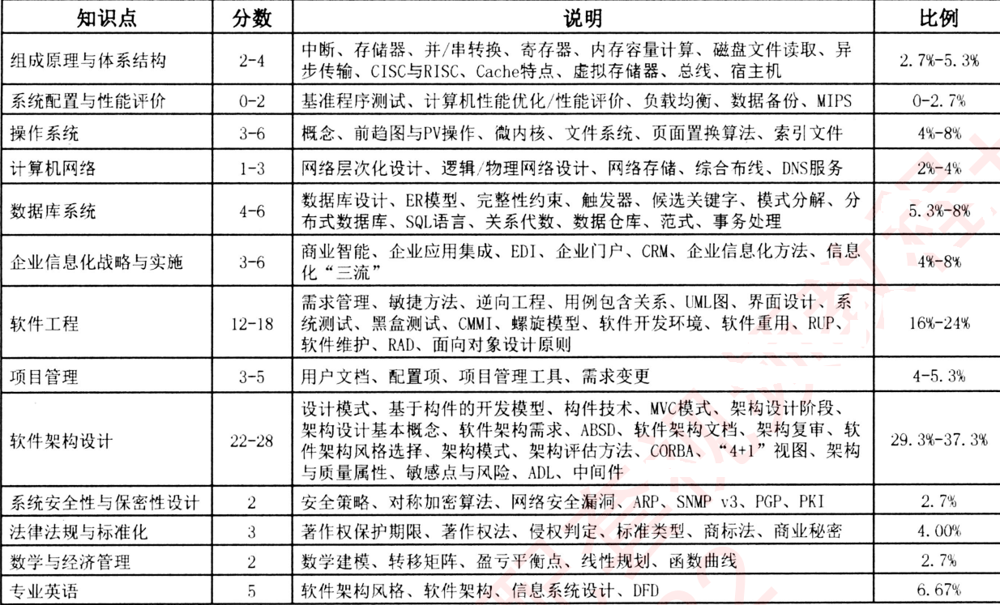

# 介绍

## 报名和时间

考试官网：https://www.miiteec.org.cn/

中国计算机技术职业网：https://www.ruankao.org.cn/arrange

报名入口：https://bm.ruankao.org.cn/index/main，https://bm.ruankao.org.cn/sign/welcome

希赛-全国软考报名时间安排：https://www.educity.cn/rk/2313742.html

**往年北京**：

上半年报名时间： 2021年3月20日14:00至4月12日16:00，考试时间5月29日。

下半年报名时间：2021年8月12日14:00至9月3日16:00，缴费时间为8月12日14:00至9月5日16:00。考试时间11月6日；

三门考试都是在一天内完成，上午考综合知识，下午先考案例分析，后考论文

2021年8月12日至9月3日日报名----2021年11月6日考试-----2021年12月20日出考试成绩----2022年1月6日出合格分数线---2022年1月29日出电子证书。

## 内容和题型

架构师考试科目有三门：综合知识、案例分析、论文。

**（1）** **综合知识，** 75道选择题，150分钟，有些不是教材上的知识。每年都有相似的题型，大家可以去刷真题。

**（2）** **案例分析，** **5道大题，70分钟；1题必选，另外4题中选做两题，总共需要做3个案例**；每个案例2~3小题，基本为问答题和填空题，重点考察大家对知识的理解和应用能力，和语言组织能力。

**（3）** **论文，**论文命题四选一，120分钟，你可以在四个论文题目中选一个你最有把握的一个题目**。**论文要求在两个小时内，写一篇2000\~2500字的论文，除去审题，构思，写作时间可能只有100分钟，每分钟需要写20\~25个字，每2~3秒写一个字，你可以感受一下。**需要提前准备好技术使用，项目和素材**。

## 考试合格标准

三门考试满分都是75分，合格分数线是45分；只要每门过了45分，基本上就是十拿九稳。而且三门考试要同时过，有一门不合格都不算，而且成绩不保留，下次要重新再考

## 教材和复习资料

教材：《系统架构设计师教程》，考试内容大概70%来源于这本书，还有30%是平时的积累。

真题：可以下载希赛网app，或者关注微信公众号**希赛网**，上面有真题和答案，可以方便的刷题，

论文：网上搜索《系统架构师论文范文》，了解论文的写作思路。然后在将历年真题的论文题目看一遍。

# 学习

## 时间规划

60天时间：教材是550页（**以讲义和新版视频为主，以179旧视频和教程为辅**）

1. 2天时间做两套真题，了解下真题的出题思路和考试内容，

   主要是为了后面有针对性的去复习资料，而不是盲目的去看书，有了方向和目标，看书的效率也会大大提高。

2. 40天时间夯实基础，每天坚持看完15页的教材，37*15=555页，视频每天2个。共70个。

   知道真题的出题思路和考试内容，考点分布，然后就是有针对性的看教材，

   第一遍看教材，可以不用记住细节，而是有画重点，用一个笔画出每一章节的重点，形成一个知识框架，做到在你的大脑里形成一个目录，每一章每一节，你知道这一节讲了哪些内容，重点是什么，用笔画出每一章节的知识点和脉络。

3. 20天强化记忆和真题演练

   第三阶段把教材再看一遍，每天30页，强化记忆，一边刷真题，一边看书，真题是必须刷的，因为很多考试内容都是往年考过的题型，只是换了题目，考点都是一样，往年题目会了。

   综合知识选择题教材上没有的题目，往年真题中也有相似的题目。

   案例分析的题目，真题中也有一两道题目是相似的，例如每年几乎必考的题目，给出里一些需求，让你把这些需求分类到性能、可用性、安全性、可修改性四类中。

综合知识：知识考点分布

## 论文思维演练

论文 = 心态 + **技巧**（思路表达清楚）+ **理论**（技术方案的合理性）+ **实践**（应用场景合理性）

看历年真题论文主要是为了了解出题思路，看范文主要是为了了解写作思路。可以打开链接查看历年论文真题[架构师论文历年试题2009--2018](https://www.jianshu.com/p/b5386adc8dcb)

1. 解出题的内容和思路。
2. 列举出基本的考点：架构设计、安全性、可靠性、企业集成等。
3. 看范文了解论文写作思路，摘要加正文，摘要怎么写，正文怎么写。按照写作思路去演练写作。
4. 写一篇论文要2个小时，经常在大脑里演练

例如给自己出个题目：系统安全性设计，摘要主要是列出系统安全设计的一些知识点，列出个1,2,3,4来，然后对每个知识点要结合项目中实际经验，要怎么去填充正文，换句话说就是一个中心题目，多个知识点，每个知识点再发散扩展。最后20太难，每天10分钟的时间去构造一篇论文的写作思路和写作框架。真正考试的时候，就可以按照这个演练的思路去写作。下笔如有神助。

# 经验

一天考三门，早上9点到晚上17:20结束，所以前一天一定要休息好，而且带些干粮中午吃，再找个地方睡一会，下午要考两门，还有个论文要写。保证良好的精力为下午考试做好准备。

1. 上午的时间选择题的时间比较充裕，150分钟，

2. 下午案例分析90分钟，平均每道题30分钟，时间很紧张的，一道必选题，另外要从四题中选出两题，**要快速浏览后面的四道题，快速选出自己拿分最高的两题，抓紧时间做答**。

3. 论文两个小时，是四个题目选一个，也是快速浏览题目，然后选出自己最有把握的一个，

   比如系统安全性的论题，在草稿纸上列出了要写的知识点：鉴别，访问控制，数据机密性，数据完整性，抗抵赖；项目中用到技术有协议加密，协议校验，数字签名，加密狗鉴权，网闸隔离，用户权限分组，报警分权发送等。

   论文分为摘要和正文两部分，摘要有固定的格式，说明你参加了什么项目，这个项目中用到安全性的哪些技术（这就是列举的知识点），这些技术有什么作用。正文部分就是具体讲解在项目中这些技术是怎么用的，为什么用这些技术，技术的优势，实现的作用。摘要300-500字，正文2000多字，一共要2500字。

## 论文模板

摘要：在xx年xx月，我参加了xxxx项目的开发工作，该项目主要用于实现xxxx功能（交代项目背景）。在整个项目开发过程中，我担任了系统架构师的职务，主要负责xxx（例如技术选型、架构设计、设计方法等），整个项目历时xxx月，最后在xxx时间圆满完成。项目的xxx模块采用xxx技术/理论（围绕命题），提高了xx系统性能，减少了维护成本（技术选型优点，这个就根据自己选择的项目来展开）。xxx模块采用了xxx技术，然后xxx。本文以此项目为例，讲述xxxx（围绕命题）在xxx项目中的应用情况。

正文：正文就要根据平时做项目的积累，以及考试前的演练，列出了很多安全性技术，每一个技术写一小段，写了很多小段。

结尾：总结一下项目完成感言，谈谈从项目中的收获，和对项目中所使用技术的理解，最后发表一下自己对系统架构师的感悟。

